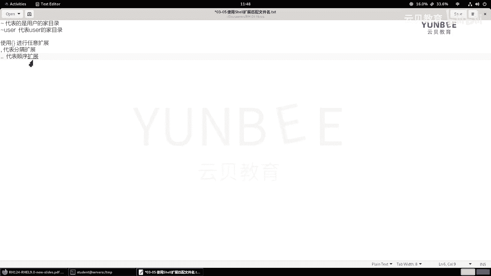
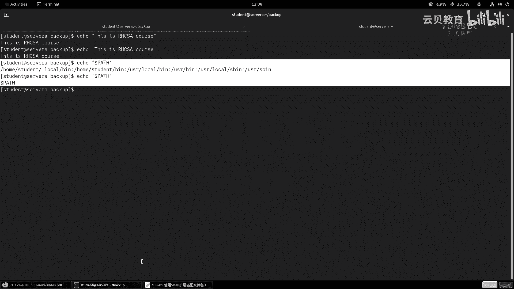

# 零基础入门Linux，红帽认证全套教程！RHCE9认证实战 RH124课程 - P15：03.7 使用SHELL扩展匹配文件名 - 云贝教育 - BV1Ns2gY8EVU

那么我们接着来学习第五节啊，使用shall来扩展匹配文件名。OK那么呃在我们的拜当中啊，有非常多的这种扩展命令行的方法。比如说啊这个模式匹配啊。

什么还有什么主目录的扩展呀呃这么字符串的扩展呀啊变量替换呀等等啊，那么通过这些方式的话呢，可以啊进行文件名或者是路径的名称的一个匹配。那么早期的时候呢，我们把它称之为是通配符啊。

通配符OK那么这些通配符里面的话呢，其中第一种呢叫做模式的匹配啊，模式匹配。那么在使用模式匹配的话呢，我们有一些啊原字符。那么原字符呢代表了不同的含义。那么来看一下这个表格啊。

那么其中在我们的拜 shell当中，我们可以使用星号啊，代表的是零个或多个啊字符组成的任何字符串。其实你像这个星号啊，在我们windows当中用的也蛮多的对吧？比如说我写一个关键词啊，后面呢加一个星号。

代表的是开头以关键词，对吧？哎，后面是任何字符结尾的啊，那么问号呢代表的是单个字符啊，匹配单个字符。那如果我想只匹配某一个字符呢啊某一个字符呢，比如说我这里举的例子啊。

中括号括起来的那么ABC啊ABC那么代表的就是啊我去匹配包含有A或B或C的任意一个字符。那么我们把这个ABC啊替换成我们想要啊这个匹配的字符就可以了啊，单个字符。那如果我想用反方向选择呢。

就是说我不想去匹配啊中括号里面的内容。那么我们可以在这个。匹配的这个关键字母啊，前面跟上一个感叹号或者是尖角符，哎，都是可以的啊。那么除此之外呢，还有一些其他的，比如说我只想匹配什么呀？字母。

那么字母的话呢，就是两个中国号冒号阿尔法啊，这个这个是一个整体啊，阿尔法。如果是想匹呃匹配小写字母，那么就是两个中括号啊，跟上一个冒号啊，然后呢中间呢是啊lower。那如果我想去匹配大写字母。

那么就是两个中括号，然后呢冒号中间有一个什么呀？uper啊，大写字母，那么既有数字又有字母呢，那么就是阿尔法和number的结合，那么就是ALNM。那么如果是可打印的，但是不包括空格呀啊有这个字母呀。

还有数字之外的啊，可打印的字符，那就是啊这个PUNCT啊。OK如果只想要什么呀？数字，那么0到9的数字，那就digit啊只要有空格，那么就是space啊，这是我们最常见的一些啊最常见的一些。

那么我们啊简单的举个例子啊举个例子。那么在举例子之前呀，我们先创建一些目录和文件。好，那现在呢我呢去这个访问我们的soA。

好，访问sA啊。那么那么这个servA的加目录里面呢，之前已经被我全部删除掉了啊，空的。那么这时候呢我们创建一个目录啊，叫global好了啊，make dR啊 global。

然后呢我们顺便呀学学咱们回顾一下咱们之前的一个命令好吧，CD机啊这个LOB啊，创建的同时接着呢进去啊，那么已经成功来到了，然后呢我去创建几个空白的文件啊，那么分别包含什么阿尔法呀。ALPHA阿尔法呀啊。

然后呢这个BRA啊，我随便写一写，包含有字母的啊。啊，随便写了几个文件，那么这些文件啊，然后呢我们来呃准备去匹配一下。那比如说我想去匹配这些文件当中，所有以A干嘛呀？开头的文件。

那么就LA开头后面任意不用星号。啊，信号，那我要想匹配啊这个文件当中啊包含有字母A的呃，那么就信号开头什么呀，信号开头A信号结尾。那所有包含字母A的。那那我要想匹配这个呃这些文件当中啊。

包含有4个字母的那四个字母就四个单个是吧？那么我们可以使用四个问号。哎，来进行匹配。那来进行匹配OK那么如果呢我想去匹配什么呀？这个这个A开头或者B开头的呢？啊，A开头或B开头的那么就是A。B对吧？

然后星号。啊，你像A开头和B开头的那我不想要A或B开头的呢，加个感叹号或者是尖叫符。啊，都能够产生相同的效果。啊，相同效果。那这是给大家简单的举了一个例子啊，那么其他的符号呢用起来呢都是相同的啊。

相同的O。

好，那么接着呢我们再来介绍一些其他的扩展。比如第一个叫波形符的扩展。那么波形幅啊一般我们还有的地方称为波浪符是吧？啊，都行啊都行。那么这个波浪符呢代表的是什么意思呢？代表的是我们的这个加目录啊。

加目录okK好，那么就意味着我们可以啊，那么这样来用举个例子啊，举个例子，比如说我用ele命令啊，e呢它的作用呢是干嘛的呢？是用来打印消息的啊，那么比如说我打印个ABC啊。

就ABC那么这时候呢我打印个ecle什么呀，dollar。

比如说root，看什么效果，因为发现他打印的消息呢是跟目录下的root。那么换一个呢，比如说换成一个dollar dVOPS呢，哎，它打印的是什么呀？dvo加目录。

因为你波浪号本身呢就是一个加目录的意思。那你后面跟上一个用户名，就代表的是该用户的加目录。那我要是啊不加任何的名字呢，直接写个波浪符呢，代表的是自己的加目录啊，代表的是自己加目录。

啊，那么我们把这个呢笔记啊给大家记一下啊，那么波浪号啊代表的是啊用户的加目录OK那么如果是波浪号后面跟上一个user，那么代表的是什么呀？代表的是啊user的。

加目录啊加目录OK那么比如说我们举个非常简单的例子啊，比如说我现在呢切换目录呢，来到t。

那tampO呃那么哦对了，我们的这个soA上没有用户的这个加目录里面没有任何的资料啊，我们再打开一个标签页。我们去登录到我们的word station。啊，over season的话呢。

加目录当中啊是有的，因为它是图形化的嘛，那么我先切换到tamp里面。那么比如说我现在呢想切换到加目录下的哪里啊，文档当中。回车啊哦DOCO。DOCMENT。啊，加目录下面的downalloads啊。

sorry啊，忘记写这个斜杠了啊，回车，那么我们就能够成功的切换到我们的什么呀啊加目录的这个documents目录当中。好，呃，这是波浪幅啊波浪幅。那么接下来呢我们再来看一看如何呢去这个。

啊，使用这个大括号的扩展。那么大括号的扩展呢是用于干嘛呀？用于生成任意的字符串的。那么我们可以使用逗号来表达顺序扩展。那么句点呢两个句点代表的是这个顺序表达啊。使用花括号和大括号啊，使用。啊。啊。

这个符号呢进行什么呀？任意的一个扩展。那么在这个符号当中，逗号啊代表的是顺序。扩展。啊，然后呢，两个据点代表的是sorry啊，这个叫呃。叫风格啊分格列表吧嗯。分格列表。Fen。格啊扩展啊，然后呢。

这个代表的是顺序扩展。啊，剩利扩展。那么我们举个例子啊举个例子。

呃，那么我们回到家务录里面。我们还在这个呃globe里面啊，那现在呢这里面有非常多的文件了。那假如说啊我现在啊想这个啊生成这个。形生成这个啊四个文件啊，这四个文件呢以啊周日周一啊这个啊。

周二周三啊为为开头的一个log，那么就可以这样来写ecle换括号，对吧？写个sunday。啊，sunday逗号monday啊，逗号tuesday。啊，然后呢wednesday。啊，那么逗号啊。

然后呢是作为这个风格啊，那么就是句点啊log。那么接着啊那么他会把这几个文件名啊依次的罗列出来。那我如果把这个ic换成什么呀啊，其他的命令，比如说是啊touch。那么就会多出来什么呀，这些文件。啊。

就会多出来啊，那我想做一个顺序的表达呢。那比如说我创的一个目录，那么这个目录呢叫什么呢？叫做ARCHIVEarchsarchs后面用数字好吧，杠0102030405的那种。

那么我这边要用花括号01开头到几呢？到09好了啊，09，然后点儿谁呀，点这个。哎。啊，不要点了，就叫就叫这么多好吧，回车我们来看一下，因会发现我们多了非常多的目录，你看01020304。

那么我并没有中间来指定0203这些数字，那么就代表是0102一直到09啊是个顺序啊，顺序啊，这种用法。啊，当然了，这个花火号与花火之间还可以做嵌套啊，还可以做嵌套啊。那么举个例子，比如说我创建一些文件。

好吧，创建一些MP3吧呃这个touch。啊touch。比如说是song好吧，song song什么呀？哎，我这边呢先扩展一下这个s里面有这个。A吧用A啊上A上B上C好吧，A逗号B逗号C。

那么代表的是一个顺序表达。但是呢这个A呀，我又想让它干嘛呀？有A一和A2。啊，A1和A2来看一下，哎，我就我我就对A又做了一个什么呀扩展。那么这个时候呢，我们来看一下所有的MP3。

你看送A一送A2送B送C。啊，我还可以进行嵌套。还有一个举个例子，比如说我们呃有的时候呀用这个封号呢代表的是一个扩展嘛，我们还可以这样来用举个例子啊，比如说。呃，比如说我想对这个。啊，对这个什么呀。

我想对这个。sunday点log呢做一个备份啊，那么我可以这样来做啊CP什么呀？CPsunday。那么理论上来说，我们是不是应该这样写呀？对不对？哎，这样来写，但是呢我我现在呀不想这么写了。

因为这样写太麻烦。哎，我呢把后面的这个文件名啊删掉，然后在原文件的后面跟上一个花火号写个逗号。逗号前面什么都不写，那么就代表的是复制什么呀？copy点log本身。然后呢风逗号是分格符嘛，风格符的话呢。

我直接加个后缀点BAK就代表的是目标的文件啊，是一点BAK来结尾的。然后呢，我们再来看一下sday的文件。你看有两个吧，是不是？那这些呢都是使用大括号来进行扩展的啊，扩展的啊非常的实用方便啊，使用方便。

好，我把这些命令的样例啊记在我们的笔记当中。啊，还有前面的几个命令。啊，我们已经我在这边看一下啊，在这里哦，sorry，我把它清理掉了啊，清理掉了啊，不过也没什么太大影响啊。好。

那么我们接着来看第三种叫什么呀，叫变量的扩展。

变量扩展的话呢，其实干嘛的？其实这个变量扩展呢就是我们在当前的事要当中啊临时的来定一个变量，然后呢将这个变量啊干嘛呀，只配一个值。我们知道变量的目的呢就是干嘛呀啊，就是这个。

其实类似于在内存当中来存储某一个啊容器的什么呀，一个数值，对吧？因为我们知道数值在内存当中的地址是很难记的啊，我们就给它定一个什么呀，定一个便于记忆的地址啊，那么来存放的。

那么用法呢就是前列写上你的变量名啊，后面跟上你的值哎就可以了。好，那么我们同样举个例子啊，举个例子。

举个例子，比如说呢我现在啊创建一个我的什么呀，写一个啊data啊DIR谁呢？那么目录呢在M呃t下面的啊叫做data什么DIR。那么我后面要想引用这个变量怎么办呀？我可以在这个变量的前面呀。

使用一个doer符来引用啊，后面跟上dataDR就打印出来了。但是我们呃在标准的写法呀，我们还会跟上一个什么呀花波浪号，为什么呢？我先举个例子啊，比如说我现在要引用了，引用的时候呢，我顺便呀希望在这个。

我下次再创建的时候呢，是一日期来结尾的。啊，日期来结尾的。那么日期的话呢，我们我们手动先写一个吧，比如20。23年的这个12月哎，那我这样写一下啊，哎，是可以用的对吧？因为为什么呢？

因为我中间呢加了一个特殊符号啊，它能够解释出来，不影响前面的引用。那么假如说我在我在引用的时候呢，我没有加这个特殊符号，那么它就没有办法去解释了。为什么呀？

因为它认为啊你doer符后面的这些东西都是一它是一个整体。而我们前面定义的这个变量啊，只有data dR。那么为了防止我们的变量被。被什么呀？被这个引被其他的字符给引用的时候呢，给他给他给他解释错误。

我们可以用花火号给它包裹在一起。哎，包裹在一起。那这样的话呢，被包裹的部分呢就可以被正常的解释了。好，OK这是我们在定义变量和引用变量的时候的一个注意事项。那么还有还有一个呢。

就是希望大家注意的是我们当前定义的这个变量啊，只对当前的这个绘画是有效的。也就意味着，如果你再建立一个新的绘画。啊，新的绘画那么就不存在了啊就不存在了。啊，不存在了啊。

所以这个地方是啊当前的绘画是有效的。

好，这是我们说的这个变量的一个扩展啊变量扩展。然后我们前面还给大家介绍过，就是说在linux当中啊，我们的这个大小写是严格区分的。因此大家在定义变量的时候呀。那么你的变量名称虽然是大小写都可以用啊。

但是一定要严格区分啊。其二呢就是啊我们在定义变量的时候，你不仅可以使用字母，还可以使用数字，也可以使用下划线。但是呢不可以以数字开头啊，你只能以字母或者下划线开头。啊这个地方一定要注意啊，那么变量。那。

可以。只用大小写。啊，大要写字母啊，下划线。啊，以及什么呀数字。但是。不能以谁呀，不能以数字呢开头。啊，然后呢，通常呢我们都是以什么呀？我们啊会使用啊大写字母为主。啊，字母为主，小叶字母呢呃大字母为主。

这个为主意思呢就是它以开头啊开。啊，这样便于合命令啊做一个区分啊，便于一个区分啊。好，下面一个扩展呢叫命令替换啊命令替换。那么命令替换呢代表的是在执行命令的。

就是在我们执行当前的这个命令行里面的命令的同时呀，优先的啊执行命令替换符里面的命令。OK命令替换啊命令替换。啊，那么在执行啊这个命令的同时。优先。执行什么呀？命令。替换中的命令。那么举个例子啊。

比如说我现在呀我现在呢走一个这样的指令啊，先看一下加目录当中的。

加入当中有没有其他内容，发现只有一个global是吧？然后呢，我现在想干嘛呀，想CD到back up。那么这个肯定会报错，为什么呀？因为这里面没有back up，但是呢我后面跟上一个什么呀？命令替换符。

那么命令替换符的话呢，我们现在呀推荐大家使用的是dollar符括小括号，里面跟上你的命令，那么我们来执行一次，那么就是dollar括弧，那么里面要创建一个什么make dR啊，然后呢截个back up。

我们来看一看能否成功。哎，发现成功了。那么也就意味着我们在执行这个命同时啊，那么理论上来说应该是CD进去的对吧？啊，然后呢怎么怎么样的，但是呢它并没有先CD，而是先执行了make dR这个命令。

再取CD的，相当于什么呀？相当于我们执行了make dR back up。啊，然后呢分号啊CDBACK相当于走到一个这样的命令。相当于走一个这样的命令，优先的去执行了。那么这种用法呀那么特别的有用啊。

特别的有用。为什么呢？因为。

因为通过命运置换的方式啊，可以在一行当中可以执行多个。啊，那么不然的话呢，我们就可能需要干嘛呀？需要分成多个命令来执行。啊，深神多米，有的时候还可以干嘛呀？你说那我分两步也无所谓呀。我举个例子。

那比如说。

我想创建一个这样的目录。比如说我在back up当中啊，我想创建一个这样的文件，什么文件啊？比如说我想在这里面创建一个文件呢，是以日期来结尾的。那么如果按照你以前的方法，是不是应该先去定一个变量。

或者说手动的去指定时间。对吧，那么手动指定时间呢有一个弊端，就是说如果我们写的这个文件呀，放在了什么呀，放在了脚本当中，而这个脚本是定时去自动执行的。那你又如何实现手动去定义这个时间呢？你没有办法。

那就意味着你需要人为的去定义。那人为定义，你你你你还是手动的对吧？你要在这个脚本执行之前呀，手动的去改这个时间，那很很不方便。那所以说所以说我们可以怎么办呀？可以走命令置换呀。

比如说呢这个是back up什么呀。back up啊 filess哎，我后面一个日期看好了啊，dollar括弧谁呀？比如说date啊，date加上一个年月日吧啊，点log。啊，点log回车。

你会发现我们的这个命置换呀，就会根据事实的具体的实时的一个数据呢来生成，那就会很方便。那很方便。这是给大家举了一个命令置换的一个非常非常什么呀，一个重要的例子。那么并且最后一个例子呢。

也经常出现在我们的试要脚本当中。

啊，等等这个命令啊。好，这是举了两个例子啊，举两个例子。然后呢，大家呢在网上查阅资料的时候啊，或者说看书的时候呢，可能会看到一个这样的符号。注意啊，这个是反单引号啊。那么这个反单引号的话呢，它在哪里呢？

在我们键盘上面的。哎，啊，引号啊在我们键盘上的数字键啊，最左边就是我们的ESC按键下面的那个啊，ESC下面的或者说是tableable按键的上面的那一个啊反单引号啊，反单引号。那么这个符号呢是。

早期啊早期用于作为什么呀？早期。早期用于什么呀？命令啊这个置换的。啊，那么又意味着前面的你像这个命令啊，我们可以按照以前的写法呀，那么就变成了什么呀？变成这样来描述的啊啊反单引号哎，去这样去写。啊。

这样去写，那么这样写，你说可不可以呀？当然是可以的，但是有个弊端啊，就是说反单引号啊。反单音号啊，那么在某些什么呀字体啊字体。啊，下可能啊导致啊这个和谁呀和我们的单引号混淆。啊，混淆。哎。

那么你有没有办法，因为你单引号是引用字符串的呀，那你反单引号呢是命运置换呀，那是完全两个不同的内容。啊，所以说呢混淆之后呢就没有办法呀去执行命令了。那么举个例子，比如说今天对吧？我给大家写的这个笔记啊。

如果没有给大家说这个符号的话，那么大家呢直接看我的笔记。有可能你的系统上面的字体呀就会把这个反单引号呀，变成单引号，发现哎怎么。老师执行的这个命令就能成功。我执行的为什么就会失败呢？甚至会报错呢？对吧？

那就是这个原因了啊，所以说呃会容易混淆。但是呢doer符加括弧就不会呀，对吧？它不可能会把doer符给你变成其他的符号，是不是啊？这个不会变，所以说呢我们可以大胆放心的去使用啊，大胆放心使用。

但是我们不能忘记在早期的时候啊，我们用的是反单引号。OK好，接着呢我们再说最后一个知识点，那就是如何防止参数被扩展。防止被参数扩展的意思呢，就是说我们前面不是介绍了一个。

什么呀？这个定义的变量。比如说这个doller data啊，DLR哎可以引用是吧？那么这个时候呢，如果啊如果举个例子。我不希望我不希望这个dollar dR呀输出的结果是tamp下的d个点R。

我就希望它输出的是dollar datata DR。我就希望它输出的是我打印的这个字符串，那怎么办呢？因为我们的ba shell遇到joer符的时候呢，他就认为哦原来是个变量。

我要去引用解释这个变量具体的结果OK那么我们可以用范斜杠放在特殊符号的前面来防止。被扩展，那就是说你你这个导点符啊，不要告诉我你有什么特殊的含义。那你我我就要你的doer符，你到er符，你洗的时候。

do点符打印出来呢还是doer符就行了。我们可以在前面加上一个反斜杠。还有一种方法呢就是使用单引号也可以实现。也可以实现哎，都是可以的啊，都是可以的啊，放在特殊的符号前面代表的是防止参数被扩展。

但是呢大家也别忘了，我们前面还有一种用法就是什么呀？放在结尾空格结尾叫什么呀？换行哎，换行啊，两个别弄混淆了啊，不同的位置代表了不同的含义啊，那么是起到相同的结果的。

那么除此之外呢，我们还有一个作用呢，就是给大家说了一个双引号。啊，OK双引号。还有什么呀？单引号。这两个也是不一样的啊，那么这两个符号呢就是双引号啊，双引号。和什么呀？单引号。

那么在使用过程当中基本上没有差别啊。啊，在使用。过程中基本上。没有差异。啊，都可以啊都可以用于啊。用于什么呀？引用。引用啊字符串。

那，举个例子啊举个例子，比如说。我还用icQ来举例吧。啊，ecle啊，看好了，双引号写个this。is什么RHCSCI course没问题，那我用单引号呢也是可以的。啊，也是可以的。那么在这里呢。

我们用引号引起来呢，代表的意思呢，就是说你这里面的这一串呀是一个整体，你不要把我解释成什么呀，你不要把这里的空格呀解释成这个啊命令的一个分格符之类的。你不要解释我就是一个整体，代表是一个整体。

但是呢但是呢它也有不同的地方。

OK就说如果啊如果。引用的。部分中啊包含有特殊的符号，比如dollar符。那doller符后面跟上一个什么呀？一个变量的这种啊，比如这种啊那包含有，那么单引号呢干嘛呀？单引号呢将啊这个。啊，不会什么呀。

扩展参数扩展变量OK但是呢双引号啊。会什么呀？解释啊这个参数的一个扩展。啊，那么我们来看一下，那如果啊那如果我们这里面写个ecle什么呀，双引号，我写一个啊，那么这里面那写一个符号呢，叫什么呀？

叫dollarPAATH啊，哎，能够执行。那如果是单引号呢？

哎，就不行了哎，就不可以了啊。所以说我们在使用的时候啊，一般来说不用区分啊，但更多的时候呢就会区分这种情况。

啊，那举个例子，我再举个比较猛一点的，就如说我呢输入的内内容里面啊有一个这样情况，我在这个里面又用到三个引号。

好吧，比如说外面有个引号啊，this。啊，这个里面啊看好了啊is啊这个呃什么呀date。OK那么这种情况啊，然后呢，这个还有什么呀？呃d什么呀啊，这个我又写个引号。2021啊10月30号。

那执行没问题是吧？那因为我们的这个e呢，你后面写什么，它就打印什么呃，我只用e来举例的。但是呢我们将来呢可能会遇到这种。内容啊需要包裹起来。但是呢如果你不加引号就会出错的。但是我这icol没事啊。

我只是说将来我们会遇到这种被引号引起和引很多次的那怎么办？你像这里面这种，那么他在解释的时候其实怎么解释？他认为啊Z。这这是一对引号OK然后呢，这是一对引号。然后呢，这又是一对引号，它是这样来解释的啊。

并不是说我们我们本来的意思呢，就是说哎我中间的这一串呢是什么呀？是一体的。然后呢，接着哎这又是一体的，然后呢，日期呢又是一体的，它和我们理解的。其实不一样的，虽然结果看起来一样啊。

但是它理解起来和我们我们的初始的期望是不一样的。那怎么办呢？我就这样来做，我加个什么呀反引号。反引号反引号意思呢就是说你在执行这个外面的那就一看就是哦，原来外面的这是一对儿，那里面的这是一对儿。啊。

你会发现你看就和我们的期望是不是就结果就不一样了，是不是？哎，这是一对啊就能够被解释出来啊，我们可以用这个防止参与扩展的反斜杠来使用。你看那我为什么不用单引号呀，因为这里面也有单引号呀，对吧？

那么就冲突了啊，就会冲突了啊，这个地方啊，我们将来如果遇到了就会可以让来实现啊实现OK好，那么这是我们这一小节的啊各种扩展符啊，希望大家能够熟练的掌握。在后面。

啊，各种命令啊或者脚本的开发过程当中啊，能够能能够拿来这个用使用。

