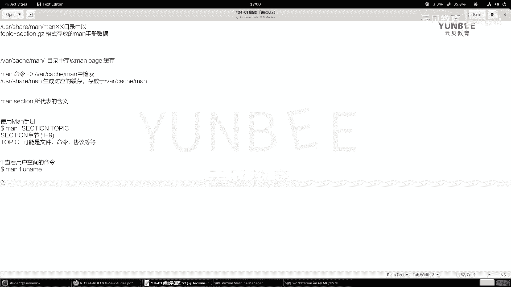
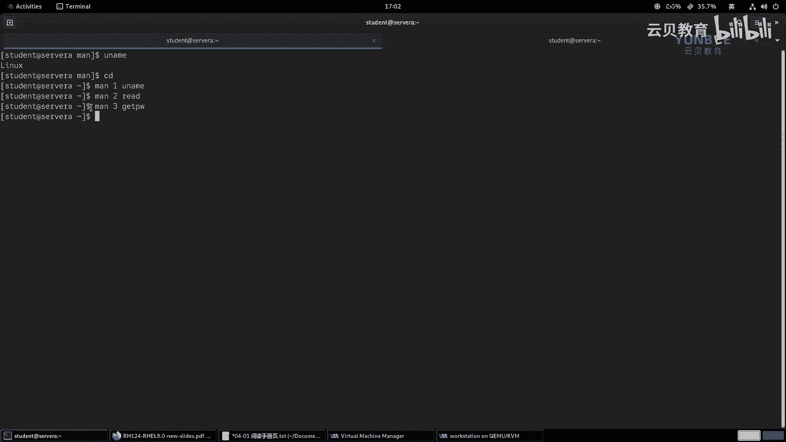
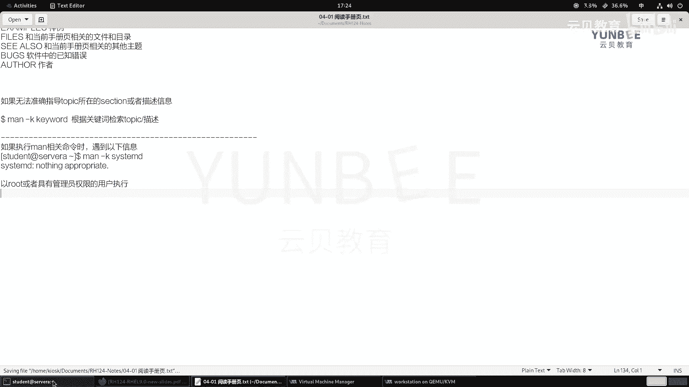

# 零基础入门Linux，红帽认证全套教程！RHCE9认证实战 RH124课程 - P16：04.1 阅读Man Page - 云贝教育 - BV1Ns2gY8EVU

啊，第四章呢介绍的是在红贸企业linux当中呢来获得帮助啊。那么这张那么我们学习完毕之后呢，就可以在所有linux发行版当中啊，利用本地的啊这个帮助系统来获得一个啊帮助文档啊。

那么这一张呢一共是一就一个目标啊，那么就是在本地linux系统当中呢，利用手册页啊，来查找一个信息啊。那么利用这个手册页的话呢。

会提到一个工具啊叫man那man啊man page置O那么所以说呢在我们的real9啊re9的这个R124当中呢。我们会学习啊学习这个使用啊man page来获得获取本地的一个帮助。

OK那么但是呢我们还有一个帮助呢，其实可以和man page呢做一个相互的补充啊，就是精优音。啊，金庸音方。那么这个帮助的话呢，在我们的re19的教材当中啊被删除了O。好。

在re耀9的IH124当中啊取消掉了。它被取消了啊。OK那么但是呢但是呢那么我们的这个Gin呢在某些某些内容啊，某些呃某些这个内容当中啊还是很有帮助的。啊。

所以说呢我们这里呢要给大家呢啊做一个补充的一个知识点来给大家介绍。OK所以呢这这一章啊，那么呃按照PPT上来说呢，是一个小节。那么实际上呢，我们的这一章呢是两个小节啊，两个小节OK。好。

那么首先我们啊来看第一小节啊，那么啊阅读我们的my page啊，阅读我们的my page。那么我们在前面的章节当中啊，我们啊早期呢一个命令呢，什么呢？叫早期的时候呢。

我们通过的语法结构呢是command的。啊，然后呢杠杠help，那么通过这种方式呢来获得一些简要的一个帮助啊，但是这种帮助的话呢，它有个缺点啊，比如说他的这个信息量比较少啊，信息量少。啊。

信息量比较少OK。啊，这是一种。那么第二种的话呢，也有什么极少数的命令。不支持什么呀？杠杠ha尔啊，极少数命令不支持杠ha尔啊。那么我们举个例子吧，比如说我这里走一个啊这个PS杠杠ha尔。

那么打印的帮助信息呢出示出来了。那么问题来了，那这里的SL对吧？这些又是代表什么意思呢？对吧我们不得而知，那么还要啊通过更多的命令来获得啊获得。因此呢下面会提示我们什么呀？哎要想获得更多的信息。

那么去查看man括弧一。那这里的啊去查看PS括弧一啊，那么这里的PS括弧一呢，其实呢就是在告诉我们，你要想去获得更多的信息呀，请去man手册里面去查找啊，那么这个一呢啊我们后面给大家介绍啊。

它代表的是man的什么呀？手册页的一个编号啊。啊，这种那么还有一种啊还有一种呢就是什么呢？啊，这个我们在使用帮助的时候呢，不代表它就特别好用。我举个例子，那么比如说呢我用个I echo命令。echo呢。

我们在前面的啊这个视频里面呢给大家呢做一个简单的一个介绍，对吧？那么可以用来打印你指定的内容，但是我现在呢想这个了解一下这个e命令有什么选项可以来使用的，那么这个时候呀我加一个刚刚help。

那么他就会把我们的这个刚刚help呀当做一个很普通的一个什么呀字符串的来处理了。那么直接打印出来了，并非啊是我们想要结果啊。那么这个时候啊，那么我们在帮助的时候呢，要区分一下啊，那么就是命令啊。

OK命令呢分为什么呀？分为。啊内置命令。和什么呀？外部的命令。那么什么是内置命令呢？内置命令呢代表的是我们的bes这个应用啊应用。啊，本身啊所携带的命令。OK那么外部命令呢，那么就是什么呀？

不是拜师内置的对吧？那么就通过什么呀啊软件的安装来获得的。啊，获得的你像我们刚才的这个acco呢，它就是一个什么呀？内置命令。那么对于这种内置命令的话呢，我们可以通过help的方式啊。

help这个命令呢来获得一个帮助。那比如说helpbsh啊，bsh自己回车啊，那么这里面他说没有关于字帮助信息，通过使用help helpp或者是哎那告诉我们有一个man啊等等。

你看那这个就是我们啊现在的help命令。那这个是我们马上要讲到的。那么最后一个呢是关于什么呀？我们给大家补充的一个内容啊，那么我们就用help去看看谁呢？

去看一看help，那这里面就有一些信息了啊，但是还不够我们用啊，那么我们就直接找到我们想要的命令。比如说help echo哎，那么就能够啊这个看到它这些选项啊，以及啊一些符号所代表的含义啊。

用用什么呀用help echo这样类似的命令来获得啊，那么内部命令啊，我们可以通过这种方式呢来获得帮助啊，这是第一种情况啊，这是这是用help的啊，那么使用。

help那这个help呢也有可能是杠杠help啊来获取一个啊帮助。OK好，那么第二种啊第二种的帮助呢是在哪里呢？第二种的话呢就是利用什么呀？啊，利用我们的软件。ok软件自带的。文档。

啊，自带的文档。那么这个文档在哪里呢？在我们的这个啊user share BOC的目录当中。那这里呢有各种各样应用程序啊，他们自己的目录啊，比如说这里的COL我们进去看看它有没有文档啊，L看一下。

那么在这里呢有一个read me，有一个to do啊，有一个什么FANQ啊，这些文件呢我们不确定就是帮助的。我们来看一下这个to do。OK图图没有我们想要的内容啊。好，那么我们再来回到上一节目录。

找一找别的。找一个，比如说啊这个谁呢？咱们。点兵点将点一个啊，比如说这里的fail啊，fall估计也没有啊，我们进去看一看吧。那只有一个read me啊，也没有啊，没有。

那么也意味着我们的dog里面的文档呀，就要看我们的什么运气了啊，不代表所有的都有文档啊，我们找一个，比如说这里的。Stress。啊，strice and这里有一个read me，我们看一下。啊。

也没有对吧也没有啊，呃，所以说呢这个地方啊就要看这个运气了。同志们啊，那那么如果我们这样去检索起来比较麻烦的话呢，我们还有一种方式，那么我们以房0的为例啊。

或者说我们用这个word station为例吧。那么我这边啊先去登录到word station啊，然后呢来到这个在这里啊，那么我们来看一下，你发现这些系统里面都是有的啊，都是有的DOC。

啊，都有的。那么我我这边啊可以这么来用啊，就是利用讯机的软件啊，打开我们的word station的本地 consolel。

然后呢，我们登录一下。

好，然后呢打开它的浏览器，我们利用啊这个本地的文件协议啊，然后呢打开我们的user share DOC的这样一个目录啊，然后呢啊就类似于我们默认的这个主页啊，这样一个协议啊。

你看它这个指向的就是什么HTML关于帮助的啊，我就是关于这个产品的说明啊，我们把这个路径直接删掉就可以了。

哎，那么就能看到这些什么呀，这些各种各样产品的一个文档啊，那么我们这次呢去一个network measure里面看看有没有哎，这里面什么呀？这次运气比较好，那这里面有这个read me啊。

read me。那么介绍的信息。那么关键的是这里面有个examples例子。啊，关于啊一些配置啊这个。network manager这个本身的一个配置啊，哎，那么就是类似于这种啊。

你看看有没有相关的帮助。OK那么所以说我们。

就是第一种啊就是利用命令行啊，利用命令行干嘛呀？去访问我们的这个。访问我们的这个USR。啊，UUSR share DOOC然后呢，这个是应用的什么呀，名称的目录下方啊。那么第二种方法呢。

如果我们是由浏览器。啊，浏览器，那么我们就可以通过访问什么协议啊，fill协议跟目录下的USR share DOC呢来获得啊。那么这种缺陷很明显的啊，那么这个不啊，这个不是什么呀，所有的软件啊。

都有什么呀文档啊，这个地方就不一定了啊。不一定都有啊。还有一些软件呢，它的这个帮助文档呢是独立的。就是说啊你你你安装软件包的时候呢，它没有带这个文档，你要想看，那么ok你请请你自己去安装。

比如说我们这个以前啊讲这个日志服务器的时候，那么日志服务器呢，我们知道叫什么呀，叫这个啊，咱们还没学到啊，那么叫什么叫这个sslog，我们搜一下cl FSYS。啊，那这里有一个slog。

那我们这个来访问一下。啊，这个窗口我给它适当的调整的大一点点啊，把这个分辨率我们调整的大一些。比说调整成这个。我呃，1400乘以900。

好，那么在这个界面呢，我们。好，打开之后啊，那么找到我们的这个浏览器啊，浏览器在这里我把这个字体放大一点啊，这个cttrol键加加号啊放大。那么这里呢有一个ss log。啊，点开。那么在这里呢。

我们看一下，那这里只有一个什么呀read这个呃read me点MD的啊一个呃这个阅读的一个markdown文件啊，并没有什么样例啊帮助之类的。那么这种情况的话呢，我们有一个软件包啊。

这里呢给大家暂时演示一下啊。

啊，他有一个哎这里面有一个dock，哎，有一个这样的包啊，我给他安装一下。

好，安装成功之后呢，我现在呀刷新一下这个帮助页面，有没有发现多了一个什么HTML。那么在这里呢就会有很多的资料啊。你看这里面比如说啊历史呀、索引，我们打开索引吧。那么这里呢就有非常多的信息了。

比如说手册页对吧？关于配置的格式啊，这个日志的服务器啊该怎么去配？啊，关于怎么配，那这里呢都有一些特定的语法结构啊，都有写的非常详细。呃，你像。你像这个在。18年的时候啊是18年吗啊，18年的时候啊。

18年。呃，这个红帽有一门课啊，叫做IH。呃，IH多少来着？IH413。OK那是18年就是最后一次了。那么之后这门课呢就取消了啊，那么讲的是安全啊。

那么安全里面啊就有一个呢要求呢就是搭建一个集中的日志服务器啊，有服务器端，有客户端啊，然后呢通过加密的协议呢来传输日志。那么在配的时候呢，我们就是参考这个手册里面啊，99%的配置文件呢。

都是在这里复制粘贴出来的啊，然后呢就能拿到满分。所以说这种帮助文档的意义非常的大啊，就是写的还是比较详细的啊。但是呢缺点呢刚才给大家说了，那就是要看运气，不是所有的软件呀，都有帮助文档。

那么你第一种获取的信息不够全面。第二种呢要虽然有全面的，但是呢要靠运气，那肯定肯定不行是吧？啊，你不能说啊这个具体某个应用，该怎么配置的，我全靠运气，那那不现实，所以说呢我们的啊这个早期的时候呀。

早期的时候啊，那么这个特别是面向于我们linux的开发人员。早期的时候开发人员。开发人员。那么在开发linux性功过程当中啊，那么发现了很多问题。那么这些问题呢干嘛呀？然后呢进行一个什么呀总结。啊。

进行一个总结，然后呢找到对应的解决方案，然后呢就生成了我们今天要讲到什么呀？叫讲到的一个linux的什么呀，就是开发人员的。开发人员的手册页。啊，手册页OK那么这个手册页呢，我们也称之为叫什么呀？

叫做man page。啊，配置，那这个man啊叫man usual手册的意思啊，英文缩写啊，不是男人的意思啊。但是我们呃网上呀也看到有些啊这个有意思的小伙伴啊，就成为啊什么问题啊，配置文件不会写。

命令不会用，怎么办？请问那个男人，对吧？OK这样一个比较搞笑的一个翻译啊。但是呢我们都知道，那么这个man代表的是man usual啊手册。那么这个man page在哪里呢？在我们的系统当中啊。

我们可以去访问一个这样的目录啊，那么CDUSR share。那在这个里面有一个man的目录。那么在这里啊，我们L一下，那么非常多，我们做一个过滤，好吧，L。

啊L什么呢？这个杠D啊，然后man啊加上一个问号就可以了。那么这个时候呢，我们就能看到非常非常多我们想要的。当然了，也会遇到这种有两个字母的啊，两个字母的啊，那么这里的man后面的数字啊。

代表的是什么意思呢？代表的是我们的章节。啊，张杰哎，就好像我们在这个阅读一些啊这个技术类的书的时候呀，那么他会做一些分类，对吧？哎，比如说看一个菜谱是吧？哎，炖汤的哎，炒菜的对吧？哎，这种分个类啊。

所以说呢这里的数字啊，manman啊，后面的数字。

数字代表什么意思呢？啊，代表了我们这个man手册的章节。啊，我们称之为是section。啊，section啊。然后呢，这个man后面的，比如说这里的man，我们看到的有个一有个P啊。

那这里的P又代表什么意思呢？这个P啊代表了啊兼容谁呀？po six这种协议的这种啊软件的一个帮助啊，因为我们的linux有些软件啊，是直接从unix里面拿过来的啊，他们直接是兼容的啊我所这种的话呢。

都要遵循po six的一个协议。那么还有一种呢，这里比如说我们看到一个man3X。那这里的X又代表什么意思呢？X就代表了啊这个X图形。啊，图形的一个协议啊图形的一个协议。

那么所以说呢那么这个带有X的卖手册呢，就是啊代表了我们的这个。图形化界面。啊，这种X的啊X的什么呀？这种X system吧，X window。啊，window啊sstem的软件。啊。

那么这个里面是空着的啊，空着的里面没有东西啊，就空啊，里面都是空的啊，都空的。OK这是我们的这个字母啊所代表的一个含义啊一个含义。OK那么在这节目当中，我们以刚才的这个这个零我们忽略掉它啊。

那么有效的数字呢是1到几啊，1到9。

O。啊，有效的章节啊，那么有效的章节。那么是一杠9啊，就是慢一一直到慢9啊，慢一到慢9OK。好，那么在这些目录当中啊，我们随便的去看一看。比如说我们LS一下谁呀，慢一吧慢一慢一。那么一的话，你会发现啊。

进去之后啊，这里啊有非常非常多的文件，这些文件你看都是以。

什么呢？以以这个。以这个一个关键词啊，那么这个关键词呢我们称之为是topic，就是话题啊，话题。然后呢话题后面有个数字啊，那这个数字呢正好对应了我们查看的这个目录啊，慢一这个目录啊。

然后呢后面是一个Gz。然这个Gzip的话呢，是我们linux一种压缩的软件包的格式。那如果我要去看第二个呢，那么你会发现啊在这里面的文件啊，都是以就是以这个topic开头。

中间呢是以啊man的这个section的。section的这个呃。部分啊就数字2，然后呢来来命名的一个压缩文件啊，那么这些文件啊，我们也不需要说啊这个来到这个目录里面去去检索不需要的。

我们有专门的命令OK我们有专门的命令啊，那么这里的啊随便找到的啊。

好，那么这些USR啊share下面的man啊。叉叉的这种目录啊，目录当中以谁呀？以这个TOPICtopic TOPIC topic，然后呢section。啊，然后呢点儿GZ的格式啊进行一个存放。格式。

啊，格式来存放的我们的什么呀，这个man手册的什么呀数据OK一个数据。那么这个数据呢，我们默认情况下呢，我们的man不会去查找的啊，不会去查找的。那么相反啊相反，那么在我们的这个linux当中啊。

还有一个目录啊，还有一个目录。那么这个目录在哪呢？我们需要带大家去看一下啊，应该应该是在。

呃，找一找啊CD到user。啊，呃user什么呀？The lab。man啊，哎，不对啊，不对，OK这个地方我们需要去找一下啊。嗯，让我想一下，那么应该是在哪里呢？可能我们需要走一个齐全了啊。

OK想起来了啊，是在这里啊，那么在我们的蛙下面蛙下面有个catch目录。那在这里呢有一个man的目录。啊，慢的目录。那么现在的话呢，这里面是空的啊，没有任何的数据啊，没有任何的数据啊，我们提个全啊。

提个全也也是看不到的啊。我们来air杠tu一下。啊，蛙下的lab慢。啊，慢。OK就在这里了哎。Sorry， C D catch。没有的啊没有的，这里面空空的啊，什么东西都没有。

那么在这个目录里面存放的什么呀？存放的是我们曼曼这个帮助的一个缓存数据啊，这个目录。

O那么这个目录啊目录当中啊存放的是。啊，我们的慢。卖手册的缓存。啊，缓存。那么什么意思呢？就是说我们啊在使用慢命令的时候呢，那么这个慢命令啊，那么这个慢命令呢就会去我们的啊这个挖下的CACHE啊。

CACHE的慢。当中。啊，去检索。检索。你要查找的内容，那么如果不存在呢，就会报错。那所以说呢我们会通过一些命令啊，实实现从USR的share man啊，这个目录当中干嘛呀？去生成对应的。

那生成对应的什么呀啊，可以生成对应的缓存啊，然后呢存放于。我们的挖呃ca。麦当中我们有专门的命令的啊，有专门的命令。啊，OK他们之间的一个对应关系啊对应关系。好，那么我们这里呢在啊正式的学习之前呢。

那么我们来先给大家介绍一下啊，那么关于topic。啊，sorry应该是section啊，section啊所代表的含义。啊，带有了含义。那么我们这个先去看一下我们的PPT啊。

PPT里面呢已经给我们罗列了出来啊，第一章一直到第九章。那么第一章呢就是我们user share man目录下的man一啊，man一其实也包括man一P啊。那么第一章里面的话呢。

代表的是用户空间啊执行命令的一个帮助啊帮助。那么就是我们平常最普通用户啊，任何一个普通用户呢都可以执行的命令，还有事效程序，就在第一章里面。那么我们举个例子啊，那么要想去使用这个章呢。

我们我们是我们先给大家介绍这个章节的所代表的含义啊，介绍完之后呢，给给大家演示一下啊，怎么去用。那么第二章那么第二章里面的话呢，是什么呢？是一些系统调用的内容。啊，系统调用内容。那么系统调用的话呢。

主要这里指的是从用户空间来调用内核的一些历程。OK那这个信息量还是很丰富的啊很丰富的OK啊，一这个一般我们都用不到啊，一般用不到啊。那么第三个章节呢是库的函数。啊，库的函数。

那么但是呢其实第二章和第三章呢，你可以理解为是同一个内容。啊，都是一种API都是一种API不同的在于。那么第二章的这个API呢主要是谁呀？主要是内核里面的。然后呢，用户空间要用。

然后呢需要向内核里面去申请。那怎么申请啊？就通过第二章里面的这些。这个函数啊API呢去调用。那么第三章里面的呢也是一个调用的，是谁调用的？这个是我们用户空间的应用程序啊，他们自己啊自己开发的时候呢。

写的一些函数API自己共自己去调用的。OK这是第二章和第三章的一个区别啊。那么第四章里面呢介绍的是一些特殊的文件啊，比如说我们在DV目录当中看到那些设备文件啊，什么字符设备啊啊，这个快磁盘设备呀等等啊。

就是第四章节里面介绍的。那么第五章节呢里面存放的是一些啊配置文件的一些啊相关的这种文件格式和语法。啊，比如说啊有些文件我要我我要去安装一个阿帕奇。比如说哎这个配置文件该怎么去配置，我不了解。

那么可以通过查看第五章节的内容啊。那么第六章节呢，在以前的时候呢，是用来介绍什么呀游戏的。OK游戏的啊，还有什么屏保啊之类的那这个功能呢已经被阉割掉了，我们不用去关心了啊。那么第C章呢。

第四章节呢左则是什么呀？则是介绍一些关于啊一些那个。比如说呃一些协议啊，什么TCP协议。对吧文件系统啊文件系统，比如说我们前面学习的啊文件系统结构啊等等啊，都在第七章里面介绍。

那么第八章是一些特权的命令，那么又意味着啊是需要用入的权限，或者是具有啊这个管理员权限的啊，才能执行的命令啊。那么第九章节呢，是我们内核内部的一个API的一个调用啊，一个内核内部的一个调用啊。

OK那么这是一共9个小章节啊，小章节的内容啊，我们一定要了解一下。那么了解之后呢，我们要想去使用M手册啊。那么使用卖手册。慢手册。那么命令呢就是man后面跟上什么呀？跟上它的section。

SECTRON再跟上top。Itop啊，那么section呢就是我们的章节啊，SECTION啊，那么。SECTRON。啊，是我们的张杰。章节，那么代表的是1到9啊，然后呢。

这个topic呢那么就要根据内容了。那么这个topic呀丰富的非常的丰富。那么可能是文件，可能是什么呀？文件，也有可能是命令。哎，有可能是什么呀？一些这个协议啊等等等等啊，都是有可能的。

那么比如说啊我们来查看什么呀，查看这个用户空间的命令，就是我们所谓的普通命令。我们举个例子啊，就比如说我们。这个我想看一看我们的这个我我先返回到普通用户的身份啊。

比如说呢我想看一看我们的这个啊当前的系统的内核的版本，那么我们会用到一个命令的叫you name啊，叫you name啊，哎，那么you name之后呢，他只告诉我了什么呀？linux系统。

那我肯定知道这是个linux系统啊，我想看看是内核是什么版本，那怎么办呀？哎我们去组个命令啊，man一啊，那这个命令我们普通用户呢就能执行。那么它肯定是放在哪里啊？

放在了这个第一章里面那么就是man一啊，空格跟上我们要查找的这个topic，那么这里的topic呢就是一个命令了啊，那么就you name。

回车哎，那么就能看到了。那这里告诉我们啊，那么这个信息是有什么内容呢？那么这个信息里面啊，那么注意了，那么在这个信息当中，那么前面的这个是标题啊，然后呢，name呢是一个简要的说明啊。

然后下面有一个什么摘就是概要啊，就是用用命令的一个用法啊，用name跟上选项啊，然后呢描信息呢则是一些比较详细的帮助页啊，那么告诉我们打印我们这个系统的一些信息啊，如果你没有加这个选项的话呀。

就类似于加了选项杠S。I杠S那我们看杠S什么意思呀？杠S全篇呢叫nal name啊，来打印我们内核的名称。原来我们的内核什么是内核什么内核呀？linux内核对吧？然后呢，A呢是打印所有信息啊。

然后呢按照顺序啊，然后巴拉巴拉的巴拉啊这样信息。那么我们一般会用到什么呀？杠R代表的是内核的发行版本啊，V呢是内核的一个啊一个版本啊，不一样，对吧？M呢是我们的这个硬件的名称，P呢是处理器的类型啊。

处理器的类型OK。啊，然后我们来我们可以试一试啊，那么右边啊我们这个SS到SSH去到我们的student atserv A啊，然后呢我们在这里试一下you name杠S，你看不加S是不是一模一样。

you name什么呀，you name杠R内核的发行版本杠V内核的版本。那这个在我们的这个什么呀re9上面不显示对吧？不显示啊。好呃，然后呢M是我们的什么呀？硬件的名称啊，我们加个M。M啊。

原来是叉8664位的一个硬件架构啊，然后P呢是处理器的啊处理器的。啊，那么也是差八64的啊，叉八664的啊，那么就根据这样信息呢去打印就可以了啊。比如说我们的杠A看看都有什么内容啊，内核的名称，主机名。

还有内核的放映版本，对吧？放映版本啊等等。OK这是我们的啊一个信息啊信息。那么第二章节呢，我们举个例子，那么第二章节什么呀？那么第二章节啊，我们我们的命令啊举个例子写在后面吧。

man一啊you name对吧？第二个章节啊，第二章节呢是我们的啊这个内核啊，这个用户空间调用内核的一些啊这个一些函数啊之类的那比如说我们打开一个文件的时候呢，会用到一个read的函数。

那这个地方就涉及到了我们有些命令没学到的，但是我我可以让大家看一下啊，举个例子啊。

呃，比如说呢我们使用开命令来读取passWD的时候。我让大家看看消息啊，这个地方呢不需要大家能明白啊。那么这个命令呢是跟踪啊，跟踪的时候呢，你看执行了一个什么样的命令。啊，然后呢在执行过程当中啊。

它既要打开文件，还要访问相关内容。那么这里你看它要干嘛呀？去read，看到没有？这里面会有什么close open NATread啊，PREread64。那这些呢都是内核里面的一些什么呀？

内核当中的一些这个啊存用户空间所需要调用的一些内核的一个历程啊，那么这里面有个read，那么我去我去看一下这个read是干嘛的啊，man2read。哎，那么就能看到了。那read德是干嘛的呀？

是用来从一个文件当中来读取的啊读取描信息的啊，这是它的相关的一个源代码啊，源代码描信息具体是干嘛的哎，就介绍给我们了啊。O这是我们说的第二张啊，第二张我们一般用不到啊。O举个例子啊，那么查看。

read的什么呀，这种啊调用。的一个历程。哎，那么举个例子呢就是man areread。好，那么第三章节呢则是什么呀？这个我们啊这个应用程序。应用啊程序自己的啊这种库啊文件啊的一个帮助。

那么我们去找一个啊，比如说我们呃找一个有一个东西啊，就是叫什么呢？叫做get机呃getPW。

man3啊get。啊，PW。O。啊，这是一个例子啊，简单的举了一个小例子。那么这个干嘛的？这个函数呢是用于获取什么呀？啊，在缓存里面啊去获取这个用户的ID啊，用户的ID。O。好，这是。又一个例子啊例子。

好，然后呢接着呢第四个啊章节，我们有些设备啊，一些设备的。我们举个例子，比如说我们前面用到的这种啊我们图化界面啊，走1个TDY啊TDY那么TDY的话呢，你会发现啊和我们以前在字符界面看到的信息不一样。

在字符界面的话呢，输出的内容是什么呀？DV下的TTY。

一对吧？这样这种结构的。但是在我们啊图形化界面呢，看到却是PTS。啊，PDS那这个PDS是什么东西呢？对吧？它是在设备里面呢是特殊的，那么就man4啊PTS。看一下原来它是一个什么呀，尾的伪终端啊。

尾终端啊，然后来模拟谁呀？master和sve啊，那这里的master和sve呢就涉及到了啊终端你早期终端的时候的一些啊专业的术语了。我们不都不不去做过多的一个介绍了啊。那么简单来说呢。

就把这个PB呢当做一个伪终端来理解呢就可以了。O好，那么我们这是第四章的一个啊。那么第五章呢。

是一些文件的格式啊之类的对吧？你比如说啊比如说我们这个举个例子，PSSWD这是个命令吧。但是与此同时啊与此同时，在我们的系统当中啊，还有一个啊passWD的文件。那么这个时候呢。

我们想看一下这个文件里面的内容所代表的含义。那么我们先看一下啊。

哎，这么多东西啊，代表什么意思？什么乱七八糟的是吧？不明白，那么就慢减5PSSWD。啊，哎，那么这个时候呢就会告诉我们呀啊它是干嘛的，对吧？详信息每一列所代表的含义就能够罗列了出来啊。

这是这是第五章的一个例子啊，man5PSSWD好，那么第六章呢是游戏我们就忽略了啊，忽略了游戏啊，游戏忽略。

那忽略其实我们可以看一看现在有没有内容，对吧？你的如果啊如果在这里面user share man man6里面，如果有内容，那也行啊。哎，有一个什么INTROINTRO是干嘛的，是个说明啊。

啊，是个说明介绍游戏的啊，他说这个介绍谁间介绍自己的，他说这个来介绍游戏，他说第六章节是用来描述游戏哈有一些有趣的啊这个可用的应用程序的，没有的。现在啊里面是空的哎，空的。

所以说啊这一张啊这一张呢就我们就空缺了啊好，那么第七章呢呃是什么呀？第七章是一些。

惯例对吧，惯例。还有这个什么呀？一些这个所谓的协议啊标准对吧？等等。那么我们我们你像咱们这个。

前面的章节里面我们介绍了文件系统的结构，对吧？但是呢有些目录啊我们没有介绍，因为目录太多了，太多了，没有一一的介绍。那我想了解一下呀，怎么办？慢期目录结构的英文缩写啊HER回车那么就能看到了。

你看根目录啊，这是一个根目录啊，就是我们这个整个目录的起始位置，对吧？B目录啊是用来存放一些可执行的应用程序，哪些应用程序啊，就是我们这个。在单用户模式呀啊或者是我们系统启动的时候呀。

修复的时候用到的命令啊，然后boot目录啊包含了巴拉巴拉巴拉什么什么信息，对吧？啊，就能够看得到了啊，这是第七章啊第七章啊，什么TCP协议呀啊，这些啊都通通都有啊都有。

然，第八章啊第八章呢则是一些什么呀？这个呃需要管理啊，管理系统的时候用到的一些命令啊，管理系统是命令。我们举个例子，比如说我们装软件的时候呢，用到的一些命令啊，叫DF。

哎，那么这里面就有相关的介绍啊，我们用普通用户啊，看看能不能执行DF好吧，DFinall谁呀？inall一个叫这个。随便找一个软件，比如说叫VM。啊，提示我们什么呀？

就说这个命令啊不能够啊是呃这个命令需要以什么呀？super user啊，超级用户的啊这种权限呢去运行。OK那么就意味着我们是没有权限运行的啊，没有权限去运行的啊啊必须有管理员权限才可以。

呃，第九章的话呢，我们也没有什么例子啊，我们可以Luser share man man减9看一下看空的。啊，空的啊，没有我们想要的内容啊，想要内容。OK好。

那么接下来啊接下来呢我们这个说的内容啊就到这里了。然后。

呃，还有呢就是我们在使用这个慢手册的时候啊，手册的时候，那么如果打开了一个页面之后，那么该如何去导航呢？啊，那么导航的命令呢有比如空格啊，往下分啊去翻滚屏幕啊，一一次分一个屏幕空格键。

那么也可以使用pp down和p up。也是可以的啊。那你说我这个键盘上没有配置档和配置up啊，这种情况是存在的呀。比如说咱们现在不是最近这两年流行什么机械硬盘是吧？啊，有些键盘特别的精简。

里面连这个啊这个配置up配置档啊，deelete的键都没有，那怎么办呀？哎，我们可以使用这个。什么呀？使用我们键盘上的这个按键来来来实现啊，比如说我们可以使用D和UD的话呢是向下滚动半个屏幕啊。

U呢是滚滚动啊，往上滚动半个屏幕。啊，哎，也可以呀，对吧？我看不了那么多，我就看少一点嘛，对吧？还有上下键这种有吧，对吧？上下键呢一次滚动的是一行啊，如果想搜索我们的这个内容，那么就用啊斜线啊。

实上输入关键词哎，有没有发现咱们在前面的啊内容当中是不是也遇到了啊这种斜杠搜索的啊，哎都是通用的啊，通用的。然后搜索的时候呢？如果用的是小写字母N啊，是往下搜索啊，我这个表格上没有写啊。

如果是shift键加N，那就是大写字母N，代表的是向下减索啊，G呢是呃跳转到手册页的开头啊，大写大写字母G呢来到结尾Q呢退出啊，我们来找个例子啊，那么我们man一下，我们man一下，先man个谁呢？

PASSWD哎，大家有没有发现我这次执行命令的时候呢，没有加数字，我们来看看效果。

哎，他来到第一章OK那么所以说呀我们这里面介绍一下啊，那么如果啊man命令没有。

啊，没有指定啊我们的sction。那么我们的麦。啊，会啊先后的。从谁呀？第一章到第九章来查找匹配的。匹配的什么呀？这个topic。

那么第正好第一章里面有这个passWD的一个帮助，所以呢就显示了pass wD的一个帮助信息啊。好，那么在这个页面呢，我们使用空格键往下来分屏幕OK然后呢，上下键上键啊一次移动一一行啊，下键OK呃。

我这个键盘呢就没有这个p置up配置当哎，有啊。OK配up啊，配置到啊是存在的啊。OK呃，还可以使用什么这个这个D啊，我们往看一下啊，我先先往前移移啊，不然不然这个东西太多了啊，B。啊。

D呀啊D啊一这半个屏幕啊，我们可以。标记一下，比如说现在呢在哪里呀，我们把这个。这个地方标记一下啊D。哎，然后接着呢我们把这个标记一下D，你看是不是正好是一半啊一半啊。如果是空格呢。

我们来试一下这一行啊这一行。回车空格啊没了，看不到了，因为正好在上面部分啊，然后呢，U呢是往上翻啊，U往回翻啊，往回翻半平半平的搜索呢，比如斜杠，我想去搜索1个PASSWORD。啊，回车。

那么这个时候呢，所有匹配到的字符串呢都是以高亮的方式来显示的。啊，高量的方式来显示的。然后呢，我们摁一下N往下查找大写字文往上查找OK如果不想查找了，你就不用管它啊，回车就可以了。

还是回车其实也是往下一行一行的。我想快速的跳转到好这个慢手册的开头。记记啊，小写字母记一次就可以了。想了结尾大写字母记啊，就可以了，不想看了，Q退出啊，Q退出ok。好，那么我们再总结一次啊总结一次。

浏览我们的麦手册。啊，空格键。啊，空格键。代表的是向下什么呀？翻屏。啊，然后呢。其实我们可以合在一起是吧，配置啊当是吧？哎，配当啊，然后呢，这个配置up啊是向上什么呀翻屏。然后呢，这个方向键啊。

那么上上键up。OW啊向上。一行okK然后当。方向键的下键。那么就是向下一行啊，然后D啊向下什么呀？啊，这个。向下半啊这个。半屏幕。啊，然后呢这个U啊这个像。Sang。半瓶。OK呃，呃斜杠跟上关键词。

代表的是搜索关键词。啊，搜索关键词。那么在搜索的时候呀，N键代表的是向下。检索。OK然后呢，shift键。加N啊就代表的是。向上检索OK呃，然后还有什么呢？小写字母G啊。

就是代一个键G代表的是呃回到什么呀？回到开头啊，那么大写字母记。shift键加G代表的是呃来到结尾。啊，结尾。OKQ键呢是退出啊退出。那么基本上这几个按键呢就足够了啊。

如果我们将来学习一些啊这个正则表达式之后呀，那么我们也可以在这个。这个斜杠啊搜索的时候呢，用正则来匹配啊，用正则来匹配。OK这是导航页啊，导航业的一个用法。OK还有一点呢就是。呃，在使用的时候呢。

如果我们遇到比如说举个例子啊，比如说人家说了啊，那么详细信息。啊，请看什么呀？详细的信息啊，请看写了一个什么呀PS括弧一哎，代表的什么意思呀？代表的是。代表啊代表阅读。什么呀PS。的卖手册。

手册第什么呀？第一章节OK。那第一章节啊代表是这个意思啊，代表意思。

这个地方大家一定要知道啊，那么我们在这个去man的时候啊，man的时候，比如说man我们的啊PSFV的时候，那么这些内容又代表了什么含义呢？啊，它有什么含义呢？

那么首先啊那么这里的name代表的是我们的这个曼手册的一个主题名称啊，我记得我是有。

哦，sorry啊，我这里面没有批价，没有显示啊，那么name代表的是我们的主题名称。那主题名称OK我这边呢咱们也给它记下来啊。

给它钉到top上面啊，那么在慢手侧页啊，删手册页。在阅读。阅读慢。手册页面的时候，那么看到内容啊，你像举个例子啊，name代表的是我们的主题的名称。啊，主题的名称以及简要的说明。啊，然后呢。

你像这种呃代表的是我们的什么呀概要。啊，语法的概要。好，接着。呃，这种description呢代表的是一个详细的描述信息。OK有些命令当中啊还有一些选项啊叫options，那就是选项。哎。

这个是选项的一个介绍。啊，选项的一个介绍。有的时候我们选项看了半天，不知道怎么用，对吧？我们往下找一找，可能会看到什么呀？样历啊，这个里面没有例子啊，我们找一个有例子的，比如说。NMCLI。好。

我们搜一下吧EXAMPLEexles。哎哎examples啊，这里面还有一些例子啊，一般会有一些例子。啊，一样例。啊，阳历OK呃，还有呢就是。啊，我们看着说吧，比如说还有一些呢叫fis。

fis的话呢代表的是和当前的手册页相关的文件和目录。啊，和目录啊，然后还有什么呀？比如说这里的see also。C also的话呢代表的是什么呀？和当前的手册有相关的啊相关的一些其他主题。啊。

相关页的其他主题对吧？还有这个bus，那就是字面意思了，对吧？哎，软件的什么呀，已知错误。啊，已知错误呃，还有什么有些呃在下方还有什么呀，我们再找一找吧，因为这个信息量太多了。啊，这个找一个还找这个。

你比如这个啊还有什么呀？你看这里面有个fas看到没有啊，下面还有什么作者啊，作者等等。啊，除此之外，还有一些其他的关键词啊，我们就不再一一举例了。比如说还有什么版权的声明啊，哎版权声明啊之类的啊。

都会有啊都会有OK。呃，但是呢我们在呃实际的使用慢手字过程当中啊。

不会像课堂上一样啊，这么精准啊这么精准。比如说。比如说我们的命令里面啊，我们命令里面这个。は。

还取消不了了。

好，取消掉啊。比如说我们在这个呃给大家讲的时候啊，你看我这边举例子啊，你看这个章节啊就立马就确定了，对不对啊，然后呢，我们实际的使用过程当中啊，可能没有办法清楚的啊记下来我们这个topic的内容啊。

如果啊如果。无法啊无法这个呃这个准确的准确的知道我们的topic。啊，所在的什么呀？所在。的这个。section。啊，或者啊这个这个这个或者说这个描述信息。那么我们可以利用这个命令啊，叫man杠K。

后面跟上一个关键词啊。关键词的方式呢来啊根据什么呀？根据关键词来检索topic。啊，那么这个关键词呢会匹配top币里面的内容，还有描述的内容。描述啊描述这样一个信息。

它其实呢就是去所有的man手册里面去找name那一行啊，name那一行，还有这个什么呀？description里面内容，看看有没有匹配到的，那么就能够看得到啊。好，那么我们去man一下。

比如说man啊杠K谁呢？就比如说我们的sstem D。

哎，执行一次执行次这个时候呢问题来了呀，他说什么呀没有找到没有找到，找不到呀。那这个东西不可能不存在的呀，为什么呀？因为我们的系统就是由st D来负责起来的，它肯定有。

比如说我们man system term D看有没有，你看有的。哎，是有的呀。那为什么我们的man刚可找不到呢？哎，还记得咱们前面说的哇下面的catch man吗？哎，这里面是空的呀，空的。

所以说你在什么man去检索的时候，他去哪儿检索呀，去这个缓存里面去检索，你缓存里面是空的呀，所以说就搜不到嘛，那怎么办？那么这个时候呢，我们需要啊这个在这个当中啊创建缓存。

而这个缓存呢是在根目录下的蛙当中的。ok那么这个目录就意味着我们的普通用户啊是没有办法在这里去管理的。啊，是没有权限的。所以说呢我们必须要有管理员权限。那么我们可以啊可以呢干嘛呀？

切换到管理员啊管理员那么SU杠谁呀root这个命令啊，我们啊在这个第六章呢就会学到啊，那么以root的身份啊来执行一次啊，manD B那么就会更新我们的man手册。

啊，OK那么如果。如果执行慢。啊，相关的命令时。啊，遇到以下啊这个。信息。啊，那么执行以谁呀，以root或者具有管理员权限的用户啊，然后呢，这个执行谁呀，执行我们的这个命令。

啊，执行这个命令，那么就能够更新我们的数据了啊，这个信息量比较多啊，你看我这个例子。

来执行啊来执行哎就可以了。那么执行完毕之后呢，我们去看一看啊LRS。

Y下的CCHE。啊，麦。那这里面就会发现啊这里会多很多的文件啊，文件出来了啊。OK具体什么含义呢？我们不用去过多的去关注啊。那么接着我们回过头啊，再去man杠K一下，发现是不是就能用了。

那么输出的结果里面啊，输出的结果里面有非常非常非常的多啊，我们给大家来解释一下啊。

啊，解释一下。那么在书的结果里面啊，左边是什么呀？是我们的这个topic的名称。那么括弧里面是我们的section啊，右侧呢是它的描述性信息啊，描述性信息啊，非常丰富。那么你可以根据描信息呢来判断啊。

左边的这个topic是否是我们需要的那一个topicO。

那么。如果我们遇到一个更糟糕的情况，就比如说啊我们没有办法没有啊办法通过啊这个上述的命令。来查找我们想要的内容。那怎么办？那么这个时候呢，你可以啊使用什么呀这个。使用一个啊叫做。啊，全文搜索。

OK全文搜索的命令呢是man杠大写字母K跟上你的关键词。那这个就很厉害了。那么这个命令呢会干嘛呀？会啊按照关键词。啊，对所有的啊所有的man手册。内容啊进行一个关键词匹配。啊，进行关键词匹配啊。

所以它的效率呢很低啊很低啊，但是呢啊可能会找到你想要的内容啊，那么我们来演示一下怎么去用啊，这个命令在用的时候还是要注意的man。

比如说杠大写字母KPASSWD。那么他首先会立即打印出来第一个匹配到的。你比如说它匹配到了一个。第一章节的XARGS那这里面有没有？PSW关键词呀，看一下，你看看一看啊PASSWD你看它它里面是有的呀。

但是这个文件我们一看就知道，那和我们想要内容可能相差的很多是吧？这只是例子里例子里面有了一个关键词。那么这个命令这个手册本身啊，可能和PSW没有任何的关系，那怎么办呀？Q。退出。那么退出之后呢。

接着我们的麦呀会把我们打印出来。那么下一个检索到的一个麦手册啊是CHAGE啊。第一章节的你要想看摁下回车键，如果跳过摁一下ctrol加D啊。如果想退出，不要找不要往下继续找了ctrol C。

我们假如说现在想看一看回回车。哎，CHAEEQ退出啊，那么G盘WD我不想看跳过cttrol键加D啊，往后我也不想看了，cttrol键加C终止。OK终指啊，这是大写字母K啊，这个就比较暴力了。

但是精准度很差的啊很差的。你很少会用到，这是万不得已的时候呢，会使用的一种方式。

啊，会选择一种方式OK。好，那么这那么这些呢就是我们所有啊man命令的一个呃使用方法啊使用方法。

