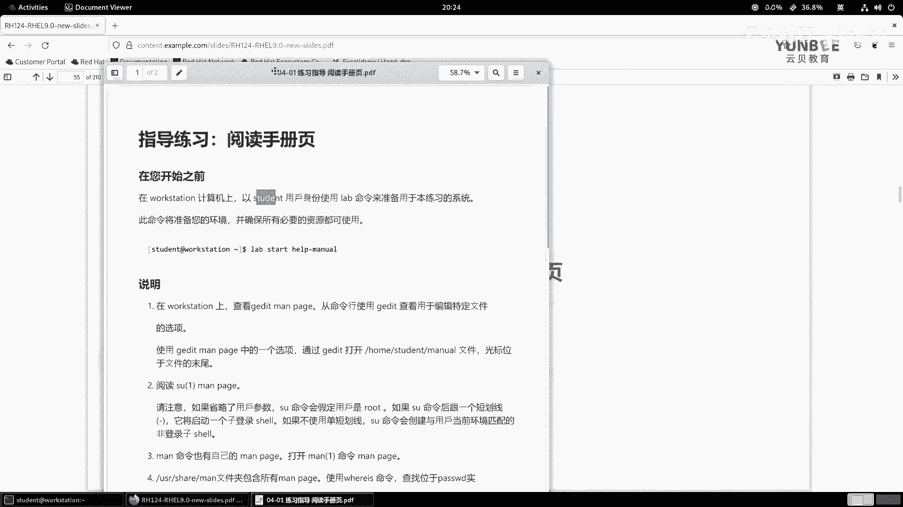
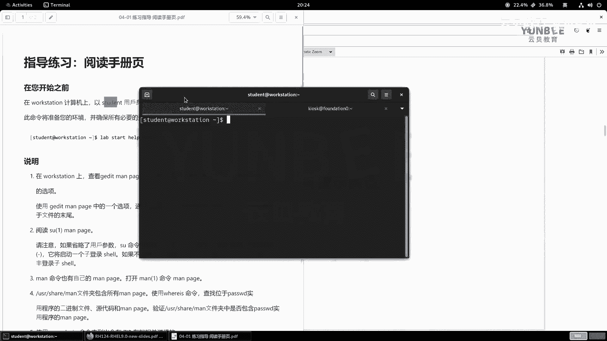
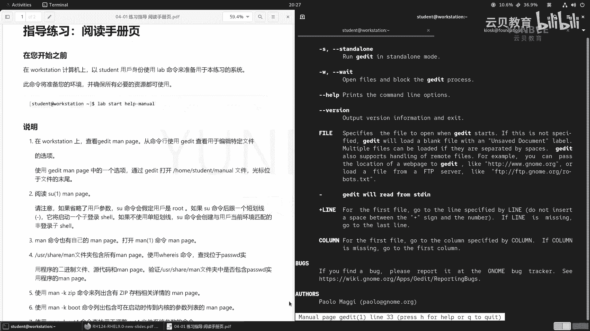
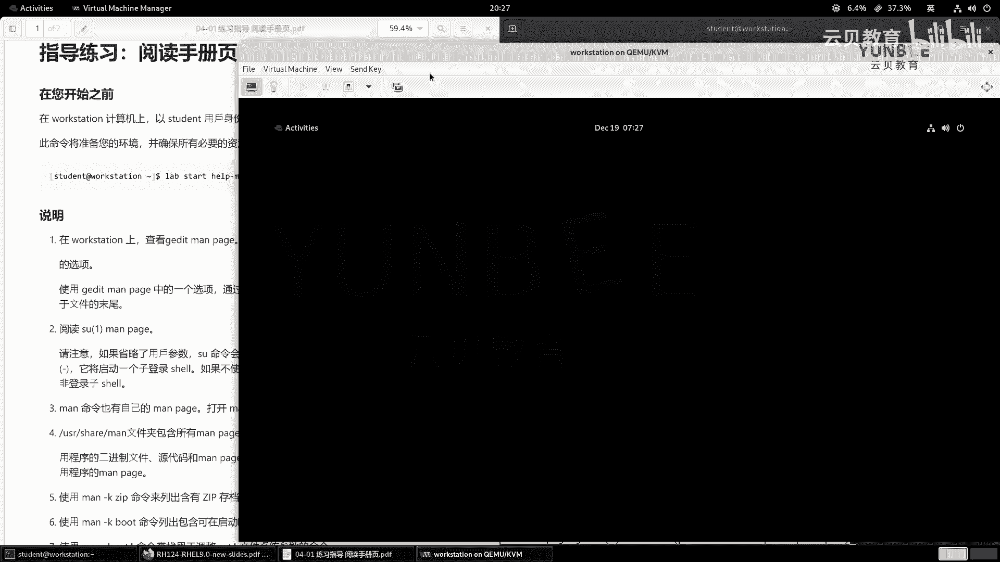
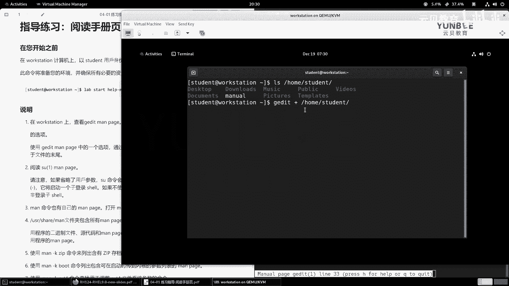
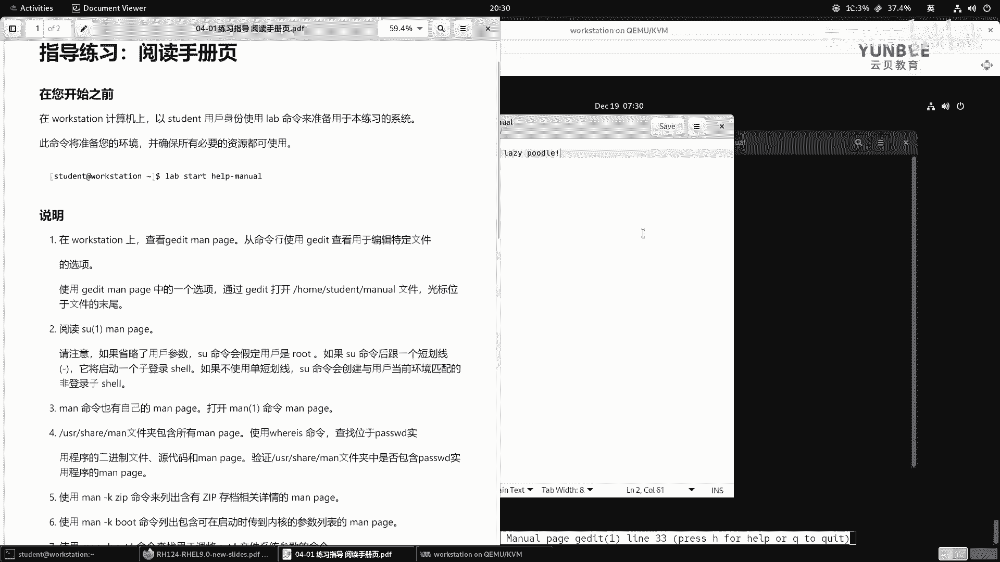
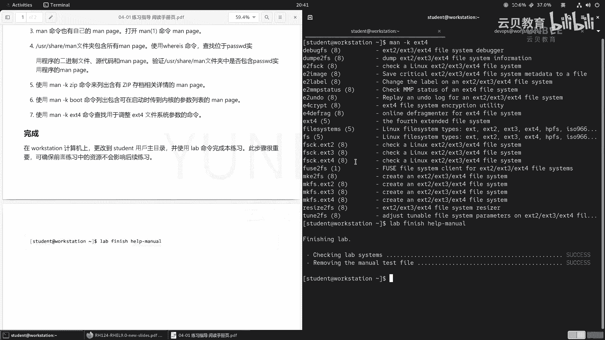

# 零基础入门Linux，红帽认证全套教程！RHCE9认证实战 RH124课程 - P17：04.2 阅读Man Page-实验 - 云贝教育 - BV1Ns2gY8EVU

那么接下来呢我带着大家呢来做一个实验啊，那么阅读手册页。好，那么打开我们的这个实验内容。那么我们来仔细阅读一下它的要求。那么在开始之前呀，要求我们啊这个在over station上面。

然后呢用student用户的身份来指引我们的这个lab命令。好，那么接着呢我们按照以前的方法把它拖放在屏幕的左边。然后呢，在打开一个终端啊，把它拖放在右侧。

接着呢我们已经成功的登录在了我们的word station节点，那么来执行命令啊，lab。Startt。Help G man。好，已经成功的执行了。那么接下来呢我们来看说明。

那么第一步要求在word station上面查看G editit的man page。那么注意了，那么G edit啊，man page该怎么看呢？那么这里并没有告诉我们啊，那么我们在使用的时候呢。

就直接使用man命令啊，跟上G edit。M G I。OK然后呢从命令行使用Git来查看用于编辑呃特定文件的选项。OK然后呢，在查看慢熟的之后呀。

还要我们使用Gedit man配置当中的一个选项来打开加目录下的manus的文件。然后呢，光标呢位于文件的末尾。O那么我们先用man去打开。那么打开的时候呢，这里面的简要呃就摘要里面啊。

就是我们name里面的一个概要。那么告诉我们G editit呢是一个用于Gn桌面的文本编辑器。哎，那么就意味着我们的这个啊并且还说了，那么我们的这个文本编辑器呀，是gome桌面环境的一个官方的文本编器。

因此我们在。使用的时候呢，那么需要借助于图形化界面啊。好，那么接下来呢我们继续阅读啊，继续阅读。那么要想打开一个文件呢，它的用法呢就是记idit跟上选项，跟上文件啊。

后面呢还可以加号line冒号什么呀coln，行和列。那么我们来看这个行和列代表什么意思。那么文件顾名思义呢，就是我们要打开的文件名啊，然后呢加line呢代表的是打开啊文件的什么呀哪一行啊。

啊打开这个第一个文件的啊哪一个行。那如果没有啊再加二后面呀写上内容，就是用空格来替代的啊，那么就代表的是来到文件的结尾啊，文件结尾。OK好，那现在呢我们就打开我们的word station的图形化界面。

好，双击我们的over station。啊，那这个东西呢现在有点啊这个挡着我们的视线了，所以我把它关闭掉。

好，那么接着打开一个终端啊，你像我们呃这种终端呀，刚打开的时候呢，字这个比较小啊，大家在使用的时候呢，可以啊在这个地方呀选择放大啊。但是呢这个放大呢缩小，我们都是通过鼠标的方式来操控的。

那么感觉啊效率很低，那么怎么办呀？我们找到这里的performances在performance里面有一个什么快捷键啊，short course。那么shortcast里面有些括捷键，大家可以记一下。

比如说啊新建标签对吧？shift键加cttrol加T，新建窗口啊，shift键加ctrol加N啊，关闭啊我们的标签页。啊，shift键加control加W啊，关闭窗口呢就退出了啊。

shift键加controrl加Q啊，复制啊，shift键加control呢加C啊，粘贴ctrol加shift键啊，加V啊，然后呢放大呢就是全屏，那么就是F11啊，那么然后这个放大啊，zoom in啊。

放大，那么就control键加加号，那么缩小啊，这个ctrol键加什么呀啊，减号啊，OK。啊，减这个短的啊，然后呢这个恢复正常大小呢是control键加0啊，加0OK。那么所以说呢我们在这个里面啊。

我们就可以直接使用快捷键。比如说ctrol键加shift键加加号啊，就是加号啊，那么就可以放大了啊，那么放大之后呀，我们按照刚才man手册里的方式，先检查一下home啊。

student当中有没有一个文件呢，叫man usual好是存在的。那么接着用GI的命令啊，跟上一个加号，加号呢是加的什么呀？加的是line。啊，是行啊，那么这个行如果不存在啊。

就空格的代表的是来到啊行委啊，第一个文件的第一行的行尾。那么这个文件呢就是home下的啊student。

买油了回车。那么这个时候呢，注意观察我们的光标呢正好在我们的文件的结尾啊，整个文件的这个结这个这一行的结尾啊，打开第一个文件的所有行的结尾OK。好，接着我们继续往下看要求啊。那么呃打开之后呢。

第二步呢阅读SUE的man啊man page。那这个时候呢我们就可以关闭掉这个图化界面了啊。好，那么我们回到啊这个字符界面吧，这样效率比较高啊，大家呢也可以啊停留在我们的这个图形化界面啊，都可以啊。

man啊ESU回车那么接着我们来看一下，那么这里面的SU的意思啊，用于干嘛呀，啊，用于这个执行一个命令啊，跟上一个属性，然后呢啊这个跟上一个。

用户啊或者组ID之类的啊，这是FU的一个呃用处啊，就是啊真啊使用具体的某一个用户或者是组的身份来执行一个命令。好，那么呃描信息里面呢也告诉我们了啊可以使用用户，还有组呢然后呢运行一个命令。

那如果我们的FU后面没有指定用户的话啊，那么它用法嘛，FU选项短横线user还有一些参数。那当我们的这个user没有指定的话呢，代表的是我们的SU啊，默认以root用户的交互的shall来运行。

那么如果使用了用user这个啊选项的话呢，就意味着啊我们啊可以来指定啊这个参数。那么就是这个参数在执行的时候呢，是以谁呀？这里的用户的身份来执行的OK呃，然后接着这是我们的这个关键的地方啊。

关键的地方OK。呃，然后呢再往下看啊，再往下呢，我们找一个地方呢，就是什么呢？就是下面就说为了向后兼容啊，那么SU命令默认啊会更改啊当前的加目录啊，并且呢设置环境变量为home的变量，还有shall啊。

还有shallO。啊，那么就就是什么时候呢？如果没有指定用户呃，没如果目标的用户不是root的时候，那么SU呢会默认切换到这个新用户的加目录啊，以及更改它的适效环境这两个变量啊。

那么所以说呢啊在执行SU的时候呢，推荐使用杠杠login的选项，或者是使用啊短格式啊。叫这个什么呀啊，一个横线啊，来这个呃来什么应对于这种复杂的环境啊环境去匹配。那么整体上来说呢。

就是说我们在啊使用这个SU的时候。啊，SU的时候，那么如果我们直接SU回车啊，那么它就是以root身份，因此这里应该输入的root密码。比如说roroot hatread hat之后。

你看成功登录到了root好退出。但是呢我们不建议干嘛呀，直接这样用，而是建议使用什么呀？刚刚log in啊，或者是用这个短的横线来代替，那就相当于是SU杠什么呀，root。哎。

然后那这个root你可以写也可以不写啊，那这种方式呢来登录。啊，这种方式来登录啊，或者换一个身份。啊，这样的一个效果，建议呢加上一个短横线啊。好，那这个命令具体的呃使用内容呢，我们在。

后面的章节当中呢会给大家详细的介绍啊，主要是给大家解释了它的一个啊主要的意思。然后呢，这边让大家看一看啊它的说明里面的效果啊。好，接着啊Q退出。呃，第三步呢说慢命令呢也有自己的慢手册，打开慢一。

那么就是man一慢回车。OK那么用法你看man啊，man的选项，还有章节，还有夜，对吧？咱们给大家讲的时候呢，把这个页呀翻译成什么了呀？翻译成topic了啊，用t topic来代替了。

那么在里面也描述信息里面也告诉我们的第一章是可用于执行的程序或者是用命令。第二章呢是系统调用，那么是由内核提供的什么呀？函数啊，第三章呢是什么呀？是这个库的调用啊，是程序应用程序的一个库的一个函数。

第四章节呢是特殊的文件啊，一般在DV下发现啊，第五章呢是这个关于文件的格式和语法啊，然后第六章是游戏啊，第七章呢是一些杂项。比如说。啊，一些这个啊标准的乱七八糟的啊。那么第八章呢是系统管理的命令。

一般用于入的身份来执行啊。那么第九章呢是一个非标准的一个章节啊，是内核的一些API的信息O这是man手册，那么大家呢也可以详细的去看啊这些啊含义代表什么内容啊，好，那么Q呢就退出了啊，Q呢就退出了啊。

第四步呢他说这个user share man文件夹呀，包括了所有的man page，那么使用where is命令来查找啊pas w使用程序的二进制文件源代码和man page。

那么这个where is呢这个命令呢也是用来查找的啊，那么只是查找这个命令啊这个还有慢手册，还有帮助文档的位置啊，那么我们来查一下。

那么它的命令在user B pass啊和这个匹配的文件名在ETC pass D啊，慢手册。啊，卖手册啊相关的位置OK相关位置都有啊都有。好。

第五步呢使用man杠 K zip命令呢来列出含有VIP存档相关的man page置，那么就是man杠KZIP。啊，那么左边呢各种各样的ZIP右边呢是介绍啊，那么这个呢是用于什么呀？啊。

用于这个是一种qui的排序的一个文件压缩跳过，这个是B to压缩文件的一个比对的啊，比对的跳过搜索的跳过。那么这个呢是一种什么呀B那么是一种也是一种压缩器跳过啊B跳过了啊。哎，这个以名字也就跳过了。

那这个是个过滤的跳过呃gray呢是和内核相关和gray相关的。我们也跳过那么 zip呢是用来压缩和展开文件的。但是呢它不是纯的zip啊，是GUN zip。那么咱们题目上要求是zip存档啊。

所以说呢我们往下找，那这里有一个I zipip是用来列举啊，测试和展开啊，什么zip压缩包的唉，有到了。那下面还有zip开头的，但是呢是自动展开的这种啊，下往下继续找啊，哎，这里面有一个大写的zip啊。

zip in是用来查看啊zip文件包的什么详信息的那么上面这地方呢差点漏掉啊，是有一个包和什么压缩归档文件的啊，那就是zip一啊z一O。好，这是我们看到的这个zip的一个信息啊，C信息啊非常多啊。

但是呢这个这个地方代表的是zip存档相关信息的那应该谁呀？刚才看了好几个zip了，应该是zip in for吧，对吧？应该是找到这一张啊，这个就是我们第五步啊要求的内容。那么第六步呢。

要求使用man刚 k boot命令，列出包含可在启动时传到内核参数列表的man page，那么就是什么呀？man。杠K boot那找一找啊，这个信息量还是非常多的啊，我们从上往下找啊。

O这个呢是用来配置一些二进制格式的启动的时候，跳过啊，那这个呢是介绍启动时候的一些内核参数，哎，好像就是这个吧，对吧？哎，就是它啊，就是它好，第七步啊。

使用man杠KEI4命令来查找用于调整EIT4文件系统的参数的命令啊，参数的命令。OK好，那么那么我们来执行一下这个命令啊，那么就是。manKET4调整ET4文件系统参数的啊，那么这个是什么？

第bu个调过备份的，调过呃检查文件系统的，跳过这个是保存我们的。啊，比较重要的一些什么呀原数据调过啊，这个是更改标签的，调过这个是更改MMP的。这个是用来replay啊回放和什么呀，撤销啊。

这些日志的啊，这个是用来加密的啊，这个是用来啊在线什么呀啊啊这个。啊，这个是什么意思啊？我们来看一下。OK好，那么这个是在线的去呃整理我们的磁盘碎片的啊，然后接着呢是。

指的是第四代我们的文扩展文件系统啊类型文件系类型啊，也是文件系统类型的一个简写。这是这这三个都是检查文件系统的对吧？下面呢这个呢是什么呀？FUSE啊FSE的文件系统客户端的挂载啊。

文件系统用户空间的一个挂载，创建文件系统创建创建创建，这个呢是用来。呃，对于EIT文件系统的一个。啊，大小的一个管理。最后一个呢是用来。

干嘛的用来这个呃用来调整啊调整我们的这个EST文件系统的一个什么呀啊，用来调整我们文件EST4文ESEST文件系统的一个一些参数。所以说呢第七的要求呢就是我们的最后一条记录啊，最后一条记录OK好。

那么这个实验呢就做完了。那么最后呢再执行一个lab命令啊，lab finish。啊，害怕。啊，help man。那么这个实验呢呃那不是很重要啊，那么主要是给大家来。

这个带着大家呢来熟悉一下怎么利用man啊去查阅相关的这个topic以及阅读啊，还有呢就是如何利用man刚 key的命令啊来检索我们想要的信息O。

