# 零基础入门Linux，红帽认证全套教程！RHCE9认证实战 RH124课程 - P18：04.3 使用GNU Info - 云贝教育 - BV1Ns2gY8EVU

那么接下来呢给大家来补充一个我们早期啊在红帽啊HHCI的培训过程当中呢，一个帮助手册啊，那么叫GNU in啊，GU info。为什么要介绍GO info呢？那么我们其实一般情况下呢。

或者说对于绝大部分的人啊，那么我们在想呃这个linux当中啊，获得一些帮助的时候呢，那么这个man page呢其实啊基本上呢就够用了。因为在man page当中啊里面已经有丰富的什么命令的一个用法。啊。

一个用法。那么但是呢呃我们的lining系统里面的更多的软件呀，都是由GNU项目开发的啊，GNU开发的。而GNU的话呢，它也有属于自己的一个帮助文档。那么就叫做GNUin啊，G因in这两个啊呃。

那么相比较而言，那么man page的话呢。啊，M page呢它的格式比较正式啊，就是里面内容格式呢相对呢比较正式。那么它的内容呢更清呃，它的内容的话呢，就是更加倾向于什么呀？

倾向于介绍啊软件包的特定的命令。或者是功能啊而功能啊，然后呢呃每个啊每个文档呢都是独立的。啊，那么这是啊慢手册，而我们的这个精U infer的话呢，那么有点不一样啊。那么它呢这个文档呢是涵盖了。

涵盖了啊，那么整个特定的一个软件包，就是这个软件包相关的，它你都可以直接浏览到啊。然后呢，里面的例子呢也更加的实用。那也更加的实用啊OK然后呢，并且呢它采用了这种呃超文本的结构。啊。

这样浏览起来呢更加的方便。那么所以说呢我们应该把这个GNU in呢也做一些了解。那这样的话呢呃和慢 page呢结合在一起啊，两者之间呢进行一个补充啊一个补充OK那么要想使用这个GU in的话呢。

它有两个命令啊，一个呢叫infer。啊，另外一个呢叫Pfer啊，那么这两个命令的功能是一样的啊，那么区别在于什么呢？就是说我们的infer的命令呢，它给我们提供的这个界面啊是一个呃很普通的文本界面啊。

很很很普通啊啊我们可以做一个演示啊，比如说啊in我们的啊，那么打开之后啊打开之后哎，那么就是一个和man配差不多的。但是不一样的地方在于我们的光标啊在移动的功当中。

比如说现在呢我的光标啊移动到这里的啊in。那么这个时候呢它下面的这个下划线，你会发现啊，它没有了。那么其实就是选中了我们回车。

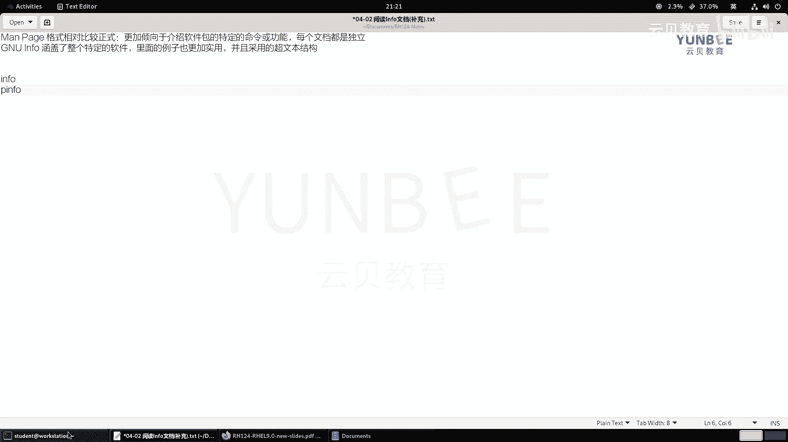

回来之后呢，就来到了这个啊introduction的内容里面啊。啊，那么这是这个是说的是infer啊。那么P in呢P in的话呢给我们提供一个啊这个啊links的一个界面。

就是一个基于文本的浏览器的界面。那么它的界面呢更加的漂亮一些。那么这个时候呢，我们的高亮呢，它能够直接以红色的方式呢来展现出来啊。那么有超链接的部分呢，一般都是什么呀？一般都是蓝色的啊。

同样我们可以直接回车啊，打开对应的页面啊，所以说这两个命令呢，大家呢根据自己的喜好啊去选择就可以了。那么这个是提供一个什么呀啊，这个基于啊这种LYNX。

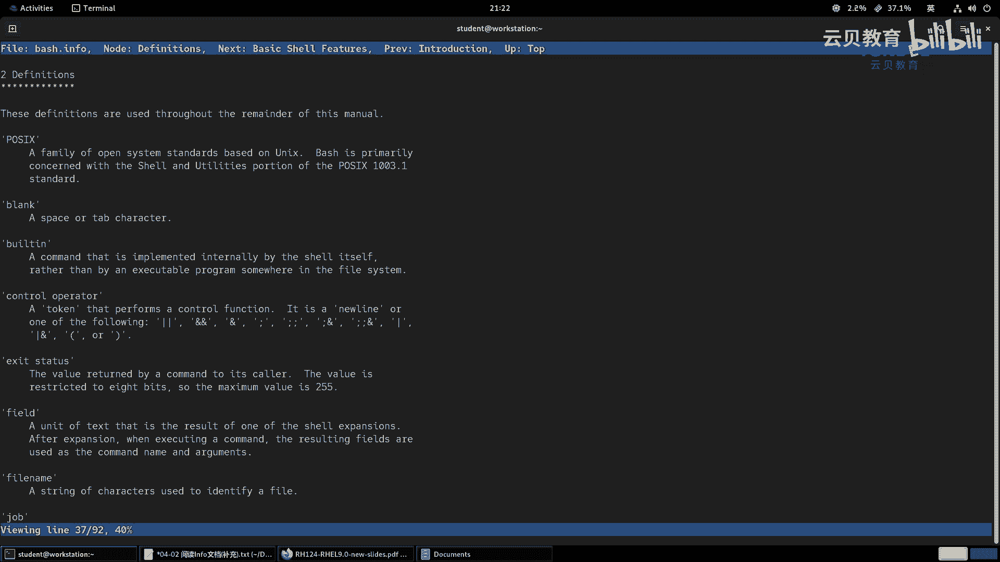

啊，les的一个界面。那么两者啊都是基于文本的浏览器的一个样式。你可以这样理解OK那么其中我们的P inform呢是什么呀？彩色的？啊，是彩色的，那么可能识别度会更好啊。啊，更好啊。

这是我们说这两个命令的一个简单区别啊。那么我们在使用的时候呢，它的语法结构啊，那么语法呢。啊，语法呢是多少呢？是。啊，音啊P音fer或者infer都行啊，后面跟上我们的topic啊。

topic呢就可以了啊就可以了。OK那么在使用过程当中，那么它的一些导航键给大家介绍一下啊，导航键。啊，导航键。那么比如说我们要想去分屏，那么就是空格键。啊，空格或者是配置什么呀，down啊。

那就是向下什么呀。翻屏啊好，然后呢我们使用啊配置什么呀？up。啊，或者是。啊，B间啊B间，那么代表的什么呀？代表的是这个向上翻屏。OK向上分屏。OK好，然后呢要是想显示我们主题的话呢，就是U。啊。

U啊显示我们的主题的负节点。啊，负节点啊，那么还有一个呢就是D。那么D的话呢是用来显示我们主题的目录。啊，显示我们主题的目录OK。呃，如果想返回到我们的页面的顶部呢，是用快捷键home键啊。

那么返回到哪哪里呢？我们主题的一个。顶部。OK那么像。下一个。啊，像。下一个啊抄链接。那么我们用的是方向键的下键，那就是。啊，这个当啊AR呃当 a row啊当 a rowO那么打开光标的主题。

那么我们的命我们的按键呢是回车键，就是enter键。啊，iner键。好，这是我们最常见的几个案件啊。那么除此之外呢，我们还有就是上键就是up。R row那么这个呢是呃。这个像什么呀，上一个。

那上上面的一个超链接。那抄链接OK要想搜索呢，我们使用这个搜索和这个麦里面是一样的。那么跟上你的字符串。搜索关键词。OKN呢就是向下减索。OK向下检索。OK哦，sorry啊，向下检索不是啊。

那么向下的话呢是这样摁的，就是先摁一下这个斜线。啊，然后呢这个再按一下什么呀？再按下我们的回车啊，这样才是向下啊，向下搜索。OK下下搜索啊。呃，因为他这个没有没有没有往上往往就是往前面搜索。

就是往上搜索的，他只有往下啊往下。Okay。呃，以及显示我们主题的下一个节点是N。啊，这个这个这个命这个命令啊比较多啊，那么这个是P的话呢，是显示主题的上一个节点。啊，那么Q呢是退出。啊。

退出啊啊这些按键啊和这个和这个我们前面的这个什么呀呃慢还是很大的区别的啊。那么我们来感受一下啊，那么我们这边啊我去搜一个谁呢？P音 for一个sstemD好了。

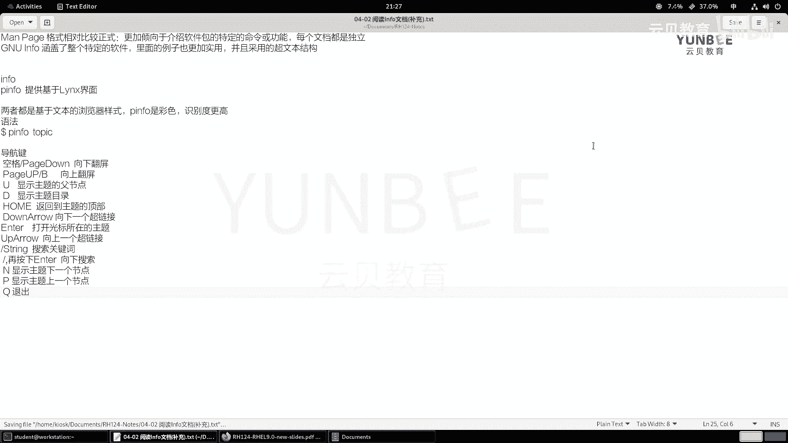

啊，打开之后啊，我们往下空格或者是配矩当啊，返回配矩up或者B键啊，B键啊往下先移移啊，B啊都可以啊，都可以。好，那么现是呢现在我想看一看我们当前的这个主题的副节点多少呢？那个U。打有。啊。

好像没有反应，对吧？我们往上看一下啊，U那应该是我们的这个文档，应该是没有没有附节点啊，我们找一个。找一个别的啊in for call your tells啊，看一下啊，按一下U。哎，可以了，对吧？

哎U啊能够能够按看看到我们的这个节点啊，然后呢我们再按一下什么呀N。啊，N看一下啊。N的话，看来这个。这个版本升级之后，有些按键可能不是很通用啊，我们再找一个coll youQ you tells。

N是哎，这个可以啊这个可以。所以说我们把它更改一下。那么这个NN的话呢，更新之后，那么我们加上一个什么呀音fer好吧，音音form啊。

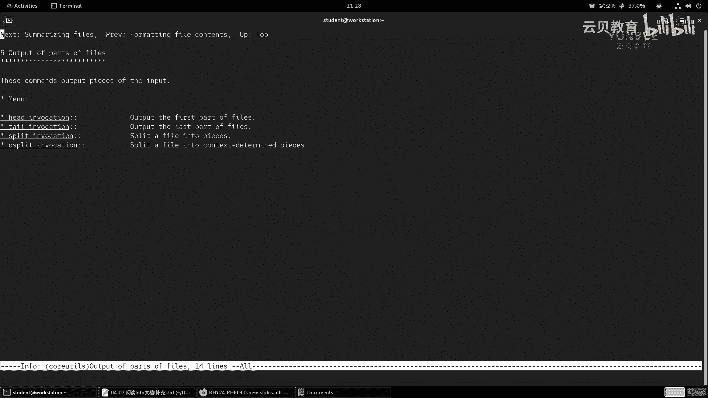

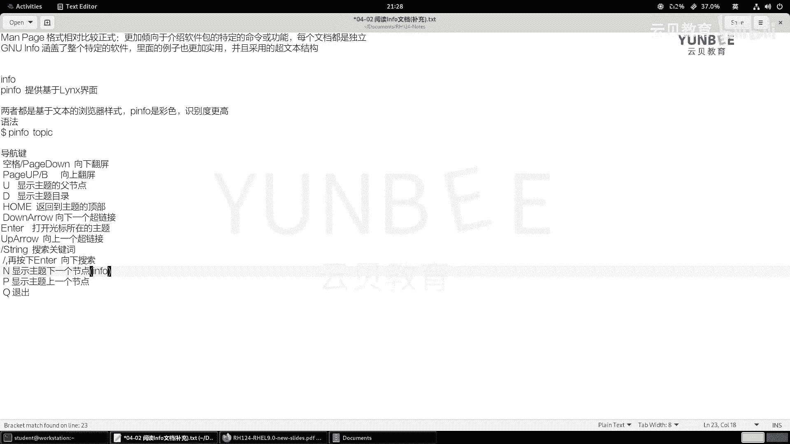

Okay。那么P呢是用来查看上一个节点的。啊，现在已经到顶了啊，我们再加个P哎，这个没问题啊，in啊in infer会更加的实用一点，就是命令更加适用一点啊。那么同样我用这个infer呢。

用个D来试一下。

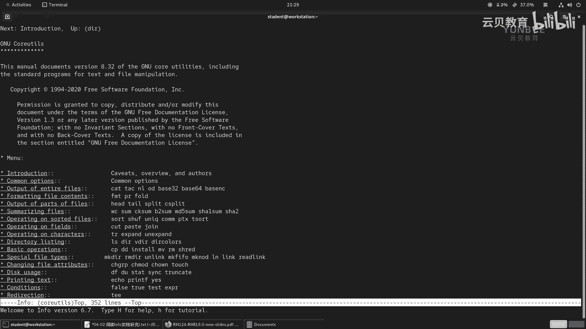

啊，D附节点，哎，这个好像也是。特别是对针对于谁呀，infer更加的好用点啊。这里的D啊也是in for单独的。啊，那么U呢。

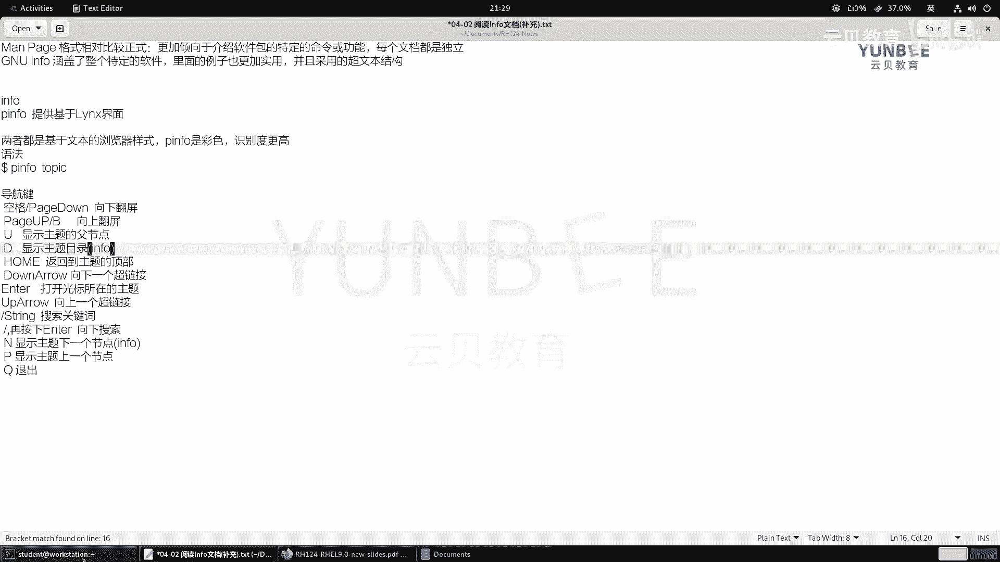

往下移移样试一试，比如说这个。You。OKU啊。OK也是也是一样的啊，这个呃这里的几个快捷键都是对infer特别的好用啊。inform。

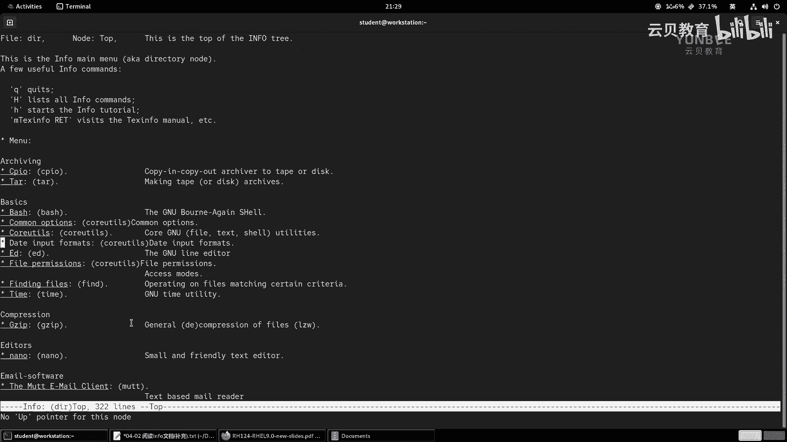

OK啊，P键呢也是音O那其他就一样了，应该啊我们搜索一下，好吧，搜索一个关键词呢，叫做什么呢？叫叫精NU。

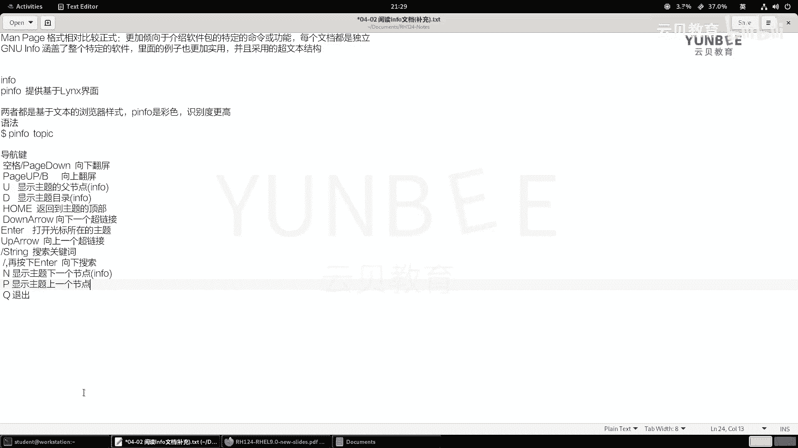

啊，然后。往下找啊，哎，斜杠回车啊，斜杠回车啊，是可以的啊，Q退出。

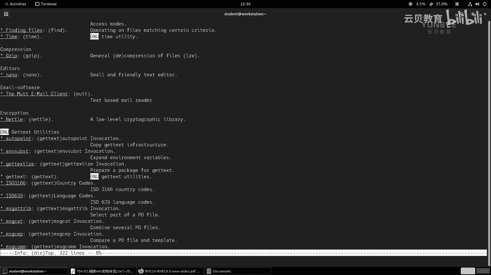

啊，这是呃几个会计按键啊，有点差异啊，我这里呢做了一个总结OK好，那么接着呢给大家做一个非常非常简单的演示啊，非常非常简单演示啊，我们。

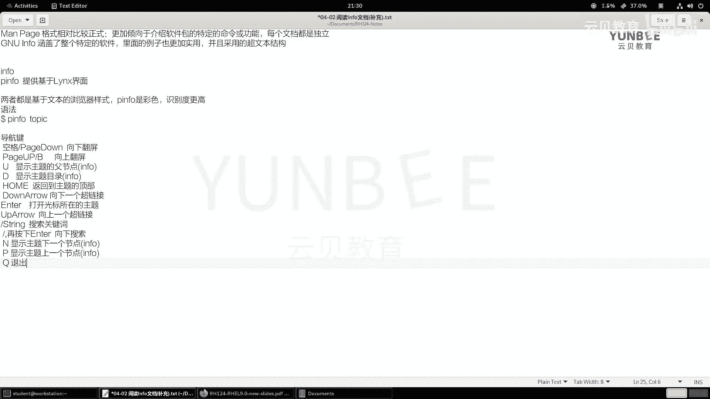

退出刚才的命令了，那么先走一个音P音form，我就走一个拼音form啊，什么都不加。那么然后呢我移动我的方向键，找到一个帮助呢？就谁呢？我想想一想。

找到第二个啊就coll u common options。哎，正好和刚才直接打开的是一样的。回车那我们来浏览。然后呢，我们使用pageup和p置 down呢进行翻译。啊，翻译啊。

然后呢让我们看一看这里的三个横线是什么意思啊，是用来显示这个。对吧有一个的两个的其实就是短格式和长格式之分，对吧？OK呃，然后呢接着呢我们再上一道原来的精 u in，我们摁个U哎，返回了啊，U返回了。

然后呢我们去找一找这个。关于呃GNU u的一个信息啊，GNU u的信息。啊，然后。然后接着呢，我们再摁一下U啊，返回顶级的目录啊，返回顶级的目录OK。这是这个啊。

然后或者说我们直接摁个D来移动到CPIO里面啊，这都可以移动的。你看直接返回的啊，最顶层啊，最顶层啊光标注意看啊，看光标的位置，按个D啊，直接来到最最原来的主题副主题OK。呃。

然后呢接着呢我们去往下找啊，我们去找谁呢？我们去搜一下啊，输个斜杠，搜个扣。you tells啊，然后找到之后啊，然后呢我们按一下回车啊，又打开了。啊，然后用N啊继续找啊，找到这个往下找啊，一直找。

你看各种各样的内容都有啊，你想找到之后呢，确定回车呢就可以了啊，然后阅读完Q退出OK好，那么我们的这个内容呢就结束了，给大家做一个非常非常简单的介绍啊，仅供了解啊，仅供了解，这个不重要O。

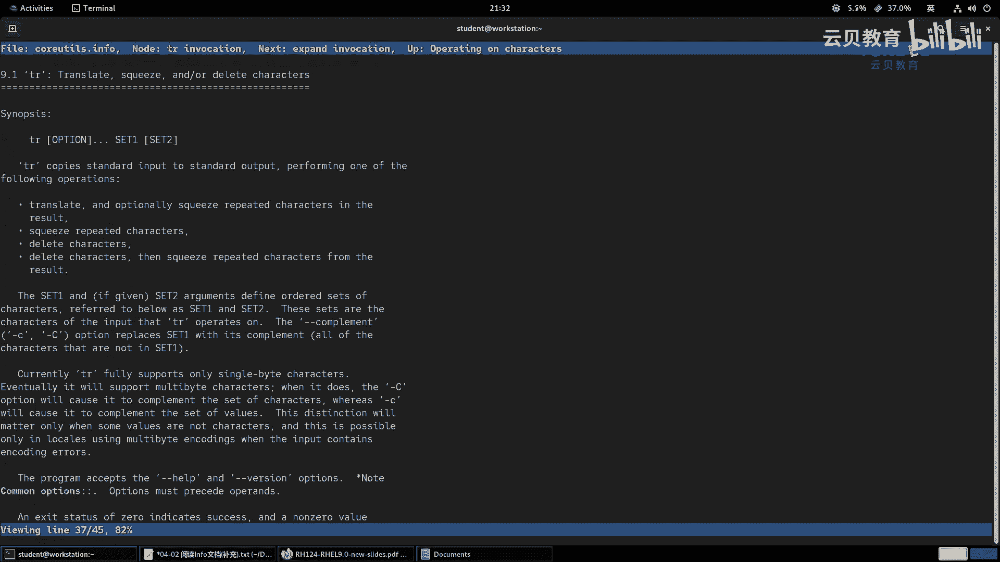

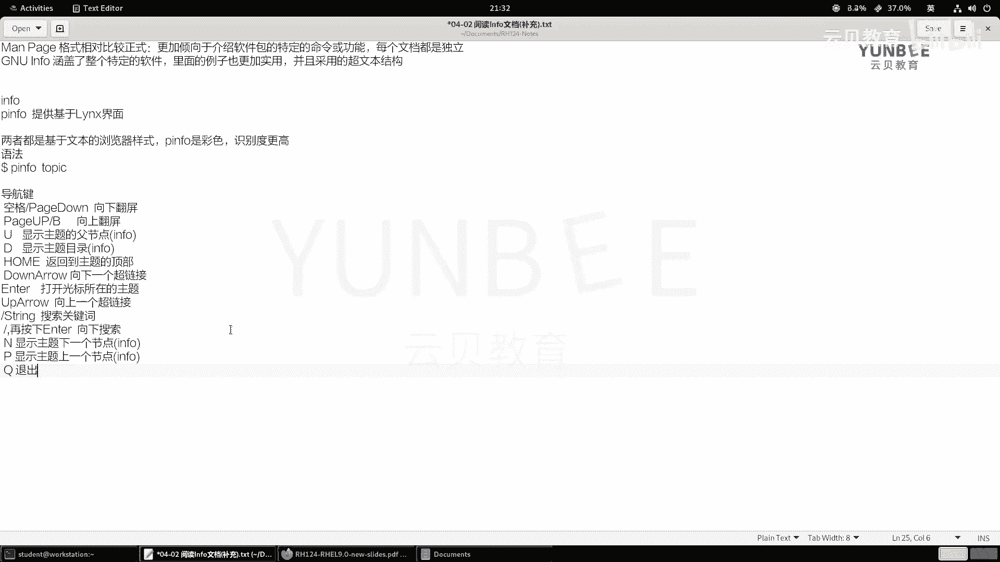