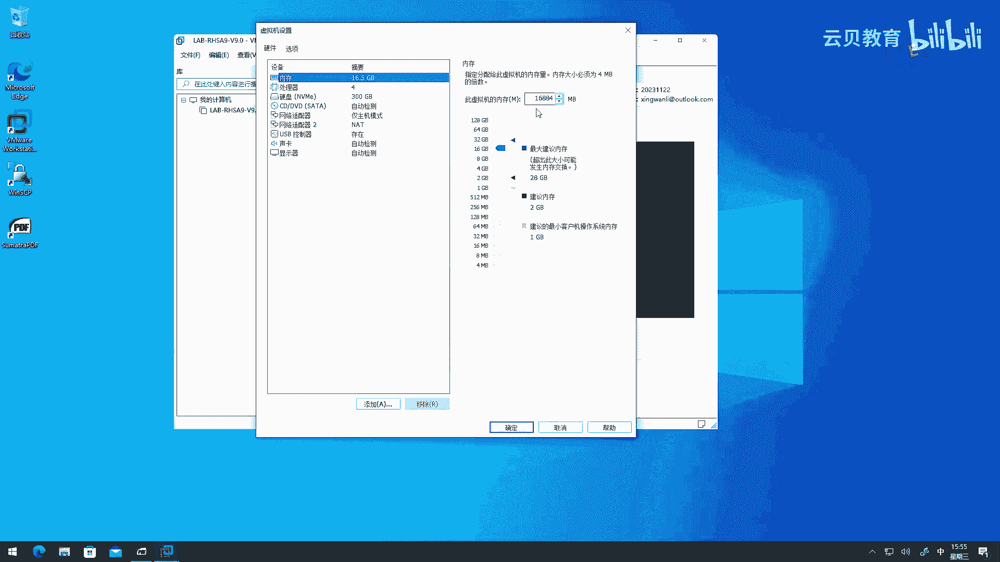

# 零基础入门Linux，红帽认证全套教程！RHCE9认证实战 RH124课程 - P1：00.1 红帽RHCE前言介绍 - 云贝教育 - BV1Ns2gY8EVU

好，大家好啊，欢迎小伙伴们来学习我们这个IHCS的一个课程啊。好，那么在我们正式讲这个内容之前呢，那么先给大家来介绍一下我们的这门课程的一个主要内容啊，然后方便大家呢了解一下。

那么当前的课程是否满足自己的一个需求。好，那么首先呢我这边做一个个人的介绍啊，那么我的名字OK行万里啊，那么呃名字呢也比较啊容易记啊。然后呢，这个我这边呢很早就拿到了红包啊官方这个认证的假师啊。呃。

然后做红帽的培训啊8年了8年了啊。啊，那么红帽的架构师这块的认证呢，目前保留在3啊level3的这样的级别。那除此之外呢啊还有什么阿里云呢V的相关的啊，云原生coberin相关的啊这些呢。

简单给大家介绍一下啊。好，那么我们的重点呢是放在呃给大家介绍一下我们的一个课程的主要内容这一块啊。那么我们这个课程的话呢，是基于当前最新的红帽铁板啊linux版本九啊，然后这个设计的课程啊。

它的HCI红帽这个认证系统管理员的一个课。那么这门课的话呢，主要的内容，我做了一个啊规定。那么我们这门课的话呢，是面向于没有基础的小伙伴啊，开是学习的啊。当然了，我们呃如果有一些计算机方面的知识啊。

还有网络的知识呢是再好不过了。OK好，那么我们的整个的课程的范围之内呢，首先我们会带着大家呢从零开始来认识什么是linux。OK然后呢我们开始给大家介绍什么是命令行，对吧？

然后呢如何在命令行里面啊去这个执行一些基本的命令啊，以及了解了解我们这个linux当中的文件系统结构啊等等相关的这些标啊非常非常基本的一些知识啊。然后呢，接着呢我们会给大家来介绍。

那么如何呢通过命令行来管理我们的服务器。那么管理哪些内容呢？那么涉及的有本地用户的管理，本地组的管理啊，权限的管理软件的管理哎，网络还有网络安全的管理啊，以及什么磁盘的管理呀，容器的管理。

试要脚本的开发啊，甚至还有什么呀？如何呢去监控服务器性能指标O那么。那么我们当前的这个HCSC课程又和啊红帽标准的IHCIC课程有什么区别呢？O那么首先啊那么这个课程呢。

我们包含了标准的HCSC课程的所有的知识O那么这些知识呢大家呢都可以通过我的啊PPT呢能够去啊查看啊，然后呢除此之外呢，那么我这边呢额外增加了一些比较实用的winux的管理的技术。

那么我这边加了一个星号。那么大家呢在看我们的这个整个啊整个我们的这个课程的那个目录的时候啊，那么我会在增加的这些啊课程的小章节的后后面啊，同样用星号来标识一下啊标识一下。但是啊是主要的啊没有涵盖所有的。

那么举个例子，啊，比如说我们我这边增加了一些。啊比如说我们的这个在re9的HCI当中，它啊取消了以前啊re8呀，还有real7的时候的一些一些技术的一个讲解。那我又把它拿过来了啊。

这哎因为我发现啊就是和我的学员交流过程当中发现呢啊有些技术还是在用哎，我们不应该把它丢弃掉，那么这其一啊，那么还有什么知识呢？比如说啊我们应该掌握，但是呢书上从来没有涉及到的，不然它只是提了一点点的。

你比如说啊现在呢我们如何呢去写一些啊sstem地的单元文件。哎，这些啊都是我会加进来的，包括我们这个上面我写的这个什么呀监控服务器性的指标。哎，那么这个内容呢。

其实就是要比我们传统的HCI的内容都要多的啊，要比标准的。RHCS课程的内容的涵盖量要更多，哎，范围要更广一些。OK那么学完我们的这个课程之后呢。

那么我们除了在工作当中啊能够啊解决而些一些这个系统管理的。这个需求之外啊啊我在课我我们在这个整个的课程的啊所涉及到一些实验呢，那么大家跟着学习，那么熟练的掌握之后。

那么你就可以参加红帽的I去CNC的一个考试了。就是我的实验设计的啊，都是能够满足我们的一个需求的啊，满足我们的需求的啊。那么这个是我啊我的我这个HHCI的课程和啊传统的HHC程最大的一个区别啊区别O好。

那么呃我们在学之前，那么有一个问题还要解决一下什么问题呢？就是说啊我们最好的方法呢？就是啊有这个什么呀配套的环境，对吧？那这样是最好的啊，OK那么所以说呢我这里呢给大家介绍一下我们的配套环境。

啊那这个配套环境呢会在啊我们的这个。标题当中啊，会我们在课程的啊列表里面给大家提供这样的一个啊链接，或者是其他方式来给大家提供啊O啊，那么。我们来看一下啊看一下。首先呢呃我们在准备学习之前呢。

我会把我们所用到的这套环境啊放在百度啊网盘上面啊，然后呢去啊大家去下载的去使用的就可以了。啊。那么首先呢在下载的时候呢，我们要有两个条件是要满足的。一个呢是我们的这个硬件啊硬件啊，硬件呢这一块呢。

那么我这边写了，那么至少是英特尔的I5的处理器或者同等性能的AMD的芯片。okK这两个是要求的啊。那么呃如果是我们我们是推荐走英特尔的啊，英特尔的那么AMB的新的芯片也是没问题啊，没问题。OK啊。

那么我这里呢以英特尔的为例啊，那么我建议啊，那么咱们的。这个CPU的这个代数呢就是建议至少是8代起步啊，八代啊，像什么有些还有什么四代的，五代的就太老了啊，那么因为咱们的系统呢也是比较很现代，很现代。

但是呢呃咱们的系统是reo9啊，毕竟是面向服务器的，所以说呢。咱们如果的CPU是13代的话呢，那么使用的时候呢可能会出现一些问题啊，因为它的内核对13代的CPU呢是不够兼容的，ok不够兼容的啊。

这个地方大家要注意一点，所以建议大家呢就是用八代以后，但是不超过13代的CPU。啊，不超过13G的CPU啊，这是最好的啊。OK呃，然后呢，咱们的存储这一块呢，就是要求咱们本地的磁盘至少有100GB的。

啊，空间我们强烈推荐走SSD。啊，就是固态硬盘啊，固态硬盘这一块啊好，然后呃我们的内存啊内存的话呢，我这边呢就是啊这个宿主啊，那么你的就是你的个人的电脑啊，只有PB内存的啊。呃，那么我这个推荐的话呢。

应该是。我这个推荐啊啊不是说啊我们的这个个人的电脑是推荐石有GB内存啊。ok那个我的这个推荐呢就是说我们至少就是说我们的如果我们的个人的电脑大于石有GB是更好的那是更好的啊O因为我这个推荐本来是应该写在后面的后面的。

那么我们然后呢，为什么要至少使用GB呢？因为我们还要给我们的viware world station。哎，给它分配啊14GB内存。那这里呢给大家再详细的来说一下。

那就是说我在百度网盘上给大家分享的这套环境呢，就是基于wemware来做的。啊它是1个OA one的环境啊，里面啊有一个房地震里面有很多台虚拟机啊，这些虚拟机的是来学习的。

就是虚拟机里面套了一个虚拟机哎，一个套了的虚拟机啊，这个我们在后面的正式课程当中会再详细的来给大家介绍怎么去使用啊，怎么去使用。那么是14DB内存，其实呃根据啊这两天官方的要求呢。

其实我们还是建议就是你的房地，就是我们下载的这个vi station来运行的这台虚拟机啊，分配16GB内存。okK啊，然后呃还有一个一个硬硬性要求，那就是我们的个人电脑。那么dance虚拟化是要打开的。

OK因为呃是这样的，跟大家解释一下。因为咱们现在的win station呢，它有个功能就是。就说它可以和什么呀，windows自带的heber共存。哎是共存啊，走这样一个虚拟化。但是呢共存之后呢。

会有一个问题，就是说我们的viewware station就不再支持虚拟化的嵌套了。哎，就不支持了。所以说呢如果我们啊安装了he v的话，比如说咱们用了什么windows的linux子系统这种的啊。

你要把它关闭掉了，你需要把它关闭掉，这个地要注意。还有呢就是。我们要关闭掉啊windows的一个内核的一个保护的机制，也是要关闭掉的那这两个都要都要做啊。那如果大家这块呢，你啊想尝试自己解决，对吧？

网上搜一搜，都有解决方案啊，那如果解决不了呢，啊我们也可以啊通过其他途径啊。比如说我们呃看看后期能不能通过远程的方式给大家去解决这个问题OK啊，因为咱们的这个视频有可能啊这个就联系老师这一块啊。

可能不是很方便啊，咱们再将来再想办法啊，啊最好的是啊这个网上自己搜索一下这个解决方案啊。OK好，然后或者说我们也可以在啊这个留言的方式来告知啊，然后呢给大家再啊额外的去介绍啊，都是可以的啊。啊。

这个地方一定要注意啊啊要打开beos的虚拟化。然后呢我们的呃vi where season的一个版本呢，那么建议呢17版本17不要太低了。因为呃从17开始才支持reo9。啊，如19啊。

这个地方大家要注意了啊要注意了。好，然后。

关于如何在dos当中开启虚拟化呢？那我这里。给大家做一个简单的一个介绍。因为这个呃演示起来不太方便啊，然后。我就做了个截图啊，那我这个是以呃thinkpad为例啊。那么不同的品牌的电脑呢。

它在开机的时候进入bios的按键呢是不一样的啊，有些是什么delete键，有些是F12，有些是F2，对吧？啊，都有啊，那么我们进来之后呢，那么你看我这里的think pad为例。那么我会找到安全啊。

在高级一般会在高级里面之类的啊，去找个你就找那什么呀，找CPU那一块，找CPU这一块啊，像我这个在安全当中有一个虚拟化。那么我们要确保这里的有个什么呀啊，有一个英特尔的虚拟化的技术打开的。

那如果支持VTD的话呢，建议你要打开。那么AMD芯片呢有自己的，没有自己的标识，把这个虚拟化打开啊打开。一般来说啊，现在的品牌电脑都是默认都是开着虚拟化的。都是开着的那你说我。

有没有必要先到bis里面去检查呢？没事，我们可以啊在windows开机的状态下呢，我们走一个这样的命令。

啊，大家呢可以在你的命令提示符里面啊啊，那么走一个叫做system in for命令。你走完这个命令之后，那如果你的bios当中啊虚拟化是打开的那你可以看到这里面有一个什么呀？

有一个固件中一起用虚拟化是说明就打开了啊，如果这里面写了否啊，那么你就干嘛呀？重启你的计算机然后呢进入bios里面啊，然后把虚拟化打开呢就可以了。OK那么这些事情做完之后啊。

再加上你的啊已经把我们的这套环境啊啊下载到了你的本地磁盘上啊，并且安装了winware station pro的这样一个软件啊，然后呢我们就可以把这个啊下载的这个虚机啊啊环境啊，我就称为环境好了啊。

把它啊这个把它是干嘛呀？把它加载啊加载到我们的ware station。那该如何去操作呢。好，那么我们打开我们的这个veware station之后呢，我们先对它的网络做一个设置啊。

因为呃我做的这套环境里面的默认网卡呢走的是hos only模式。而这个ho only模式呢啊它又和ve station里面的hos only模式呢是冲突的。啊，是通突的啊，所以说呢我们要把它给禁用掉。

那怎么禁用啊？那么就是打开编辑，然后呢去选择虚拟网络编辑器。啊，找到这个地方，然后接着下一步干嘛呢？下一步啊点开之后呢，那么会弹出来一个窗口啊，问我问我们要不要把这个更改设置。

O那么我们就点击更改设置啊，更改设置之后呢，我们就会看到一个这样的一个界面了啊，叫虚拟网络编辑器。哎，然后呢我们选中VMnet1啊，那这里呢啊给大家解释一下。

那么VMnet一是viware里面默认的post only啊，这块要网卡，就是仅主机模式啊。那么选中这块网卡之后呢，那么在下方有一个复选框，叫使用本地DHCP服务器，将IP地址分配给虚拟机。

那我们要把这个啊这个复选框里面的这个对勾啊给它去掉哎去掉啊啊就可以了。然后呢点击应用确定就可以退出了。啊，那么退出之后呢。那么那么接着下一步呢就是干嘛了呀？

就开始去啊加载我们的这个V world station了啊，那么具体怎么加在呢？我这里呢啊先给大家演示一下啊，这个注意事项我们稍后再说啊。好，那么我们。

我先把这个PPT呢最角化啊。好，那么我们打开我们的we station啊这个软件。好呃，那么我这边呢演示一下。那么比如说我先选择编辑。啊，选择编辑，选择虚拟网络编辑器。好好。

那么现在呢我们看到这个窗口啊，然后点击这里的更改设置。哎，点击是啊点击是。好好，那么我们选择vinet一哎vivenet一，你会发现这里有一个复选框哎，使用本地的BSCP符将IP地址分配给虚拟机。

我们把这个对勾呀给它取消掉。哎，然后呢应用。啊，那么。走这一波之后啊，确定。好，那么我们的这个功能呢就设置完毕了。好，接着呢呃那么我们可以选择直接选择这里的打开虚拟机。

或者在菜单栏里面啊找到这里一个打开。都行啊，都可以啊，都可以是一样的啊一样的。然后大家我建议大家呢按照我的方法来啊，因为呃我发现有些小伙伴没有用过这个软件，他不知道怎么打开，然后。自己呢是新建虚拟机。

然后再导入磁盘的那这样的话能用吗？能用是能用，但是呢它会丢失我给大家配好的一些配置。所以说按照我的来啊，按照我的来啊打开虚拟机，然后呢，它会弹出来一个窗口，那么这个窗口呢干嘛呢？

我们就啊利用这个窗口呢去啊打开我们下载啊下载这个环境的目录，比如说我呢就在D盘里面来找到一个这样的目录啊，点开。那点开之后呢，那么它只会识别它的这个配置文件，执行文件。

那么您就看到一个绝对不会出任何的错。然后呢选择打开它就可以了。

哎，打开就可以了。那么打开之后呢，那么呃首先啊那么我们要做一件事情呢，就是检查一下这里的点击这里的编辑虚拟机的设置，我们要去做检查一下。

因为我发现呢这个呃viware was station pro17这个版本有一个小的bug，就是说啊我们的这个在处理器这一块啊，它会丢弃，就有的时候会丢这个有一个有一个复选框啊，叫虚拟化啊。

这个inter VT什么什么的这样一个这个对勾呀，可能会会消失啊，我们要确保这个对勾呢是勾着的，但是勾着的啊啊，然后呢这个处理器的数量呢，那么现在的电脑一般都是。肯定是大于四核啊。

这个四这个四个核心的那如果你说我的电脑就四个核心，对吧？那你可以把这个地方改成2乘以2。啊，再小就不变议了啊，再小就不建议了，好吧，然后内存呢我这边给大家分享的之后啊，内存呢就是16。5。

因为这样的话呢，我们里面这套环境内存基本上就正好是16GB。啊，如果你说我的电脑一共就16GB，那你就把这个内存呀调整成多少呀？调整成14GB。那你可以打开我们的什么呀计算器。

然后找到我们的计算器，然后你算一下对吧？算一下，那么14呢乘1个1024啊，等于个14366，你可以稍微多一点嘛，行15001500啊，1500呀，15000。

哎，这样的话也是可以的啊，这样也可以的啊，这样也是可以的啊。那么再小就不太建义了。同志们啊再小就不太建义了啊，然后你就可以开机了，选择开启此虚拟机。那么你的环境呢就加载完了啊。OK那么注意啊。

我们在描述里面也可以给大家说了，他默认的这套环境的账户啊，叫key ask密码呢是red hat，我们没有对root账户的任何权限。那么哎走到这一步，那么我们的环境呢就能够。

准备完善了啊，那么准备完善之后呢，有两个注意事项，就是建议大家呢就是不要对我们的扫地震做任何网络的更改。啊就除了我给大家刚刚演示的步骤之外。

任何的其他操作不要去做OK那么第二个就是啊大家加载完成之后干嘛呀？打个拍照，哎，打个拍照，那我怎么打拍照呢？哎，那么我们可以啊在选中啊，选中这个地方哎，或者说直接点击右上角。

啊，这个我鼠标这个地方类似于有个什么呀？时钟的位置都可以啊。好，那么我我一般都是在啊这个菜单栏里面啊，选择快照。选择拍摄快照。对吧那这个快照呢，我们建议大家呢起个名字。起个名字对吧？

比如说起个初始化对吧？起个INIT对吧？初始化的快照起个名字，这样的话呢，你在还原的时候就知道啊，我这个还原是哪个版本，对吧？哎，描述一下这个初始的信息，选择拍始快照哎就完毕了。好。

那么这个呢就是给大家来介绍了我们的环境的一个。

打一个什么呀？一个最原始的一个打开的方法，以及我们的这个呃HHCMC课程的一个主要内容。

