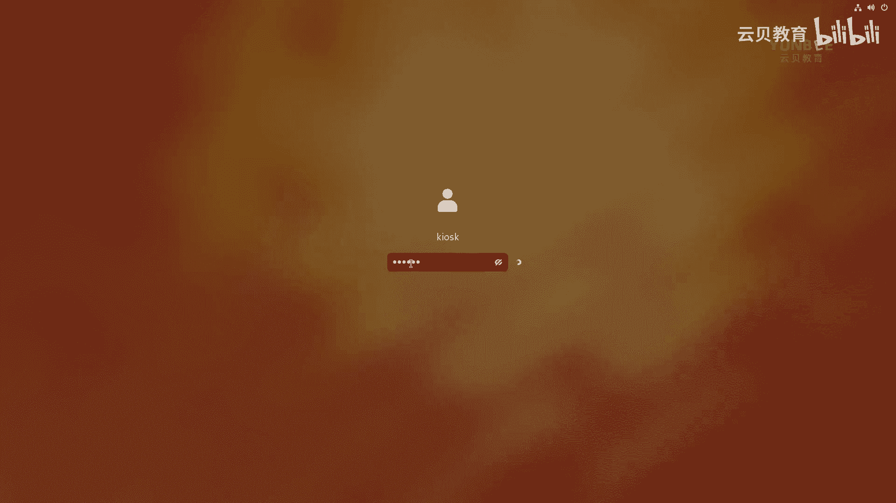
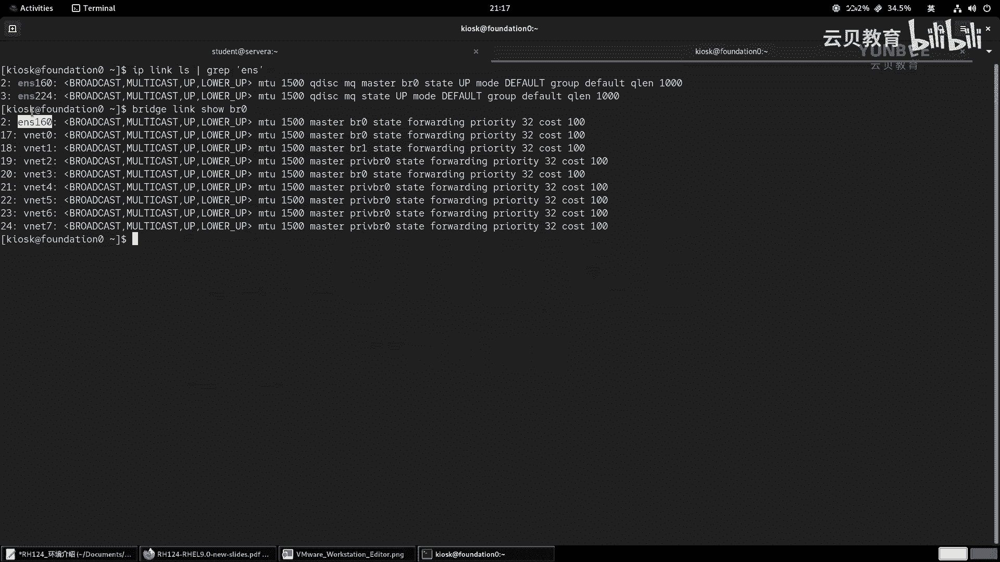

# 零基础入门Linux，红帽认证全套教程！RHCE9认证实战 RH124课程 - P2：00.2 环境介绍以及设置环境 - 云贝教育 - BV1Ns2gY8EVU

好，那么接着呢来给大家介绍一下我们的课堂环境啊。那么在正式呢理解这个拓图之前呢，我们先给大家说一说我们的环境是怎么组成的啊。OK它的架构是怎么样子的？O那么呃就正常一般情况下啊，一般情况下。

那么一般情况，那么我们的环境呢是安装在。啊，是安装在啊这个物理啊物理PC上面的那就直接安装。O那么。大概呢是什么样子？那么我们来看一下这张图片啊。好，看张图片。那么这张图片的话呢。

就是我们标准的一个部署方式啊，那么个人的电脑啊，个人电脑一般我们用的都是台式机啊，台式机啊，教教学环境当中，我们一般用的台式机。因为这样那个呃硬件的扩容啊这块比较方便啊。好。

那么我们直接在PC机上呢去安装一台啊仿迪是0。啊，房定阵零啊那么房地阵零呢是干嘛的呢？它是讲师端OK是讲师端啊。啊，这是他的全名啊，主机的全名称，还有一个学生端。

那么学生端的话呢呃是通过网络引导的方式来安装的啊，他会从房地证名上啊去安装操作系统。那么它的主机名安装完之后呢，是房地产X。那么这里的X呢，它的范围呢是1到20，一般来说呢就是1到20啊。

当然可以更多啊。那么新的版本当中，我们最多可以安装200套左右啊，一般呢这个其实用不到，对吧？因为你呃参加考试的时候，那么教室里面最多是容纳20台考试机所以说我们啊教室里面也是20台。

那么在这个环境里面啊，它有个玉子玉啊，叫LT。OK那么这个ILT是干嘛的？给大家说一下啊，ILT那么ILT的话呢，代表的是啊这个instruct。啊，然后呢leader。啊，崔林。

就是啊有讲师啊作为这个啊引导学习的一种培训。OK就不是自学啊，是讲师引导的。也就是说啊我们。啊，老师在上面讲台上给大家讲课，大家呢在啊下面呢去跟着老师的节奏呢去教实验啊，这是最传统的方式啊。

OK那么呃但是呢随着发展啊，那么现在呢我们呃这个。特别是疫情之后啊，特别疫情之后，那么我们在呃这个交付课程的时候呢，更多的是干嘛呀？走线上了。那么走线上呢，走线上呢，其实我们指的就是什么呀视频教学。啊。

线上呢就是视频教学。那么这个线上的话呢，就意味着我们没有办法。啊，没有办法呢来到线下，对吧？那么去呃，使用教室的机器啊，因为呃这里的讲师端也好啊，然后呢，这里的学生端也好，那么他都是什么呀？

他都是一个局域网啊，在一个局域网当中。OK那么线上的话呢，我们每个学员分布在全国各地，对吧？那怎么办呢？OK那么这边啊，那么我这边呢就是将我们的讲师端这套环境。干嘛呀？那么利用啊利用啊wimware。

啊，W station。干嘛呀？封装了一个镜像。好，去封装OK。封装了一个镜像。啊，这个镜像是个虚拟机文件，对吧？哎，虚拟机。文件。那么这个训机的文件叫什么呢？叫lab2HSA9杠V9。0。

OK那么这套环境呢，它是一个什么样架构呢？

O是这样的啊是这样的。O那么我们来看第二张图片。那么第二张图片呢，你看那么首先呢这个硬件呢就是我们个人的电脑了啊，个人的电脑OK那么个人电脑上面呢有可能装的是windows，要么就是装的是macOS。

对吧？就是苹果本啊，那么。更多的人呢一般用的都是windows啊windows不开。那么我们这个拿到我提供的这套啊ware的虚拟机之后，那就是lab什么呀？把这个图片放大一点，你就是lab2HS9V9。

0之后，对吧？那么在前面的视频当中，那么已经给大家介绍了，那么利用啊，把这个labHS9V9。0这套环境呢打开对吧？打开啊，那如果你用的是m克的话，那你也可以啊用这个ware啊去加载啊。OK呃。

方法都是差不多的啊方法差不多的啊。那么当我们加载完之后呢，那么我们打开这个labRHSC9V9。0之后，那么我们其实就是打开了房地震灵这台虚拟机啊，那么我现在给大家讲课呢。

那么我们看到这个桌面其实就是房地震灵。啊，放定震灵啊，那么我的底我的底层的系统呢，速主机的系统呢是windows。是windows，那么我用的也是willware word station来运行的。

那么怎么去验证我们的主机名是不是房地产0呢？OK那么在我们的屏幕的左上角有一个activities。啊，我们点开，那么点开之后呢，在我们的下方有一个大boardO大ashboard。

那么大shboard里面的第三个啊，第三个按钮。那么我们鼠标在上面悬停之后，那么能看到这里有个标识，那叫termin。

OK点开。啊，点开，那么点开之后呢，我们在这里敲一个命令。好，让大家看一下，因为发现我们的主机名就是仿定是0点LT点ex点comOK那么和我们图片上的啊这个是一模一样的。啊，是一模一样的啊。呃。

那么在这个仿定是零上呢，还有几台虚拟机。啊，还有几台虚拟机，同志们，那么那么这件虚拟机呢，那么又和我们的这个虚这个啊这个这个lab2HS9这个虚拟机呢可能名字啊在描述的时候呢会冲突，好吧。

那么所以说呢我们在。在说的时候呢，注意啊，我们说的时候，我们把这套环境呢起名啊，就叫什么呀？我们就称之为啊。我们称之为是房地税。啊，这叫房定审。OK因为这个名字是随便起的，我也我我也可以起成什么呀。

起成别的名字对吧？那但是这个名字是绝对是稳的很啊，绝对不变。O然后呢在。😊，我们访定里面跑的这些啊，比如说我们图片上的什么classroom呀。对吧bas train呀。啊。

这个word station。啊，serv a server B utility。这些那么我们把它称之为虚拟机，好吧，虚拟机。啊，虚拟机啊虚拟机okK那么这些虚拟机呢我们可以怎么去看呢？怎么去看啊。

那么同样还是在我们屏幕的左上角点击这里的activities。

那么然后选择下面的第四个图标，那么鼠标放在上面之后啊，悬停能看到有一个标识叫viual machine manager。

OK那么这个这个软件呢就类似于我们windows里的谁呀？we where world station。但是你打开之后发现里面空空如也，什么都没有啊，什么都没有，为什么呢？

因为我们现在还没有给我们的环境做一个初始化。OK一会儿呢，我们初始化完毕之后呢，那么这里提到的什么？classroom啊等等，这些呢就会出现啊出现。我们先给大家介绍这些训机是干嘛的啊。

那么首先classroom是干嘛的？classroom的话呢是一台啊是一台非常重要的。服务器。OK是一台非常重要的服务器。那么这在在这台服务器上呢，它提供了两个站点。OK2个站点。

那么这两个站点分别呢是HDDP。content。点example点com。那么这个站点呢是来提供提供我们的系统光盘。OK还有我们在呃使用的什么呀软件包。哎，就在我们的这个站点上面提供。那么除此之外。

那么我们还有一个站点。叫的medadeals。那么这个站点提供什么呢？它提供的是我们的练习所需的文件。啊，练习的时候所需要的文件OK所以说呢这台机子呢一定要保持是运行的。

OK那么其中我们的这台机子呢在默认情况下啊，就是设置完。啊，设置完。课程之后。那么啊会跟随。我们的仿定线。啊，开机自动什么呀，启动。OK会自动启动啊。那么接着呢，下面还有谁呢？

接着下面的是我们的bation。ba的话呢是属于什么呀？啊，它是一个啊属于连接我们的学生网络。啊，我们称为是tudent network。到什么呀啊，教室网络。啊，教室网络啊，那么就是去哪里呢？

去classroom啊，class room啊，然后呢呃。的一个重要的服务器。那么所以说呢，在我们的环境当中，他充当了一个什么角色呢？充当一个路由器。那路由器还充当了域名解析服务。打击服务。啊。

非常重要OK那么第三个呢，就是我们的啊学生端啊，学生啊啊学生啊。我们学生用。的虚拟机。啊，虚拟机。那么在开机的时候。啊，那么需要啊通过我们的ba。啊，被子人啊，那么像class room。

那么下载开机所需的脚本。OK那么这个脚本是什么内容，我们不用关心。OK但是我们需要知道的是，如果我们的学生用的虚拟机。在开机的时候，没有办法去下载这个脚本。那么我们学生用的训机呢就没有办法正常运行啊。

这个地方一定要注意好，那么接着。那么下面的这些啊下面的这些我们把它称之为是学生用的虚拟机。为什么要这样称呢？是因为我们在啊学习期间。啊，所有的实验。啊，都是在。学生用的虚拟机。中执行的。

这个地方大家一定要注意okK这个地方一定要注意啊，我们既不在foition零上，也不在classroom上面，也不在basic上面去敲命令，仅在学生用的训机里面去执行命令。

并且呢更重要的是我们会在啊word stationationth a和serv B，包括有ility我们都不去执行。okK。啊，都不去执行啊啊，那么这个地方要注意okK好，那么接着。

那么word station是干嘛呢？word session呢它是一个具有图形界面的工作站。那么就充当了一个什么角色呢？充当了个人啊电脑的角色，好吧。就类似于我们的工作的笔记本。啊。

你通过上面的远程软件连接到我们企业内部的服务器上面。OK。那么除此之外呢，呃还需要啊在该节点。运行什么呀？lab的脚本。OKlab脚本啊，那么serv a那么是干嘛的呀？serv a是我们的服务器啊。

服务器A吧。那么serv B呢是我们的服务器B。那么有TT是干嘛的？有TT的话呢，也是啊呃不用于管理OK不用于管理啊，就你不用去搭理他啊，让他跑着就可以了。那是干什么用的呢？在我们的RH124当中。啊。

忽视就可以了啊，忽视就可以了。那么在我们的2H134当中呢。那么充当的是啊这个容器。镜像寄存服务器，也就是我们所谓的regtry。OK你就是所谓的re。OK这是几台虚拟的角色。

OK大家是要了解的啊是要了解的好了解的。好，那么我们再来回过图啊，回过我们的PPT来看一下这张图，那么就能够一目了然了。你看啊，我们通过word station。啊，W station然后呢可以干嘛呀？

在学生网络当中，那么它的网段呢是172。25。250啊，在这个网段的情况下呢，我们的word station啊，word station就可以来管理我们的serv a server B。

OK以及从UTT上面呢去拉取什么呀？容器镜像。OK那么这些机器的流量呢又怎么去啊连到classroom的呢？那么这些流量经过学生网络，然后呢会到哪里呢？我们的be子这。ba斯这呢它有第二块网卡。

那么这个第二网卡的网段呢是172。25。252，那么流量呢就发送给了class room。OK。啊，这是这样一个过程。那么除此之外呢，我们后面也可以在findition零上面啊，那么做一个命令。

那么这个命令一旦执行啊，它会启用我们findition0的第2块网卡。那么这个网卡呢，它就会把路由啊和classud room上面的第2块网卡的路由呢打通。哎，就能够实现我们的这些虚拟机呀和互联网接通。

啊，接通啊。好，这是我们介绍的这些啊这个虚拟机它们之间的一个关系。啊，关系啊，所以说我们在呃日常的学习过程当中啊，一定要确保cloroom是正常运行的。

还有bastion呢也是正常运行的这两个是必须的啊必须的。好，那么接着呢我们来看看他们之间的这个主机名啊，主机名还有IP地址。O。呃，那么。主机名。那么在我们的学生端这一块啊，学生所用到的虚拟机。

那么都是lab点ex点com的一个域名啊，一个域OK那么网段呢都是172。25。250的那具体的IB地址呢，我们也不需要刻意的去记，不需要啊不需要啊。OK好呃。

那么接下来呢我们给大家介绍一下该如何的去呃做一些这个呃配置啊配置。好，那么我们来看这个PPT啊。好，那么我们打开我们的这个房地产之后呀，那么如果是锁屏的啊，那么我们直接输入密码啊，回撤之后啊。

那么我们输入一个密码叫readdhead就可以了。啊，re就可以了。嗯，大概是这样一个效果，大家看一下啊。

就是我们有的时候时间久了，锁屏了，对吧？哎，那么有个账户呢叫key ask。啊，K ask。那么这个时候呢，我们就输入密码red hat回车。

啊，就可以了啊就可以了啊。那么。打开之后呢，干嘛我们需要打开一个终端。那么前面呢我这边已经打开过一个终端了啊，那如果你忘记掉怎么打开了，那么我们再看一遍啊，屏幕的左上角activities。

OK然后呢接着啊在大师bo一栏当中选择第三个啊termin。

啊，terminalO好，那么打开之后，那就是我们的窗口了，打窗口了啊呃，然后呢我们这边呢顺便把这个讯机的管理软件呀也打开啊，顺便监视一下。我们看一看这个讯机有没有生成成功，好吧。

那么如何让它一直停留在最上面呢啊在这个窗口上面啊，鼠标右键在下面有个always on top，我们选中它。这样的话呢，我们的这个窗口啊，你看。

不会遮挡。啊，不会遮挡。好，那么接着呢我们需要在房地震0。A in三个 meaning。啊，第一个命令叫修度。H T G said a course。IH199。那么IH199呢。

就是我们的这个环境里面的一个coursese，就课程标题啊。那么这个IH199呢可以用来学习我们的IH124和IH134。啊，是可以通用的啊。那么接着第二个命令呢。

就是走1个IGT杠VMCTL full recite classroom啊，杠杠yes。啊，然后啊再执行第三个啊HT杠VMCT要get all好，我们来给大家解释并演示一下。

好啊，那么我们现在呢这个。执行一个命令啊，这个命令啊。叫做修路。O秀度。啊，空格。啊，这个地方大家一定要注意啊，因为啊咱们的学员当中可能有几个别的会干嘛呀？他这个以前用过linux，但是又不熟啊。

那么他知道一些linux命令的最简单的语法，在这个地方反而会容易出错啊啊，没有基础的人也容易出错啊，那么一定要注意了SUDO空格。然后IHT。啊。短的啊这个横线啊。

就是我们这个呃键盘上面数字键右边的这个啊，挨着加号的旁边的那个。然后解s COURSE。空格啊RH199注意啊，那么空格的地方呢只有两处。啊，其他地方呢都是紧密的，一定要看清楚啊。

很多人在这个地方容易写错，习惯性的再加加加一个空格，没有空格啊，这是一个命令啊，这是一个命令，它不是两个啊，它是一个OK好，然后回车。那么回来之后呢，因为它要设置嘛，所以说时间比较长。

我们就耐心的等待一下啊，等待一下。好，那么设置完毕之后，我们的虚拟机还没有出现啊，还没有啊。那么是因为我们还没有启动虚拟机，那怎么办呢？那么接着我们走第二个命令啊，RHT。杠VMCTL空格。啊。

ful reset。啊，空格classroom。杠啊空格啊，杠杠yes。啊，然后回车。那么这个时候呢，你观察我们右边的这个窗口，你会发现会多一台谁呀？classud room，并且呢是running。

那么小伙伴们要注意了，那么这里的running呢。我们只能够理解成什么意思啊，你不能把它理解为运行，你要理解成什么意思呢？你要把它理解为啊你的讯机呢开机了。OK就是接动电源了。那到底有没有正常运行呢？

你是看不出来的，在这里啊，你看不出来，那怎么办呢？我们鼠标选中它双击。

啊，就会打开它的本地concil啊，也叫本地控制台啊，然后呢我们就让它运行，一直看到登录界面为止。那么这个启动过程呢，也和我们的硬件的这个性能是有关系的啊，还有这个比如说CPU啊。

还有磁盘的性能都是有关系的啊。好，那么已经正常开机了，那么我们可以把这个窗口呀关闭掉了。右上角的一个啊这个啊X的一个标记点击。

啊，那么你这个时候呢，如果你想测试有没有通，肯定也通了。pin空格杠C啊，我们就P三次好了啊，然后class room点example点com。啊，是能够正常通信的啊正常通信的。好。

那么接着我们在呃这个执行第三个命令叫做IHT。杠VMCTL啊，然后空格get空格哦，那么这个命令呢会帮助我们将啊涉及到的虚啊所有虚拟机呢下载到啊这个本地。那么与此同时，我们右边的窗口里面呢，也会发现啊。

这里会啊增加一些虚拟机啊，都是shut off的状态，就是关机的状态。好，已经全部下载完毕了。啊啊，因为这个字太多了啊，我清一下屏幕怎么清理呢？在终端的后面呀执行一个这样的命令。

叫clear CLEAR回车啊就干净了。好，那么接着我们来看第二步。那么我们前面经过这么多的啊命令了。那么我们的环境到底啊符合不符合我们的需求呢。

那么使用cat。啊，空格啊，ETCRT来验证一下。

好，那么这里呢给大家验证一下。cat空格斜线啊，ETC斜线啊，然后RHT。OK那么我们关心的地方呢，在这里，你看哎coH199啊。

然后呢它的虚拟机有beittion ver station utilityityserv aserv B，你看这里的关机的哎，正好全部满足。然后呢，还有一个呢VM0。

那么VM0的意思呢就是它会跟随我们的fodition的启动而正常自动运行。啊，已经跑起来了啊，跑起来那就可以了啊就可以了。好，那么接下来呢我们走第三步执行一个命令啊。

叫做HT杠VMCTLstar all。那么这个命令呢是用来启动我们啊学习所用到的所有虚拟机。

OK好，那么我们来指引一次啊，IHT杠VMCTLstar空格哦。啊，命令一定要看清楚再执行啊，回车。如果你的讯机已经是running了，你再star out的话，它会报错。对 error啊。

你的讯机什么什么已经在运行当中啊忽略即可啊。好，那么所有讯机呢正在启动，那么我们可以双击ba来观察一下。

啊，那么这个启动速度呢，因为比较多啊，机子比较多，它的启动速度呢就会比classroom呢要慢一点啊要慢一点。呃，这来熏机非常的重要啊。那么大家在启动的时候呢，一定要去打开它的cl去检查一次啊。

然后看一看它是否是正常运行的，这个地方一定要做。啊，因为它起不来的话呢，那么剩下的这些ABUTT呀什么它也起不来。好，我们现在已经起来了。好，那么关闭掉即可。那么同样我们这边呃去拼一下吧。

P杠C我们拼一个3次，好吧，BASTION那在这里呢我们就可以只写它的主机名的短名称即可。

哎，是通着的啊是通着的啊，那word station呢。也正常起来了好，正常起来了。好，那么起来之后，那么接下来我们来看第四步。第四步呢。

我们就可以通过SS的命令啊登录到我们的work station节点。那么在登录的时候呢，用户名呢是student密码呢是student。啊好，那么我们现在呢去登录一下。

ISSH啊 studentdent at work station。OK那么这个主机名啊，你在写的时候啊，你可以使用我们键盘上的制表键啊，就tableable按键来补齐啊，回车输入它的密码。

OK那么在输入密码的时候呢，注意了。那么在在我们的命令行界面啊，那么linkux里面的密码输入是不显示的啊，你输进去了就可以了啊。然然后呢，我们已经成功登录了，那么也可以走啊这个。

登录之后啊，那么我们也可以干嘛呀？在word station啊再走一个命令来登录到我们的serv A测试一把，怎么测试？

就在这里啊SSH。Sorry。啊，回车。啊，那么那么能够直接登录即可。啊，即可啊，这里的呃原理呢我们暂时呢先不去介绍啊，那么只要能够登录那就行了。那么还有一种方法呢，就是使用它的本地cl。

那么本地conl呢就是利用我们的讯机管理软件，然后双击它的图标。

就能打开。呃么呃那么这个图标这个界面呢给大家说一下，就是说在非必要的情况下就不要去打开了。为什么呀？图化界面不要消耗资源啊，不要消耗资源啊啊O那么现在呢我们选择student user。然后输入密码。

sdent。啊，你可以看一下啊，密码是student啊，然后回车。就能够成功的登录。啊，成功的登录。那么第一次打开它会比较慢啊，那么打开之后呢，我们。啊。

直接点击最下方的这个但时board里面的terminal。OK然后。那么我们去远程一下servA啊，SSHserv A。哎，也是可以的啊，都行啊。呃。

然后呢我们的课程里面只有在最前面的章节呢会用到他的图化界面啊，呃之后呢就再也用不到了。所以说我们。我们这个地方要注意啊，就一般我们就关掉就行。

啊，不要用退化界面，咱们就在你的哪里啊，你的放定上面知道吧？然后呢，SS。

去登录到over station。那这样的话呢呃效率比较高啊，也比较省资源啊，省资源。OK好，那么值得注意的是，在我们的学生端用的信息里面啊，那么默认的账户呢是谁呀？是student。

密码呢也是still that。OK我们默认就用它来登录。那么除此之外呢，我们的入的账户。密码是red hat。啊，red hat啊，我们的呃学生用的这这这个虚拟机啊，这三台啊，你想去这个。

我加个横线吧。啊这个WORKSTATTON。然后还有这个servver A。啊，还有这个ser B。sorryB啊，那么他们的账户和密码啊，一般来说，我们在over station上面呀。

只需要用student登录。因为跑这个脚本必须要用他的身份啊。啊，必须用它，其他用户都不识别啊。呃，然后呢，他们上面呢有一个管理员叫root，密码是righthead。那除此之外呢。还有一个用户啊。

叫什么叫DVOPS。那么这个账户的密码。是多少呢？也是bd hat。啊，也是re hat啊，这些呢呃都可以供我们在后面的学习当中呢会用到它。遇到他好OK好。

接着我们再来介绍一下那如何啊如何打通我们的这些虚拟机连接到互联网。那现在呢我们的机器呢是没有连接到互联网的。我们来测试一把。比如说拼啊杠C啊一次吧ACCES点点com啊。

我们去拼一下这个域名是拼不通的啊，是拼不通的啊。好，那么现在该怎么去做呢？我们来看PPT啊PPT。

那么我们下面呢，我们首先在我们的findition上面已经增加了2块网卡啊，这个我已经增加过了，大家不要自己去设置啊，我给大家提供的环境当中已经增加过了。

那么我们只需要在这里执行一个命令叫做IP link L空格有个竖线啊，竖线，然后空格gra空格ES。那么看一看我们的网卡。

好，那么因为我这边已经登录到sA了，所以说我再打开一个标签页，怎么打开呢？啊，那么我们的这个窗口啊左边有一个加号。啊，我的鼠标的位置点击就可以了啊。然后呢，右边的这个迅机的管理软件呀，我暂时就用不到了。

我就给它关闭了啊，关闭了。好，那么在我们的房定零上面，我们走一个命令啊，IP空格LINK空格LS空格一个竖线。啊，那这个竖线呢就是我们回车键上面的这个按键，然后空格做一个命令叫GREP空格啊ENS。

那么这个单引号呢加不加都可以啊，回车。那么你会发现我们这里呢有2块网卡啊，一一个呢是ENS160，一个呢是ES224啊，那么这里的网卡的名称啊，那么我们要根据自己的是具体情况呢来决定啊。

你不能说我视频里面叫ENS160，一个呢叫ES224。哎，我的怎么打开和你的不一样啊，啊，每个人都有区别。你像我的PPT里面对吧？你看第一个网卡呢叫ES160。第二个网卡呢叫什么ES256，那就不一样。

对吧？

所以说我们这条命令执行完毕之后呢，要根据自己的情况啊，那么这两个外网卡的话呢，哪一个可以用来啊这个配置啊互联网呢？那么我们走第二个命令来做一个判断。那么第二个命令呢叫做。

bridge啊bridge link show BR0啊，这些干嘛的，咱们不用关心啊，直接执行就可以了。

BRIDGE bridgedge空格啊，link空格ho空格BR0回车。那么你会发现那么输出的结果里面啊，结果里面那么有非常多的网卡，其中有一个呢就是ENS160。那么就说明了在我的这道环境里面啊。

那么我们的BR0呢是和谁呀？ENS160做了一个桥接啊，这个BR就bridge桥接网卡啊。所以说呢ES160是不能够用于什么呀？连接互联网的。哎，那那用谁呀？那就用这里的什么ENS24。

那么所以说我们走第三条命令，叫做IHT杠。EXTRNLexternal杠杠config后面跟上我们的什么呀？

网卡名称。啊，网卡名称。那么我这里刚才筛选出来的网卡呢就是谁呀？ENS24，那么命令呢就变成了IHT杠EXT1R。啊，你可以按table键啊，然后杠杠config。卡飞哥ENS224回车。好。

然后呢我们等待啊等待。好，那么结束之后，那么看到这个消息啊，那么说等待classroom的RCloc呀完成，然后呢会分配1个IP啊，那看到这个消息啊。一定要看到这这三条消息，就说明我们的命令执行成功了。

然后测试一把怎么测试呢？在访定上测试一下pin啊，我我的PPT上有命令啊，pin空格杠C33W点readhead点儿com测试一下。

看看有没有通。P空格杠C3次3W点儿red hat点comM。哎，首先呢能够证明我们的放地ition呢是能够连接互联网了。然后呢，左边的这个标签我们再点击一下，来到讯机里面测试一下。pin啊杠C34啊。

3W点red hat点com。嗯。ok好，也是通的对吧？通的啊呃，或者说你直接在在我们的上去测都行啊。训任何一个训机里面都是效果是一样的。哎，都是通的啊都是通的啊，那么我们的这个火狐浏览器对吧？

你也可以就能打通了。比如说这个红帽的书签对吧？打开。

啊，就能够看到红猫的官方网站了。

啊，就说明我们已经接通互联网了啊，接通互联网了啊。啊，那这个时候你要是你说哎反正我的环境都是已经测试没问题了嘛，我我在我我把它这个房地产关机，对吧？关机你可以右上角啊，然后选择power off。啊。

你关机关机之后呢，干嘛呀？你再给你的这个啊这套环境打一个什么呀？用will用 words打一个快照，对不对？你标记一下什么呀，课程设置完毕是吧？网络设置完毕啊，就可以了。

你后面就可以把我们这个当前的课程啊全部学完啊。那么在学过程当中发现有问题了，你直接还原这个快照就可以了。啊，就可以了啊，那你说那我没有打快照。啊，没有打快招。那么我们呃这个课堂当中啊，这里的虚拟机对吧？

虚拟机，比如说啊这里的so A对吧？我敲实验啊，做了很多的改变啊，我想给它还原能不能呢？可以啊，是可以的，怎么还原啊，给大家介绍一下。首先第一个啊，如何。重置虚拟机。啊，那么比如说。

比如说例如啊那么重置谁呀，重置我们的sA。那么我们只需要在我们的foition上面执行一个命令叫RGT杠VMCTL resetet server a。就是你想重置哪个训机。

你你这个后面就写什么训机的名称啊，这个名称呢就是我们在这个训机的管理软件看到这个名字。啊，看到这个名字就可以啊。好，那么接着。第二步啊第二种情况啊，如果啊我们的这个虚拟机损坏了。损坏啊。损坏。

那么如何重置？那么重置的话呢有两步啊，第一步呢就是。啊，那么第一步。第一种就是就是我们先试一下啊，试一下，那就是走一个命令呢，叫做RGT杠VMCTLre啊，比如假如说假如说谁坏了呢嗯？啊，假如说。

假如呢是谁呀？我们的sverA。好吧，啊，sry a。那么我们后面就就按照前面的方式去重置就可以了。那如果不能解决呢，如果reset无法解决。那么我们再走第二步。那么第二步的命令呢就比较厉害了啊。

第二步的这个命令呢要有个前提条件，就是你的class room一定是正常的。一定是正常的OK。那么命令的就是RGT杠VMCTL full reset server就这样去执行。

OK那你说我能不能就是傻瓜式操作呢？傻瓜是的。重置。那么我们的命令呢就这样错啊，第一步呢就是IT杠VMCTRreet all哈加个刚刚yes傻瓜式的啊呃，然后还有呢就是傻瓜式的这个完全重置。

你可以理解为修复啊，那么命令呢就是。HT杠VMCfor reset什么呀哦。OK那么注意啊，那么这里的奥的话呢。代表的是我们的over season。啊，overtation，然后这个basition。

Sorry a。ser B还有一个有itity。啊，不包括谁呀？不不包括classroom。如果你需要for set classroomroom的话呢，你需要把这个all专门改成classroom。好。

那么第三种情况，如果以上也无法解决。例如。例如。啊。例如是我们的放dition出错了，对不对？那么我们建议干嘛呀？那么建议呢就是啊这个还原我们的vimware的快照。啊，才能解决。

才能解决OK这是给大家说的这个如果遇到问题该如何去解决啊。那这些内容呢建议大家啊一定要记下来，大家一定要记下来OK。

