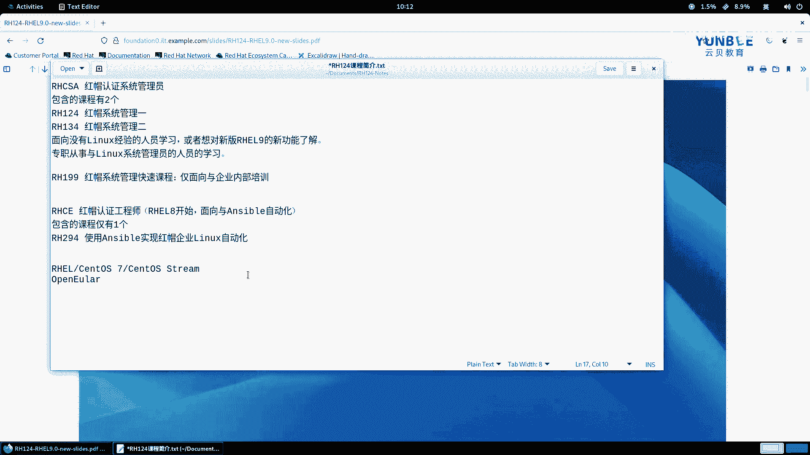
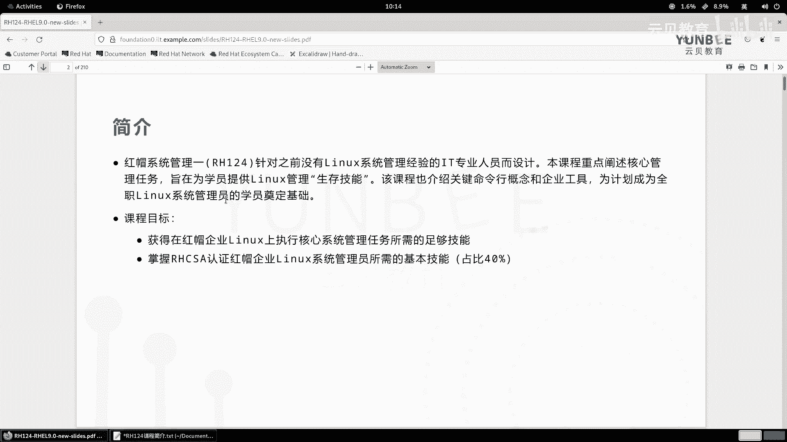
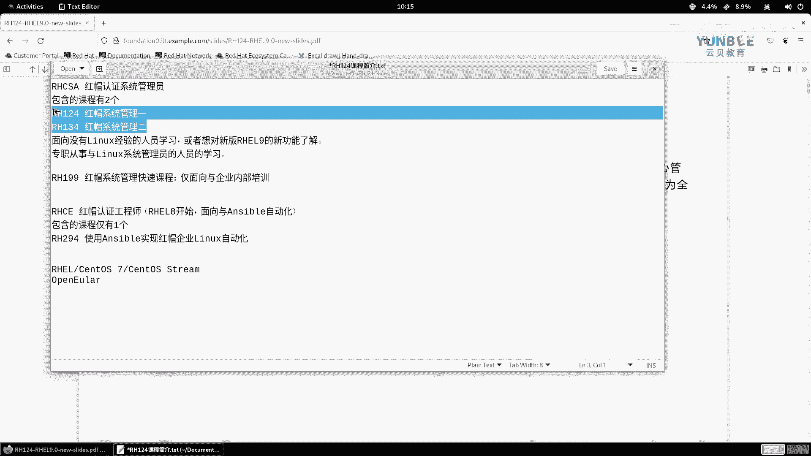
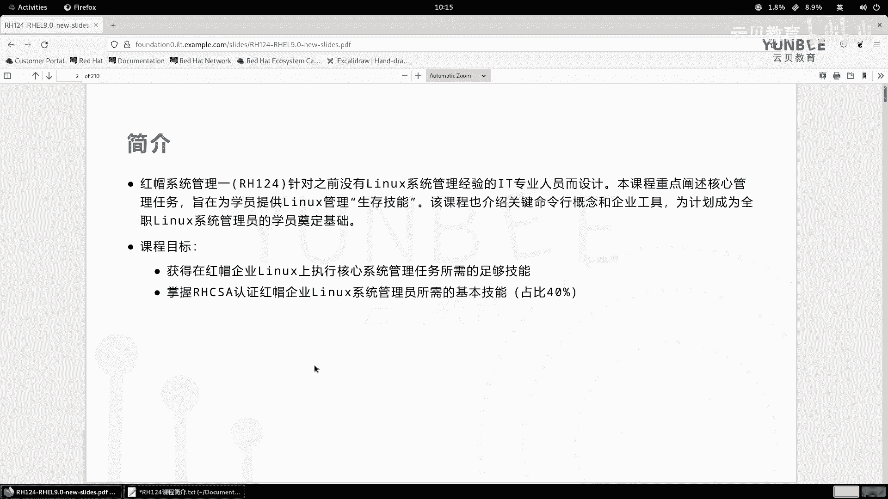
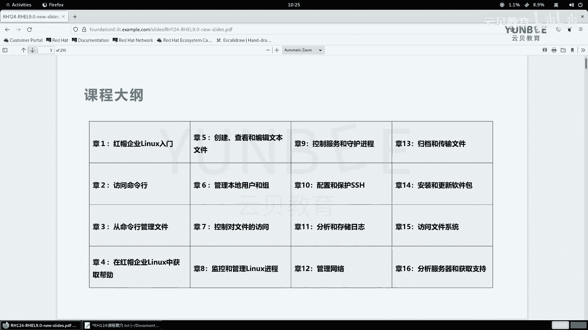

# 零基础入门Linux，红帽认证全套教程！RHCE9认证实战 RH124课程 - P3：00.3 课程简介以及课程规划 - 云贝教育 - BV1Ns2gY8EVU

好，那么在前面的嗯呃视频当中呢，我们已经完成了啊在咱们个人的电脑当中啊，然后成功的打开了啊下载的这套配套的环境啊。那么接下来呢我们开始正式的进入学习的环节。好，那么我们在学习之前呢。

我这里呢先给大家介绍一下我们这门课程包含的啊它的coursese啊子课程。OK呃，那么我们的这门课的话呢，咱们的总的标题呢叫IHCSA。IHCSA那就是红帽哎红帽把认证的系统管理员。党系统管理员。好。

那么这这是一个证书啊，这是一个认证。那么它的包含的课程呢包含有两个啊包含的课程。一共有两个，那么分别是IH124啊，那么我们称之为是红帽的什么呀系统管理。啊。

系统管理一OK那么还有第二门课叫IH134啊，那么红帽的什么呀？系统管理2。啊，系统管理2O。那么这两门课的话呢是面向于什么呢？初学者的啊，面向于没有经验的。Yeah。

lininux啊没有lininux经验的啊，然后呢然后呢这样一个人员去学习的。啊，那么或者呢干嘛呢？或者呢就是啊讲对我们的这个新版本。啊，对我们的新版本。啊，哎这个real9的一些什么呀，一些功能。

一些更新的功能。啊，了解的也是可以学习的对吧？学习的。那么除此之外呢，我们也适合什么呀？适合专职。啊，专职从事于啊从事于。啊，linux啊系统管理员的啊一个职位的啊相关的一个人员的一个学习。啊。

都是可以的啊都是可以的。OK好，那么除此之外呢，我们还有一门课啊，叫做IH199。那么这门课呢叫做什么呀？红帽系统管理快速课程啊，那么这门课程的话呢哎仅面向于什么呢？仅面向于。清楚。啊。

那么企业把内部的一个培训。啊，仅面向于企业内部培训啊啊，那么我们个人啊，或者说我们的企业呢，当然也可以选择只学习I124I134对吧？或者说我们这个啊有些人还没有毕业，对吧？

还在上大学还学习IH124和H123134也是非常的适合的啊，也是非常适合的啊。OK好，那么呃那么这三个呃环境啊，RH1242134，还有啊我们的RH199，那么都可以用我们当前的这个环境来学习。

那么如果大家呢学完之后，觉得这里的内容呢哎不能够完全胜任我们的工作要求，还想了解一下自动化，啊后我们还有一门课啊，还有一门课，那么我会在后面的推出。那么我们称它的证书呢叫RHCE啊，这个终极的认证啊。

红报的什么呀，认证的一个工程师。那么这个工程师的话呢，从呃从这个什么呀？reo8开始，okK那么这个那么这个工程师呢会给你附带一个什么呀？加一个子标题，那么是面向于什么呀？

面向于这个unable的一个什呀自动化的。还自动化的。那么所以说呢这门这门认证里面包含的课程呢，那么仅有一个。啊，只有一个啊，那么叫什么呢？叫做IH294啊，叫叫做IH294。

那么它的课程的名称呢叫做使用sible。啊，使用sible啊，然后呢实践我们这个红帽。啊，企业linux自动化。啊，自动化okK啊，是这样一个标题啊是一个标题。那这个名称在八的开始的时候呢。

就改成这个名字了。以前在real7的时候呢叫系统管理三，现在不叫系统管理三了啊，那么很早呢就变成了这个使用ensible来实现红帽企业运行自动化。那么有的人说了，那我工作当中没有用到这些啊红帽的系统。

对吧？那么你学完啊这个我们的这个课程之后呢，那么其实你在工作当中啊，除了红帽之外，我们还可以干嘛呀？只用ss。对吧s那么s的话呢呃呃在目前为止，企业里面用到的版本还是以7为主。哎，7为主。

那为什么没有8呢？为什么没有八呢？因为从八开始就没有s啊叫什么呀？叫s啊 stream啊stream。那么这个版本我们在后面会给大家介绍。那么它的一些特性呢决定了一些企业呢会去选择它啊，不会去选择它啊。

那么除此之外呢，我们其实国内的啊你像open欧啦。啊，open欧拉啊，我记得是这样写的啊，那么open欧拉的话呢，包括这个服务器版本的麒麟，其实他们的包管理的方法呢其实和红帽呢非常类似啊非常类似。

所以说呢我们也可以啊快速的上手open欧拉这样的一些系统啊，那么如果我们用的是U班图之类的啊，那么呃在。适应过程当中可能要比欧克欧拉的要稍微难一点点啊。

因为它的整个的管理啊要比红lo的的变这个变化啊区别还是比较明显的啊还是比较明显的。但是呢我们。啊，这个学完这个IH1124，还有IH134之后呢，其实啊都是比较基础的概念啊。不是比较记弱概念。

所以说我们上楼起来还是比较轻松的。啊，还是比较轻松的O。

好，那么那么我们来开始来学第一门课IH124那么G19的那么系统管理一好，那么呃接着呢我们来了解一下第一本书啊，它的内容是哪些啊。

那么系统管理一呢主要是面向于没有linux系统管理经验的IT专业人员而设计的那么哎那么学什么呢？看主要给我们提供一个生存技能，对吧？从零到有的阶段那你以前什么都不会你学完之后呢，哎，我会了啊会了啊。

OK那么在这本书里面呢，整个的内容相对来说比较简单啊，那么为我们后面的啊学习呢打下一个坚定的基础啊，那么全部我们的IH124里面包含了我们最基本的最基本的一个技能哎，最基本最基本的技能啊。

那么你哪怕你这个工作当中，比如说我们一些企业。咱们国内的一些企业啊，有些特殊的部门开始使用国产的laing套技能。哎，那你这里具习124之后呢，完全可以熟练的去掌握啊，都命令行部分的啊，都是没问题的啊。

没问题的。OK呃，那么如果我们学完之后，你们想参加红帽的认证考试啊，那么我们第一本书里面涵盖的知识呢，包含了我们的这个RHCSA里面大概40%左右的知识点I左右的知识点啊。

那么可能有人啊看到这个呃课程之后呢，有个疑问啊，那么前面我不是说了一个IH169嘛。那如果是你是企业客户啊，那么这种就一门课，对吧？它其实相当于把这个RH124和I934呢合在一起了。

然后把那些啊就是啊你没有经验的部分啊，就要学习的知识呢，把开除了啊，然后呢把这个知识点从简单的到容易的部分，但是呢知识点又相通的，它就合并在一起来讲了，啊一般这门课呢我们都讲了3天。

啊，相当于你讲完了啊，就相当于我们的第一本书和第二本书一个总知识，这个啊是快速课程啊。那么我们一般呢在学习的时候呢，还是建议大家学习前两个。因为这个呃相对来说资源更多资源更多啊。好呃，然后呢我们。

一本书啊，咱们具体呢要学习什么内容呢？那么第一本书的话呢，我们整体的章节呢一共是16个章，一共是16个章啊。那么在这个16个章里面的话呢，是我们一个标准的一个大纲啊，标准的课程大纲啊。

我们先按照标准的课程大纲呢，给大家来详细的来说明一下啊，详节说明一下啊，那么第一本这本第一本书里面的第一章，那么我们会带着大家呢来了解到底什么是linux，什么是红帽企业版的linux啊。

然后以及啊在学习linux当中，我们可能会涉及到一些术语。比如说什么是开源。啊，什么是开源啊，以及火帽的它的这个系统呢啊延生的这些产品。那这些产品对于我们的学习来说呢，在后面的啊这一些。

其他的知识啊学习呢是有意义的啊，我们也要了解一下。那么第二部分就第二章我们会学习关于命令行的使用啊，也会给大家介绍一下啊这个无形化的界面的一些操作啊操作这块啊，比如说如何在命令行里面提高效率，对吧？

走这个快捷键呀这些啊啊，那么第三部分呢。则是涉及到一些文件的啊一些这个管理啊，比如说啊我们linux当中啊，这个它的目录结构是什么样子的对吧？啊，怎么去这个管理我们的文件呀啊。

怎么去使用shall的啊扩展呀。来匹配文件名对吧？还有什么软链接、硬链接等等。好，那么第四章呢，我们在标准的教材当中，我们会给大家介绍如何使用啊这个慢手册啊，慢手册来获予帮助。OK那么在我的课程当中呢。

还会给大家额外的介绍如何使用GNU来获得帮助。啊，那这个呢内容呢会在我们视频的大纲当中呢体现出来啊，在我们的PPT里面呢，我就不再额外的去写了好，那么第五章呢是关于学习啊，那么如何呢去管理啊编辑文件的。

那么涉及的知识呢有什么呀？比如说主定向呀，对吧？重定向呢啊VM编辑器的使用啊，啊，还有这个如何去更改我们的视效环境啊，这第五章的知识啊，啊，那么这第六章呢，那么第六章的知识的话呢，包含的是什么呢？

关于用户的管理，本地用户的管理，还有本地的组的管理。那么涉及的知识有，比如说我该如何切换到不同的用户，对吧？哎，我是一个普通用户，那么如何去。切换到系统的管理员呢，如何在本地增加修改删除用户或者是组呢？

对吧？那么如果有用户了，那我该如何对用户的密码的生命周期做一些管理？这是我们第六章的知识点。好，那么第七章呢，我们学习的是关于对文件的访问的一个控制。那么从字面意思呢，我们应该能够猜到了，它讲的什么呀？

讲的是关于权限的管理啊，那么在这章里面，我会给大家介绍关于如何啊理解我们linkux当中的文件系统权限，以及如何从命令行呢去修改这些文件权限啊，那么除此之外呢，我们还会介绍关于什么默认权限特殊权限。

OK好，这第七章内容啊，那么呃在我们学习完第七章之后呢，我会给大家增加一个什么呢？一个关于啊访问控制列表的一个知识啊，还有这个如何更改文件属性的知识啊，哎，这是我增加的两个部分啊。

那么在我们标准的课程当中是不存在的啊，不存在的啊，因为这两个呢都是和文件有关啊，文件权有关啊，又是和安全相关我觉得很重要加进来了啊，那么第八章呢是来学习啊，如何呢去监控和管理linux的进程。

那在这章里面我们会给大家介绍什么是进程怎么去查看进程的一个状态，对吧？哎，如何呢去。监控我们的计算机现在的性能指标啊，性能指标啊啊，然后这个相关的一些命令啊等等。好，那么第九章呢我们会学习啊。

我在我们的re19当中谁来负责我们整个服务，还有手务进程的运行的啊，哎，这是第九章的主要内容。那除此之外呢，我还会给大家增加一些比较实用的内容，比如说我们需要修自己去创建什么呀？啊。

控制服务的这种文件怎么去书写这个内容呢，在红包所有的。培训课程当中都是不涉及的那我这里呢在我们124当中呢，大家来介绍，那么方便大家呢学完之后啊，那么哪怕你没有学习其他的课程。

也是可以在工作当中去使用的啊去使用的OK好，那么第十章呢关于如何呢去保护SH服务，还有如何呢使用SH呢远程连接到我们的服务器啊服务器。那么呃第十章呢，我会在我们标准的课基础之上呢。

在额外增加一些保护SH服务的一些方式啊方式。那么第十1章那么第十一章呢，我们学习的什么内容呢？我们学习的是如何呢去啊查看我们的日志。啊，日志以及啊在我们的reo9当中啊。

全新的系统日志的服务是如何呢去使用的啊使用的啊啊，包括还有关于什么呀这个时间的一个一致性的一个解决方案。OK第十1章啊，那么第十二章里面呢我们则是学习啊我们网络相关。

比如说啊我如何去查看我们当前系统的网络的配置啊，配置，对吧？那么看完了，那如何去修改我们的网络配置。啊，修改我们的网络布置啊啊那么以及呃那么在修改的时候呢，我们会给大家介绍了两个方面。

一个呢是通过命令行，一个方面呢是通过无人编辑。那么在这张里呢，我也会给大家增加一些啊这个更加实用，更加简单的方法呢来配置的啊，满足我们啊这个初级的需求和我们一些复杂的场景的一个需求。啊，那么第十三章呢。

关于是如何呢归档和传输的文件。那么在这章我们会学习呢，如何去创建归档文件压缩文件。啊，如何呢在不同的性之间啊去传输啊，传输呢涉及到啊两种传输，一种是普通的传输，一种是同步啊，同步啊都会涉及到啊。

那么第十4章呢，那么学习的是软件包的管理啊，软件包的管理。那么在这一章那么我们在学习的时候呢，会有关于我会增加一些比较实用的内容啊，就是比如说我们的标准的课程里面会给大家介绍关于如何注册啊。

注册我们的这个就是订阅啊，订阅我们的这个呃账户啊订阅。那么我们如果没有用到红包订阅。对吧是不需要的。但是呢我们有一个事情呢是需要的。就是说我们学完这门课之后呀，将来我说哎我想参加红包的考试，哎。

我们需要一个什么呀？红包的账户，哎，那么这个是需要的对吧？哎，然后呢我这里呢会给大家介绍一下如何呢去注册一个什么呀完美的账号。哎，就是你比较标准的账号啊，既能使用。

又能够不影响你将来的后期的一个业务的扩展。OK好，那么除此之外呢，我们还会给大家介绍如何呢去查看系统当中的软件包的一些信息啊，如何呢去安装和更新软件包啊。

还有呢就是如何呢去啊创建自定义的软件仓库啊自定义的软件仓库。哎，那么会在第十四当中会给大家介绍啊好，那么第十5章呢是关于如何访问linux的文件系统啊，那么主要的内容呢。

就是啊如何呢去挂在我们的啊这个一些。此牌呀这样的一个内容啊，还有呢就是如何在。文件系统当中呢去查找我们的文件。最后一章呢呃会给大家介绍一个，就是我们的从re耀8开始呢增加一个新的功能，利用外b控制器啊。

我们称为是。啊，外部 web部 console啊吧来呃这个观察我们的服务器的一个各方面的指标信息，以及呢呃给大家介绍一下如何通过红猫的门户来获得些帮助啊好，那么这就是我们整体的内容啊。

哎表面上呢我们是16章。那么在我的课当中内容可能要加起来的话呢，应该就是大概是。啊。将近20张了，应该是171819章的样子啊，应该就是19章了。如果按照我的讲课内容，再分个章节的话。

应该就有个19章的样子了。啊。好，那么这个是我们的。啊，我们的这个整体的一个课程大纲的一个内容啊内容。

