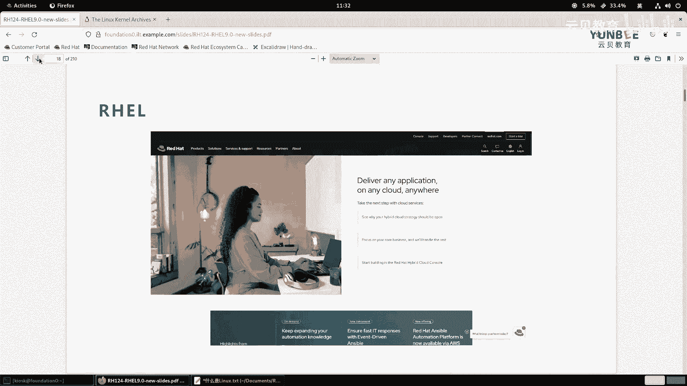

# 零基础入门Linux，红帽认证全套教程！RHCE9认证实战 RH124课程 - P4：01.1 什么是Linux - 云贝教育 - BV1Ns2gY8EVU

啊，我们来看第一章啊，红帽企业linux的入门。那么在这一章里面，我们的主要目标呢是给大家介绍一下什么是开源啊，什么是开源，以及什么是linux啊，那么linux它呃在平平常描述的时候。

我们一般会说什么呀？linux的发行版。那么什么是linux发行版，以及这些发行版和红帽啊，企业linux的版本有什么区别。啊，这是我们这章的一个主要目标啊，那么这章呢我们只有一个小节啊。

那么什么是linux？OK那么我这边呢在给大家讲这个什么是linkux之前呢？那么我们这里啊给大家呢呃做一个简单的小的科普okK。那么我们在说这个linux的时候呢，其实有广义和狭义上两者之分啊。

那么狭义上okK那么狭义上呢，我们说linux。啊，其实呢其实指的是什么呀？哎，指的是这个。O。嗯，是指的我们的linux的内核。哎，那么就可呢。壳了啊，那么也就是有这个雷纳斯本人啊。

雷纳斯呢是我们linux的作者啊，有雷纳斯本人进行发行的啊这样一个产品。那么他的网站呢是啊3W点。啊，磕了。啊，点ORG啊，3WCl点ORG那么最新的版本呢是6。6。啊，6。6啊。

我们可以去打开我们的网站啊，访问一下。

OK啊，这个昨天那应该是今啊应该是今天啊啊16。7，那么是13号啊，前天啊前天呢又重新发发行了一个啊，那么前两天刚看到的是6。6啊，那么13号呢又发行了6。67啊，6。67，那么这是最新的版本啊。

就是我们上课的时候，那么最新的版本呢是6。67。

啊，6。67这刻个版本啊，那么广义上的话呢。广义上啊。广义上，那么我们说这个linux呢指的是什么呀？指的是我们的linux的发行版。哎，发新版。那么比如啊比如我们现在学习所用到的红帽。

企业版linux。那么简称什么呀？real啊简称real。啊，简称reo。哎，那么这是呃我们所谓的linux。那么我们为什么要学习linux呢？对吧？那么其实原因非常的多啊。

那么呃在当前的IT的这个圈里面啊，那么你只要从事于啊这个这相关的工作的啊，那么linux到底是干嘛的，我们是需要了解的啊。

因为现在很多的啊这个IT的技术呢都是依赖于linux的比如说我们现在很火的什么呀啊，容器技术，对吧？云原生技术啊，云原生对吧？云哎，那么这些呢都要依赖于我们的linux啊，都是起主要作用的。

OK那么linux的应用非常的广泛啊非常广泛。那么呃我们无论是不是从事于IT这一块的，那么其实我们每天呢都会和linux的应用进行交互。啊，举个举个例子啊，比如说啊这个村里面的王大妈对吧？啊。

刚刚呢他的儿子给他买了一部智能手机啊，然后呢学会了什么呀啊，学会了刷抖音。那么这个抖音呢，那么他在提供服务的时候呢，他的后台就是一台linux的服务器。啊Lux服务器对吧？

那么啊虽然王大妈不知道什么是IT。对吧，但是呢它却和lininux呢做了一个交互啊，那么又意味着要在我们的现在的生活当中啊，每个人啊都会和lininux呢打交道啊，息息相关啊，你可能没有直接接触过。

但是呢你却离不开它啊，离不开它啊啊，然后呢还有呢就是我们的windows用户呢需要和linux进行交互。那么我们知道windows呢作为啊这个市面上用户量最大的桌面什么呀，桌面操系统。啊，桌面操作系统。

那么我们在啊在这个管理linux的服务器的时候，或者说一些应用的时候，那么我们需要借助于windows干嘛呀？远程连接到linux上进行一个管理啊进行管理。

那么所以说一些开发人员呢啊为了这个更加方便和linux交互，他们会买一个什么呀？自带有终端的操作系统，比如说会买什么呀？苹果的笔记本啊，苹果的笔记本。

但是我们知道在新的windows10版本之后呢啊在系统里面可以安装什么呀？windows terminal啊，window terminal来和linux交互啊。

但是呢呃windows terminal它在默认情况下用的是CMD当然你也可以安装什么呀power shell啊，它的交互啊就是使用习惯呢啊说实在的。

并没有直接啊使用这个内置sh或者是ZH shell的麦交互用起来舒服。啊，这个具体什么是bash什么的什么part shell，我们后面再给大家介绍啊。OK那么我们接着还有就是什么呢？

就是我们在这个呃IT的这个领域里面呀，我们做软件的开发。那那么软件开发完成之后，那跑在哪里呢？那么绝大部分的应用啊，现在都是啊托管在linux上面的。啊。

都是拖在linux上面的那无论是在物理服务器上面，还是在讯拟机里面，还是现在的容器技术，那么它底层呢都是依赖于什么linux啊，linux居多啊大部分绝大部分都是的。O还有现在我们的所谓的云，对吧？

你像云计算呢也是我们的国家战略，对吧？国家战略。那么云计算里面的底层，那么它的技术呢就是有linux呢作为驱动的。包括我们呃现在呢就是国产化的操系统当中，也是以linux作为什么呀？主要的研发方向啊。

研发方向OK呃，无论是私有云还是公有云。那么我们要跑业务，那么跑的业务呢，它的载体呢也是linux为主。OK那么我们的移动应用或者是我们的什么呀物联网啊，比如说我们的什么呀？我们的手机啊，智能手机啊。

比如说你的是安卓的呀也好，你是鸿蒙的系统的也好，对吧？那么呃特别是安卓，对吧？特别是安卓，那么呃它呢其实本质上来说也是linux的一种，那么它的软件呢虽然格式不能直接在linux当中去运行啊。

但是呢它属于什么呀？它它属于是linux的一种软件吧，啊这么想理解还有IOT的设备，对吧？IOT的设备。啊，LT的设备我们去呃比如说我们现在的智能家居啊，智能家居呢，那么它里面呢啊会跑一个单片机，啊。

里面跑的系统呢就是linux啊，linux啊OK因为为什么呢？比如说现在的什么呀啊这个新能源的汽车啊，新能源的汽车呢，那么它的这个车机系统，那么也都是以linux为主啊，linux为主。

那比如说呃我们这个。举个例子啊，比如说现在很多国内的国产汽汽车，那么它里面跑的是安卓啊，安卓系统啊，然后你像现在通用汽车，那么它的呃车机系统里面已经和红猫谈妥了。

就是用红猫的啊reo系统企业版linux里面跑容器。啊，跑容器啊来提供一个交互啊，那么。那么你像这个鸿蒙的车机系统呢，它目前里面的大部分代码呢，因为早期呢是由华为来提供的。

所以他也他也去借鉴了一些啊早期贡献到安卓里面的一些代码。那其实你也可以理解为我们的鸿蒙啊，和linux也是有一定的关系的对吧？有一定的关系的啊，那么不是直接关系，我们可以理解为借鉴的一些优点啊，OK。

啊，还有呢就是我们现在这个工作呢这一块啊，那么从事IT的人非常非常的多啊非常非常多。那么就意味着啊就业呢这一块呢会机会也也比较多，对吧？啊，就比较比较多啊。现在你像市面上那么最简单的linux运维。

那你肯定是要有红帽的证书啊，是最好的对吧？那么除此之外呢？如果你懂一云技术啊，云原生技术虚拟化技术，那就再好不过了啊，再好不过了啊，那么为什么这么多的地方呢都在用linux系统，对吧？啊。

为什么都在用那肯定是有优点的那么优点呢在于最大的特点就是linux呢是开源的软件。啊，开源软件。那么什么是开源呢？那么所谓开源呢就是开放源代码，就说我的这块软件，我的这个操作系统到底是怎么实现的。

到底是怎么工作的啊，它的原理是什么啊，我的程序是如何去写的那么我我的代码是可以允许你干嘛呀，去查看的。并且呢根据一些许可协议，你也可以直接呢拿来修改再次的发行。啊，这个是开源？啊，就有开源哎，就好像。

是什么一样啊，对吧？就好像这个啊我给你一个啊礼物啊，给个礼物，我我我直接告诉你这个礼物里面都是什么东西。那不会说是一个惊吓的礼物，对不对？我直接告诉你啊，到底什么样子。那这样的话呢，对于用户而言。

那么里面有没有什么呀恶意的程序，是不是就啊很很容易发现，对吧？好，那么第二个呢就是啊lininux呢提供一个可脚本化的强大的命令行的接口。啊，那么linux系统不同于windows啊。

那么windows我们是桌面的，那么是方便于大众使用的。所以说呢它的交互呢更倾向于什么呀？使用鼠标和键盘，包括触摸屏啊，还有你像移动设备也是的。而linux系统呢，我们更多的是运行在服务器上面。

那么在服务器上面的话呢，我们在管理的时候，如果可以通过命令行管理。那么可以大大的提高我们的效率，啊，大大提高我们的效率，包括我们后期的学习，我们也都是以命令行为主。啊，为主啊。

那么将来我们有机会学习啊一些啊高级的产品。比如说云计算呀、云原生啊等等的时候，你会发现啊，那么图形化界面实现的功能完全是没有办法啊这个替代命令行的啊，是没有办法去替代的啊。

还有第三个呢就是linux是一种模块化的操作系统啊，就是说除了啊我们内核之外，其他的各个组件呢，你都是可以根据自己的需要进行增加或删除的。其实严格来说，包括我们内核也是的，我们可以对内核进行裁剪。啊。

进行裁剪。因为那核随着发展呢，它越来越大。比如说我们想把它跑在什么呀？跑在这个单片机上面，那我单片机上面的这个存储空间也好，对吧？运行内存也好，都非常小呀。那你原来的内核很大，那我没有办法去存放。

那我就可以只把我需要的部分呢留下来，不需要地方呢全部删除掉。啊删除掉，那就是模块化，不会出现一些问题啊，所以说我们在啊。

使用的时候呢更加的灵活啊更加灵活。OK好。

那么刚才呢我们给大家已经介绍了什么是开源软件了。那么对于开源软件而言，对用户来说有什么优点呢？对吧？那么所谓的开源就意味着我们的源代码是允许任何人啊可以怎么样去读啊，去读的啊，然后呢，这个代码。

那么我们在编写之后呢，就可以干嘛呀，把它。把它编译成可执行的二进制文件，对吧？如果这个代码可以直接被解释呢，我们一般把它称之为是脚本啊脚本那么无论是脚本也还好，还是可执行的2二进制啊程序也好。

那么它的源代码呢，那么都会受到保护，受到保护。那么受到保护呢，有两种嘛，一种呢就是我不让你看你像windows的软件，对吧？你像QQ呀啊微信的这些软件，对吧？我我不让你看我我里面是怎么写的啊。

你像那个linux的内核呀，这些软件，那我我可以允许你去查看哎，允许你复制，允许你修改，重新分发，啊，那么这两个都是非非常明显的什么呀闭源软件和开源软件之间的区别。啊，K区别啊。那么既然开源了。

那就意味着我们的用户可以查看代码的什么呀，用途，并且改进，就意味着我们可以更加容易的控制。OK还有呢就是你像你像这个。现在啊这个在校的啊大学生对吧？那如何你在啊毕业之后啊找一个更好的工作呢，对吧？

我们建议呢就是你可以在大学期间干嘛呀？学习代码开发的时候，你可以直接参与某些开源的项目当中。为什么呀？因为你在参与开源项目当中的时候呢，你就可以直接从实际的代码当中来学习更加实用的内容。

那么其实就相当于自我进行了一个培训。啊，这个培训我们不要片面的就是狭义上面的人理解为啊必须要有老师。啊，然后呢一对一的讲课这种方式啊。那么我们这里的话呢，主要是指的是你从中学习到内容，那么提升了自己。

那就是培训啊，还有安全性。安全性的话呢，因为代码是开放的。那么就意味着我们可以干嘛呀，看看里面当中有没有一些敏感的代码，那么通过对这个代码进行修复啊，然后提高它的安全性。啊，安全性啊。

不需要原始的开发人员的参与啊，不需要原始人员参与啊，还有稳定性OK那么稳定性呢主要指的是什么呢？主要指的是。啊，我们的这个啊应用程序的什么呀或者源代码的开发人员啊，在缺失的情况下。

比如说啊某个项目因为资金的问题没有办法继己去开发了。或者说啊因为其他原因，比如说啊这个啊这个生病啊或者是意外呀，对吧？导致开发人员意外离世啊，或者其他原因，哎。

那么那么这个这个应用程序呢哎我的企业当中还在用，对吧？那怎么办？你不能说没有人维护了，我就呃那漏洞啊各方面没有办法，那怎么办？哎，我可以自己去开发对软件，对吧？

或者说或者说把这个代程序呢移交给其他的一个一个社区啊，一个组织啊去维护，保证。软件还可以正常的运行，那就是稳定，那就是稳定。OK好，那么关于这些源，那么既然开源了呢那么问题来了呀。

那我的代码是不是写完之后，我我选择了开源，那大家对吧？大家都可以去啊抄袭，那我的啊这个什么呀心血是不是就没有人去保护了呢？不是的，那么为了保护这些源代码啊，然后提高啊这个。

打压大家在开源这一块呢的积极性啊，那么所以说呢我们啊会有一些开源的什么许可证，那么来保护啊保护我们的源代码。那么这个开源的。这个这个种类目前其实非常多啊，基本上有60多种。你像我们国内的木兰啊。

木兰社区里面的木兰的许可协议，还有我们常见的这种公共版本许可协议啊，GPL啊，还有宽松式的啊这个。许可证啊LGPL啊，还有什么啊麻省理工大学的MIT呀，对吧？伯克利大学的BSD呀、阿帕奇啊等等啊。

非常多啊，放非常多。那么其实我们常见的这些啊，基本上有哪些呢？比如说我们常见的啊这个开放。

啊，我们成为开源吧啊，开源什么样许可。那许可。那么有哪些呢？有这个比如说。啊，我们啊最常见的啊，就比如说阿帕奇，我按照字母顺序吧，阿帕啊也不能说字母顺序吧。我们按照我们啊一些一些常见的啊。

就是比较多的啊，一种呢是阿帕奇的许可协议。啊，阿巴奇的许可协议。LISCENSE啊阿玛奇的许可协议。然后还有呢就是呃BSD的许可协议那，然后还有GPL的那GPL的全称呢是GNU什么呀？GPL啊。

这个GNU呢，我一会儿给大家来介绍什么是GNU啊，还有一种呢是什么呢？啊，这个啊GNULGPL。啊，那么这里的GPL呢指的是什么呢？指的是通用许可协议啊。啊，那么这里的L呢指的是啊library。啊。

library啊，那么。啊，这样一个许可OK那么还有哪些呢？比如说MIT的那MIT的许可协议。啊呃还有这个moza，你像我们的啊fe force的这个浏览器。啊。

还有一些这个我们通用的啊通用的一些许可协议啊，比如说这个还有什么呀？呃，我们还有一个我们可能也遇到过你像那个。呃， elepssy。还有木兰啊木兰，我们国内的啊国内的一个木兰。啊，木兰这样的一个许可。

那除此之外，其实还有一种啊，还有一种，但是呢一般不是做源代码的啊，一般呢是干嘛呢？是写文章。你像我们在互联网上发表自己的文章啊，然后允许别人转载的这种。那么我们称为CC啊，CC的话呢代表的是什么呢？

代表的是这个。啊，叫创作啊，c。创作通用一个共享的一个协议。CC啊CC那么这些呢前面8个啊就是我们平常这个在开源领域啊，那种源代码呀一些项目呀所遵循的啊。那么呃CC的话呢一般是发表一些文章。

所以说它并不是真正的一个你可以理解为它是一种。

呃，狭义上的一个开源协议，好吧，它并不是说我们和上面这些还是有本质区别的啊，本质区别的。就是说允许你去转载啊，署名啊，署名啊，非商业使用啊，上面这些是可以允许你商业的。啊，商业的。那么不同的许可呢。

他们也有自己的社区，你像阿帕齐的社区，对吧？国内的木兰社区啊，阿里云的什么阿里巴巴的这个开源的社区是吧？啊，还有这个open online啊等等等等啊等等等等，这些啊非常多啊非常多。

那大家呢都可以啊去了解啊去了解。

好呃，然后呢，那么这些开源软件呢到底有谁来开发和维护的呢？啊，有谁来开发和维护的呢？那么很多人想到那既然开源了，那么对吧？那么大家呢都是自己有时间了去写写代码，那这个代码质量会不会说呃有些问题，对吧？

其实不会的啊，因为现在的。

开源和以前的开源其实已经发生很大的变化了。那么在很早的时候，那么的确是有一些爱好人员，那ITlinux啊这种Ilinux计算机吧，计算机的爱好人员呢去啊去开发的。那么现在随着发展。

那么现在我们的开源软件呢是非常专业的啊，不再是有志愿者来提供的。OK那么现在的开源软件啊。啊，开源软件。啊，的开发是非常专业的。啊，并非啊并非啊有这个完全啊并非完全呢。完全由啊这个啊早期的这种志愿者。

啊，志愿者来开发的。那么现在的开发人员一般都是干嘛呀？啊，更多的都是有自己的职业啊，自己的职业。然后呢，那么所在的开源社区呢，会给他支付一定的薪水。啊，来保证这个呃你的收入啊收入。

以及保证我们整个的这个开源项目的一个可持续的发展啊可持续的发展。那当当然了，那么这种志愿者呀、学弱学肉团体呀依旧发挥非常大的作用啊，所以说呢这种啊一种是志愿者，一种是学弱团体，还有这种什么呀？

这个呃还有这种我们所谓的这个专业的这种提交代码的。你像在华为呀、阿里云的这些啊IT的这种大公司里面上班，他们都有贡献代码的呀，都有贡献代码的那那么这些结合在一起，我们的代码质量非常高的啊。

那么有这些团体呢干嘛呀支付资金。你像什么基金会对吧？各种各样基金会什么linux基金会啊，这个opent基金会那么基金会嘛那就是基嘛对吧？基本的资金那么有这些会员来提供资金。

那这些资金呢维护整个社区的健康发展啊发展来来一个运行啊运行。那么在这个开源里面的话呢，首先我们要知道呢就是啊红帽。啊，红帽我们一定要知道一下，就是说。就是说我们的这个。呃，应该这样来说吧。

我们应该我们应该给大家介绍一下，就是我们的这个图片里面的这几个人啊，我觉得我觉得是有必要给大家介绍一下的。为什么呢？因为没有没有这两个人啊，没有这两个人啊。

那么就没有我们互联网的今天OK那么首先呢第一个大神呢就是GGNU的啊这个作者啊，叫什么呀？叫做啊richar marman啊，那么就是理查德mar啊man这个中文啊。

OK那么这个sman的这个人呢，他是干嘛的啊？

O。啊，那么金优的创始人啊创始人。

我把这个给他复制下来。

啊，创始人啊man啊。那么这个人呢在呃在发明这个呃开源这个术语之前呢，在很早死亡以前，那么我们要知道，那么unix的最早期的计算机的操系统呢叫unix。那么unux随着发展。随着发展啊。

那么出现了很多分支。那么这些分支呢，并且呢是走向了什么呀？走向了B源啊。啊，走向了闭沿。啊，走向了避缘。并且呢呃我们要想去使用的话呢，那么需要支付昂贵的费用。啊昂贵的费用。啊，on your啊。

那么据说有一个小的消息呢，这个小息没有经过验证啊，就说这个啊这个storeman这个人呢啊他想去啊开发某个软件啊，开发某个软件。然后呢，但是他没有哎他这个这个呃他正好呢没有拿到这个系统的一个许可。

他就想着哎，我这个。啊，找了个同事吧啊，找一个同事，是个教授是吧？我说哎我用用你的啊这个计算机用一下行不行，对吧？比如说这个什么什么东西啊，那但是不好意思啊，不能用，为什么呀？因为因为是有许可的啊。

是许可的，不允许复制啊，不允许复制。呃，然后呢还有与此同时，那么啊计算机的爱好人员呢在遇到一些问题的时候呢，想讨论的时候，哎不能够随意的去讨论。为什么呢？因为你讨论的时候涉及到了什么呀？

涉及到了一些保密的信息啊，我这个代码里面一些特性啊，不允许公开。啊，那么所以说呢这个riard mar storeman这个人呢就想着，那我干脆呀干嘛呀，干脆去开发一款新的操系统。

那么我这个操系统啊是允许大家可以干嘛呀？去这个修改源代码查看源代码的啊，那么在开发的时候呢，那么我这个系统呢要和你的unix长得差不多非常像，但是呢又和你不一样，你要钱，我不要钱O你是闭源的。

我是开源的。那么所以说呢它的linux，它的啊不是linux啊，它的它的操系统。那么发行之后呢，就叫GU。那监有。那么什么是经营U呢？GNU的全片呢叫GNU。its not。unix的缩写。

就说我呢我这个系统啊和你的unix长得不一样的一个操系统。那如果你要翻译成中文，你只能这样来翻译啊，那么它的内核叫什么呢？内核啊，它的内核啊内核呢叫做。

hard啊叫hardok那么所以说呢我们的这个tman啊，这么早期真正的黑客啊，然后呢发起了开源的运动。啊，开源的运动。那么在这种情况下呢，那么这个这个风啊刮的是越来越大啊。

然后这个时候呢有一个大学教授。那么大学教授呢，他为了教学的一个需求啊，因为unixux太贵了，所以说呢他啊这个就开发了一个操系统叫Mix。啊米。啊，然后做教学来使用。

那现在呢有些大学里面在教这个计算机的操系统的时候呢，还会介绍这个minux啊。然后呢，后来呢呃在这个一个大学生啊，大学生教谁呢叫雷纳斯。啊，linux斯诞生出来了啊。那么在91年的时候呢。

就根据minux的一些特点呢，就干嘛呀去开发了一个啊这个操系统啊它这个啊。开发之后啊，然后呢把这个源代码呀，就干嘛呀？这个也是受这个朋友的啊这个建议啊，然后放在互联网上面了啊，放在互联网上了。然后呢。

那么没想到啊，然后呢，就这个啊非常受大家的欢迎欢迎啊，喜欢，然后呢并且呢干嘛呀，帮他去修改啊，这个啊这个源代码让它变得更好。然后呢，大家就建议他他呢把那个起个名字啊，起个名字。那么起个名字之后呢。

就按照他自己的名字啊，起了一个谐音吧啊，叫什么呀linux。啊，叫linux啊，所以说有些地方呢把它翻译成叫么上linux也行啊，因为linux本身。啊，人名嘛，那么按照这个美式或英式的发音。

你可以翻译成什么linux，也可以分成linux。那U发成EU或者是什么呀，这个R都可以啊，哎，都行啊。反正我们一般你像我都是叫linux啊。OK那么就诞生了。那么他的只负责呢是科 now啊。

负责科呢啊，负责科 now。然后呃现在的话呢，雷纳斯本人呢，他基本上不做开发了，基本上不做开发。他主要的目的呢就是合并来自于全球开发人员的什么呀？内核的代码，和的合并在一起啊，然后呢再发行。

这是他的主要工作啊，主要工作OK。

啊，然后呢GNU它的吉祥物呢是一个啊这个非洲的一个牛龄啊，牛铃啊，然后呢，我们的这个linux的这个呃这个这个吉祥物呢叫什么？是一个啊吃的肥肥胖胖的一个企鹅啊，叫tas啊，TUX啊tas。

O。好，然后我们给大家介绍一下红帽啊，红帽。那么既然学习reo的操系统，我们不得不了解一下什么是红帽。那这里这个地方呢不是广告啊，不是广告okK。那么什么是红帽呢？红帽啊，那么首先它是一家OK啊是一家。

那么开元。领导者。为什么呢？因为红帽呢它会啊这个根据市面上最优秀的开源软件呢干嘛呀？他去把它收购过来，收购过来。开源收回之后呢，给他进行再进一步的一个维护和改进。然后呢再以商用的方式呢来提供。

所以说啊红帽呢是世界领先的开源软件解决方案提供商。OK没有之一啊，它就是最先进的。OK那么他利用社区。啊，社区作为驱动。啊，社区呢作为驱动。啊，然后呢来提供啊这个可靠性。啊，和这个高性能。等一些什么。

比如云呢啊linux呀、中间键呀。啊，存储啊、虚拟化呀等的一个解决方案。OK解决方案O那么特别是现在我们啊国内的I区IOE啊去IOE。那么你像什么oracle呀这种对吧？这个呃取消。

那么但是红帽这块目前啊，那么在所有的你像我们以这个操系统为主吧，那么linux里面啊做的最好的。商业提供商呢就是红包这家了。啊，红帽这家了啊，OK因为你可以付费购买它的产品，然后提供一些技术支持啊。

当然了，你说我不想用也可以，那你也可以选择它的社区的版本，或者选择什么得变等等啊。但是啊优最优秀的那的确是红帽，那这个是咱们不能否认的啊，不能否认的那如果出于某些原因，我们没有办法去选择红帽的产品。

那我又想去用这种红帽，它引以为傲的这种开源软件。那我有什么选择呢？那么大家可以看这张图啊，这张图呢是早期的时候呢来收集的啊。那么红帽呢从这种啊这个数以万计。

甚至更多的软件当中啊去这个筛选最优质的啊最优质的okK然后呢进行一个啊使用。比如说操系统这一块呢，它的社区是斐doa啊斐doa的字面意思翻译过来就是摘帽。啊，这个大家呃看那个什么西部的电影啊。

美这种美国西部电影啊，那么那些牛仔头上戴的帽子摘帽啊，摘帽okO就是fdora啊fedora。那么呃那么这个社区的系统啊会使用最新的软件啊，经过测试稳定之后呢，那么红帽呢把它吸收进来，变成商用的红帽。

且把linux。OK这是操性这一块啊呃然后中间键那么社区版本呢叫jabo啊，那么红帽呢把它称之为是gebo middle wheel中间键。红帽的虚拟化产品overt。overt的话呢。

它是底层是基于KVM的虚拟化，是开源的。啊，开源的那么现在国内啊有些企业啊，那么为了摆脱啊Vware的虚拟化，那么在选择啊虚拟化解决方案的话呢，都会选择overt啊overt。

那么红帽的商用产品呢就是re hat enterprise什么呀啊，viualizationization啊，viizationization ok现在他把这个企业去掉了啊。

叫做re hat啊 virtualization啊，红帽虚拟化。那么存储这一块呢，早期的时候呢，红帽是啊这个主要是以glaer啊，作为一个文件存储。那后来呢红帽又收购了一个sefe存储啊。

se存储主要是由于云计算open stack火起来的。OK那么赛现在的话，红帽的存储，我们一般指的就是赛F了啊，以前早期的时候。说红帽存储呢叫glaster，现在的存储呢指的是seef。

因为glaer红帽不再啊不再提供了啊，不再提供。就是你可以理解为它的生命周期结束了啊，现在正在主推的是sef。呃，现在的sf呢被红帽称为是redheadcloud storage云存储啊。

因为它要和红帽的云软件结合在一起。RDO呢它的上游呢是opent社区啊社区OK然后呢，红帽的商用版本呢是。Opent platform。啊啊。

opent啊这个基础设施云啊基础设施云目前啊以电信啊金融行业为主。啊，一般啊小型企业不会去用opent啊。好，红猫的云原生容器化解决方案平台啊，叫orange社区版本的企业级open shift。啊。

那么大家有些人可能听说过容器。啊，容器的话呢在企业里面是不能够啊大批量去部署的，那么就会用到一个编排叫cobernet，简称K8S啊，那么世人皆知K8S。

但是很少有人知道K8S呢是因为open shift而火起来的。O那么火帽在这块呢发挥了非常非常大的作用。企业级的你像金融领域，国内很多银行啊都是用的open shift。啊，不会用co本址。

OK而互联网领域呢，你像阿里巴巴呀啊他们的你像云原声里面的阿里云呢、华语云的这些他们提供的云原声解决方案用的是cobernets，也是定制的啊，定制的cobernet啊。好。

接着社区版本的maagage IQ啊，那么红帽称为是cloudform。那么它是一个跨平台的混合解决方案啊，就说你安装这个软件之后呢。

你可以啊同时管理你的企业内部部署的比如说红帽的产品winware的微软的等等啊，所有产品，你可以统一的进行管理啊管理。然后接着呢最后一个呢是for man啊，for man翻译过来叫包工头哎。

工地上的工头，你看它这个帽子是吧？啊，是安全帽。啊，然后呢它的产品呢是要site卫星服务器。那么卫星服务器呢它是一个基础设施管理软件，它可以对红帽的产品进行统一的管理啊，从而解决差异性而导致的问题。

比如说同时的软件的分发补丁的修打打补丁等等啊，那么这个图片上呢主要是一些优秀的，右边呢是商用的，就是说你想获得体验好的话呢，你要去购买它的订阅。那么左边的是社区的，你想去用呢，可以直接拿来安装去使用啊。

这是几部分少的啊，那么当然了，红帽现在还有一些其他产品。现在红猫引以为傲的产品呢，一个呢是它的企业版linkux套系统，一个是存储，还有一个呢是它的open shift。啊。

open shift的这是它目前呃主推的产品啊，还有一个现在我上面没写啊，就是我们第三本书要学习的啊，就是安yible啊，它称之为是自动化平台啊，这个图比较老了啊，是早些年的啊来做的。

好，那么接着呢给大家介绍一下什么是linux的发行版。OK那么咱们前面给大家说了，那么linux在狭义上呢指的是内核呀。那么单独的有一个内核是不便于大家呢来使用的。那么所以说呢有些啊厂商啊。

厂商或者是社区啊，就把这个科呢拿过来。

然后呢，再安装一些什么呀？用户空间的软件。啊，软件对吧？以及什么呀？一些管理的软件。还有这个引导的啊引导的这个方式给它一合成，就变成一个什么呀？可以什么呀，启动的一个什么呀ISO。啊。

然后呢这个时候那么大家呢就可以利用这个SO干嘛呀？安装在自己的。自己的什么呀，服务器当中了，或者个人的PC里面啊，那么这样的一个东西呢，我们称之为是linux的发行版。OK发映版。

你比如说我们图片上的这些发音版，你看啊非常多。你像这个很早很早一个元老级别的linux发映版叫什么叫啊这个slaackware啊，sackware啊，这个更新很慢，但是呢很稳啊很稳啊，特别特别老啊。

特别特别老，呃，比红帽还要老啊，基本上是linux诞生之后，很快啊slaack wear呢就就这个出现了啊，感兴趣的小伙伴呢可以自己尝试去安装一下啊。然后呢接着呢就是红帽了啊。

红帽红帽的话呢是呃91年不对啊，是。哪一年来着，我也忘了啊，然后去创建的公司，好像96年吧啊。去创建的啊，发展到现在成为开源领域的领导者老大啊，通信啊通信的话呢是呃是什么呢？通信的话呢。

咱们应该听说过一个系统叫深度OK深度早期啊就是图片上这个深度是武汉的一家公司啊。后来呢国内的一些厂商啊，就是很多很多家企业啊，有提供各种各样软件的硬件的合在一起干嘛呀？

组建了一家啊新的公司呢叫统信通信嘛，统一的可信任的啊，那么成为UOS。那么就是以深度这款操作系统社区版本的。啊，然后呢啊重新打包啊，然后呢提供商业的支持你去购买啊。

一般现在政务的里面都会用到通信的操作系统啊去购买啊。OK通信啊，有家庭版，有个专业版啊，去购买okK然后呢还有一个genlegeninle的话呢是一款什么操作系统呢？就是一个。这个系统不得不说啊。

就说我如果我们将来。用linux方向版觉得都不太符合自己的。啊，品位的话，那么可以尝试去安装一下针头。那么针头的话呢，它的社区里面直接提供源代码。那么你可以用它的软件包的安装软件。

直接在你的本地将源代码自动编译，安装在你的硬你的你的这个个人电脑当中。所它的性能啊是和你的硬件是100%匹配的。OK100个人，1000个人用军透就有1000个不同的军透link系统。

okK是可以定制的。好，rocky那么rocky的话呢，包括下面的这个malinux系统呢，都是红帽在宣布啊不再使用，不在这个提供sinttoOS之后呢啊出现了一个二原源代码二进制兼容啊。

这个红帽系统的一个。linux方译版啊，就roy和欧马lin系统。那，man generalro呢主要是以桌面为主啊，桌面为主啊，那么是一个lin是一个archlinux系统的一个桌面啊。

是一种开箱即用的，安装简单。啊，迪聘然我们前面说了是个社区版本的。那么符合咱们国内的呃用户的使用习惯。啊，那么如果你想装一个linux的桌面，又想用国内的这些软件。比如说微信呢之类的。

那么推荐大家走深度ok还有inux OS呢是一个不可更改的linux发行版，就说你。安装之后装一个软件，它会给你打一个，你可以理解为是创建了一个不动的版本的一个时间节点。啊。

这个软件OK还有open麒麟啊，为什么没有加麒麟是open麒麟呢？open麒麟是开源的啊，是开源的O呃，打造了我们国内第一个跟社区啊，跟社区OK呃，然后这个。

又意味着它是直接从linkux内核来构建的啊，目前也是国内比较重要的一个项目。啊，国内同样一些政务呀会用它的商业版本叫kilylinux系统。OK你像你像我们的空间站，okK就运行的是麒麟的操系统。

好呃，桌面。大家非常喜欢的U版图啊U版图啊，还有这个呃红帽的替代产品，奥马linux，还有一个也是一个定制性比较强的啊linux桌面版叫archchlinux。还有zora呀MS这些等等。

我就不再一比例了。你像open欧拉，open欧拉的话呢是华为贡献出来的一款开源的linux的发行版。那么目前国内的国产的linux发行版啊，那么一般都是基于open欧拉在二次的去定制的啊定制的。啊。

linux meet是一个桌面的啊，那么比较特别是嗯用windows用的比较多啊，你想快速上手linux的，用这个比较舒服，我就比较喜欢用linux meet啊。还有2排比较经典。啊。

然后forra是最流行啊，最灵行最先进的linux桌面方向板。okKclelinux呢是英特尔发行的啊，和自己的CPU兼容性非常好，性能非常好的一个发行版。des边啊对吧？德边也是非常著名啊。

那么呃做服务器的也是非常的稳定啊，非常稳定啊，还有syn透s早期是红帽的。一个啊。OK啊，那么s呃s的话呢，那么红帽是早期它的一个社区版本的企业啊，就s。那前面的这个C呢就是社区的意思。

ENT呢就是entterprise啊呃，后来呢放了一些变化，我们后面给大家再介绍。呃，那如果你你是从事与啊安全相关的，那么你可以装一个凯ly啊，做专门做渗透测试的。呃，然后德国的一家suser。

那么它的社区版本呢叫openser。那suser早期。open soer早期在国内也是有众多的粉丝的。那么特别很早很早以前啊，很早很早以前其他的linux反应版啊都不能安装QQ的软件。

但是open soer可以安装。啊所以说当时粉丝非常多啊，现在呃苏字他的企业级的产品。也是呃像腾讯啊之类的，他们也都也都在用。那么我们在云提供商里面啊，那么也可以选择ser的企业级的啊好。嗯。

那么这里呢给大家一些建议啊，如果你是一个国产的支持者，对吧？然后你又不想花钱的，那么你可以装用深度啊，深度，还有一个openki啊，都可以。啊，然后你想呃这个在国内的服务器这块生态想。了解的比较多。

你可以装一个open欧拉啊，那你说我这个我们企业的系统，对吧？要和国际化接轨，那么你商用的版本呢有red hatok那如果你不想付费，你又想用红帽的生态类似的。你说我学的就是红帽的产品，对吧？

这个习惯你养成了，我不想再改来改去，那么你可以用rocky。马linux系统啊，然后还有这个什么呀？其实包括open欧拉，其实也可以你也可以理解为是用的用法是一样的啊。

还有那个阿里的这个龙西啊都是行的那你说我红猫的这这这一套我都不想用，我想用其他的，你可以用德变服务器上面跑，或者说优斑图啊，优斑图这些都是可以替代的方案啊。

ok。好呃，然后呢我们给大家说一说我们整个系统的一个生态发生了一个变化。大家了解一下。那么那么我把这个时间节点呢划分成了2014年到2019年啊，你可以你也可以理解为是。啊，这个。

在更早的时候吧啊更早的时候啊呃是这样的。那么在呃在14年以前吧，在14年以前我先说一个14年以前啊，那么14年以前的话呢，红帽是这样的。

就说红帽呢首先它这个有一个社区呢叫dora啊doradora呢拿着坑 links的内核啊，最新版本的内核稳定的啊，然后呢。然后构建一个方圆板之后啊，然后呢大家去测试。那么测试之后呢，然后呢。

就出现了什么呀？就出现了一个红帽的啊企业版。后来呢后来呢在这个后来呢就干嘛呀，就这个出现了一个和，因为要遵循什么呀？GPL嘛，那么红帽这个它的商用的。方映版发布之后啊，他要干嘛呀？

他要把自己的源代码发行出来。那么发映出来之后呢，就这个有几个人呀就构建了一个社区。那这个社区呢就叫s S。啊，然后呢它保证了啊源代码啊源代码啊和这个红帽呢是兼容的。你可以理解为是一模一样啊。

所以说呃我们国内很多型企业啊，很多企业都会用sinds，其实国外也是一样的啊。那么但是呢随然发展。他的合伙人呢这个出一些什么分歧啊分歧。那么所以说呢sindows项目呢就有点变化了。

那么在14年的时候呢，那么红帽呀就干嘛呀，就把这个sds呢就收购了。啊，就收购了。哎，O。那么收购之后和收购之前，那么都是一样的啊，都是。

首先斐dora呢啊那么社区拿着linkux内核呢来进行一个发行啊，然后呢受众人员主要是开发人员，对吧？做一些更改呀，创新呀等等。发布周期很快，基本上6个月1次。然后呢，稳定之后。红帽呢干嘛呀？

给他发行成商业版本。那么企业企业啊，还有这个应用软件开发合作伙伴去使用火帽企业版的个操系统。那么优点。稳定安全。性能好。并且它的发布周期呢都是固定的。OK那如果你觉得购买红帽的这个操系统成本很高，对吧？

啊，花花的钱比较贵，那么你可以啊直接用它的什么呀s透啊，一模一样啊，稳定性啊各方面一模一样。唯一的区别就在于你不用花钱。啊，你不花钱，你就意味着没有什么呀？没有这个技术支持，售后支持，对吧？啊。

然后及时的安全补丁这一块啊，那么它的发行呢一般在红帽某个版本发行之后。啊，几个月啊，然后呢会发行sins啊，然后呢，在19年之后呢，那么在19年的时候啊，那么之后那么红帽呢就说了。

这个sins项目呢不再不再继续了。然后呢把sins项目呢改成了sints stream stream叫流啊，流媒体的流啊，就意味着那么它原本是一个稳定的版本啊，变成了一个什么呀？

啊，不太稳定的版本。那这个不太稳定的是要加双引号的。啊，一会给大家解释为什么啊，那么它的产品呢就变成什么样子呢？就是说那么一方面那么f社区啊从linkux内构建一个操系统之后。

然后呢去测试啊最新的软件啊测试文件，然后呢把一些问题呢及早的发现啊，然后呢测试没问题了，干嘛呀？然后呢，把这个打包成一个红帽。那么与此同时，它还有一个分支叫syn stream。

那么sin stream的话呢，它的里面的特性呢也是红帽马上要发行的啊这个商业版本的一些特性。所以说如果你的公司是从事于什么呀？软件开发和测试的。那么其实你安装一个ssOS stream就可以了。

不需要去安装real的系统。OK啊，然后呢我们也通过兴趣小组呢来进行一个辩题啊，所以说呢这个不稳定呢，我加双引号呢就这个意思。那么如果你是从事于开发和测试的那完全可以什呀？

用sins OS stream。那如果你的应用不需要啊这种版本快速的更迭的话呢，那么对你来说呢就是不稳定的啊，不稳定的O那么这两个之间的优点全部集成在real当中。啊，real当中。

然后呢用户购买了红帽的系统之后，那么就可以快速的获得什么呀？软件的修补呀，各方面以及技术支持等等啊，稳定更好啊。企业的话呢就是你用它呢就是更加稳定啊稳定。

O。啊，你像那么如果我们感兴趣啊，那么你可以去啊来到fdora的官网啊，那么能看到它的工作站版本啊，就是桌面的啊，然后它也支持社区版本的服务器。那更新速度比较快啊，一般也就是用来做测试啊，还有什么呀？

还有物联网的，还有专门云环境的一个虚拟机，对吧？还有专门跑什么呀？容器的操系统叫QOS，那么这个Q呢给大家来说一下啊。叫QS。QS是怎么来的？是这样的，那么。嗯，在哪里呢？在kubernet。

那么还有这个docker。啊，docker。那么这两个东西啊，火之后呢，那么有一个社区。啊，一个社区或者一个企业吧，那么就看到了这个商业。那么所以说呢他推出了一个专门。运行啊容器的操作系统。

那么这个操系统是不可变更的。也就意味着你在跑这个系统的时候呢，你需要写一个配置文件。那么这个系统呢就按照你的配置文件呢干嘛呀运行。你说哎我我能不能按照传统的方法去改里面的文件，不可以啊，改不了啊。

改不了啊，不可更改的啊，叫什么叫QOS。啊，QS。然后呢，这个那么这这那么这个时候啊这个时候呢，红帽的社区里面就是斐多拉社区里面呢，也有一个也有一个跑这个容器的。啊，跑容器的操系统，但是呢它不叫QOS。

叫什么呀？叫做呃这个autom。啊，叫原子。啊，原子主机。原子性嘛就是不可再分割了啊，就已经我这个系统已经最小了啊，原子主机啊，然后呢，红帽呢就收购了这个QS啊，收购了。啊收购了我们的QS。

那么收购QS之后呢，那么斐dora呢就先去测试嘛。那么斐dora就把这个什么呀，斐dora。啊，将他的auto这个错了，不是autom啊，是这个。啊，然后原子主机啊，它的。再加上QS的一些特点啊。

QS的特点哎，然后呢就推出了谁呀，推出了QS。哎，提出了f啊，它是这样一个一个过程啊，专门跑容器的啊，专门跑容器的。你看the container什么opimOS啊这个优化的。好，呃。

然后呢给大家再介绍一个软件仓库啊，是由斐多ra来维护的一个。呃，红一个企业级的一个软件仓库啊，OK一个E嘛，是扩展的一个仓库，是企业级的那在这个仓库，你像我们后期某些软件啊，你可以来这里面去找，但是。

这里的软件红帽是不做技术支持和维护的它是有粉多维护的OK。

呃，然后接着s OS stream啊是。这个19年之后啊发生的事情。那这个事情。啊，当时。变化之后，火帽也遭受了这个。开源领域很多人的批评O很多人的批评啊。

包括最近呢呃红帽彻底的说不再将代码发布到sintosOS的一个get代码上面，就get点二stoOS点OYG不再发行了，又遭批评。那其实红帽红帽的这个红帽是对是是错啊，我这里呢不做置评。

那么按照火帽的说法呢，就是说火帽的主要目的呢是为了提高大家的积极性，你不要做一个拿捏主义。啊，不要做拿来主意，别人发行了就拿来用。那你要对对什么呀？对项目有一些贡献是最好的，促进生态的健康发展啊。

Okay。呃，然后呢商业版本啊real，这是它的官方网站啊，官方网站大家呢也可以去访问3W点readdhead点com。

好，呃，那么三者之间的一个区别啊，那么我们这里呢就不做详细的介绍了。那么红帽的话呢，就是你是付费的，所以它的支持周期比较长啊，长达10年啊，十0年OK并且它的软件呢是有供应商的。啊。

就意味着你的系统稳定啊，软件跑起来稳定啊，对不对啊，有技术支持是不是啊啊，安全的认证啊，对吧？用起来放心嘛，对吧？那么fi啊呀、sd啊这些虽然没有花钱，但是你就意味着需要干嘛呀？

需要投入更多的金钱和时间啊来维护你的系统的稳定性。OK所以说这个成本我们要看花在哪一块了啊，你这块的话就花钱买了什么呀，买了放心嘛，对吧？那你这个的话呢，你没有没有买的话呢，属于自己去承担这个风险啊。

承担这个风险。那么红帽的系统发布之后呢，它有个三个产品的延伸啊，一个呢叫负责是做我们边缘计算的。另外一个呢是专门负责跑容器的一个操系统，叫redheadqS。哎，就是前面的这个啊，那么商业之后，那么。

再加上什么呀？再加上这个re系统，那么就吹出了red hat什么呀？QOS。那么专门运行什么呀？容器啊，一个商业操系统。那么目前运用在哪里呢？运用在。open shift上面啊。哦。

我跟 ship在上面。然后呢，还有一个呢叫什么呢？叫UBIUBI是干嘛的呢？UBI呢它的全拼呢就是universalbase image。啊，我们翻译过来吧，叫通用。啊，基础镜像。那么干什么用的啊。

那么我们可以把它作为一个base a，然后呢再结合我们的container file。container fail的话呢是一个什么呢？它类似于docker fail是用来定义容器构建的一个生命文件。

那么通过这个文件呢，可以生成一个什么呀？你自定义的。自定义的一个容器的镜像。啊，容器的镜像啊容器镜像。啊，主要是起到一个这样作用。O。啊，质量非常高啊质量非常高。Okay。OK好嗯，然后。😊。

后面的内容啊后面内容，那么这个是我们。这个这个红帽的产品的一个。一个产品线吧。O。赛do的，还有红帽的，还有s一起发展啊发展这个了解一下就可以了，不重要啊。好，然后最后呢给大家介绍一些网站。啊。

这些网站呢大家在日常的学习当中啊可以去使用。比如说精NU。对吧精优软件的，还有内核的啊，这个有open source里面有很多优质的文章，还有linux的基金会，对吧？还有一些资料查询可以在TLDP。

还有这个国内有一个非常好的软件呢，叫link CN啊，里面有非常多的一些啊新闻啊，开源新闻啊，大家可以。根据自己的需要吧，啊去查看啊去了解。

