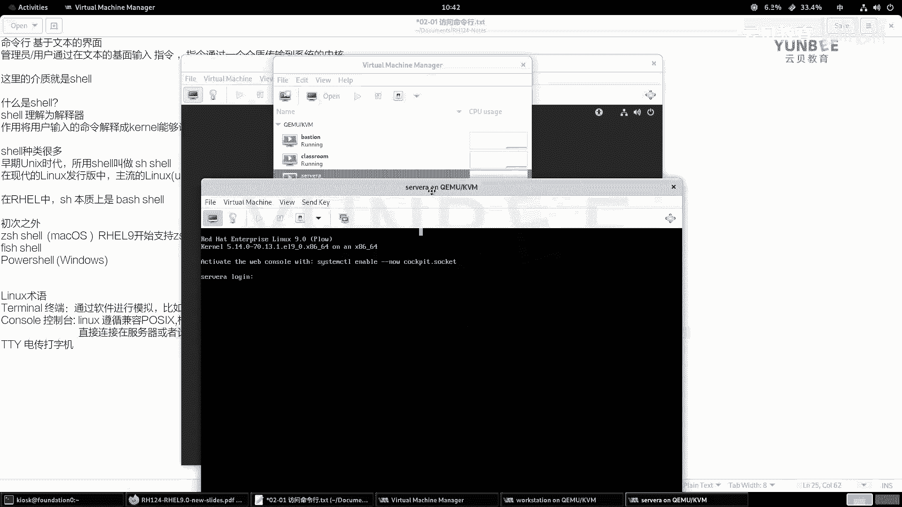
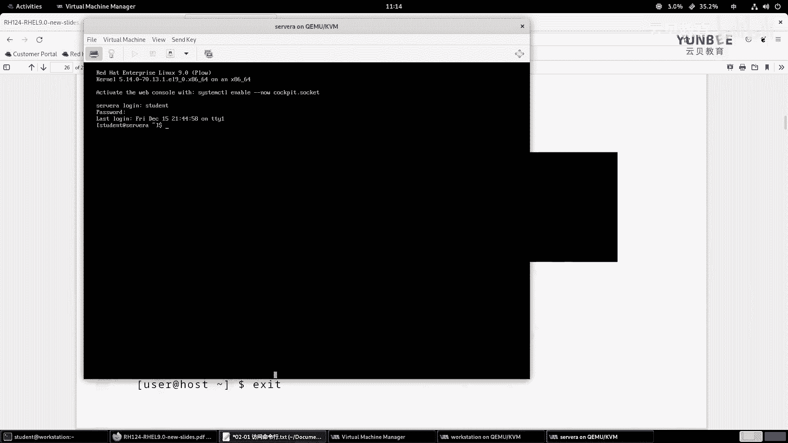
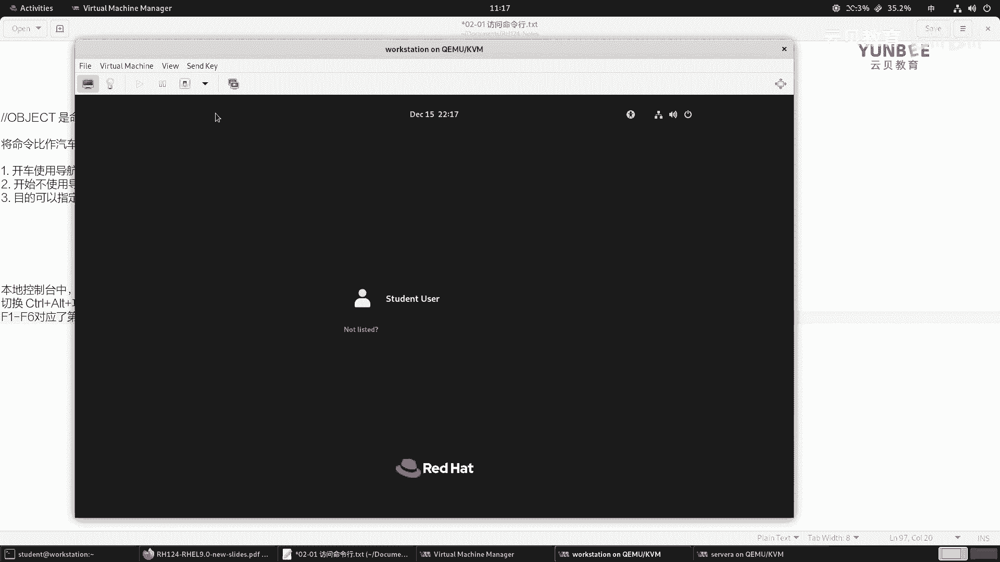
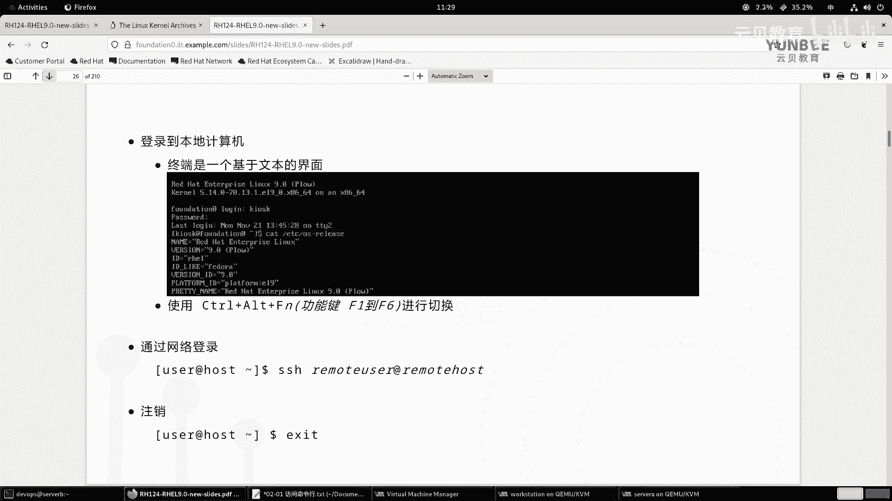

# 零基础入门Linux，红帽认证全套教程！RHCE9认证实战 RH124课程 - P5：02.1 访问命令行 - 云贝教育 - BV1Ns2gY8EVU

好，大家呢来看我们的第二章啊，访问命令行。OK那么这张呢我们呃整体的目标呢就是呃带着大家呢来了解一下。那么如何登录到我们的linux系统啊，然后呢啊如何呢利用什么呢？shall啊。

利用shall来运行一些简单的命令啊，这是我们的总的目标啊。那么这个总目标呢又分为三个这个三个阶段。那么这三个阶段分别为。

那么第一部分呢就是我们会带着大家呢啊那么了解什么是本地的文本控制台以及如何在本地的文本控制台当中呢来登录到我们的lininux系统，对吧？然后呢登录之后呢，那么再去执行一些shall指令啊。

这是我们第一个要掌握的啊，小的知识点。那么第二部分呢么同样也是推荐大家掌握的啊。那么呃但不是作为重要的部分O那是我们啊学习一下呢如何呢使用啊linux的桌面啊举ome桌面O。

那么最后一部分的话呢啊则是在我们学会啊使用啊shall这种简单的命令之后呢，一些提高我们执行命令效率的一种方式。比如说什么是tableboard的补齐啊，如何利用我们的啊命令行啊，这个历史记录啊。

以及快捷键啊，那么分成了三个小节啊，那么首先我们来看第一部分啊，访问命令行。OK那么我们在前面给大家介绍过，那么在linux系统当中啊。

那么命令行的管理方式呢是非常强大的啊OK所以说呢我们啊也是啊重点呢给大家来介绍什么是命令行。OK那么我们平常所说的命令行呢，可以简单这样来理解O。啊，命令行。那么简单来说呢，它是基于什么呀？文本的界面。

也就说我们啊在执行的时候呢，敲击的是什么呀？敲击的是一些指令啊，是字符OK字符。那么在这个界面啊，那么我们的管理员啊，或者说用户都行，哎，用户也行啊，那么干嘛呀？那么通过在文本的界面啊，输入啊。

输入什么呀？指令OK输入指令。那么这个指令呢干嘛呀？这个指令呢啊通过啊我们加上一个分隔符啊，那么这个指令呢会通过一个介质啊，一个介质。那么传输到什么呀？传输到我们的啊系统的内核。啊，内核。啊。

然后呢由我们的内核呢再去干嘛呀？解释啊，就是执行我们的这个指令所下达的一个什么呀具体的一个啊行动啊行动OK那么这里的介质呢就是一个什么呀？所谓的一个shall啊，是个shall。

那么这里的介质就是一个shall啊。啊，就是shallO那么什么是shall呢？你看我们这里提到了啊，那么在我们的红帽企业版linkux当中啊，那么我们给大家提供的默认的shall呢是啊GNU啊。

burning again shell。那么这个burning again shell呢，那么简称为bsh或者是bush都可以啊都可以。OK好，那么我们先给大家聊聊这个bsh shell到底是干嘛的。

或者说啊什么是sha。什么是我们的shall？O。呃，那么shall的话呢，我们把它理解为什么呀？理解为是解释器。啊，理解为解释器啊。啊，解释器，那么的作用呢是干嘛呢？作用呢是将我们的用户输入啊。

到什么哪里呢？输入到这个终端上啊，输入吧。这现在直接这样写好了，输入的命令。啊，那么解释啊解释成啊，那么计算机。我们的内核吧啊我们的内核。能够什么呀能够识别的语言。啊，识别的语言。那么我们都知道。

那么计算机呢它的啊语言呢是二进制的对吧？那么我们输入的命令呢是一个高级的语言啊，高级的语言是我们人能够读懂的。但是对于计算机而言，它是不能够识别的。那么因此呢我们需要把它解释成一个啊内核能够识别的语言。

所以说呢那么这个shall呢你也可以理解为什么呀？理解为是一个翻译官啊，只不过这个翻译官呢不是将你的语言翻译成另外一个国家的语言，而是将这个语言翻译成什么呀？计算机内核能够识别的语言。OK然后呢。

我们的内核啊内核O。啊，内核。那么根据啊指令所表达的意思。啊，然后呢干嘛呀？去啊调动什么呀，调动啊CPU的资源。对吧然后呢，分配什么呀？分配内存等啊进行一个什么预算。啊，然后呢输出什么呀？

输出啊最终的结果。OK那么这是我们的sha要的作用。那么sha的话呢，它也它是一个比较啊fin的概念啊。那么shall呢种类很多。种类很多。那么在早期的unux时代啊。

那么时代那么所用的hell呢叫什么呢？所用的hell呢叫做啊SH shell啊，叫SH shell，简称SHOK那么在现代的linux方向盘当中。OK发行版当中，那么主流的啊主流的linux。

那么比如说U班图。啊，然有德变啊，还有我们的那个什么fdora啊，stos，还有我们的红帽这些啊，那么都是以什么呀？包括还有什么企业级的ser啊ser。哎，那么这些啊那么都是OK那么都是以。谁呢？啊。

baash啊baash shell为主。都是以be shell为主。所以说呢呃我们的这个be shell的应用范围是非常的广泛的啊。那么在我们的real当中啊，re当中。

那么SH呢本质上是我们的b shell ok shell就是你可以理解为啊，那么你能够在re当中看到SH shell也能看到b shell啊，但是呢但是呢那么SH shell呢是其实是谁呀？

是be shell的一个快捷方式啊，我们暂时称为快捷方式好吧，O。因此，你可以理解为我们的real当中只有一个。shall就是我们的辨识shallok好，那么除此之外呢，除此之外啊。

那么还有其他shall。OK除此啊，那么除此之外。那么还有哪些呢？比如说啊比如说Z SH shell，那这个sha呢目前也比较火啊，也比较火。你像那个比较新的版本的mac OS啊。

这种类 unique系统，那么它用的就是Z SH shell啊，那如果你喜欢的话呢，也可以去安装啊。那么在我们的reo9当中啊，real9啊，这个版本那么也开始支持什么呀？开始啊支持我们的ZSHsha。

啊呃然后还有什么呢？我们平常所见到的啊，我们就说主流的啊，那么非主流的呢，我们就不再额外的介绍了。你像还有这个fish啊。啊，fish shell啊呃以及windows当中的power shell。啊。

当然了，这里的windows的自带的p shell也可以安装在linux当中啊，也是可以的啊，也是可以的啊，这是我们常见的啊常见的啊，这是我们给大家说了几种常见的shall啊，好，那么shall的话呢。

它是一个软件啊，一定要知道它是一个软件，是一个介质啊，它是一个软件，用来打通用户和内核之间的一个一个交互啊交互。因为shall在英语里面还有一个意思呢，叫什么叫壳啊。

就是乌龟的那个壳O所以说呢你也可以想象一个乌龟啊。那么呃这个壳呢保护它和外界的一个一个屏障，对吧？一个屏障啊。OK好，那么呃在我们学习这个shall的时候呢，我会给大家介绍几个术语啊。

你看terminalc和TTY啊，cil和TTY啊。那么这三这三个呃术语我们要要知道。那么首先第一个术语呢叫terminal啊，termin。那么我们翻译过来呢叫什么终端。或者说要linux术语吧。

我们linux当中的术语好吧，啊，术语。那么第一个呢叫tminal。啊叫终端。然后呢，我们呃PPT上的第一张图片呢，就是一个啊terminO那么在很早以前啊，那么很早以前。

那么计算机呢是非常的昂贵的啊不像现在是吧？我们可以实现人手一个啊，人手一个计算机，对吧？你的智能手机其实也是一个计算机，对吧？啊，也是一个计算机啊，那么呃早期的时候呢，你像什么。早期的时候。

你像在美国那边啊，因为是计算机的发源地是吧？那么要想去啊管理啊图书馆里的图书，那怎么办呢？哎，在图书馆的总部啊会有一台啊计算机啊，然后呢，在各个地区啊，各个城市里面呢，图书馆呢是分支啊，是分支。

那么这些分支里面，那么如何确保图书的数量啊，种类出借情况呢？那么每个啊这个比如说某个区啊，每个区啊，然后呢它的一个图书馆，那么就会有一个终端设备。那么呃图书管理员呢可以在这个终端设备上啊干嘛去查看啊。

并且呢这个记录啊，用户这个借阅图书的一个情况啊，那么它的呃。外观呢就是我们啊图片一的一个样子啊，有一个小的一个显示器，下面有一个键盘。那么那么看起来有点特别像我们现在的计算机的一个雏形，对吧？OK好。

然后呢，第二个术语呢叫conole啊，cole。那么cl的话呢，我们把它翻译过来呢叫控制台。啊，控制台。控制台ok那么在现在的网络设备当中，我们把这个cl呢称为是cl口是吧？叫串口是吧？

我们都没有去翻译。其实服务器也有这样一个口啊，也有一个这样的口啊，O啊，但是我们这里呢就是指传统的啊传统的这个啊硬件设备啊，那么看起来有点像我们的机柜啊，但是呢又比机柜上的内容呢更加丰富啊。

那么左边的这个白色的话呢，应该是它的纸袋啊，纸袋OO那么。那么右边的话呢，右边的这些呢是一些按钮啊，一些是一些按钮啊，呃，不知道大家有没有看过我们的一个科幻啊，科幻片叫三体啊。那么三体的话呢。

在这个啊红案基地，对吧？那么叶文杰呢啊在计算机前面能看到那个那些图片啊，那些图片啊，那么其实呢就是什么呀？就是一个啊我们国产早期国产计算机的一个控制台啊，控制台的界面啊。

那要比这个可能看起来更加的舒服一点啊，那个控制台上面啊要比这个要版本要更新一点啊，上面同样也有纸带啊，但是呢也有什么呀示波器啊，一些按钮等等啊。那么控制台，那么可以控制整个计算机的运行情况。

所以叫控制台啊，所以叫控制台O那么最后一个呢是什么呢？是我们的TTY啊，TTY那么TTY呢，我们把它翻译过来呢？叫电传打字机。啊，电传打字机，那么它呢是通过电话线的方式呢来连接的啊连接的。

OK那么同同样啊那么上面呢这个我们可以通过键盘来输入指令。那上面呢有纸啊，可以打印出输出的结果啊，输出的结果OK啊，那么这三个设备我们了解之后呢，接着我们回到现代的这个时时时间点啊。

那么在现代的计算当计算机当中，那么这三种术语呢，我们还在用。但是呢已经远远超出了它原本的意思。啊，原本意思。那么比如说终端，那么我们现在是没有这样的一个设备的。但是呢我们可以通过软件。啊。

软件呢进行一个模拟啊进行一个模拟。哎，模拟模拟之后呢，我们就可以在这个终端上啊执行命令。那么比如说在我们的reo9当中。啊，比如啊在我们的reo酒当中。

那么瑞19呢安装的默认啊默认okK默认安装的图形界面。叫gome啊gome。那么在这个gome当中啊，那么运行了一个。运行了一个什么呀？运行了一个软件模拟的终端。叫做什么呢？

叫做Gometerminal。啊，Gome terminalmin ok那么这个termin呢，它上面呢跑了一个程序，那这个程序叫什么呢？叫做bsh shell。

叫做be shell。O你像我们上课的时候给大家说的，哎，打开的这个界面啊，打开的这个界面就是谁呀？gn terminal这个软件，那么这个软件里面运行了一个 shell，叫besh shell啊。

叫做be shell ok啊，这是我们说的终端啊，terminal。

那么接着呢我们来说控制台。那么控制台的话呢，同样在现代的计算机当中呢，也也是不存在了，也是不存在的那怎么办呢？那么因为我们的linux系统呢，它的呃来源呢是这个借鉴了unux的一个思想。

OK所以说呢我们的unix呢在呃开发一些软件的时候呢，是。遵循啊遵循这个。兼容啊啊遵循这个。兼容什么呢？兼容po six。啊，po six的啊是兼容po six的。

那么根据根据我们的po six的一个定义。啊，它是一个兼容协议啊兼容协议啊。那么根据这个pos的话呢，那么认为啊认为。啊，能够。啊，能够显示啊用户输入的命令。和打印啊打印啊，我们就暂称为输出吧。好吧。

输出啊，用户啊命令执行的结果的。啊，结果的介质啊，这样的一个设备吧。那么就是我们的什么呀抗诉。啊，康诉，那么是谁呢？就是我们现代计算机当中的显示器OK显示器。OK显示器啊。

那么我们一般说这个cl的时候呢，因为这个显示器呢是直接连在我们的设备上面的对吧？连接在我们的计算机主机上面的啊，计算机本身啊或者服务器本身。因此呢我们把这种cl呢称为是本地 consolel。啊。

本地 council诉啊，就是直接啊嗯。连接。直接连接。呃，在我们的服务器OK。啊，服务器或者啊这个计算机的嘛主机。上的显示器，那么就是什么呀？本地的控制台。啊，那么你像大家呢看到的我们的这个界面。

我们的当前这个记笔记的这个文本界面，对吧？还有我们的PPT的啊这样一个界面。那么它就是我们的本地的cul。那么同样啊同样，那么我们利用我们桌面上面的这个。

daashboard里面的这个viitual machine manager，对吧？点开之后啊，点开之后，那么我双击，比如说我双击这里的overtation。

O打开。那么我们看到的我抖动的这个窗口啊，抖动的这个窗口呢就是我们当前这个汛机overtation的本地cocul。OK本地cocil好吧，哎，我们。或者说本地控制台啊，这个地方大家术语呢一定要记得啊。

okK那么如果我点开的是谁呢？点开的是server a的双击一下，那么现在抖动的这个窗口呢，就是server a的本地控制台。

OK区别就在于一个是什么呀？

图形化的界面一个呢是基于文本的界面啊，基于文本纯纯文本界面啊，没有图片没有图啊图形okK好，然后电传打字机。那么电传打字机呢同样呢在现代的这个。

现在的这个计算机当中呢也没有了，那怎么办呢？OK那么在我们的linux当中啊当中，那么字符界面情况下。

哎，就是我们这个servA的这样一个窗口啊，黑白的界面。那么。

那么这样的一个自我界面啊，那么呃用来用于承载啊承载我们的bch shell啊的一个介质。啊，戒质呢就是什么呀？就是我们的啊TTY。就是我们的TDYO啊，就是我们TDY啊。那么你说怎么去验证呢？

怎么去验证呢？那么我这里呢给大家演示一下。那么现在呢是servver a那serverer a啊，我把这个窗口呀啊适当的放大一点。那么大家在呃学习过程当中啊。

有些人可能会看到这里呢有一个全屏显示的按钮啊，那么这里不建议大家呢去全屏啊，因为全屏之后呢，退出的时候呢，有的时候很难退出啊，就是你的计算机性能，如果很弱的话呢，就很难退出啊，那么退出的话。

它的按钮呢是什么呢？那这里呢有一个有一个哦sorry新的版本当中没有快捷键了啊，那么是我们的alt键加加回车键啊，O是这样一个按钮啊，我我我们不建议大家全屏啊。

OK那么我们这里呢可以用鼠标呢去去移动啊，但是字符界面呢它的大小不会发生变化的。ok那么我现在呢啊去输入啊，在log in的后方输入我们的账户啊，tudent回车。然后呢输入我们的这个账户的密码。

那么这里的密码啊是不会显示的啊，你就输入就可以了。是studentU dNT回车。哎，那么这个时候呢我们就输入成功了啊，输入成功了。然后呢，我这里呢输1个TTY。回车。回车啊。

那么你会发现我们的输出会有一个信息呢叫DV下的。TDY衣。啊，TDY1OK啊，那么这个TDY呢，你看DV嘛是设备的意思啊，设备那个什么设备呀，TDY的设备。那么后面的这个数字一呢。

就是我们的这个TTY的编号啊，第一个啊TTY啊，那么如果啊我们后面会给大家再介绍其他的TTY的啊，其他TTY的啊。好，这是给大家说的这三个术语啊，三个术语OK好，那么无论是哪一种啊，哪一种啊。

那么我们最终呢你都可以把它统称之为是终端。

好吧，你都可以把它统称之为是终端是没有问题的。因为现在的概念很模糊啊，没有那么细致了。你就说终端本地控制台的终端，对吧？图形化界面终端啊，或者说你用windows啊。

然后呢装了一个什么呀X shell啊。对吧远程连接上去，那你的X shell呢也是一个终端。也是一个终端。所以说这个终端的术语呢变得非常的广泛了。如果我们抛除啊抛开这个linux而言啊。

我们不啊不讨论linux。你像我们的手机是不是也是一个终端，对吧？我们的个人计算机是不是也是一个终端？对吧所以说往大了有大的说法，有小的小的说法啊，现在这个模概念呢就变得很模糊了。无论是哪一种啊。

无论是哪一种，我们后面再说终端的时候呢，都是一个比较泛的概念。啊，广义上的终端，只要能够干嘛呀，执行我们的命令，我们都可以称之为是终端。OK都可以称之为终端。好，那么接着我们往下继续看啊往下继续看。

那么我们该如何在终端当中来执行命令呢？ok执行命令呢，那么首先我们要认识一个概念呢，叫提示符。啊，提示符，你像在我们的这个windows当中。啊，windows当当中windows当中的话呢。

我们有一个什么命令的提示符的概念。对吧，命令提示符。那么一般会在运行当中执行一个什么呀？CMD对吧？啊，CMD的命令啊就是命令提示符啊，那么在我们的这个。在我们的这个list当中啊。

那么终端上面啊打印的这个消息打印你打开终端，那么你也可以理解为是打开了它的命令提示符。但是我们一般把它称之为是终端。啊，而不是说叫做命令提示符啊，不是成为命令提示符啊。那么呃还有呢就是。呃。

这是广义上啊，那么呃广义上这样说的，那么如果是存狭义上，那么离我们的这个windows里的提示符呢，就是打开这个CMD之后。啊，那么一个窗口对吧？也会有个光标在闪烁。我记得windows里面是个大于号。

对吧？在闪烁等待我们输入命令。那那么这个。闪烁的部分呢就是提示符的符号啊，称为提示符啊，提示符啊，这狭义上来说的啊，我们这里呢就是以狭义上来理解的啊，提示符就是这个大于号。那么linux里面呢。

linkux当中啊，无论是任何的linux发言板啊，包括layunix，我们的layun系统mac也是一样的啊，也是一样的。那么我们打开终端之后啊，打开终端之后，那么我们会看到一个这样的一个界面。

比如说我这边啊啊这个先登录到我们的over station。好吧，登录一下over station。

啊，输入账户的密码student。

好，然后呢打开终端。啊，然后呢我这个因这个字体比较小啊，我稍微放大一点啊，然后这里面有个放大啊，点击这个右上角的这个三个横线啊，我们放大一点啊，放大一点。啊，然后我把这个窗口再放大一点啊。好好。

那么这个时候呢在我们的这个界面啊在我们的这个界面，那么就是我们的什么呀？光标在闪烁。那么我们看到的这个是内容就是命令提示符，就是命令提示符。那么在我们的呃linkux当中呢，命令提示符呢分为两种。

啊，这是第一种哦，sorry这个。没有复制成功啊，因为这个训机内部啊，那么我就在外面先远程一下啊远程一下。好，我这样去复制，这是一种啊，这是一种。哎，那么这是第一种我们所看到的这个命令提示符。啊。

命提示符OK那么在这个提示符里面啊，那么有一个doer符。有个doller符，那么这里的doller符。就是啊。普通用户的提示服。那提示符。那么如果啊如果那么我再换一种方法。

我换一种方法，那么我这边啊是serv a的对吧？我登出一下，我换一个身份啊，用root。然后回回车输入密码，red hat。好。啊，那么这个时候你会发现我们的提示符呢变成了什么景字符。

景字符，那么同样我这边啊也也去切换一下用户啊SU。然后呢，ride hat你会也现在也是root了啊，这是另外一种。

啊，好，另外一种这第二种。那么这里的景字符呢代表的是什么呀？代表的是系统超级管理员啊，管理员root。啊，root用户身份的什么呀提示符。啊，提示符OK这是两种啊这是两种OK呃，那么又意味着。

意味着那么这个时候那就意味着什么呢？意味着。执行。命令钱啊，要什么呀三思。啊，134，那么有可能。啊，会对系统。产生。致命的。OK致命的什么呀破坏。因为什么呢？因为我们后面会给大家介绍。

就是说这里的root呢就类似于windows里的adminrator这个账户啊，那么呃是超级管理员嘛，对吧？那么你先命令可能普通用户呢操作起来没有什么影响。但是你你超级用户就不一样了。

你一回车下去执行了，你的系统都可能会崩溃啊，都是有可能的啊，所以说呢一定要注意啊，你看到这个符号呢，一定要三思而后行。啊，三思而后行啊。好，那么无论是哪一种，我们都我们后面啊后面那么在后面的。啊。

笔记当中。啊，B当中我这边加个。斜看啊，后面B当中，那么。那么使用。dollar啊代表啊任何的提示符，就说我这里我这里的提示符啊。提示符既代表doller也代表谁呀？

景字符就是我记笔记为了方便啊啊提示符。那么我的笔记呢可能举个例子，比如说我一说哎写个字啊，后面一个doller啊，doller写个这个who am I。那么dollar呢就告诉你是个提示符。

那么why am mine呢是一个命令。那么你在看笔记的时候呢，你就知道了啊，我这个是什么呀？是一个需要在终端上执行的一个命令。啊，就是那个命令啊，后面我会这样来记啊，我会这样来记。

当然了我也会告诉你身份啊告诉你身份啊，我们后面为了啊给大家养成一个标准的学习的一个命令啊，那么如果是特权的话呢，我会在特权的前面加上一些特殊的指令，让大家一眼呢能够就能分辨出来啊。

OK那么如果没有说明呢，我们都是以啊。啊，如果没有说明。没有说明。那么我们。OK在我们的什么呀？work station。啊，serv a。ser B那么中啊以及啊以及啊后期会么接触的。会。啊，接触。

Slow see。啊，sD啊这样的一些名称啊，那么都是以谁呀？都是以我们的student啊用户身份。身份来登录并执行什么呀命令的。OK如果如果换了身份，我会给大家说啊，会给大家说啊。

这个地方大家呢啊记一下啊，记一下OK那么所以说呢我们按照刚才的这种结构，那么我们就可以把这个命令题符的终端上面看到的内容啊总结成什么呀？总结成一个这样的格式，叫什么呀？user at什么呀？

hot空格啊，空格啊，后面呢后面的话呢我们就写一个什么呀，就写一个。嗯，叫做什么呀？叫做WORK working。Direory吧。啊，然后空格啊，一个导点符。啊，到这辅大概是这样一个结构啊。

OK那么这里啊这里那么注意了。那么首先user代表的是啊当前啊这个。当前在提示符什么呀？提示符中执行命令的用户的身份。啊，身份就是当前登录的用户。那登子用户啊okK然后呢。

接着后面第二个呢就是host呢代表的是什么呀？代表的是。代表的是呃，我们当前登录的主机的什么呀，主机名。啊，主机名。O然后呢，第三个地方呢是working。Are working directory。

那么这个地方呢代表什么呀？代表的是当前用户所在的文件系统的位置。那所的位置。那么你像我们刚刚第一个复制的这个，那么就代表了什么呀？代表了代表了。那么首先dollar符。

那么能告诉我们的信息是啊这个student这个用户呀，他是一个普通用户，对吧？哎，普通用户就是我们的普通用户。啊，student啊已经登录在了我们的worker station。啊，然后这台主机。

然后呢，在哪里呢？并且啊并且当前啊所在的位置。是加目录啊，或者叫主目录都可以啊，主目录也可以。啊，因为什么呢？因为我们后面会给大家介绍啊，那么这里的波浪号啊就代表了什么呀？用户的加目录。啊，加目录啊。

那么这个加目录呢类似于什么呀？呃，我们后面会介绍类似的类似于windows当中的。啊，C盘。啊，C盘啊，这个users啊下面的一个目录啊，目录，比如说叫什么呢？啊，叫XWN哎，这样的一个名称啊。

类似于windows里面的这样的一个录目录啊，类似于这个啊类似于这个。好，这是。嗯，这是我们给大家介绍的这个提示符啊，提示符OK那么在提示符的后面要干嘛呀？在提示符的后面呀。

我们啊等待着用户呢去输入命令。那么这个光标呢啊我先登出啊，登出这个root啊，那么这个光标呢一直在闪烁，那么它是在干嘛呀？等待着用户呢去输入我们的命令。啊，输入我们的命令。

那么这个命令呢在输之前我们要搞清楚它的一个语法结构。啊语法结构就是说它呢呃命令呢是有三部分组成的那么分别为要运行的命令，以及用于调整命令行为的选项。第三个呢就是作为命令的目标的一个参数。啊参数。

那么在这里呢给大家分别来详细的介绍一下我们shall命令的组成。啊，是要命令的组成OK那么分为三个部分啊，分为三个部分。第一呢是要运行的命令。那么我这里呢就用什么呀？com慢的。好吧。

command啊来来来来代替啊。那么第二个部分呢，代表的是用于啊调整命令什么呀行为的选项。那么我这里呢就用option啊。大写的option好吧，加个S，因为选项有的时候会很多啊。好。

第三个呢就是我们的什么呀？啊，一般啊通常。啊，通常。啊，这个作为。啊，命令的目标的参数。目标的参数。那么我这里呢就用什么呀？ARG。啊，ARG呃，或者说用什么object吧。好吧。

Oject来代替好了啊。好，那么所以说呢我们的总结呢就是command。啊，OPTIOS空格OBGT啊，那这个笔记里面的这个空格可能看起来不是很明显啊，我我多加一个空格吧，这样会稍微的清晰一点啊。

OK这是几个意思啊。那么命令呢是干嘛的呢？com慢，那么本质上呢是啊一般啊一般啊一般呢是啊可执行的二进制文件。啊，一般是课帧文件。那么我们就它其实就是什么呀？就是一个工具。就是一个软件，对吧？一个工具。

啊，一个工具啊，那么我们可以举个例子吧。那么例如啊例如windows里面的谁呀，我们安装的安装的这个什么，我们现在装的比较多的软件有哪些？比如说我装的有这个。啊，举个例子，嗯。

比如我们安装了一个微信的PC的客户端，好吧。啊，这样的一个软件。啊，其实就是一个什么呀？就是一个应用程序嘛，对吧？一个应用程序啊。好，那么接着呢这个options呢要注意了，这个东西呢花样就比较多了。

option的话呢，我们翻译过来是选项呀，选项啊，那么这个选项呢又又干嘛呀？它又这个分为三种。啊，分为三种。那么第一种呢是呃属于什么呢？属于是这个啊BSD风格的。那么所谓的BST风格呢。

就是说这个选项的前面啊选项。选项啊，那么是以字母的缩写。啊，字母的缩写。啊。为主吧为主，就是有的时候也可能不是字母的缩写，或一些特殊的符号啊之类的啊。然后呢，那么这些这些这个选项。啊，选项的前面。啊。

选项前没有啊这个所谓的这个短横线的符号。啊，是没有符号。那么例如我们将来会学习到一些命令啊，比如说PSAUX。啊，这是一个命令啊，然后还有比如说将来会学习什么ta啊，这个TF后面跟上一个文件。

那么这里你会发现啊，那么这里的PS呢就是一个命令。啊，那么这里的A也好，U也好，X也好呢，它们都是选项，只是合在一起了。你可以分开写啊。那么这里的T。是一个选项，F呢也是一个选项。那么无论是哪一种。

那么前面都没有什么呀短的这个横线。啊，这是一种符号。那么这种符号在我们呃linux里面见到的比较少啊，见的比较少，我们很容易能记下来。那么第二种风格呢就是unix风格啊。unix风格unix风格的话呢。

它呢就是选项啊，选项呢那么是。啊，这个。是这个这个这个选项的一个。具体内具具是我们具体选项啊，具体。选项的一个英文缩写。啊，是他的一个具体的一个英文缩写ok。啊，英文缩写。OK那么选项前。啊，有什么呀？

有这个。短的横线的符号。那封号OK那么例如。啊，例如。啊，IS杠L。啊，杠L那么或者说呃我们将来会学习到一些其他的命令啊，其他命令啊哎什么。你看这个啊这个这个这个。啊。user add啊natasha。

啊，sorry，这个不能这样说啊啊换一个。啊，换一个啊，比如说什么呢？那user name杠R哎，杠2，那这里的user name呢是命令，杠R呢是选项啊，杠个选项OK。好，那么无论是什么呀？

无论是我们的BSD风格啊，无论是。嗯。BSD风格。还是什么呀？unix风格。啊，那么那么这些选项呢，我们都可以通称之为什么呀这种类型的啊。选项呢都可以。都。可以啊称为啊短格式。短格式啊选项。

OK那么这种选项呢是呃选项呢都是有字母的缩写的，所以选项啊不同的选项。之间啊可以分开。啊，分开也可以什么呀？也可以。啊，也可以合并。啊，使用okK那么举个例子啊举个例子，比如说。我们的一个命令啊，L。

杠L杠H啊，然后杠D啊杠D。然后呢，后面跟上一个啊目录。啊，比如说谁呢？ETC吧，那么等同于。啊，等同于LS杠LHD啊ETC。呃，表达意思是一模一样的。那是一模一样的OK。呃。

然后我们接着第三种风格叫做什么叫U叫做这个GNU风格。那么兼优风格的话呢，选项啊选项呢是啊具体选项的全名称啊。啊，全拼OK那么选项前呢有两个。啊，短横线。啊，符号。那么例如。啊，例如。啊。

长的选项我们用的比较少啊，让我想想命令呃。突然okK让我想一个，比如说嗯。比如说啊PASSWD杠杠STDIN。啊，这样这样这这个名单单的这样写，肯定会报错啊呃，找一个。嗯嗯，比如说我们找一个。A。

L4杠杠ha吧，就这样写吧，就这样写吧。好，那么这样的一个格式。OK这样一个格式啊，那么这就是一个长格式的。那么长格式呢，因为ok因为我们因此呢我们把称之为是长格式啊。因此，那么称之为是。称为长格式。

那么长格式的选项呢是不能够合并的啊。啊，不止合并，你要单独来用。okK好，那么除此之外呢，还有一个注意事项啊，注意事项呢就是有些命令。啊，选项呢也有自己的参数。啊，举个例子。举个例子啊。

你看啊user add杠SB。下面的ZSH娜塔莎。那么在这个命令的当中举例的当中，那么user add。那么是什么命令？OK那么杠S呢是什么呀？是选项。OK然后这里的病。啊，并。下面的哎。

怎么老是跑前面呀？B下面的ZSH呢是什么呀？选项的参数OK然后呢，接着呢他上呢是什么呀？是我们的这个对象啊，就是命令目标的参数。就理你可以理解为是是谁的呀？是user艾的参数。啊，是参数啊。

你说那这么乱，我怎么记啊啊，不需要去记啊，这种情况还是比较少的啊比较少的。ok好，接着。那么最后一个呢叫什么呢？叫做对象。啊，对象。啊，是我们的命令。明令。的对象啊，就容易理解了啊。

我们呃还可以来这样来比喻啊，就是你可以把命令啊当做汽车。啊，汽车，然后呢，选项呢选项什么比作什么呀？比作导航设备。啊，设备。然后呢，这个这个object呢就是目标，你就把它理解为什么呀？目的地。

到目的地就可以了。那么那么我们开着车呢有这种场景。第一种啊，开车啊使用导航设备。第二种。对吧开车使用不使用导航设备。对吧就意味着我们的选项呢要根据情况而来啊，要不要去使用？对不对？要不要去使用？

那么第三种呢就是这个目的地啊，目的地呢同样那么可以啊可以指定。那也可以呢不指定。那也可以不指定。你看我们你看我这个前面的这个笔记里面啊，你看这个命令L杠L，哎，后面就没有什么呀，就没有。参数吧，对吧？

user name杠R呢，你看后面也没有吧，都是空的。OK也是空的那所以说啊这些呢组合啊都是相互的，但是开车是必须的。啊，就是工具命令是必须的啊，命令的选项啊，命令最终的对象啊。

都是要根据具体情况而对待的。啊，而对待的。好。这是我们呃说的这个几个术语。啊，几个术语啊。好，那么接着我们已经知道了这个命令行的组成部分。那么我们接着来介绍一下如何登录到本地的计算机。那么登录本地呢。

我们区分为两种，一种呢是基于文本的界面。那一种呢是基于图形化的界面。

那么文本界面呢，我们前面见识过了，那么就是这样的一个标识。啊，就这样一个标识啊，然后呢我们直接在这里输入什么呀？用户输入对应的密码呢，就可以成功登录啊，成功登录。那么在本地的控制台当中。

O。本地啊本地的控制台当中呢，那么在我们的real9当中呢。默认啊默认有啊6个终端。那么这个终端呢，我们严格意义上来说呢，叫什么呀？虚拟控制台。啊，工制台那么怎么切换呢？

那么切换的方式呢就是哦ctrol键。加offt键和加上我们的功能键。那么这个功能键呢指的是F1到F6。啊，到F6啊，因为我们的环境呢是跑在虚拟机里面的。那么呃我们因此呢在呃执行这个组合键的时候呢。

我们就用这个啊虚拟机上面的组合键啊，在窗口的上面有一个send key。

啊，sinend K啊，然后呢下面有什么controrl out F1F2F3F4一直到F6。啊，都是可以去用的。我们比如说啊。我们我们执行一个ctrol out F3。啊，然后呢输入账户名。输入密码。

执行1个TTY你会发现我们切换到第三个虚拟控制台。OK那么如果呢我把这个换成6呢，cr Alt F6呢，然后同样再登录一次。那么指行1个TTY。那你会发现啊，那么我们就变成了什么TTY6。

那么所以说呢这里的F1到F6呢，对应了什么呀？到对应了啊，对应了文本控制台。

啊。我们的虚啊虚拟。第啊1到这样写吧，到第6个什么呀虚拟控制台。啊，控制台ok好，那么还有一种呢就是我们登录的是图形化界面。

图形化的界面。那么图形化界面呢，我现在先给它锁呃给它这个注销掉啊，在图形化的右上方点击这里的power off或者是log out，我选择log out。

啊，那么这个时候我们来。

注意观察一个事情。现在呢我发送一个crl F1，好像没有什么变化。

F2呢。哎，是字符界面啊，字符界面ok然后呢，F3呢。

啊也是字符界面。所以说啊那么如果啊如果安装了图形化界面。大图形界面，那么我们的图形界面的绘画绘使用。第一个虚拟。控制台那就占用了。啊，占用了啊，那么还有一个注意事项呢，就是。呃。

如果你是因为我们的这个环境啊是定制的，就是红帽原厂定制过的啊。如果是自己安装的话呢，其实TTY2。才是什么呀，默认的。图形界面。啊默认同学界面。OK啊，它是一个这样的一个一个变化啊一个变化啊啊。

然后你登录的时候呢，它图话界面就是2，然后呢，你再切换到TDY1的时候呢，TDY1会重新登录的时候会重定向到TDY2。啊，登录的时候啊会从定向。到TTY2。的图形界面。啊，这是装通话界面的时候。

其实这个地方我们不用去啊去这个纠结啊，到底是怎么一个逻辑啊，我们一点都不用关心啊，一点都不用关心。它有通话界面，有灯，没有退化界面，你就切换本地控台啊，本地控台就可以了啊，就可以了啊。

那你说那我万一我这个。对吧呃，某出于某些原因啊，我这个服务器呢没有连接键盘，也没有连接显示器。对吧没有连接，甚至连QM的这种硬件设备，我也没有连接。啊，那那你说我怎么去登录呢？对吧？那么这个时候啊。

那么如果啊。如果我们的服务器啊服务器没有啊键盘呀，这个显示器呀。啊，或者说我们的KVM的硬件啊，KVM的硬件。啊，这种外设啊外设的一个呃连接。那么可以通过服务器的什么呀csl。啊，c诉口。啊。

进行一个登录。配置服务器。但是大家都知道，现在我们的服务器都是很现代的是吧？啊，但那么很少会用ccl口，我们都会用什么呀？用它的这个管理口，对吧？管理口呢进行去管理啊，很少会用conl了啊。哎。

这是我们说的一种一种方式啊，一种方式OK那么这个csl口呢，我们一般分成什么串型控制台是吧？哎，串口就是我们所谓的串口啊，咱们的。咱们的这个大家在学习当中啊。

如果有人是啊这个之前从事于什么网络设备的管理的，像路由器啊、交换机这些的那肯定对这个contl口呢非常的熟悉啊，非常的熟悉OK啊，这是这个啊，那么还有呢就是。还有一种解高级的解决方案。

这里给口头上给大家说一下啊，就是说啊这个这个我那个所在的位置啊，这个呃既不能通过cl口，也不能够通过什么呀？这个这个这个控制口啊，就这个管理口去登录啊，也没有这个外接口，那怎么办？他那那怎么办啊？

那么这种这种比较极端的情况下呢，其实我们还可以利利用一种模式，就是还可以啊还可以。还可以利用什么呀？哎，我们的VNC。啊，来运行啊运行。图形界面。啊，注意是图形界面啊。那么呃如果是安装系统。

安装系统时啊，那么这个字符界面也是可以。也是可以通过VNC连接。啊，查看的。查看安装的进度。那这个就需要我们去看这个官方的安装手册啊，在安装的时候，那么在安装的这个选项里面加上一个选项啊。

在安装的条目里面增加追加一个选项，就是VNC的什么呀，账户和VNC的密码就可以登录上去了。OK啊，这是我们说的这种啊在这个比较这个要么是本地对吧？要么就是比较极端的情况啊。但是呢更多的时候呢。

我们在管理服务器的时候呢，都是通过什么呀？远程的方式或者叫做网络登录啊，网络登录的方式，这才是我们最常用的。比如说举个例子啊啊，我们公司的业务呢都在云平台上面，对吧？公有云上面啊，我们并不是云的提供商。

我们只是一个租户，比如说我用的是阿里云的，用的是华为云的或者腾讯云的产品是吧？那人家的数据中心。对吧那你在杭州数据中心，比如说你购买的这个数据中心所在的位置呢在哪里呀？在这个这个华北地区，对吧？

你不能说啊，我为了调调配一个软件，我再出差到啊这个这个华北地区，是不是啊？你说我这个业务呢是提供国际业务的，我还有一些服务器啊，在这个啊亚马逊云上面，而亚马逊云，你买的这台这个这个服务器呢。

正好在哪里啊？在北美洲啊，难道你啊配一个服务，还要啊出差坐飞机去北美吗？对吧？那肯定不现实，那所以说呢我们更多的时候呀，是通过网络的方式来登录的？那么现在呢比较安全的登录方法呢，我们都是通过SSH协议。

啊，网络来登录啊，那么就是通过SHSSH那SS的全拼呢叫secre shell。啊，secre share啊，哎，叫这个名字啊，我把这个大写呢就是它缩写的一个标识啊，一般都支持啊一般都支持。

那么它的语法呢。简单的来说呢，就是SSH。跟上你要登录的用户。然后呢，跟上你要登录的主机。啊，就可以了，这是最简单用法。具体啊有些其他高级的用法呢，比如说我们将来会学习到什么呀？密码的啊。

有我们会提供什么密码的验证啊，密码的验证。还有这个密钥的验证两种方式。啊，两种方式啊，那么具体该怎么实现的呢？我们在后面的章节当中呢，会给大家介绍啊会给大家介绍。那么你像我们在这个教学环境当中啊。

我再打开一个新的标签页。那么我在这里呢SSS啊，看好了SSH啊，我要登录到overtation。

at four station。那么这个时候呢，我们需要输入对方的账户和对应的密码。验证通过之后呢，就可以登录了。那么左边的这个窗口啊，那么如果我呢SSH谁呢？比如说我再换个用户名啊。

DVOPS艾servver a。我换一个身份，那么在登录的时候呢，并没有输入密码。并没有输密码。那么我这个方法登录呢，就走的是密钥认证。啊，密钥认证啊那ok那么我把这个命令要写全的话呢。

就是SSH杠I加目录下面的点SSH里面的ID啊，2SA。哦，我们这个应该是。嗯。叫lab RA啊。好，DVOPS艾特serv a这是密钥认证登录啊，两种方法好吧，两种方法啊。

OK两种方法。

给它分开啊，分开写，这是两种方法啊。那么密钥认证啊密钥认证啊，验证呢安全性很高啊安全性。OK高于密码验证啊，我们后面章节当中会给大家来介绍啊介绍，我们暂时呢就不用多说啊，无论是用哪一种方式登录啊。

那么有的时候可能会遇到一个这样的情况，我再举个例子啊，举个例子大家看一眼就好了。比如说我用serv A去登录serv位 B。

我还用这个用户，好吧，OK登录ser B。那么会看到一个这样的消息。如果你确定是对方是安全的，第一次登录啊，那么你就干嘛呀，你就这个。输入一个yes呢就可以了啊，就这个是走密码认证啊。

密码认证初次的密码验验证会遇到这样一个提示啊。

如果。OK如果啊第一次啊。这个使用密码验证登录服务器。那么会看到这个这样一个消息啊，那么确保啊这个。主机呀，还有IP呀。啊，这个。安全的情况下。那么输入什么呀啊yes。既可以。执行什么呀？下一步了啊。

那么具体的内容啊，具体。具体如何识别啊，是否安全。以及实现。啊，如何实现啊密钥验证？啊，我们在后面的章节。来介绍啊来介绍。啊，这个地方呢就是如果我们拿到环境之后，你敲哎。

怎么老师敲的时候就直接输入密码了，我这边怎么就就会看到一个这样的类似的消息呢？对吧？我们教育环境当中，你可以大胆的去执行啊，输个yes呢就可以了那就可以了啊。好，那么无论是接着呢我们再说一个呢？

就是无论是啊本地来登录还是远程的方式去登录，当我们啊执行完我们的命令之后啊，执行完命令之后，那么我们一定要做一件事情呢，就是什么呀？要注销我们的登录啊，这样才是安全的啊，安全的。比如说图形化界面。

啊，图画界面O那么这个是呃我先回到F1啊，F1。比如说呢图化界面。

啊，通然界面我登录成功了。啊，登成功了。然后呢，这个时候呢，我就干嘛呢？

哎，点击啊我们这个啊这个桌面啊，右上角啊点击这里的注销。啊，就可以了，这是图一化界面啊，那如果是字符界面呢，那么字符界面的话呢，我们就直接在这里执行一个命令呢，叫exact。啊。

这是第一个这这是这是可以的啊，是OK的，也可以执行另外一个命令。那在这里面执行一个exact退出了。

啊，或者说还是执行一个什么呀。Q呃。我记得新的里面有没有啊？哦，新的里面没有这个命令了，那我们就直接只做exact就好了啊，exit就好了，退出啊就完事了啊，退出。啊，你看我们就回到了最原始的状态。

然后这样的话呢，就可以避免什么呀？避免这个。没有断开连接的情况下，你离开了你的这个绘画界面，你人离开了，对吧？绘画还在连接。哎，另外一个人拿着你已经登录好的这个界面，对吧？哎。

去执行一些啊这个一些其他事情，那就不好了啊，或者说你用快捷键啊，快捷键。比如说我右边的这个标签一啊，快捷键快捷键ctrorl加D也是可以的。那ctrol键加D也是可以的啊啊。

或者执行命令log out啊，log out都行啊，都行，log out都可以啊。但是你看让我们推荐，因为我这个是已经最后了嘛，所就退不出来了啊，退不出来了。

好，那么。执行啊完毕。之后呢，那么。啊，如果是终端。登录啊，就是通过啊通过这个终端或者是本地的字符界面登录的。那么执行什么呀？执行。exact或。啊，log out或。啊，谁呀？control键加D。

啊，可以什么呀？退出登录。也叫注销啊要注销啊。好呃，这是我们第一小节的内容。

