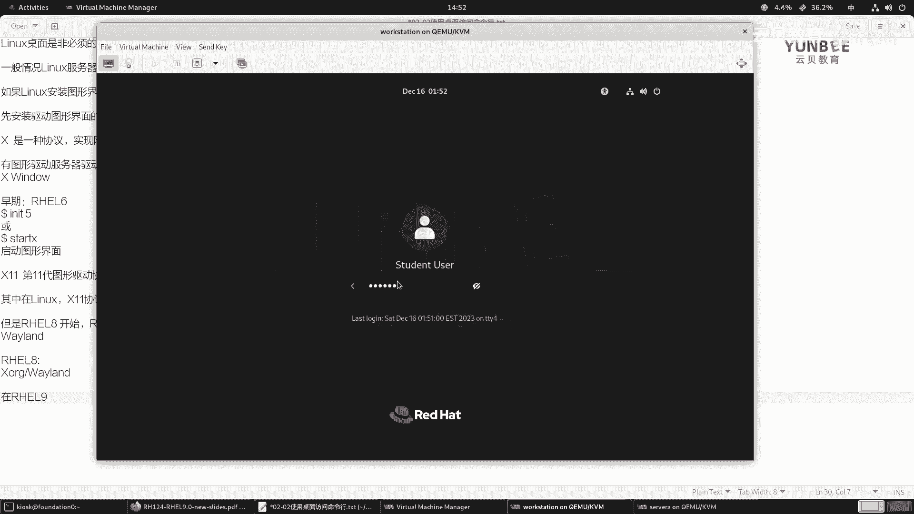
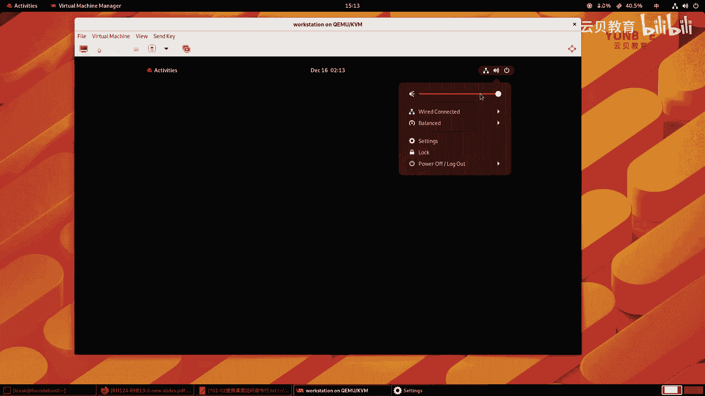

# 零基础入门Linux，红帽认证全套教程！RHCE9认证实战 RH124课程 - P6：02.2 使用桌面访问命令-理论 - 云贝教育 - BV1Ns2gY8EVU

接下来呢我们来学习第二节，那么使用桌面访问命令行。那么在正式的介绍这一小节之前呢，我们先给大家来介绍一下什么是啊linux的桌面ok。那么首先我们需要知道的是linkux当中啊，linkux当中。

那么桌面呢是一个非必须的部分。OK那么这个桌面呢你可以理解为是一个独立的一个大型的软件啊，是一个独立的大型软件。那么它和windows是不一样的。那么windows当中。

那么桌面呢是操作系统当中的一个部分，啊linux桌面不是的啊，那么linux桌面的话呢，它和啊其他的这种啊独立的软件呢都是相同的。那么比如举个例子啊，比如说在windows当中，对吧？

我们可以选择去安装一个啊微信的客户端，也可以选择不去安装，那么这里的linux桌面呢就类似于我们啊windows里面的这个微信这样一个软件啊，它是一个独立的。是个独立的OK那么一般情况下啊一般情况下呢。

我们是呃在使用linux服务器的时候呢，不会安装图音化的界面。服务器啊一般来说一般服务器。啊，不会安装图形界面。OK为什么呢？因为你安装了图形界面之后呢，它会消耗更多的资源。OK好。

那如果啊如果那么linux安装图形化界面。那么需要做些哪些准备工作？OK那么首先那么要想去呃安装linux的图形界面，那么我们必须要先安装什么呢？先安装。O。我们需要先啊。安装啊驱动啊图形界面的服务器。

啊，它是个服务啊它是个服务ok。他这个服务，那么这个服务呢在早期的时候呢，是利用的是X啊XOX呢是一种协议啊，X是一种协议。OK协议，那么就是能够实现特定的目标而而构建的。那么你比如说。

我们身边啊我们身边呢比如说这个啊实现什么呀啊，网站的啊网站的这个呃这个数据传输。那么我们会用到什么呀？HTDP的协议。还有这个HTTPS的协议。啊，那么X呢也是一种协议。

OK那么有X协议呢实现的这个图形化界面呢，我们称之为是X window。OK有图形啊，这种驱动服务器啊，然后呢驱动起来的图形化界面。那么称之为是啊X window。啊，X window没有S啊。

X windowO这X window啊。呃，你像在早期啊，那么在早期早期什么时候呢？你像在我们的real6这样的一个版本的时候啊，那么管理员呢可以执行一个命令呢，叫INIT5啊，这样一个命令。啊。

这个命令那么就可以干嘛去启动啊，或者是谁呢？或者是这个。Start。X这样一个命令啊，那么可以干嘛呀？启动啊启动啊这个我们的图形界面。啊，图形界面OK那么这里的X呢就是X window的意思。

X window的意思啊。那么现在呢主流的图形呃界面驱动呢一般走的是第十一代的啊第十一代的图形界面协议啊。啊，第十一代，那么有这个第十一代呢，它的呃图形界面服务器呢有非常的多啊。

那么其中啊其中那么在linux当中呢，我们的X11啊利用这个协议啊。那么这个协议，那么实现的啊图形啊，这个驱动服务器呢，它的软件啊。是谁呢？叫做XORG。X， O G。啊，一般中间可能会加个点。啊。

或者不加点都可以啊，XORG啊XORGOK呃那么但是呢从这个。从哪个版本呢？从这个real7开始。哦，sorry啊，reo8开始啊开始。那么红帽啊开始。啊，在这个开始支持什么呀？支持这个新一代的。啊。

新一代的这个。X啊驱动服务器，谁呢？就是vland。啊，叫welandOK那么又意味着在reo8当中，那么老的这种XORG和新的V什么land呢是同时存在的，你可以切换。啊。

你可以切换OK那么在我们的re19当中。啊，在re19当中，那么我们来看一下啊，怎么去看啊，我们切换到over station。那么在登录的时候。

啊，在登录的时候。O哦sorry，我这边回车了啊，我先登出一下。

呃，但是呢我们的这个环境呢，它在呃演示的时候可能啊体现的不够具体啊，为什么呢？因为环境咱们之前说过，那么就是这个环境啊是被定制过的啊，定制过的。OK你看在这里啊右右下角呢有一个呃齿轮的标记点开。

那么你会发现呢，在这个。

在我们的这个呃桌面的右下方呢，它一个标准，看到没有？X11display server。啊，X11啊dipower啊，然后要么这是它的一个，你看走的是第十一代的啊，其实他这样写呢就代表的是走的是什么呀？

XORGOK那么其实我们严格意义样来说，那么啊不是的啊不是的。

我这边啊我这边尝试看看能不能更新一下他这个软件包的环境啊，我尝试一下啊。

因为咱们的这个环境定制的太深了。OK那么reo9上面默认的话呢，应该走的什么呀？我这里面给大家描述一下啊，默认使用的是。

啊，这个VlandO。啊，Vland啊这样一个驱动服务器啊。

这个地方大家要知道就行了啊，咱们的这个环境呢这个。啊，有点差异啊差异啊，有些命令呢我们暂时还没学啊，我这边先尝试一下啊。OK我尝试一下，它是有些包的啊，你看有几个包没有安装啊，我重新给它更新一下啊。

更新一下。然后重启啊。看看有没有什么变化啊，这个呃不一定会有变化啊，我们只是说来确认一下而已。嗯，OK让它启动的过程当中呢，我这边啊再走一个命令啊，然后呃在soA上呢，我去安装一下这个图化界面。

我看能不能正常的起来。

这边SSI去。Student at server A。啊，这些命令呢暂时大家呢不需要去掌握啊，主要是给大家来演示一下它的一个最终的一个效果。好，那么经过漫长的等待呢，这边的软件包已经成功的安装了。

那么啊然后啊我这边呢给它起来，把这个图形化界面的服务。

哎，我们看一下这个serv a啊，s a好，现在呢他没有任何的这个感觉啊，好像没有什么变化。那么我这边输一个student。鼠标啊ok。F1。好，我这边让大家试一下啊，student然后密码。嗯。

因为现在呢，他还没有这个我没有启动图文化的服务啊。那么我这边临时的执行一个。

好，起来了啊。好，那么接着呢我们点开任何一个用户啊，我们主要看这里O主要看这里啊，那么你会发现我这边自己安装的图形化桌面之后呢。

那么它第一个选项呢就是standard标准的叫vland display server。啊，这个是默认的啊默认的。而我们这个word station呢，它本来我们在这个使用这套。配套的学习环境的时候呢。

他已经安帮我们安装过了。啊，里面东西很少，它为了节约资源啊，那么为了节约资源，它安装的很少啊，但是默认啊给大家看一下就可以了。啊，就可以了啊。好，那么这是给大家啊说的这个默认情况下呢。

我们走的是vland的驱动服务器。那么微land的服务器呢也是全新一代的。那么从今年的10月份。

啊，严格来说是11月份开始啊，那么呃其他的linux发言版呢也逐步的在推广，就是自己的软件呢啊都支持什么呀？支持这个Vland啊，就说这个呢肯定是未来的趋势啊，未来趋势。目前而言啊目前而言。

你比如说咱们呃国产的一些啊linux的软件啊，目前还都是以支持XORG呢为主啊，XORG为主。你比如说啊你像这个深度啊linux深度这个这个发行版，那么上面跑的这个我们平常用的这个腾讯会议为例啊。

那么就是走的是XORG。啊，那如果你把它下载到你的。其他的linux方向板当中，你要想运行的话，并且你用的是啊Vline的驱动的那是跑不起来的。

不过这个变化应该啊很快就会这个就是逐步的被大众所所所这个就是。根据使用量吧，根实际使用量。那么大家在开发软件的时候呢，也会逐步的向这个vland进行一个驱动啊。

那么当我们的系统安装了这个这个啊vline或者是XR机之后呢，就可以选择安装什么呀，选择。啊，安装啊这个我们的图形图形的软件啊，桌面环境呢叫做啊桌面环境。那么桌面环境也是非常的优秀，非常的多啊。

那么比如说那么咱们这个real啊默认的这个桌面呢叫gro啊，gro啊啊，然后一些其他的linux反映版，你像U班图啊这些，对吧？那么这这种的，那么我们还可以选择去安装什么KDEpl嘛啊。啊。

plus嘛这样桌面啊，还有这个cinema。啊，cinema啊，还有这个什么这个。呃，XFACE啊这样的一个比较经典的桌面啊等等等等吧。还有我们国内的深度的桌面啊，din啊这样一个桌面。

那么它简称DDE啊，第一个D呢是din。第二个D呢是桌面。第三个E呢是环境啊等等等等吧。我们都可以选择自己自己喜欢的啊喜欢的。那么在我们的gn桌面当中啊，gn桌面当中。

那么它里面有一个非常非常重要的一个核心的功能叫做gn shell。那么接到 shell的话呢呃为我们提供。啊，提供了这个核心的功能。啊，核心的功能。并且啊并且支持什么呀？高度的自定义。啊，高速自定义啊。

比如说我们刚刚安装的这个servA为例啊，那么我们可以选择不同的这个主题。那默认呢我们的标准啊，标准的主题我们可以打开看一下，输一个账户名student。

啊，这是它对应的密码。好，那我们来看一看是什么效果啊。好。这是我们第一次登录进来啊，登录进来我们给它取消掉就行了。那么和我们啊的这个这个外面这套环境的桌面是一样的啊，很干净啊很干净。

左上角呢有一个activities啊，activities。那么我们我们这个注销掉啊注销掉，然后呢换一个我们换一个这个主题。

比如说我们换一个经典的主题啊，gome classic好，那么账户名呢也是student。

OK那么你会发现呃和刚才的是完全不一样了。那么这个呃经典的主题呢，它和我们装的real7的版本是一模一样的。那么左上角呢是应用的菜单，还有你的啊一加目录的一些子目录啊，然后这个下面还有一个什么呀？

有一个这个图标，那这个图标代表的是打开你这个呃所有的窗口啊，我们这个目前没有窗口，所以你感觉不出来，我可以随便打开一个，比如说打开一个fis。啊，然后再点击这里。啊，它就缩放了啊，缩放了OK啊。

这是这个经典的桌面啊，看你喜喜欢哪一个了啊，你你想你想用哪一个呢，你就可以切换啊。那我这里呢是啊以虚拟机来给大家演示的，大家呢也可以在登录我们的房定阵的时候呢，去选择自己喜欢的主题。

啊，都可以啊都可以啊，我把这个窗口呢就最小化掉了。

好，那么接着我们往下看啊，那么这个界面呢是给大家介绍了我们举no要的一个核心的功能。那么这些功能都是干嘛的啊？那么一共呢是有7个数字啊，第一个数字一啊，就是上面的这一排全部都是啊。

那么代表的是我们的顶栏。那么在顶栏里面呢，从左到右呢分别是有2啊，二的话呢是活动概览。那么活动概览的话呢，我们可以用鼠标单击啊，你看单击啊，它会把所有的窗口呢进行一个什么缩略图。

也可以按一下你键盘上的windows键，然后要开始菜单键，对吧？那么mac上面的是command键啊，windows上面呢叫做windows键啊，你统称之为什么super键啊，都行啊，都行啊。啊。

然后呢这个以及什么呢？再往中间啊，中间那中间的话呢就是这个啊七的位置了啊，七的位置啊，七的位置呢我们点开之后啊，那么是。嗯，就是如果没有点开的时候呢，它是显示的我们的日期和时间啊，那这个可以调整的啊。

那么点开之后点开之后呢，会显示我们的托盘消息，那就是你的组件呀，你的应用啊，给你发送的通知啊通知那我这里呢以我的桌面为例，点开啊，点开你看能弹出来我们的日期啊，还有这个今天的事件啊，这个消息啊等等。

OK好，那么接着啊这是二这个这个一的中间位置啊，就是七的。内容，那么一的位置再往右呢啊是我们的什么呀？是我们的系统菜单。幸三呢点开之后呢，就是三的啊这个区这个区域的内容啊，那么点开那么点开之后呢。

有我们的声音啊，声音还有我们的网网络连接。那这里的网络连接啊，那么注意了，无论我们有没有权限，在咱们的教学环境当中，大家千万不要去修改啊，还有这个设置啊，这个锁屏以及关机重启和注销的一个按钮。啊。

都在这个里面啊，在三的位置。啊，在三个位置OK那么我们稍后呢再给大家详细的介绍这个设置啊，设置。好呃，那么当我们点击这个activities的时候呢。

那么最下方啊，就是我们PPT里的四个位置，是我们的dashboard。

啊，大ashboardok那么中间的位置呢是我们的缩略图啊，就是5啊5缩略图。那么右边呢这个地方呢是什么呢？是我们的另外一个工作区域。

啊，工作区域啊，那么我们可以啊使用键盘上的win呃这个windows键加alt键加方向键进行切换。啊，这个这个可以大家试一下啊，一般我们啊直接用鼠标就可以切换啊切换啊。

OK那么接着我来给大家介绍里面的设置啊，sttings。

那么在ss里面的话呢，左边呢是它的一个导航栏啊，导航栏。我们把其他的给他。

最小化。

嗯，好，那么在这个区域啊，那么左边是我们的导航啊，那么首先左边第一个呢是网络啊，那么你可以去打开或关闭啊，我再重申一次啊，就是这里的网络大家千万不要去手动的去点击开开启或关闭啊，因为呃这个网络的复杂性。

不是你目眼睛看到的这么简单啊，我们这个环境的网络是深度的去定制的啊，大家千万不要去随意的去修改。一旦修改，那么大概率呢你需要还原你的快照啊，好，蓝牙对吧？蓝牙O背景，那么你可以选择你喜欢的桌面环境。啊。

你可以选择你喜欢的桌面环境啊。OK然后那么再往下notifications，就是我们的托盘消息啊，哪些消息呢可以提醒哪些消息不用提醒，对吧？search。那么search呢。

你可以快速的在啊这个什么文件呀，这个计算器呀，对吧？这个字符呀，软件和终端当中去搜索你想要的内容啊，还有多任务啊，多任务呢，其实就是一些快捷键，比如说热点，对吧？左上角啊，还有这个移动你的窗口啊。

可以这个什么呀，可以啊切换啊，就是这个分屏啊分屏。那这个功能是啊新的版本G能当中自带的。那么呃以前的时候呢，我们需要自取安装一些插件啊，我们现在不需要啊，还有gome的桌面啊。

这个这个软件都是gome桌面里面的软件啊。OK还有这个什么呢？嗯往下我们关找关键的啊键啊这个。我们的。power啊电源。那么电源里面的话呢，这里有一个啊节能的一个选项。那么我们可以干嘛呀？

可以选择这个熄屏时间，默认的话呢是3分钟啊，3分钟啊，就是意味着你在桌面上没有任何的变动的情况下呢，那么就会进入到锁屏界面。那么你像我为了给大家演示内容，我就把这个改成never了，不用锁屏。

diisple displace的话呢可以用来啊显示我们的分辨率和修改分辨率。比如说我们的word station啊，word station呢这个窗口啊太小了，那太小了，那么不太喜欢。那么这个时候呢。

我给它分辨率呢调整一点点。

啊，调整一点点OK好，我们来点击这个系统托盘啊，系统设置。

找到this list。啊，我们把这个分辨率呀调整的稍微大一点点。调整成多少呢？1400乘以900。

OK那这样的窗口呢啊相比较而言啊，那么啊是比较舒服的，再太小或者太大呢都会影响我们的这个放地ition的一个分辨率啊，都会影响的。那这样的大小会舒服很多啊，舒服很多。O你看现在啊移动一下。

让它选显示完整。

啊，显示完整，正好大小啊再大一点点，它就啊容纳不了了啊，容纳不了了OK。

啊，这是我们的这个啊界面啊界面。好，那么除此之外呢，我们还可以干什么呢？还可以这个比如说键盘啊，键盘在键盘的输入源学助输入法，对吧？那你可以增加啊中文输入法。比如说我这里增加了智能拼音啊，智能拼音啊。

在这个我们的gome里面啊，特别是红帽的。

linux翻译版当中，那么其实最好用的是5笔输入法啊，只不过不好意思，我这我不会用五笔啊，我主要是用拼音了。那么拼音里面的话呢是推荐大家使用这个智能拼音，那其他输入法就不太好用了。

OK那么其他呢还有什么呀？比如说你可以更改你的系统的语言，对吧？啊，还有这个呃。还可以在这里啊呃修改你的这个账户密码啊，这个我们不用去改它啊呃时间和日期啊，还有我们gome的版本情况啊。

系统版本情况看这里的设备名对吧？否定是0。啊，内存啊，然后我们的CPU啊，然后这个磁盘的容量啊容量。O还有这个就是我们的系统的名称啊，就系统的名称啊，然后64位的。

那么我们的gome的版本呢是gn40版本。那然后咱们的这个。虚拟机里面的这个图形驱动啊，它用的也是S11啊，都是为了兼容性更好啊，兼容性更好ok。呃。

然后呢我们的房定是灵啊是跑在威文威尔的虚拟化上面的啊，这是给大家介绍内容啊介绍内容。

呃，然后那么像这个工作区呢给大家也都介绍过了啊，那么终端的打开。那么在我们的这个。举到我们桌面里面呢，那么最简单的方式呢就是点击activities。啊，然后再找到dashboard。

再打开terminal。

那这个也是我们第一天就给大家介绍的内容啊，就是这个终端啊。好，然后呢还有一种方法呢就是。

啊，直接啊在这个输一个alt键加F2。啊，那么在这里呢输入一个什么呀 genomeome。啊，gome啊，termin直接回车也可以打开一个新的终端啊。

新的终端O锁定屏幕和注销呢呃我在训机里来给大家演示啊啊，那么在这里点击power off或者log out。

啊，这里呢有挂起重启和关机以及注销。啊，锁定屏幕呢就选择这里lock啊，lock就可以了。锁屏。

啊锁屏OK这是给大家演示的图形化界面。

