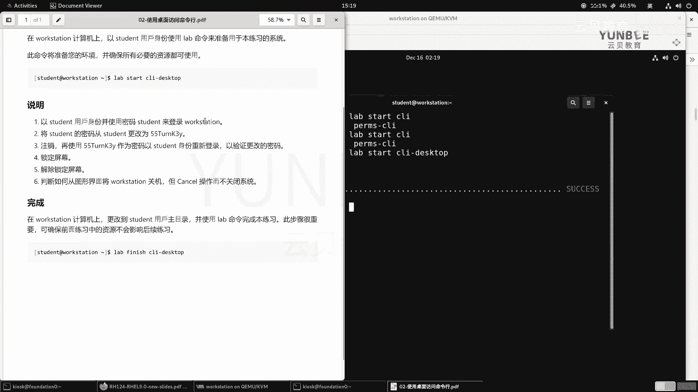

# 零基础入门Linux，红帽认证全套教程！RHCE9认证实战 RH124课程 - P7：02.3 使用桌面访问命令-实验 - 云贝教育 - BV1Ns2gY8EVU

那么接下来呢给大家演示一下呢，如何通过我们的桌面来访问命令堂啊，那这个指导练习呢大家了解一下，不是重点啊啊，主要是带大家呢了解一下我们的这个实验啊。

顺便呢熟悉一下我们的这个课程当中的啊实验是如何去执行命令和这个答题的啊。好，那么我现在呢打开我们的要求题目要求啊。那么指导练习啊，那么首先呢我们需要登录到word station。

然后呢以student的用户的身份呢来执行一个lab的命令来准备我们的练习的系统。那么准备的时候呢，那么我们的命令如下下啊star呃la start cI desktoptop。

那么这这个实验呢是需要用桌面桌面的。因此呢，那么我就打开word station的本地控制台。

啊，然后呢登录我们的账户。

那么成功登录之后呢，那么接着啊接着那么我们来看要求啊，第一步呢以student用户的身份啊，sorry，我这边还没有执行啊，这一次。好，把这个字体呢放大。我们后面会给大家介绍一些快捷键啊。

它可以帮助我们快速执行命令。啊，lab啊lab然后start啊CLI这个里地方是可以用tableable按键的啊，tableable按键啊是能够补出来的。哎，看到没有啊，desktop。没车道。

好，执行完毕了。那么第一步呢要求我们以student用户的身份并使用密码。student来登录word station。那么我们在执行这个脚本之前呢，已经成功的干嘛了呀，成功的登录了啊成功登录了啊。好。

然后第二步呢将student密码呢啊从student用户改为这样的密码。那么就需要我们打开终端。那这个终端呢我们也已经成功的打开了啊，咱们这里呢给大家演示个命令。

叫做PASSWD。啊，回车。那么先输入自己当前的密码作为身份验证。好，接着输入新的密码。那么新的密码呢，那么我们来看一下要求啊。

那么新的密码呢是55大写字母T小写字母URN大写字母key3小写字母Y回车，然后重复重复输入第二遍。

回车，那么我们的密码呢就重新的更新了，然后呢注销啊注销，然后再使用新的密码呢来登录。好，那么我们点击窗口的右上角。

啊，选择啊这个登出。

确定登初。

好，然后呢我们输入啊用户对应的密码。

啊，55啊7。U R N K3 Y。

啊，回车。

啊，已经成功的登录了，说明我们的密码呢是设置没有问题的。那么第四步呢，再干嘛呢？再去锁定屏幕，然后并解锁啊解锁。

啊，锁定屏幕，输入密码啊，55。T U， R N K3Y。好，第六步呢说判断如何从啊这个图形化界面呀将windows关机，但是呢取消操作而不关闭系统。那么点击右上角的系统菜单，选择power off。

点击p off。如果你确定要关机，选择power of，对吧？这里呢啊让我们不要关机，选择conl。

好，最后完成之后呢呃那么在over的计算机上，那么更改到sdent用户的主目录，并使用lab命令完成本练习啊，非常重要啊，那么所以说我们直接打开一个全新的终端就可以了。那打开一个全新的终端。

那么它新的终端它肯定是在哪里呢？在这个用户的加目录里面，那么这里有一个什么符号呀？有一个波浪符啊，波浪符O那么我们来执行一个命令lab。

啊，非历史。啊，fininishCI。G， desk， top。好，成功的执行了。那么我们的实验呢就顺利的完毕了。

