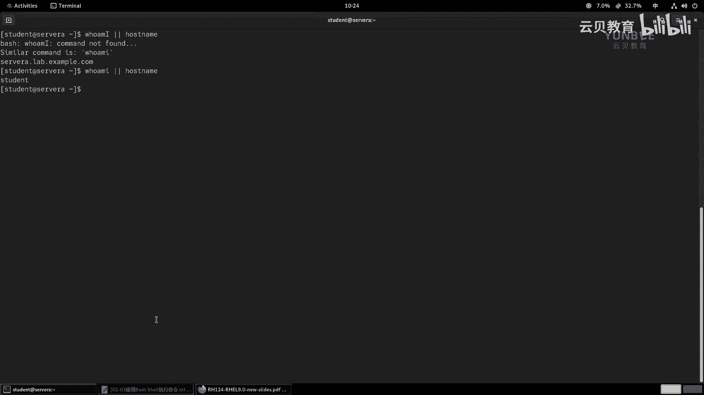
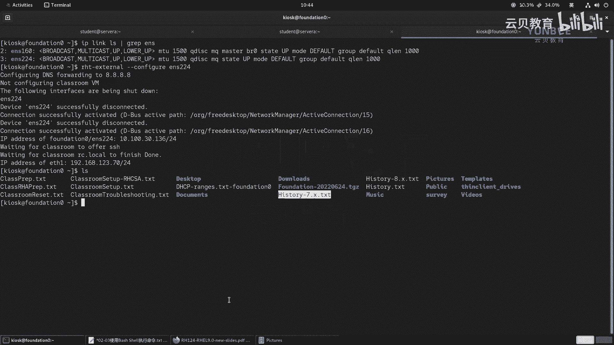
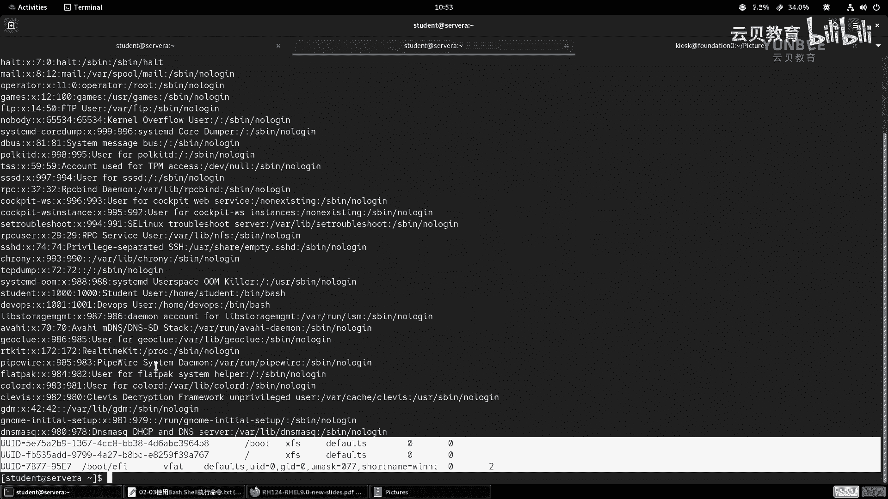
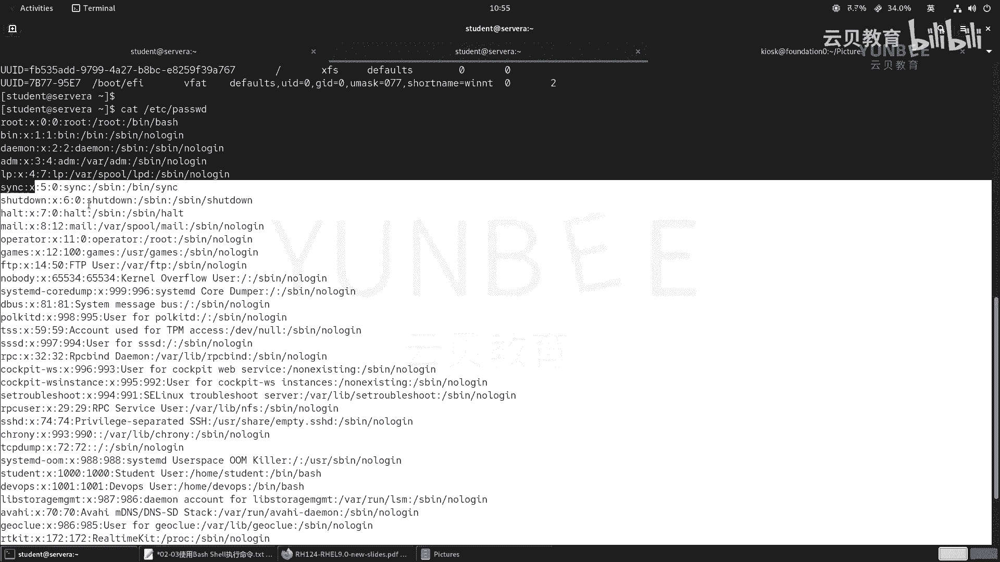
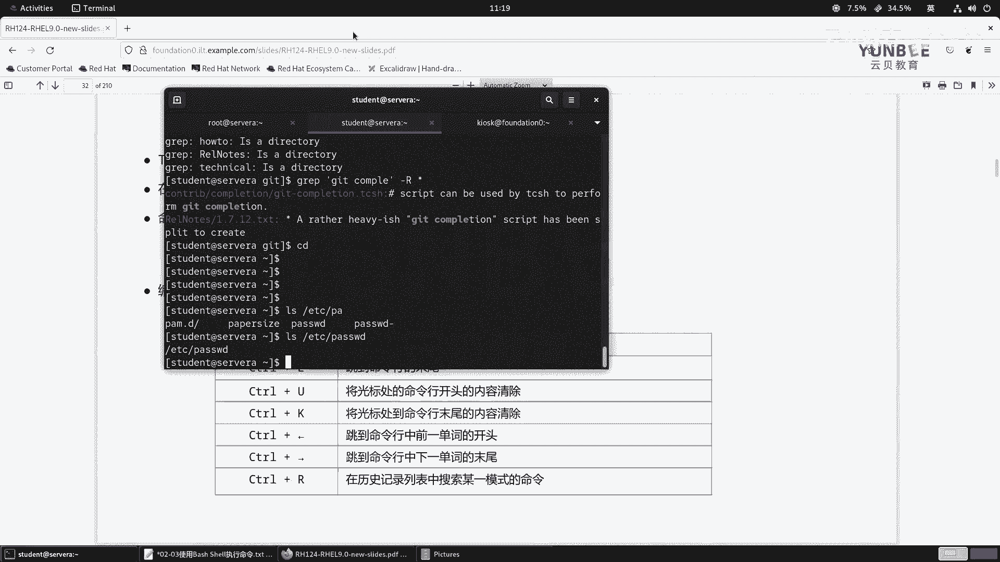

# 零基础入门Linux，红帽认证全套教程！RHCE9认证实战 RH124课程 - P8：02.4 使用Bash Shell执行命令 - 云贝教育 - BV1Ns2gY8EVU

那么接着我们来学习第三节，使用bsh shell来执行命令。那么在前面的内容当中呢，我们已经了解了如何在命令提示符当中呢来输入我们的啊这个相关的命令啊，那么它的组成部分呢是由命令选项和参数啊来组成的。

那么我们一定要注意，那么命令选项参数，它们之间呢是由空格进行隔开的啊，然后呢选项呢，那么我们常见的选项呢一般都是以一个短横线和两个短横线来开头的。好啊，那么接着呢我们来给大家呢演示一些命令啊。

在正式演示命令之前呢，给大家说几种我们常常在命令提示符当中输入命令的方式。

那么现在呢我已经成功的登录到了overtation节点。那么接着呢我呢通过SS命令去登录到我们的sver a节点。好，登录成功之后，那么我在这里呢输入一个命令啊，叫who am I。

那么who am I呢是干什么用的呢？who am I的话呢，它是用于啊那个打印当前登录用户的身份的。OK好，那么接着呢我再执行第二个命令，who am I空格啊，然后加上一个分号啊。

然后呢再整一个叫做hos name。那么你会发现，那么我们在一行当中呢输入两个命令啊，这两个命令呢之间啊是用分号分隔开的。那么它的输出的结果呢，首先输出了啊和who am I一样的内容。

然后呢又输出了house name打印的消息，就是我们的主机名啊，主机名。那么这里的分号呢代表了命令的先后执行顺序。那么等同于我们在终端当中先执行了why my，又执行了ho name。

OK这是效果呢是一样的。好，我把这个地方呢给大家做一个笔记。

啊，做个笔记。那么在哪里呢？在我们的。在我们的这个啊bsh shell当中。当中，那么一般呢一个啊shall啊一个shall。那么。在输入啊命令的时候呢啊一般呢干嘛呀？一般只输一个啊一般。输入一个命令。

那么就类似于我们上面的这种啊，那么如果啊如果那么希望啊如果希望okK。在我们的啊这个shall。的命令提示符。呃，提示啊，我们这样写好了啊，提示符当中呢啊输入多个。OK多个命令。那么可以使用啊封号。啊。

封号。哎，那么就是我们的这样一个符号啊，那么进行分割。啊，进行分割。那么注意啊，那么这里的分号呢仅代表命令的先后顺序啊，那么后面命令成功的啊，是否执行啊，和前面的这个命令执行成功呢没有任何的关系啊。

没有任何的关系OK。好，他仅代表啊呃先后顺序OK。啊，那么等同于。那么拆分执行。哎，那么就下面这效果。那么除此之外呢，我们还有一种情况啊，那么存在逻辑关系的。啊，存在逻辑关系的。

那么第一种呢叫做逻什么叫做这个和逻辑关系，或者说要与逻辑关系都可以啊，叫和吧。和逻辑关系。啊，那么举个例子啊举个例子，比如说那么呃我先清一下我的终端。

比如说呢我在这里执行一个命令啊，执行一个什么命令呢？叫做啊同样还是刚才的这个who am my和housese name。但是呢我这次呢故意把这个who I my的命令啊写错啊，我把这个小写字母I呀。

写成大写字母I啊。然后呢这时候我我中间加一个符号啊，注意是两个and符啊，空格，然后执行一个hot name。那么你会发现啊你会发现，那么这个who am I的这个命令，它提示是不存在的啊，不存在的啊。

不存在的。那么又意味着我们的这个命令执行报错了。那么报错之后呢，那么我们的house name有没有执行呢？并没有执行。ok那么我把它换成一个分号和前面的命令做一个对比。你会发现，那么第二次执行的时候。

那么我们前面的这个错误的命令啊报错了。但是呢第二个house name呢依旧去执行，它不会影响。OK不会去影响。那么要想让我们的house name能够执行，那么前提是什么呀？

前提是我们这个and的符号，前面的命令是能够正常执行的。OK这个呢就是啊逻辑和啊逻辑和。

O。那么总结下来呢，就是。那么它的语法结构就是command一啊，andcom2。那么仅有只有在什么呀？comman的一。啊，成功的执行。啊，那么comment2。才会执行。

那么将来呢我们会遇到一个这样的情况。比如说我们在这个。我们在这个网站上啊去下载一些啊源代码包啊源代码包。那么我们一般呢会将来啊我们会学到之后，那么在这个源代码包里面，我们要想去安装啊，安装的话呢。

那么一般会干嘛呀？一般会先经过编译啊，编译啊，要先经历啊，那么。那么将来啊。那么。如果遇到什么呀啊，从互联网。啊，下载的什么呀？这个。源代码包啊源代码包。那么就必须什么呀？必须。啊，先编译。啊，再安装。

啊，因为你编译之后呢，才能够生成什么可安装的二进制文件啊，那么我们的命令呢一般都是这样来写的，那么就是make啊 and make in store。啊，会我们会啊通过这种写法呢去描述。

那么前面的这个make呢就是用来编译的。那么接着再安装，因为它们之间存在逻辑关系，你只有编译成功了才能安装，对吧？如果没有编译成功，又谈何什么呀安装呢？那所以说我们可以通过这样的一个逻辑关系来描述。

当然了啊在这里只是一种例子啊，那么将来大家在学习编写式要脚本的时候，也可以对一些逻辑性比较强的地方呢使用两个and符。啊，这是第一种。第二种呢代表的是逻辑或关系。好，那么它的结构呢是这个样子的啊。

那么我们举个例子啊，举个例子，那么我们还拿刚才的这个错误的命令啊来举例。那么在执行的时候呢，我中间的地方要加上两个竖线。

啊，两个竖线我们来看一下，那么你会发现啊你会发现那这个结果好像好像啊好像有点类似于我们前面的who am my啊这个封号加上一个house name，对吧？但是呢我们再来看一下啊。

那如果我把前面的这个命令写正确了。你会发现有什么有什么不一样的地方，对吧？那么第二个演示当中，我们的who am I呢是执行成功的。因此呢后面的house name呢就不再执行了。而第一个例子啊。

who am I呢是执行错误的啊，错误的，那么没有执行成功，因此呢它就执行了谁呀？house name命令。那么逻辑和的意思呢，就是说啊那么他们两者之间只会执行几个呀，执行一个啊执行一个指令啊。

OK只会执行一个啊，那么又意味着它的语法结构呢可以总结为什么呀？command一啊，然后两个竖线啊，comman。2啊com2OK注意啊，这中间都是有空格的啊，因为它这个字体这个空格不是很明显啊。

都是有空格的啊。OK好，那么这样的话呢，那么看起来啊看起来呢就是这样一个效果。那么代表的是呃如果。啊，卡曼的什么呀，一执行成功。那么com曼的。2。无再执行。那么反过来，如果comman一未执行成功。

那么卡曼的2执行。OK这是给大家扩展了两个啊两个逻辑的关系啊，逻辑关系呢大家一定要啊一定要注意啊。这个先的内容我们在将来的学习过程当中啊。

我们红帽标准的教材里面是不介绍的那这里呢但是我们要用到啊要用到okK好。

那么这些基本的结构呢，我们了解了。那么接下来呀我们带着大家呢认识一些简单的命令。那么通过这些简单的命令呢来熟悉在linux终端当中如何去实现的啊。

那么首先呢第一个命令呢叫做datedate的话呢是用来显示我们当前的日期和时间的那么单一的来使用这个命令啊，我把这个clear也给大家记下来吧。

比如说啊比如说我们的这个clear。那么清空什么呀？代表的是啊清空。当前什么呀？终端。中的内容。内容ok。啊，那么也可以啊也可以。使用快捷键。啊，ctrol加mL啊，ctrol键加L啊。好。

然后呢第二个命令呢就是什么呢？叫做date。啊，date啊，那么用于。啊，用于打印啊当前系统的时间啊时间。OK好。

那么我们来执行一次啊，看一下效果啊，date啊，date回车。那么执行之后呢，它能够显示出来我们的啊这个周六啊，然后12月16日啊，然后呢这个下午的9点25分啊，那但是呢这个时间要注意了啊。

那么这个时间呢它的时区呢是EST。啊，EST呢是美国的东部时间啊，它的时区走的是美国东部时间啊，你会发现这个时间和我们的放dition上面的这个时间是不一样的哎，不一样的。

你看我们的这个放dition这个时间呢是12月17号啊，然后啊上午的10点26分。啊，那么正好呢将近啊时间呢差了个24小时啊，24小时OK。啊，我们后面会给大家介绍怎么去修改我们的时区啊，修改时区。

那么date命令呢，除了打印我们的这种系统时间之外呢，还可以实现啊这个打印指定的时间格式。那么对于我们的命令而言，一般情况下呢，可以在命令的后面跟上一个啊两个横线，跟上一个单词呢，叫help。

就可以获得想要的帮助内容。

我们来回车执行。好，那么我们。目前呢暂时先使用鼠标的滑轮啊，那么往前移动。啊，就能看到这个啊被屏幕覆盖的内容了。那么daate命令用法usage用法。

OK那么这个用法呢也是我们一般啊看到命令的一个解释说明的一个格式啊。那么首先呢date中括号代表的是option。啊，option。那这里的中括号呢代表的是这个命令的选项部分呢是可以省略不写的。

是可选的，是可选的啊。然后呢，又在这个选项的后面跟上了三个句点，三个句点呢就是省略号，对吧？那么代表的是我们的选项呢，可以有一个也可以有多个选项合并使用啊，可以结合在一起。然后呢。

在这个选项后面又跟了一个什么呀？中括号代表加号form mate，啊，那么formit呢，我们翻译过来呢叫格式，加formit就是加formit加格式，对吧？同样也是可以选择的。那么另外一种用法呢。

就是用data命令跟上一个选项呢，叫杠U杠U的全拼呢叫做杠杠UTC。啊，UTC如果还是不够理解，它还有一个意思呢叫univers。对吧哎就是我们平常所谓的UTC时间啊，后面还有什么呀？

一些标准的这个时间的格式啊，这个月天小时分钟，对吧？世纪年还有后面的啊这个秒述啊这样的格式。那么。那么再往下呢，那么因为他会告诉我们，他说如果你想显示啊这个。你想显示这个时间啊，用提供的格式的话呢。

或者设置这个系统的格式。那么这个意思呢就是告诉我们第一个命令是用来显示指定格式的时间。那么下面的这个呢代表的是来设置我们系统的时间。那设置我们系统时间啊，第一个呢是用来显示的。

第二个呢是用来设置的啊设置的OK然后呢，接着呢再往下呢有一些常见的选项，比如说这里的D代表的是刚刚date啊，用来显示我们指定字符串的时间，而非现在啊，当然了也可以把它理解为是debug啊，debug。

那么。第八个的话呢就是用来解释你这个时间的啊呃，然后注解一些信息出来呃F啊跟上一个什么呀date file啊，那么跟上一个包含有什么呀啊这个日期的一个文件啊啊有些格式啊啊这个格式注意的是FMT啊。

它和前面的formit是不一样的，就是为了让我们区分啊区分啊，各种各样的其他选项啊，各种各样的选选项。一般来说呢我们d命令啊，就是用这个下面的杠S。啊，杠S会用会用的多一点啊。

那么可以根据自己的需要来设定我们的时间啊，时间啊，那么起到临时性的作用啊，临时的更改时间的作用。接着呢formitform呢来控制了我们的输出啊，那么下面呢有一些解释啊，解释我们来看一下。

那么比如说我们找一些常用的，比如说这里的小写字母D，百分号D，代表的是我们的天啊，每个月里面的第几天啊，然后呢这个再往下，比如说这里的大H，大H呢代表的是24小时进制的小时。

大写字母I呢代表的是12小时进制的时间啊，好，那么我们再打开一个新的标签页啊，然后呢先登录到我们的word这个word station节点。再登录到我们的sry。啊。

sorry那么我们在课堂上啊给大家演示一些命令的时候呢，都是在word stations A和serv B上来进行的啊，所以说大家呢一定要注意我们的主机名啊，主机名啊。那么这个时候呢。

我们执行一个啊date啊，那么它的语法结构呢是什么呀？是加啊加formit，那么就写一个加号。啊，那么这个formit呢，我们刚才看到了这里的信息有非常多。我们首先呀尝试使用这个大百分号H来感受一下。

哎，那么它就显示了我们的时间呢是21点。那么刚才在d当中能够看到的是下午的9点钟，那么就是21点啊，21点OK好，那么同时呢下面还有其他的各种各样的格式。比如说我们啊年份当中的第几天对吧？

大写小写字母J，那么我们也可以使用。啊，第350天啊350天okK。好，然后呢，接着还有什么呀？这个月份啊这个分钟啊分钟这样的格式。那么也就意味着我们还可以干嘛呀进行组合呀？啊。

比如说我想看一看今天我我想按照我的格式输年月日小时分钟啊，那么怎么输出呢？年，那我们去找一找啊，年份。年份的话呢。在这里有一个大写字母Y啊，代表是年啊，小写字母Y呢代表的是我们年份的后两位。

比如说今年是2023年，那么小写字母Y呢就是23啊，那么我们用大写字母Y好了啊，大写字母Y啊，可以看一下效果，年份，那么月份啊，我们加个短的大使好了，然后呢，百分号月份月份呢是多少呢？

月份前面呢是小写的M。那天呢今天是几月几日呢？那么我们再找到日啊，日。那么日的话呢，那么我们往前找这里有一个小写字母D啊，小写字母D代表的是。每个月的第几天啊，D。好，那么年月日就打印成功了。

那么接着呢我们再打印啊小时和分钟。小时刚才是H啊，然后分钟，那么是大M。哎，你会发现它不再识别后面的内容了，为什么呢？啊？因为呀我们中间加了空格啊，空格。那么在前面的地方呢给大家啊介绍给我说了。

那么空格呀在我们的 shell要当中具有特殊的含义，用于分割啊。所以说我们要把后面的部分呀给它包括进来，用一个双引号全部包括在一起，然后前面统一的使用加号呢来解释你的摆分号所代表的含义。哎。

就能够获得我们想要内容。但是这个格式好像看起来和我们常常表达的时间不太一样是吧？把后面的这个换成冒号，哎，舒服一点了吧，舒服一点了啊。OK那么这样的话呢，我们的这个。

不同的格式就能够获得我们想要的内容啊小要内容。所以说大家在使用的时候啊，一定要注意这些特定的用法。

啊，那么date刚刚help来获得什么呀，获取帮助。那这里呢是一些例子啊一些例子OK那么在这地方啊，我再特地强调一次。那么在我们的besh啊 shell当中。其实不仅仅是拜 shell效而。

在其他的食效里面其实也是一样的啊也是一样的。那么空格。啊，空格符啊空格啊代表有啊代表的有特殊的含义。啊，那么代表了一种什么呀？不同的啊不同的元素之间的什么呀风格。那风格，所以说一定要注意啊。

哎这个这个空格的作用好。接着我们往下继续看第二个命令，那叫passWDpass WD呢其实就是英文单词pass word的缩写啊。那么这个命令呢在我们当前的学习内容当中啊。

那么是可以用来更改自己的密码的啊，更改自己的密码的okK那么dollar。他是WD那么这个命令啊。这个命令。在单独使用的时候。单独使用的意思呢就是说不使用任何的选项啊和参数。啊参数。

那么用于更新啊这个自己的密码。啊，自己的密码。那么在更新密码的时候呢，要注意更新密码时。啊，要先这干嘛呀？要先经历。要先啊这个认证啊，认证的作用呢就是证明。啊，修改密码用户的这个人。是用户自己啊。啊。

是用户自己，然后呢然后输入新的密码。那么新的密码呢？必须啊符合。啊，我们linux当中的。密码复杂性要求。那么又意味着至少什么呀，8位字符。啊，8位字符。那么这个8位字符呢可以啊使用啊大写字母。

小写字母。啊，然后呢这个下划线。啊，下划线和么呀，其他的特殊字符。啊，他说字符OK好，那么现在呢我们来执行一次啊，执行一次。那么现在呢我们是谁呢？

我们执行一个who am I看一下自己的身份啊那有的人说了，哎老师啊这边已经能看到的用户名了，不需要执行了。那么的确是这样的。但是呢在啊其他的linux方向盘当中。

或者说我们的系统呢，它的一些配置呢被发生了改变。那么这个情况下，我们有时候是看不到前面的信息的，只有一个什么呀？只有一个这个道德复也是有可能会遇到的。那么你想判断到底是谁登录系统。

那么你可以执行一个命令，就知道哎，我当前是什么身份啊，什么身份。好，那么接着呢我们来执行1个PASSWD回车。那么首先啊那么提提示我们啊，你看更改用户的密码，谁呀密码呀，是sdent用户的密码啊。

然后当前的密码是多少输入做个身份验证student新的密码必须要符啊这个符合密码的要求啊，那么我们怎么生成一个呢？啊，我们可以借助互联网上一些工具啊，比如说啊我利用这个。

one password这样的一个平台。啊，网络出现了问题，对吧？出现问题的话呢，那么这个时候怎么办啊？那么如果你之前设置过啊网络发现啊出现了类似于我的问题，那大家呢可以啊这个重新的。

啊，执行一下什么呢？之前设置网络的相关的命令啊，那么就是IHT杠external杠杠长figer。啊，ES224再执行一次啊，让它修复一下。

啊，成功了。好，那么这边啊我们再刷新一下页面，看看是否能够访问。哎，可以了啊，那么我们输一个关键词来搜索一下啊，onepa w啊ORD one pass word。OK啊。

这个就是啊one password点com。啊，往下找一找啊，它有一个自动生成密码的一个工具啊，当然也有其他的啊，大家可以自己选择。你看这里有个密码生成器。

我们这样可以保证我们的密码绝对是唯一的啊，你看可以勾选数字和符号以及密码长度，我们就来个短一点的吧啊，10位好吧啊，11位就这样吧，复制啊，复制。好。

那么接着啊我们在我们的终端里面回到我们的ser a啊，s a我们把刚才的密码呀粘贴进来回车然粘贴。

那就能够重新的更新我们的密码啊，更新我们的密码啊，这就是我们的一个用法啊一个用法啊。

呃，那么因为我们后面的话呢，这个密码我们肯定还要在。如果你记不住，肯定不方便的。所以说呢我们这里啊那么还原。密码。喂喂谁呀？student，那么怎么还原呢？这里的给他家敲个命令啊，敲个命令。但是呢。

大家不用刻意的去记啊，因为我们后面会给大家介绍。哦，sorry，这个密码是刚刚的。刚刚的这个密码。A在2。啊，成功了。

啊，那么在提示。输入密码时。啊，那么输入什么呀啊，刚刚啊这个设置的密码。啊，作为凭证。啊，就可以了啊，这个命令我们暂时不用纠结它到底是干嘛的啊。呃，然后这个我们后面在学习到本地用户的管理的时候呢。

会给大家详细的介绍啊。现在呢啊我们只是为了后面的学习方便啊。来来更改的啊更改的。好。好，这是我们呃的1个PASSWD啊。接着呢我们来看一下我们的fa啊，fa命令。那么fa命令的话呢是用来干嘛的呢？

是用来显示我们命令的什么呀，类文件的类型啊，不是命令啊，是文件的类型ok。啊，费用。啊，是用于。显示文件的类型。啊，那有的人说了，哎，我们在windows里面就不需要啊。你举个例子啊举个例子。

我现在呢打开我的图形化界面找到一个fis，在fis里面啊，这里面有很多的文件，举个例子，比如说这里一个history点TST。那么我们肉眼呢一眼就能看得出来，这是一个什么呀？TST格式的文本文件。

对不对？那么如果在pictures里面呢，那么这里面呢有PNG格式的图片。

啊，那么一目了然啊一目了然。那么我们为什么啊那么为什么非要啊使用命令呢？那么哪怕没有退化界面，对吧？比如说我在房地证上面走个L，我们马上要学到命令，也可以输出啊？你看这这个文本文件。

那么为什么要学习这个fill呢？那么注意了啊，那么在我们的linux当中。

那么一切接文件。啊，一切件文件啊，什么意思呢？就是说我们的啊内核啊内核，那么在处理。啊，处理数据的时候呢，那么这些存放数据的文件呢都被啊。处再再进行什么呀？内核啊，这样说吧，将。啊。

这个系统中所有的所有资源吧啊这样理说比较合理一点啊，所有的资源都抽象成了什么呀？啊，抽象成了这个文件来进行管理的。那么举个例子啊，举个例子，比如说我们刚才看到的这种什么TST呀，这种文件。

包括这种没有带后缀的啊，没有带后缀的。没有带后缀的这种文件。比如说这这个文件啊，没有带后缀，对吧？啊，然后还有谁呢？你像这种啊这种那么我们就把它称之为是常规文件。可用于什么呀？编辑管理的。

那么这种我们称为是常规文件。那么你像我们用来存放文件的目录，比如说这里的啊documents啊，desktop啊，这些呢一看在windows里面就叫什么呀？文件夹是吧？哎，文件夹。那么目录呢。

我们linux里面叫目录啊，ok目录啊，windows当中。那么称之为什么呀？叫文件夹啊文件夹OK目录的话呢叫什么呀？叫目录文件I目录文件。那么将来我们还会用到什么呀？磁盘啊，存放数据的磁盘。

那么磁盘叫什么呀？叫磁盘文件。啊，磁盘文件哎，等等等等吧啊，就不再一一举例了，非常非常多。所以一切进文件。那一切进文件呢，那么又意味着我们linkux当中啊，linkux当中啊不以什么呀？文件的后缀。

啊，作为区分。文件的类型。但是呢但是啊那些常见的文件啊依旧啊保留了啊保留了啊文件名的什么呀，扩展名吧，后缀我我这个后缀的意思呢就是扩展名啊。啊，扩展名哎，你有保留文件的扩展名。那么目的是干嘛的呢？

目的是为了什么呀？目的是。是为了什么呀？让人啊人类啊便于啊这个识别它主要是为了我们人啊为为我们的人O对于我们的linux而言，你加不加后缀，它能够识别出来都能够识别出来啊哎，那么我们来感受一下，好吧。

感受一下，怎么感受呢？我们回到我们的sry a啊，回到我们的sry a那么sorry a里面我们先走一个命令啊，这个命令呢叫LS其实就是list啊，列出列举，那么列举的时候呢，你看这里面有非常多的啊。

这个蓝色的它干嘛的呀？fell。

DOWNLOADS那么告诉我们它是一个什么呀，目录啊目录。OK然后呢，我再去一个地方，比如说我来到啊DV下面啊，你看这里面有很多个文件，哎，有没有发现遇到很熟悉的关键词啊，TTY1哎。

我们来fill一下TTY1。告诉我们什么呀？是一个啊特殊的字符啊文件啊，那终端嘛终端TDY嘛干嘛用的呀？我们敲级命令的是吧？那这个东西是不是连接到了我们的硬盘上面那硬盘就是用来输入字符的吧。哎。

说特殊的字符文件啊，特殊字符文件啊，然后呢你像我们的这个啊这个这个在哪里呢？在在我的定零上面啊，房定零上面，然后我这边做一个操作啊。我找找我的图片。图片去哪里啦啊，在这里你看这里呢有两张图片啊。

我把这个前面的这个啊，我把这个后缀呀，我给它改一改，好吧，重命名，我把这个后缀呀给它取消掉。哎，取消掉之后呢，你会发现我们的这个呃这个这个文件管理器呢依旧能够看得到你的缩略图啊。然后呢我们啊在这里啊。

啊，然后看一下，你看后面呢是有后缀的，前面这个没有后缀了。我用fill呢去判断一下we where啊 station的 editor的这个你会发现它能够告诉我们它是一个什么呀？PNG的图像数据。啊。

这是它的分辨率啊，它色彩呢是8位的啊RGBA你看立马就能够识别出来。所以说就应了我们刚刚的那一句话啊，就是我们linkux里面它不以文件的扩展名啊作为区分文件类型。

OK那如果我们想获得这个文件的啊更加详细的信息呢，我们还可以在前面加上一个杠I啊，杠I比如说TTY1。

啊，告诉我们这个设备字符是什么呀？是二进制的二进制的。好，我们我们这个清一下屏幕啊，回到我们的啊加目录啊CD波浪号啊啊，然后呢，这个这个我们这里没有文件啊，没有文件的话呢。

我们看一个别的啊fa哦杠IETC下的PASSWD这是个文件啊，这是个文件。哎，那么我们来看一下，你看我没有加I和加I有什么区别。我们来对比一下。那么没有加I呢，告诉我们是一个阿斯塔玛的文本，对吧？

然后呢，加了个I之后呢，告诉我们是一个什么呀，告诉你是个文本还是个什么呀plan啊，普通文本，对吧？字符集呢是美国的阿斯塔玛文件。啊，就能够识别出来了啊，就能够识别出来了。就做这么多笔记好了。好好。

这是给大家举个例子啊，那么该。

啊，杠I呢是用于啊显示什么呢？显示我们的这个呃文件的MIME的信息。那么什么是MIME呢？嗯，MME的话呢，它的英文全拼啊，解释过来呢叫做啊描述啊消息的内容。啊，按类型的一个标准。O它是一个标准啊。

OK那么一般用于什么呀？一般用于这个。呃，用于表示我们的这个文件呀，或者要文档啊啊文件对吧？文档。啊，这个还有这个字节流的。啊的一些性质性质。格式啊和格式。啊，这是它的一个作用啊作用。好。

这是我们的fi啊fa这样一个命令。好，接下来我们来看呃，我们用于查看文件的一些命令啊。那么查看文件的话呢，我们首先会用到这里的ca CAT啊，ca CAT啊。

好，那么同样我们打开我们的终端。比如说刚才ETC的pa斯WD，它是一个阿斯特玛文件，那么就用cat呢能够查看。啊，CAT啊ATCPASSWD回车，那么就能看到里面的内容。啊，cat就能看到里面内容啊。

OK当然了我们也可以看多个文件啊啊，比如说caETC下的PASWD啊，再看1个ETC下的啊FS table。OK你会发现比刚才的信息呢多了一点啊，多了这个内容比如我选中的位位置啊。

选中的位置呢就是我们第二个文件里面的内容。那第二个文件内容OK。

开。cate跟上文件啊，文件一啊，然后或者还有一种用法呢，就是ca什么呀，fill一。分2对吧？来查看一个用于查看什么呀，一个或多个这种常规的文件。啊，常规的文件啊，但是呢这个命令呢在输出的时候呀。

它如果文件比较多啊，然后可能就是。信息量比较多啊，呃可能不太舒服，对吧？不太舒服。因此呢我们可以使用less和more命令。啊，less和more这两个命令。那么你像这里的less的话呢，用的比较多啊。

用的比较多啊，less和more命令less。和什么呀，more命令。它这个命令呢我们分称之为分页命令。啊，分页命令啊，那么作用呢就是将什么呀？将我们的比较长的文件呀啊按照什么呀啊。

按照你他把你的一个屏幕呢当做一个页啊，显示多页。OK那么我们举例子啊，比如说。

我们刚才的那个什么呀？我们这个。ATC下的。啊，这个这个passWD是吧，你看那么信息量呢非常的多，我们的屏幕装不下，其实前面还有你看前面还有那你说了，那我用鼠标是不是也挺舒服的呀。

但是如果是一个字符界面的话啊，就纯文本的界面，你是没有办法用鼠标的那你看我们举个例子啊，比如说我们这里呢打开我们的servver哎。

对吧sorry然后呢我这边啊登录一下student。Stilldent。啊，cat AC下的PASSWD那这个时候呢，你呃这个还好，对吧？信息量正好整个屏幕啊包裹起来了是吧？哎，那么我们能看得完啊。

然后我再找一个长一点的。找一个长一点的啊。嗯，找一个谁呢？我换一个身份吧啊换个身份让大家看一下效果啊，修 do杠I。啊，Stdent。我去看一个东西啊。

cat it啊这个蛙下面的log messages，这是个日志。你看这个信息量就非常多了。你看。现在命令已经执行完了，但是它输出呢一直在输出，一直在输出。哎，输出完毕了，你说我想往前看一看鼠标滑轮。啊。

转的都冒烟了也也也不起作用，对吧？那么这个时候呢，我们就需要用到什么了呀，用到啊刚刚说的这两个命令了啊，那鼠标在这里面啊可以直接移到移出来的啊。如果移不出来呢，你就使用alt键加ctrl啊。

好，那么呃同样我这边为了演示啊啊，我把那个文件复制过来一份。好吧，这个复制命令啊我们还没学到啊，log下的message到哪里呢？到江目路下面。啊，权限不足是吧啊，我这边。嗯。啊，想给大家演示一下。

那我这样子吧嗯，因为很多命令还没学到啊，还没学到。啊，我们就用就用刚我我我哎这样子，我把这个窗口给它稍微的缩放小一点，好吧，这样的话呢就能够解决啊这个问题了啊。好，我把窗口呢移动到右边啊。

那么我们来看一下啊，lessETC下的PASSWD哎，这个信息量就非常少了。那么这个时候哎你会发现我能够移动它的输出的结果是不是哎就能够方便了啊，less跟上一个文件啊，跟上一个文件啊。

那么在这个界面情况下呢，我们的导航按键有哪些呢？啊，导航按键好，我把这个屏幕往上移移。那么导航按键的话呢，如果使用空格。啊，空格那么代表的是啊向下。啊，滚动。啊，这个一页一页这一页就是一个屏幕了啊一页。

你的终端那个窗口的大小啊。呃，然后我们也可以使用上下键啊，上下键好吧。那上键OK。好，那么上件呢代表的是向上。滚动什么呀？一行。啊，那么方向键的下键呢。哎，这个下界啊向什么呀，下滚动一行。啊。

向下滚动一行，这是最常用的啊最常用的几个按键。那如果呢你想搜索里面内容呢，可以使用一个斜线，跟上你的关键词或者字符串。哎，搜索什么呀，字符串。那么在搜索的时候呢，我们一般会用N代表的是向下搜索。啊。

大写字母A呢代表的是向上搜索。OK如果你想不看了啊，想退出，那么或者不想搜索了Q啊退出。啊，这是我们比较常用的几个啊，那么和这个命令类似的呢？还有谁呢？还有这个more这个命令。啊。

more这个命令呢字面意思更多嘛啊更多。那所以说呢这个命令在去查看的时候呢，我们呃控制起来可能没有less那么灵活啊。一般来说呢，我们就是往下往下去往下去看那你想往回看呢，怎么办呀？啊，比如说往下看。

哎，太多了，摁一下比如说我想往回看，那按下ctrl B。啊，可以往回看啊，back啊，ctrl B back up啊啊back返回啊。那么第二个命令呢就是。我们的more meaning。

我比较喜欢less啊，因为less灵活度更高。more啊，那么它的导航按键啊比较少。啊，比如说我们的这个空格。代表的是向下。啊，这个翻屏吧，直接用翻屏好吧，这字少一点啊。好，翻屏OK。啊。

然后呢接着呢我们可以使用这个control键。啊，加什么呀B啊。么向上。啊，三瓶。啊，向上分屏OQ退出。啊，主要是这样的啊主要这样的。啊，你说我用方向键的下键可不可以啊，也是可以的。啊。

一般来说呢往下呢一次呢是移啊移动一行啊，用一行。好，这是我们最常用的几个按键给大家做了一个介绍。呃，接着呢下面hand和tail啊，hand呢我们翻译过来呢叫头，对吧？tail呢是尾巴啊，尾巴。

那么那在这里怎么去理解呢？那么hand呢是用来查看文本的前几行啊，那么tail呢代表的是看文件的末尾几行啊，来这样来理解就容易方便了啊。hand啊啊用于什么呀？用于查看文件的前几行。OK那么。

tailll啊是用于查看文件的末尾几行。那么在使用的时候呢，我们一般的用法呢就是。啊，hand杠N啊，跟上一个数字。啊，跟上我们的文件啊，那么代表的是查看几行啊。如果没有使用杠N啊，就默认呢是几行呀。

是十行啊，是十行。okK我们来感受一下。handand。EDC啊PASSWD。那么来数一数吧，12345678910行啊，那如果我跟上一个杠N，比如说呢我只想看两行。啊，只有两行啊只有两行。

而tail的话呢也是一样的啊。tail呢呃用法呢是一样的啊，用法是一样的。OK那么查看。多少行啊多少行是一样的。那这个就不再举例了。但是呢它还有一个选项呢，就是谁呢？杠F杠F呢就是follow。啊。

follow那么你可以理解为是动态的显示而跟踪吧。啊，跟踪。跟踪啊这个文件啊几腰尾。新增加的内容啊新增加的内容。那么这个用法一般我们后期呀会用来监控我们的日志，监控我们的日志啊，然后呃同样我这边。

啊，我先这个地方要想看着舒服啊。呃，举个小例子吧，我我先用一个特权的身份啊来指行一次啊，太要杠F杠N0Y下面的log messages。啊，然后输入一个身份和验证，现在没有消息，对吧？然后呢，我这边呀。

干嘛啊，我这边组个齐全好吧，齐全。好，执行完毕之后，我们再看一看这边有没有消息。啊，这边这个消息和刚才的没有关系啊啊没有关系。好，然后。嗯，我们换一个好吧，我换一个。

让他看一个直接和这个认证相关的啊认证相关的啊。然后这边退出啊，再来一次。啊，立马就上来了，你有没有发现这里多了两条消息？啊，多来条消息啊，监控啊，监控啊。

这个我们在后期的学习过程当中啊会用到啊会用到okK。

好，那么最后一个命令呢是什么呢？是WC。那WCWC呢可以用来啊打印我们文件当中的行字符啊这样的一个信息。WC。啊，用于什么呀？用于统计啊文件中的。航。啊，然后呢字啊字就是单词了啊，还有字符啊，字符啊。

我们来执行一个。

啊，刚才的这个命令呢，我发送了一个conttrol键加C来终止它的输出啊，ctrorl加C。好，然后我接着呢输1个WC啊，ETC下的什么呀啊，ETC下的PASSWD。那么在这个文件当中啊，一共40行。

96个字。啊，那就是就是96个单词啊，2275个字符。当然了，我们也可以单独的去查看它的行加个L。单独的去查看它的字啊，就单词那样W。啊，或者是看它字符数量啊，字符数量那就是C。啊，这个命令啊。

我们其实用的比较少啊，很少很少用的啊。

这个呢是只打印什么呀？只要。只要我们的行数啊行数。好，然后呢，这个呢是打印字数。那么下面呢这个是打印字符数。啊，都是英文的啊，这是一个字符数都是按英文的用吧。那如果用的不是英文，比如中文一定要注意了。

中文里面的话一个汉字占用了两个字符。好。呃，这是我们给大家说了一些最常见的基本命令。好，那么为了提高我们的命令的执行效率啊，我们还要学习一下啊，比如说如何使用tableable键进行补齐啊。

那么table键补齐的功能呢是从real7就开始了那real7呢就增加了的啊。OK那么我们。

我们要知道的是啊，对于这个补齐的功能啊，是来源于我们的系统当中有一个软件包。叫做看呃b completion来提供的啊，是由他来提供的。所以说如果发现你的系统啊不支持table的补习。

啊，有这个谁呀？有这个包来提供啊，如果你发现不支持，那么就用这个啊你的这个系统当中的包管理工具，把这个软件包安装一下就可以了啊，安装一下就可以了啊，来提供的。那么提供之后，现在很多的啊很多的这个。

工具呢都支持补齐啊补齐okK因为我们的这个环境啊是内部是没有没有订阅啊，这块是没有走的。啊软件呢也没有些其他的啊。比如说我们的什么呀，你像你像举个例子啊。比如说我们的这个将来啊学习的云原声啊。

什么get命令的时候呀，其实它都有一些什么呀，有一些这个补齐的一些指令。呃，get的我们来看一下吧，说不定也有啊，我这边去装一个软件包啊啊软件包的安装呢，大家不用去刻意的去理解。现在啊。

那么大家只看就行了啊，我去装一个。

安装一个啊，我记得这个get命令当中也是有的，我去看一下啊。我们我们这些高级命令，咱们暂时先不讲啊，咱们将来会给大家学到的。应该是bsh之类的。没有哎。Man。Gs。所以说。B室杠COM没有。没有的话。

应该在个配置文件里面啊。嗯，这里面我记得有一个帮助。莫非是这个。对呀。嗯，好像。一时半会儿还是找不到的啊找不到的啊。好，那么我们去找一个什么呢嗯。啊，这个我们后面遇到了再说吧啊。

然后现在呢一时半会儿想不起来了啊，这个找不到位置了。啊，找不到例子了。但是呢一般来说啊一般来说呢，它的补齐的命令啊，它的语法都是命令跟上一个completion之类的。我去搜一下啊。嗯。

比如说get COMPLE看看有没有关键词啊。哦，有了，你看呃这里面这个地方哦，这个是个脚本啊，它有一个这样的功能啊。

呃，没事，这个地方我们这样说吧，应看我举个咱们做一个知识点的一个补充啊，做一个补充来说的啊，就是说一般我们将来啊我们可能遇到的一些命令，可能会看到一个这样消息，举个例子吧，我找一个熟悉的命令。那么比如。

某个啊这个命令。啊，没有补齐啊，没有注册吧，注册这个bashCOMPLETION他没有不是。啊，他没有不注释，那么这个时候怎么办？我们一般会有一个这样的命令啊，叫做什么呢？叫做。

我们一般会走一个这样的命令啊，就是。比如说举个例子啊，比如说这个cober cTL，我们将来会用到的有completion。我想想啊这个命令。

我记得就是co cTL completionCOMPLETION啊bsh那他们就会生成什么呀？生成一个啊bsh completion的一个信息。然后我们只需要把它干嘛呀存放在。

存放在我们的ETC下的一个bashcomp的目录里面就可以了。

哎，比如说这里面起个库包CTL。啊，哎就会就会生成这样的一个内容啊，生成内容。呃，这个地方我记得是这样来写的啊，这样来写的。我们网上搜一下吧啊，搜一下。哦，这个刷新一下。

他这个输出有呃问题大概是因为网站和我们的浏览器的兼容性的问题。好，出来了啊，我们来看一下啊，看一下。有没有？哎，这里来了，你看它这里面有一个啊，你看呃那么可以给他做一个配置。你看bsh里面的。

你看它这里面有命令，你看啊哎这里面有用户的啊，找系统的吧。你看系统的话，那就是走个coer cTL completion batch那后面这个命令的意思呢和我这里的笔记里的意思呢是一样的啊是一样的。啊。

跟上把把这个输出的结果呢存放在了ETC batchch completion点D的coCTL当中了。啊，就起到一个这样作用啊，我这个命令是没问题的啊，没问题的。好。啊。

这是给大家啊就是说了一个题外的话啊，题外的话啊就是它补齐的。如果你的系统发现不支持，你可以安装这个包。因为我们是bsh啊shall嘛，对吧？那么该如何去使用我们的table补齐呢？

那么我们大家一定在学习的时候呀，要善于使用我们的。

这个呃table按键的一个补齐，为什么呢？因为这个工具呢可以大幅度降低我们人为出错的命令啊，出错命令的一个情况。举个例子。就举个例子，我们我们这个课堂上给大家说的一个设置环境，哎，有没有印象，对吧？

那么第一次用的时候呢，总是有人会敲错，那么怎么办呀？IHT。那你摁table键摁一次，发现它多了一个横线，看到没有？再摁一次呢。但是它就会把所有匹配RHT杠开头的命令。打印出来了。

那么在这里面你可以看一看是不是有一个。VMCTL对吧？那我们说一个VMC你看table就能补齐。啊，这是对我们来说是非常有意义的。OK如果一次不行，就摁两次啊，就这么用啊，就这么来用啊。

不仅可以补全命令，还可以补全我们的文件，比如说我想看一看这个ETC下的PA开头的文件有哪些table一次没反应，再摁一次列出来了。你看PA开头的有PM点D呀啊，这个pe sizeize呀。

passWD呀，还有pass w杠啊，对吧？哎我想看的是谁呀？这个文件呀，哎就可以了。回车就能看到。OK这就是它的用法啊，同志们啊，命令选项有些选项也是可以补齐的啊。有些命令它有什么选项。

你不知道也是可以补齐的啊。比如说我们的这个user将来会学到user add，我们找一个猛一点的吧。啊，我这边左边这个现在是root了，对吧？啊，走一个猛一点的，你看feM啊，两个横线啊table啊。

yes你看所有的选项呢都列出来了，都列出来了啊，那这些我们都不用去刻意去记了，那因为为什么不用记呀，你table就出来了呀，你记它干嘛对不对？哎，记它干嘛呀？

所以说呢我们大家一定要善于使用tableable按键啊，善于使用tableable按键好，这是第一个啊，好，第二个呢就是如何在另一行上继续长命令。

那么这个是什么意思呢？举个例子，比如说有的时候呀我们的终端对吧？可能大小呀，不会不会像我们的图化界面一样这样方便的去调整，对吧？哎，比如说我们的这个。

我们的th A啊，我们又拿来s A了啊，它的本地空台啊本地控台啊，那么我在敲集一些命令的时候啊，看好了啊，比如说这个我想让我的输出呀更加的错落有致。哎，我可以走举个例子啊。

比如说我输一个hand啊hand杠N，我想看三行谁呀？有好几个文件，哎，我加个看好了啊，这个命令到最后面空格反斜杠回车啊，这时候呢会多一个大于号，然后呢，我们可以干嘛呀，继续输入我们想要输入的内容。

那，举个例子啊举个例子，我们再输一个文件啊啊usus share，你看命令是不是跳的很快，就是因为我干嘛了呀？我我我这个啊执行了tableable按键啊，空格之后返斜杠回车啊。

USR shareDICT啊，linuxworth回车。那在这里面呢，我执行了命令，用到了两个技巧，一个呢是tableable按键的补齐，一个呢是啊这个换行啊，反斜杠啊，反斜杠OK啊，这个结果可能在。

那个字符界面不容易记笔记啊，我把它再这一次hand杠N3反斜杠啊，这个user。share DICT words啊，番斜杠啊，这个user share啊啊字典对吧？linux words啊回车。啊。

回车就能执行了啊，这样呢就比较舒服了啊，就是自动换行，让它换行啊。

这样呢调理呢更加的清晰啊。长命令哎长命令啊，这是个举个例子啊，反斜杠啊反斜杠。

好，接着我们再说一个非常重要的功能啊，叫做history啊，命令历史记录。

okK啊，那么history啊这个是用到一个命令叫。显示。啊，显示啊命令的历史记录。啊，那么就是用的是history。

啊，黑色的这个命令啊，那么我们来执行一次。回车，那么就能够打印出来我们当前绘画的历史记录。啊，历史记录OK那么这历史记录里面我该如何的去呃利用呢？比如说我想执行一下这个。四2行的命令。啊。

我想执行1个hand杠N2ETC passWD我没有必要再去敲一遍命令了，我只需要只出一个感叹号。编号几啊？42。输入1个42回车就帮助我去执行了。那么所以说呢我们就可以使用什么呀？

感叹号跟上历史记录的编号。

啊，然后呢去干嘛呀，重复执行。历史记录。对应。编号的。一个命令啊，就能执行完毕。OK好，接着呢还有一种用法呢就是感叹号。跟上一个关键词。也是可以的。

举个例子。好，举个例子。好，clear一下啊。好，history。比如说我想去执行一个执行一个这个什么呀，执行一个这个这个这个WC的命令，我出一个干叹号WC。啊，那么WC有几个呀，你看48行有一个吧。

47行有一个，46行呢有一个，45行也有一个。我们来执行看一看肖博，他执行的是我们哪一个呀？WC杠C，那么就意味着。

history命令当中，感叹号跟上关键词会重复执行什么呀？重复执行历史记录中什么呀？这个最近一次执行的命令。啊，那肯定是要关键词要匹配，对吧啊。啊，关键词去匹配，哎才可以。那才可以啊。

这是history的用法。那么。

那么这样的话呢，不知道大家有没有考虑到一个问题，那安全性怎么办呀？安全性怎么办呀？是不是？那你能看到历史记录。比如说我在啊前面的啊命令当中啊，哎我你看第21行，我干嘛了呀？我给sdent用户设置了密码。

那我一看历史记录，就不把不是把这个密码给暴露了吗？啊，怎么办？OK那么这个时候呢，我们去看一个文件啊。那么cat命令啊，less命令的话呢，它在查看一个文件的时候呀。语法是没有高亮的，看着不舒服。

我们可以换成谁呀？V。哎view啊view啊view我们后面在学VI的时候呢，会给大家再详细介绍啊，加上一个扩展吧。

啊，VO命令啊，相当于啊VI和VM的只读模式。啊，那么这个命令暂时大家不要去学习，好吧，因为用会用到一些VI的用法啊，我这里主要是让大家看一看效果啊，去搜一个关键词呢叫做。

IHhi I his。主要让大家看这个内容比较方便一点啊。那么5十行到54行，我给大家解释一下什么意思啊，50行到54行。那么lesss的话呢，也能看到啊，但是搜一下。啊，也能看到对吧？

但是那么看起来没有刚才的那么舒服，是吧？啊一样的啊，那它是一个条件判断语句啊，它会看一看我们用户的环境变量当中的一个变量呢叫haist呃呃haist control。

如果它的值呢是ignore space的话呢，那么就会使我们的这个ignore，它就会导出一个值啊，bos这个bos代表的是ignore space和ignore depths啊。两个意思。

那么就意味着我们先理解一下什么是ignore space。ignore space呢就是忽略空格的历史命令。啊，就这个命令我的history，你在使用的时候呢，我不去记录。OK好。

还有一个呢叫做ignor dump。那么什么意思呢？代表的是。如果你在执行命令的时候呢，重复执行了多个命令一模一样。那么我的历史记录里面呢，只保留一份只保留一份啊，你多余的五步记录重复的忽略掉。

所以说呢这个地方呢就可以容易理解了。如果我们的history control的这个变量呢是ignore space的话呢，那么就会使这个地方生效，就借忽忽略空格的也忽略重复的。

那么如果你没有你的history controll的值呢不是ignore space的话呢，那么它就只会忽略谁呀，忽略我们的啊这个ds啊，那么这个环境变量呢，我们目前还没有接触到啊，给大家先解释一下啊。

解释一下。那么我们现在呢感受一下啊，我我我我去让大家看一看我们的这个值啊，你看。你看它就是ignore depths。那e啊，然后呢我们这个空格一下，看看行不行。好吧，空格写个ecle。Hello。

看看有没有，你看它有啊，看到没有，它是有的，说说明它没有生效，那怎么办呢？怎么办啊？那么我们可以这么来玩啊，哎，我们怎么来弄呢？哎，我们走一个命令啊，让大家看一下，用单引号，必须用单引号啊。

叫ignor space。哎，我们先把那个单词呢抄下来好吧。啊，这边也有啊这边有。好，VMVDC pro。啊，我们把这句话呢给它抄下来。啊，因为涉及到一些知识，我们还没学到啊。

所以说呢暂时呢大家呢就比葫芦画瓢啊来执行就可以了。啊，但是呢这个命令啊呃目前呢不建议大家呢去跟着视频呢去学习去执行，好吧，是有风险的。啊，不建议大家去跟着学啊。

我们后面学习到这些for是什么意思的时候呢，大家再去执行。这现在呢主要是告诉大家history有一个特性。好吧，好，回车。啊，这个时候呢我去刷新一下。咦，他说什么？哎，我要去给他改一改啊，可能是。哦。

sorry，这个这个单引号我我我忘记去掉了啊。嗯。双引号去掉了啊，这样子写。然后哦对了，这个哦这样才对啊。好，我把刚才的命令给他。改一改啊改一改，我把这个命令给改一改啊。这是怎么办？

icical的是没有这个。😔。

啊，走这个命令啊。ok好，然后呢接着呢去sourcece一下。

加加个备注吧，省得啊大家忘记掉了啊。那么以下。命令。啊，这个不建议啊出学人员啊。来直行O。啊，毕竟。end结束啊。啊，这几个命令啊不建议大家去刚开始学习的时候呢去执行。

好，我再走一个空格ecle。hello，123。啊，能执行看看历史记录。哎，你会发现我们的历志记录当中是不是没有留下来echo hisory123的记录啊，就保护了我们的敏感数据。

啊，敏感数据啊就起到一个这样作用啊，起到一个这样作用。OK。好。呃，然后呢给大家再介绍几个快捷键啊，快捷键啊。那么第一个快捷键呢是在我们的best shell当中的ctrol键加A。

它可以快速的去跳到命令的开头。好，我们来感受一下。

为了让大家看得更清楚，我这里呢用字母来代替命令了ABCDE1234好，ctrl键加A立即来到了最前面。好，接着第二个快捷键ctrorl键加E跳转到命令行的结尾。

啊，ctrorl键加一来到了结尾啊。

好，第三个cttrol键加U会把光标处的命令行开头内容全部清掉。什么意思？它会清理到光标前的所有内容啊，所有内容。好，那么为了让看的更清楚呢，我把这个光标啊放在一，我们来摁一下ctrorlU。

你会发现前面的字母就消失了。

啊，和它相反的呢是cttrol键加K，它可以将光标处到结尾的内容清空掉，那就意味着它会把我们的数字清理掉ctrol K。

哎，crl键加K啊就可以了。好，我把这个。东西呢再打印出来啊，ABC。DE啊1234。

好，接着我们来看下面的一个。呃，ctrol键加方向键呢向左或向右呢，代表的是跳转到往前或往后去跳转啊，那么我们来感受一下啊，cttrol键往左。

cttrol键呢向右。啊，就能够清晰的识别到啊清晰识别到OK。那么最后一个呢非常强大啊，叫做ctrl电加R。

啊，这个地方给大家记个笔记啊，在besh的。在我们的这个。Bash。需药当中。那么使用。controrl键。加R减。代表的是反向。啊，反向搜索啊这个历史命令。

啊，历史命令OK那么我们来感受一下，那这个地方呢是细节比较多，大家要注意了啊。首先我们按下ctrorl键加R。那么进入了一个reverse I search的模式。

我们可以在这个光标闪烁的位置输入关键词。比如说我输入1个WC。那么他就会匹配最近一次执行的命WC的命令。但是如如果注意了啊，如果你确定要执行这个命令的话呢，就按下回车。它就会执行。好。

如果你在搜索的时候发现这个命令不是你想要的，那么再输入新的内容，空格杠L。进一步的去匹配你输入的越多，匹配度的精准度呢就越高。然后呢你可以去执行。这第二种情况。第三种情况，我去匹配的时候呢。

这个命令和我要执行的命令的类似，但是不一样。比如说这个命令它查看的是ETCpassWD的行。但是呢我想看一看ETC下面的group这个文件的行，那怎么办？这个时候就不要摁下回车键了，注意不要摁下回车。

你可以摁下你方向键的右键啊，右键，那么它会把这个命令啊调调用到我们的终端当中，但不执行。看好了啊，接着呢你就可以去修改你要。修改的地方。哎，就可以了。哎，就是这个命令的一个特殊的用法啊。

大家一定要注意啊，这个用法好，这是我们这一小节的内容。

