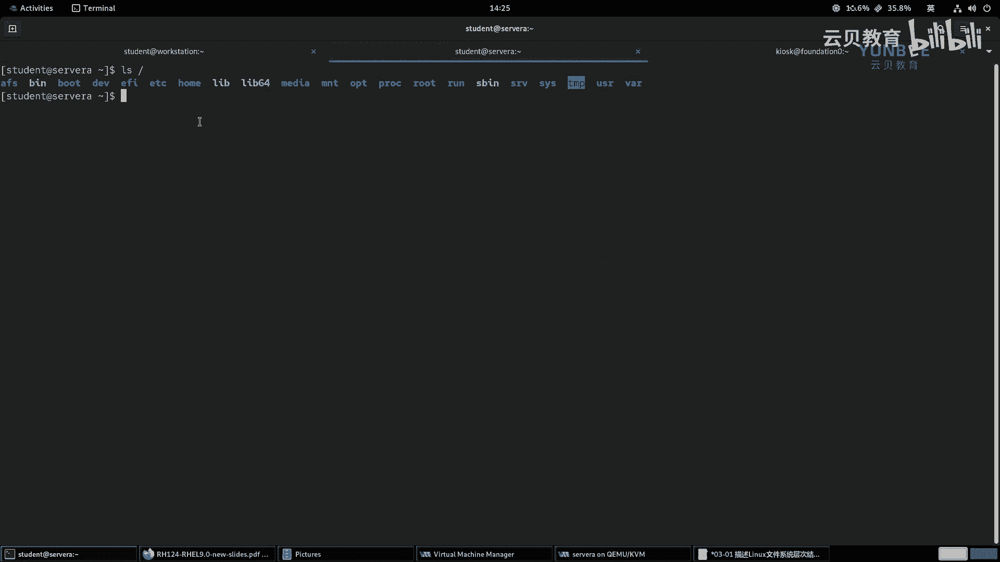

# 零基础入门Linux，红帽认证全套教程！RHCE9认证实战 RH124课程 - P9：03.1 描述Linux文件系统层次结构 - 云贝教育 - BV1Ns2gY8EVU

好，我们接着呢来学习第三章啊，存命令行呢来管理文件。那么在这一章当中呢，我们最主要的目标呢是在我们的命令行，也就是b shell当中啊，利用命令呢来这个组织文件啊以及复制移动啊创建以及删除文件啊。

那么在这章当中呢，我们又分成了5个小目标啊。那这5个小目标呢也对应了5个小章节。那么第一部分呢就是带着大家呢来认识一下我们linux当中的文件系统结构。

以及在结构当中啊主要的目录到底有起到一个什么样的作用。那么第二个小节呢是介绍啊一些路径相关的概念。比如说提到的绝对路径，还有相对路径，以及如何查看我们当前所在的位置。

那么第三部分呢则是介绍例如什么CP命令啊，MV命令啊等等啊。那么通过这些命令呢来实现啊创建复制移动，删除我们的文件以及目录啊。那么第四个部分呢。

我们会给大家介绍在我们link当中的一些链接文件啊链接文件。那么最后一部分呢则是利用通配符啊，结合我们的shall，然后呢快速高效的来匹配啊，这个不同的文件和文件名啊，这个文件和目录啊。好。

一共分成了5个小节啊，分成5个小节。那么我们首先呢来看第一小节，那么描述linux文件系统啊，层次结构的一个概念。OK好，那么我们这个在正式的介绍之前呢。

我们首先呢啊给大家介绍一下我们啊linux系统或者严格一样来说例unux系统的文件系统。啊，layun啊，那么一般英文呢代表是like unix。啊，leunO的一个文件系统。

那么呃这种文件系统和windows不一样啊，和windows呢是不一样的。那么在windows当中，在windows当中，那么整个的文件系统。啊，系统那么呃就整应该这样来说啊。

就是我们的这个在windows当中，那么磁盘呢会被分成若干分区。啊，若若干个分区。那么其中啊系统啊系统啊的主要数据系统和用户以及什么呀？应用软件吧啊，应用啊软件啊，用户我们用户的话一般指的是加目录啊呃。

我们就说系统以及应用软件吧啊，它的一个数据呢啊存放在哪里呢？存放在我们的C盘当中啊，C盘当中OK那么其他的分区啊，其他的磁盘的分区。啊斯大分区分区，那么创建文件系统之后呢啊也是独立于什么呀？独立于啊。

独立于我们的C盘的啊，独立于我们的C盘的啊。那么这个我们大家呢在日常的生活当中啊使用啊windows的时候呢，应该能够明显的感觉到啊，感觉到比如说我们所谓的什么D盘E盘等等，对吧？

而在我们的啊linux或者说ix系统当中。那么我们离我们身边比较近的呢？就是linux系统以及什么呀？还有和这个啊mac OS啊，mac OS。那么这种系统啊，那么m OS的话呢。

它就属于是layunux系统啊，它的前身呢是有BSD啊发展而来的。那么在这种系统当中啊，那么啊我们的这个整个啊整个的文件系统。啊，他啊全部啊全部呢在一个啊最大的目录下。那么这个目录是谁呢？

这个目录呢就是根目录。OK这个目录就是根目录。啊，我们一般把它称之为是root directory。啊，directory啊根目录OK因为所有的目录呢都在这个根目录下面。

那么所以说呢这个目录呢看起来啊那么看起来呢就像一个什么呀？看起来啊就像是啊这个一棵树。啊，在水中的一个导影OK哎，有点像这个。所以说呢我们把这个啊另unix系统。啊，他文件系统。称之为什么呀？

称之为是一个倒知的目录数。啊，目录数结构。啊，到这个目托数结构OK啊，那么。在我们系统当中啊，我们可以执行一个命令啊，简单来说呢？叫什么呢？叫IOS。

啊，我们在思维上啊执行1个I执行之后呢，我们空格啊跟上一个斜线。那么这个斜线呢就是我们的根目录的符号。

啊根啊开头，那么这个独立的啊单独的使用啊，单独的使用。代表的是啊根目录。啊，代表是根目录OK那么我们的L斜杠呢，就相当于查看根目录下的。

什么呀？其他的文件和目录OK那么这个目录结构呢看起来呢就相当于我们PPT上的这个图片。那么最上面的这个目录呢，就是我们的根目录。那么在根目录下呢，所看到的这些啊BboDVETC等等。那么这一排的目录呢？

就是我们的顶级目录啊，顶级目录OK那么这些顶级目录呢，我们给大家做一些详细的解释啊。

OK啊，然后我这边呢走一个命令好了啊，tree。哦， sorryor啊跟。我们我这边给他加一个level好了啊，我记得有一个选项呢是level去。看一下啊，去一杠杠还。好，有个level啊。

level的深度杠L啊。那么我加上一个。杠L。是一就可以了啊，一就可以了好。那么我把这个目录呢给它打印出来。

写在我们的笔记当中啊。好，那么解释如下。那么首先呢我们看到的这个结构呢是我们的什么呀根目录。啊，跟目录。那么AFS呢我们啊不用管它啊，它是一个在我们的re当中是一种特殊的文件系统啊。

是一种特殊的文件系统啊。AFS是一种特殊的文件系统啊，我们不用管它非重要的啊，好，那么接着呢这个B那么并啊斜线并O大家注意啊，你看我写的时候呢，加了一个斜线啊，加了一个斜线啊。

那么前面的这个斜线呢就是根目录的意思。根目录。那么。整体上呢来读就是根目录下的并啊，根目录下的binO好，那么这个目录呢是存放什么呢？存放这个啊二进制文件。可执行的二进制文件。

那么这个二进制文件呢是面向什么呀？面向于啊普通用户的。啊，普通用户的命令。OK那么真实的位置呢。真实的位置啊，那么位于谁呀？根目录的USRB当中。啊，在这里OK好，那么第三个目录呢叫什么呀？叫bot。

啊，叫bo。那么boot的话呢是引导bo able可启动的分区。OK那么就是系统呢在启动时所需的。啊，所需的文件呢，那么就在哪里呢？就在我们的bo当中。啊，就在步骤当中。那么这里呢给大家呢来看一下啊。

那么首先呢我们来看一下B目录啊，B目录。那这里呢啊有非常非常多的文件啊，比如说我们找一个我们前面啊学习用过的一个命令。

我们找一个啊找一个，比如说这里的IOS。OKL那这就是一个命令啊L命令。好，那么接着呢我们来看一下这个bo啊，boot那么boot里面存放的有什么呢？

比如说这个文件啊VMlin那这个呢是我们系统在启动时候的内核文件啊，那么sstem map呢是一个映射文件。

我们忽略掉它啊啊然后接着呢这里有一个in是对应我们内核的一个初始啊镜像文件啊初始镜像文件啊那这个confi呢是我们内核的配置文件啊啊在这个目录当中还有一个Efi啊，系统走的是EF引导的啊。

那么gb two那么grab two里面存放的是我们系统的一个引导配置文件啊引导配置文件O。

好，那么接下来呢我们继续看下面的一个目录DV。那么DV的话呢，就是我们的设备啊设备。第一位啊，这是我们的设备目录。那么在设备目录当中存放的是什么呀？一些设备文件。那么例如啊例如什么呢？

例如我们的磁盘文件。啊，示盘文件还有我们的键盘文件。哎，等等。那么键盘文件呢，我们严格意义上来说呢？叫什么呀？叫做字符文件啊，字符文件。啊，支付文件OK。啊，那么这里的根目录下的这个EIfi呢。

其实啊它只是一个什么呀？

哎，我们这个上面我再看一眼啊，O。有1个EIfi。啊，我做个齐全啊，EFI。OK呃，那么在这个里面的话呢，它应该是一个它就是一个里面只放了一个什么呀文件啊，文件啊，应该是我们的这套环境在定制的时候。是。

出现的或者说我们做什么改变啊，一般一般来说呢，这个EFI不会放在根目录下面的。我们来看一下我们的word station。OK也有啊，看来是我们啊咱们的这套环境啊。

就是它定制的时候生成的这个文件没有什么作用啊，我们忽略就可以了啊，这个忽略掉啊。

好，我们给它忽略掉，我把它删除掉。好，接着呢这个ETC。啊，ETC的话呢是什么呢？ETC的话呢，里面存放的是。存放了啊，那么我们的这个应用程序。啊，对应的什么呀，配置文件啊配置文件。那么例如。啊。

例如那么SSH和什么呀？SHD啊，它们的配置文件呢就存放于哪里呢？存放在ETC下面的SSH目录当中啊，都会以啊这个应用程序的目录啊为名称啊命名。好，那么home呢是什么呢？

home的话呢是我们这个普通用户的加目录。啊，加目录所在的位置。那么例如啊例如。例如我们的student用户，那么他的加目录呢就是哪里呢？他的加目录。那么这个加目录呢，我们一般也称之为是主目录啊。

主目录。我一般习惯于说是加目录啊，那么在主目录，那么它的路径呢就是home下面的。Still that。oktdent啊，哎，那么这种这种目录的话呢，只允许只允许啊。允许啊这个自己访问啊。

就是说这个目录啊，默认情况下呢，只允许student用户自己访问自己的啊。你不能说张三来了也想看一看是不允许的啊。好，接着呢是label。那么lab的话呢是什么呢？lab的话呢。

就library cool啊，库文件。O库文件啊。啊，库文件哎，那么应用的把应用程序的库文件。那么真实的位置。那么在我们的。USR。啊，labbel目录当中。好，那么与此同时呢。

它还有一个啊还有一个目录呢是lab64，那么存放的是什么呀？64位的库文件。啊，64位的啊库文件。OK好，那么mediamedia的话呢，我们翻译过来呢叫什么叫媒介是吧？啊，或者说叫媒体都行啊。

那么这个目录呢它是干什么用的呢？这个目录比较特殊啊，那么这个目录呢是用于啊这个系统用户，我们的用户啊，用于用户啊，临时将什么呀，需要访问的这种移动存储介质。啊，移动存储介质OK比如说什么呀？

比如说我们的U盘啊，U盘。啊，U盘OK啊，这种啊什么光盘。啊，光盘的这种啊，那么临时啊，那么这个呃挂载的位置。啊，OK那么这个地方呢挂载的意思呢，这里呢先给大家解释一下啊。

就是说啊我们在用linux的时候呢，它和windows不一样的。还有一个地方就是说你像在windows当中啊，如果我们要想访问我们的U盘，对吧？啊，我们把它连接到计算机之后呢。

在我们的这个文件管理啊管理器当中啊，就能看到这个U盘的一个盘符，对吧？我们直接输标双击呢就进去了，很方便是吧？但是呢在我们linux当中呢，不是这个样子的，在linux当中呢，你要想去访问啊访问。

那么这里主要指指的是这种这个非土一化界面，就是文本界面的啊场景下。那么你要想访问呢，就需要使用专门的命令，将你这个U盘的设备啊，设备的文件系统啊和系统当中的某一个什么呀空的目录给它绑定在一起。啊。

绑定在一起，然后绑定之后呢，你去访问这个目录，就相当于访问了你的U盘里的数据。那这个过程呢我们称之为是挂载啊。O将来我们在后面学习的时候呢，再详细给大家介绍啊，那么MNT呢是干嘛的呢？

MNT呢是也是一个特殊的目录啊，这个目录呢默认都是空着的啊，那么是用于。用户啊将这个什么呀，大型的啊大型的存储设备哎挂载的位置。啊，一啊看到没有？这两个都是用来做挂载的。

但是呢media是这种什么移动的临时的MNT呢是一般是大型的啊，这两个目录。都是空的啊那么就是预留出来，允许你大家去用的。你说我不用可不可以也可以啊，只是预留的啊预留的。OPD呢是干嘛的呢？

OPD呢是用于存放啊，用于存放。啊，这个第三方的软件。啊，第三方的软件，比如哪里呢？比如从这个啊get hub上面你去下载的软件。对吧啊，去ge他 hub去下载的，或者说从那个其他的什么呀。

网站上啊去下载的某些应用程序啊，那么。你下来之后，那么你就可以把这个应用程序呢安装在哪里呢？安装在OPT下面啊，比如说APPE这样的一个目录。啊，就这样就可以了啊，就可以了。OK。好。

你像然后呢接着下面的这个跟目录下的prolock。OKpro呢是一个伪啊伪文件系统啊伪文件系统这个伪呢就是假的意思OK。哎，文件系统，那就是说在我们的系统启动的时候啊，启动的时候，那么会干嘛呀？

在内存当中临时的啊这个划分一个区域。啊，来存放啊来存放我们的一些。一些啊一些。系统中的数据。啊，一些数据啊，这就是伪文件系统啊，就是你一旦一旦关机呢就不存在了啊，那么这里的prolock是干嘛用的呢？

那么prolock就是进程文件啊，那么存放的是。存放的是我们的进程。文件啊，竞争文件我们来看一下啊，那么这边L4啊POC。

那么这里的数字呢就是我们进程啊进程的编号啊，还有系统在运行时收集的一些信息。比如说我们的CPU的信息啊，我们的磁盘的状态信息对吧？比如说我们的这个啊内存的信息啊，我们的负载均衡的信息等等啊。

都存在这些文件或者目录当中啊，这些数字是进程文件啊。好，那么接着呢我们往下继续看。

那，那么再往下呢，这个root对吧？那么root的话是干嘛的呢？root的话呢，它是也是一个加目录，只不过这个加目录呢代表的是谁呢？系统管理员。系统中啊超级管理员。啊，root用户的。

加目录OK因为它权限很高嘛，所以说呢这个目录呀它独享了一个啊，他和其他的普通用户不一样，对吧？普通用户呢是是干嘛的呀？他是这个共共享的是吧？大家一起都在这个home下面，那热的不一样啊，我权力高。

所以说呢我就一个人啊占了一个空间啊，OK那run呢就是run time啊。OK那么run，那么就是run time。啊，run time。那么又意味着我们的系统在运行的时候啊，运行的时候。

产生的什么数据？啊，所在的位置。那么早期呢是在哪里呢？早期呢呃早期的话呢，我们的目录呢是在蛙下面的，有一个run，早期会在这里。啊，后来呢这个在real8的时候啊，real8的时候还有real7呀啊。

这个地方记得不是很清楚了啊，那么开始出现在我们的根目下面，应该是从real7开始啊，从real7开始OK好，那么同样它也是一个伪文件系统。啊，它也是一个无伟文件系统啊，一旦关机就不存在了。好。

然后SB啊SB呢是什么的呢？SB呃存放的是我们的用于系统管理的命令。存放在这里，那么就意味着我们在执行的时候呢，需要有什么呀管理员的身份或权限啊，我们来看一眼。

ISB。那你看这里面有很多的命令，比如说IP命令，对吧？查看IP信息的啊，还有这个什么呢？比如说我们的这个。啊，sources那早期的时候用来管理系统服务的啊呃，okK还有什么呢？

还有我们能够目前遇到的啊，比如说这个。找一个我们应该能够认识的ok。啊，比如这里你看做磁盘的文件系统的创建啊，创建的命令啊都在这个目录当中啊，都在这个目录当中。

OK那么真实的位置呢。啊，真实的位置呢是在根目录的USRSB啊SR。这个SRV呢，它目前基本上没有什么作用啊，那么就是服务的意思。那么早期的时候呢，是用于什么呀？用于存放一些系统服务。啊。

从新存放早期的时候用，现在基本用不到了。OKs，那么就是system。那ss啊就是system系统，对吧？哎，系统。那么这个系统指的是谁呀？指的是linux系统啊，那么就意味着它严格来说呢。

就指的是我们的内核。啊，内核在什么运行的时候啊，运内核我们把它理解为是个设备啊，设备呢在运行的时候啊，挂在的目录。OK那么它也是一个物为文件系统，因为你一旦关机，你的内核呢就不再运行了。

那也就不需要去挂载了。那么ss里面，那么ss呢我们目前啊可以去看一看，仅限于查看啊啊，因为在这个目录当中，很多的内容是不允许我们随意的去修改的那修改的话呢会产生一些比较致命的错误啊。比如说DV。

Block。那能看到我们的设备，哎，能看到我们的设备啊，那不这些设备是编号啊，那么252呢是它的主要编号，后面的0123呀，都是它的次要编号。你看那真正的位置指向的是啊这个哪里呢？

指的是我们的上一级目录里面的Dy就是C目录下的Dy。然后呢，这是它的啊硬件的一个PCI的一个编号啊，具体的位置下我们的磁盘啊磁盘。Okay。

呃，然后接着啊接着我们继续往下介绍。那么tap。type那么t的话呢，是临时的英文的一个缩写。那存放的是临时的数据。啊，临时的数据。那么这个tab呢呃根录一下t的话呢，是10天啊，10天。如果。

然后如果数据啊没有被访问。则会什么呀？自动删除。另外呢另外还有个位置呢是蛙向t。那这个地方呢是30天的啊30天。啊，我们根目录的tamp呢是10天。那么USR呢，它类似于什么？

类似于我们windows里面的那个啊那个那个什么呀C盘啊，C盘有点像啊OK那么在USR当中里面存放的有哪些呀？除了。除了我们前面遇到的。这个什么啊USR下面的B呀啊USR下的SB呀。啊。

这些目录之外还有USRlib对吧？USRlib64之外，还有什么呀？比如说USR share。

i share这样的目录啊，那么这种目录呢里面存放的是啊应用程序在安装的时候的一些数据。啊，我们来看一下这个shaer，你看shaer里面有各种各样的目录。比如说这里面有一个。啊，什么呢？找一个。

你看AX11啊，图形的驱动协议的位置啊，我们微line的绘画对吧？啊，work看啊编译器啊编译器。啊，还有我们的这个嗯找一个。哎，你看这个目录DOC啊，我们的一些文档啊等等，都在这个目录当中。当然了。

除此之外，还有一些其他的文件，我们都没有过多的去介绍啊，没有过多去介绍。

啊，这是这个目录非常的重要啊非常重要。O那么we的话呢是veryable啊，可变动的英文的一个缩写。OK可变动的数据。那么一般你像我们的日志。对吧日志文件啊，日志，还有这一些其他的一些邮件。

那有坚池应该挖下的s啊。啊，这样的目录啊目录等等。这种可变动的数据都在这里面啊，你像这些目录呢呃你像你像这个啊，你像这个bot目录呢，我们在安装系统的时候呢，会把它作为一个独立的分区啊。

一般会用于独立的分区啊，一般呢作为独立的分区。啊，分区来使用。那么home的话呢，因为是普通用户的加目录嘛，那你要想用你如果你用的是桌面的linux的发言板，对吧？

你希望啊你希望你的这个下次重新安装系统的时候呢，你个人的数据呢不受影响。那你可以把这个home呢也作为一个独立的分区啊，独立的分区啊，包括我们的va呢也可以作为独立的分区。

那么这样可以避免我们的这个分区里面的数据啊啊变动的非常多，导致我们整块磁盘呢啊被写满啊影响我们的这个啊系统的稳定性，那你也可以把独立的分区出来啊，都是可以的啊。好。

那么这里呢给大家详细的介绍了啊我们这些目录的结构啊。那么除此之外呢，咱们的PPT上也给大家罗列了这些比较重要的几个目录啊，具体的含义啊，大家呢既可以看PPT。

也可以看我的笔记啊都是比较详细的啊都比较详细的。OK好，那么我们的这些小节呢就到这里了。

