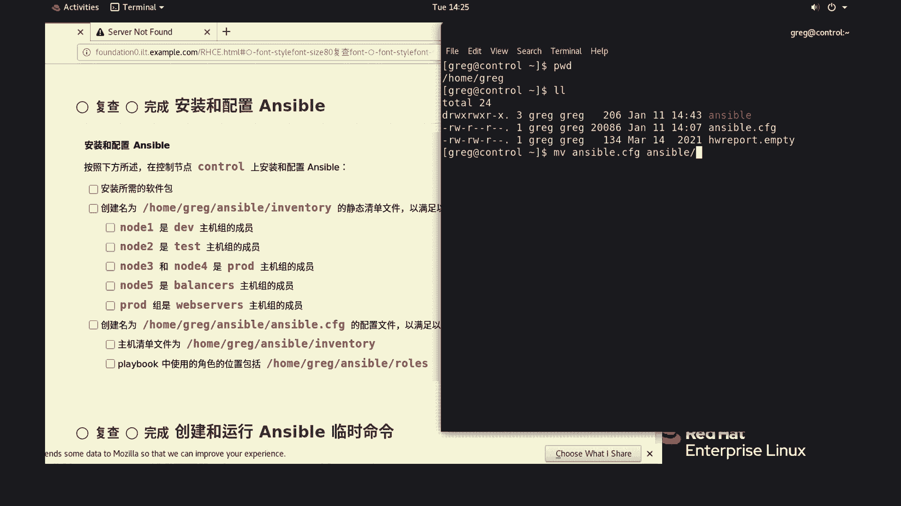
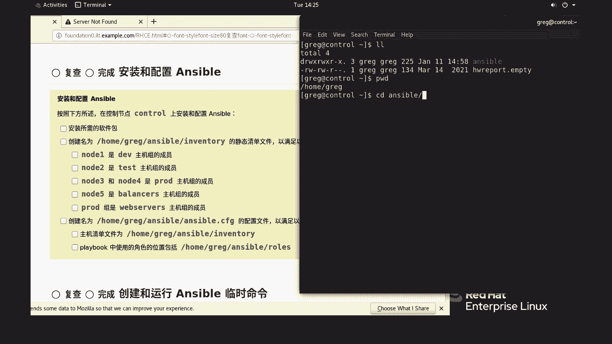
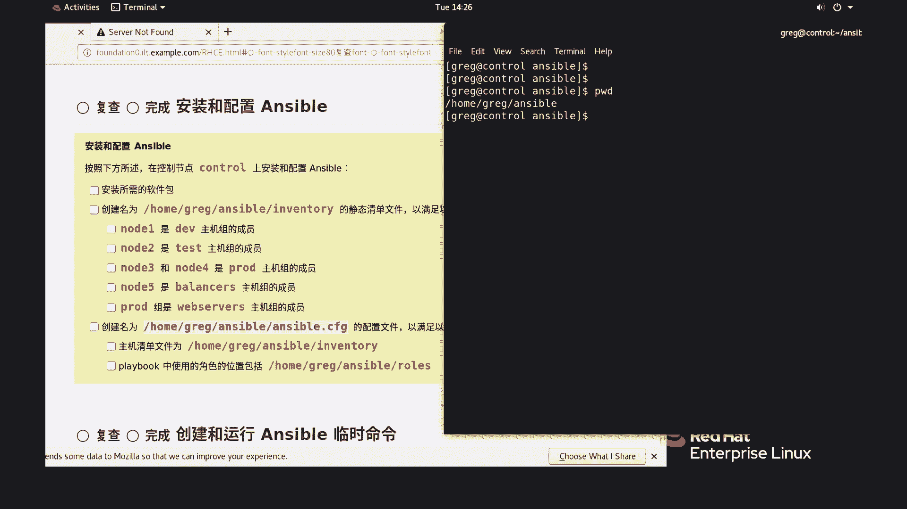

# 红帽认证考前重要提示：P1：RHCSA考前重要提示与学习路径

在本节课程中，我们将学习关于红帽认证RHCSA考试前的一些关键注意事项和正确的学习方法。我们将重点纠正一个在视频演示中出现的常见路径配置错误，并明确后续操作的正确环境。

## 课程概述

本节内容旨在澄清一个在操作演示中可能引起混淆的配置问题。具体来说，是关于Ansible配置文件初始放置位置的一个更正。理解并遵循正确的路径对于成功执行自动化任务至关重要。

## 路径配置更正说明

上一段我们提到了学习中的常见问题，本节中我们来看看一个具体的配置更正案例。

在相关教学视频中，执行Ansible剧本时，操作起点被错误地设置在了用户的家目录。实际上，这个问题的根源在于第一题中，Ansible配置文件（`ansible.cfg`）被放置在了错误的位置。

**核心错误**：配置文件被误放在家目录，而非要求的 `/var/ansible/se-bu/` 目录下。

因此，我们需要在开始所有操作之前，先将这个配置文件移动到正确的目标路径。请使用以下命令完成移动操作：



```bash
mv ~/ansible.cfg /var/ansible/se-bu/
```

## 正确的工作目录

完成上述路径更正后，所有后续的Ansible操作都应在正确的目录中进行。



如下图所示，正确的操作环境位于 `/var/ansible/se-bu/` 目录。此目录是专门为本次任务设置的，内部没有其他无关文件。


所以，我们之后的所有操作都只需要在这个目录下执行即可，除非有特别的指令要求切换到其他路径。


## 给学习者的重要提示

以下是针对观看教学视频的学员的两点核心提醒：

1.  **正确的配置文件路径**：必须确保Ansible配置文件位于 `/var/ansible/se-bu/` 目录下，这是考试和练习的正确起点。
2.  **稳定的工作环境**：整个实验操作应保持在上述目录中完成，这样可以避免因路径问题导致的剧本执行失败。

请注意，视频中出现的路径偏差是一个需要警惕的演示失误。在实际考试中，类似的配置错误将直接导致任务失败。本更正旨在帮助大家从一开始就建立正确的操作习惯。





## 本节总结

在本节课中，我们一起学习了RHCSA考试准备中的一个关键实践点：正确配置Ansible工作环境。我们纠正了配置文件的存放路径，明确了 `/var/ansible/se-bu/` 作为唯一的工作目录，并强调了一致性操作的重要性。掌握这些基础设置，是顺利执行后续自动化任务的前提。