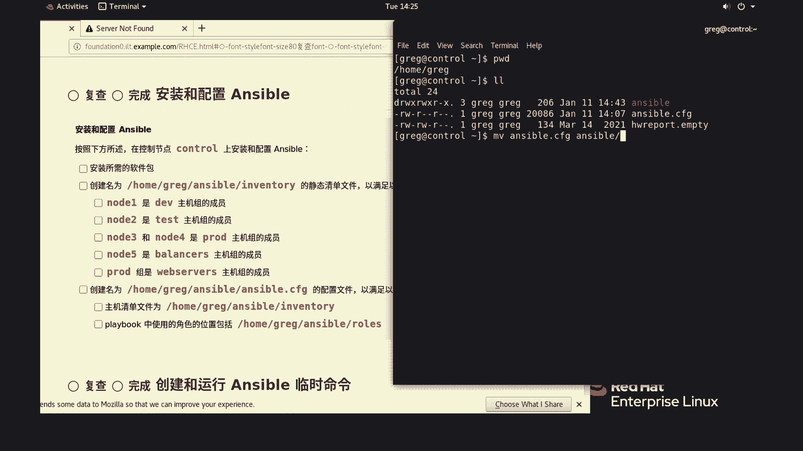
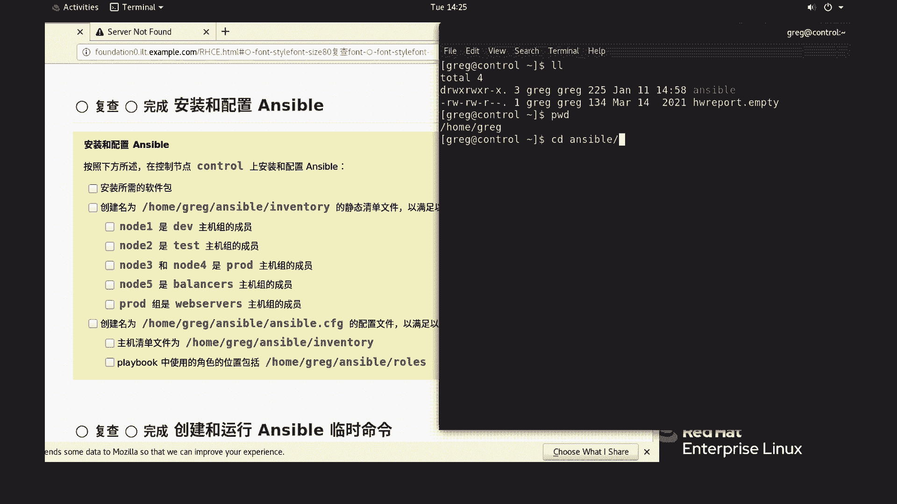
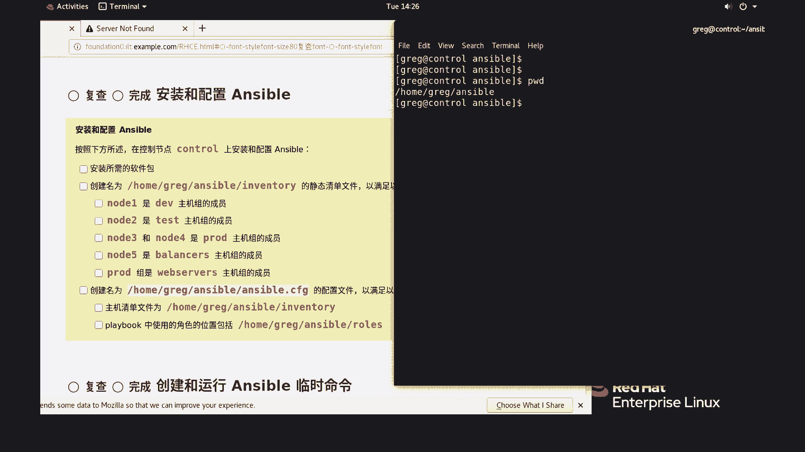

# （1）红帽认证RHCE考前重要提示 - P1：（2）红帽认证RHCSA考前重要提示 - 红帽认证该这么学 - BV11V4y1E7zj

好各位小伙伴们呢，那我们做一个更，正，因为在那个后面可能大家看到视频的时候，这个执行执行这个剧本的时候呢，它会我们是尽在那个进藏哪儿呢，是近在在用户家目录里面的，实际上呢这个是因为在第一题的。

我把那个阿斯伯的那个配置文件放错位置了，好各位看看，当时放到这儿了，也没办法提醒我，这个毕竟不是不是那个现场现场的讲课放到这个位置，要求的是放在塞伯的目录下面，所以呢我们要把这个文件重新移到。

一开始就把它放到s的目的下面去啊。

这个位置是没有没有别的东西的啊，所以我们接下来所有操作实际上在这个目录里面就够了。

看到了吗，这是因这是因为我后面后面呢我们大家可能看到视频当中，这个位置不太对，但是嗯一定会是我真正考试的时候，那就等于是挂了啊，但是我们这边呢就相当于在一开始给大家去提醒一下，你们看到后面视频的时候呢。

没关系，因为那个当当当在后面的时候我必过去的，但是没想到没有注意到这一点啊，所以呢在前面呢我更正一下，一定要注意把那个一这个路径呢是在在这s不下面，第二呢我们一直就在这个目录里面，我操作就可以了。

除非有有一些别的一些需求，我们要退出去啊。

