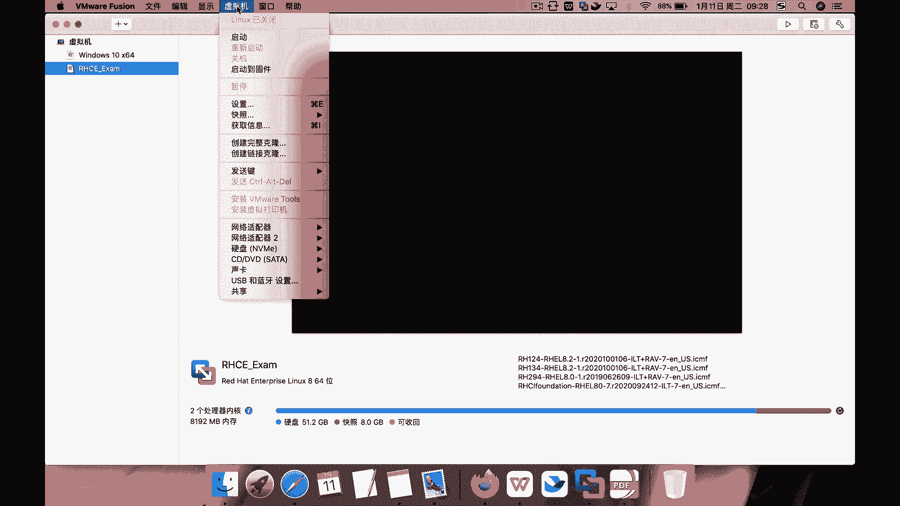
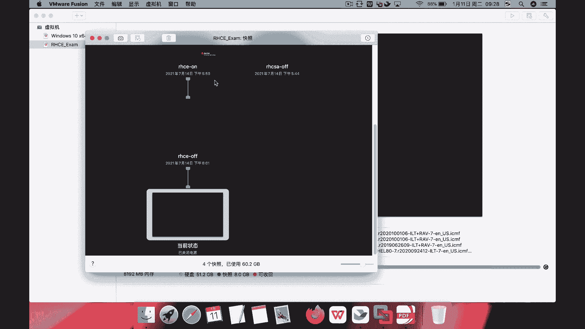
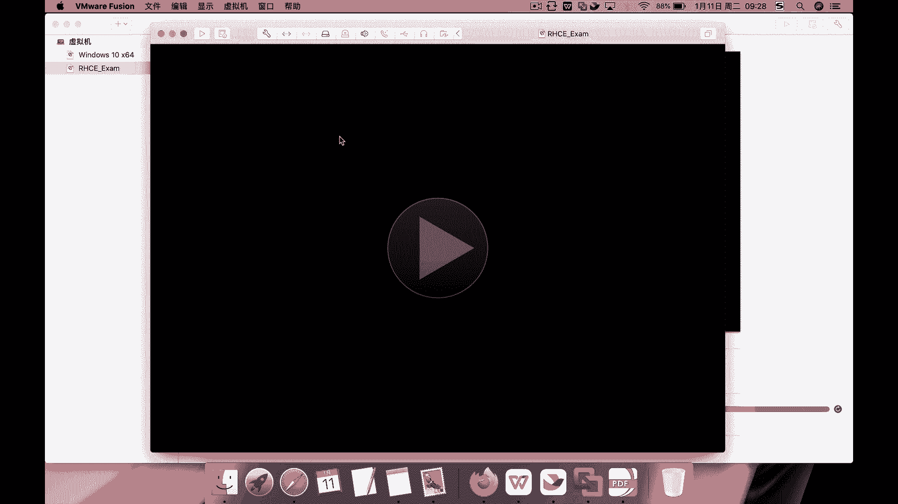
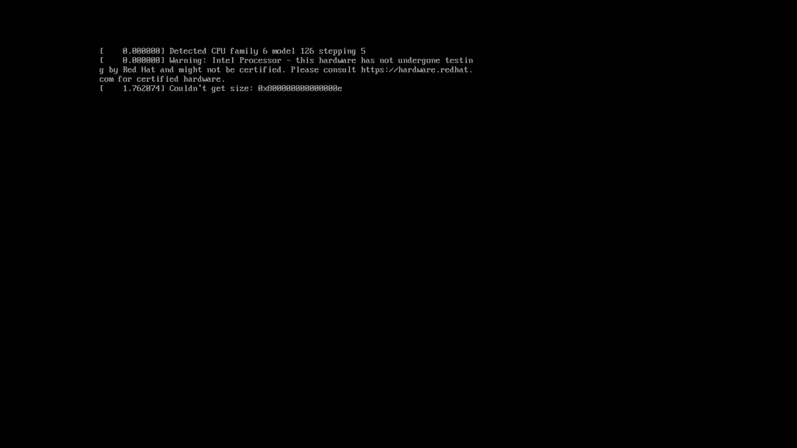
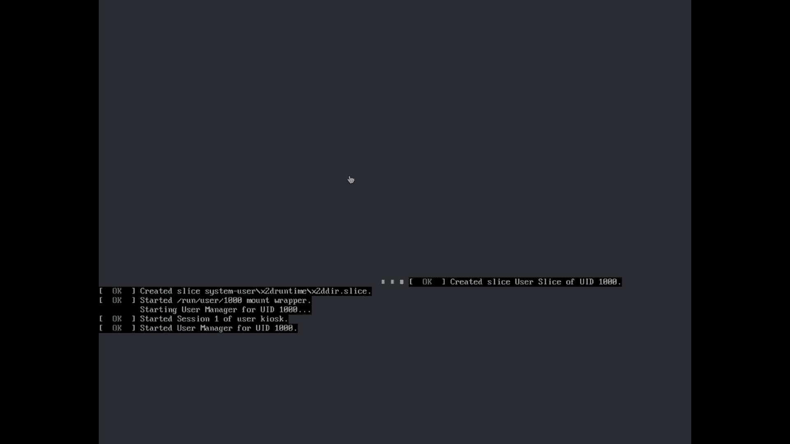
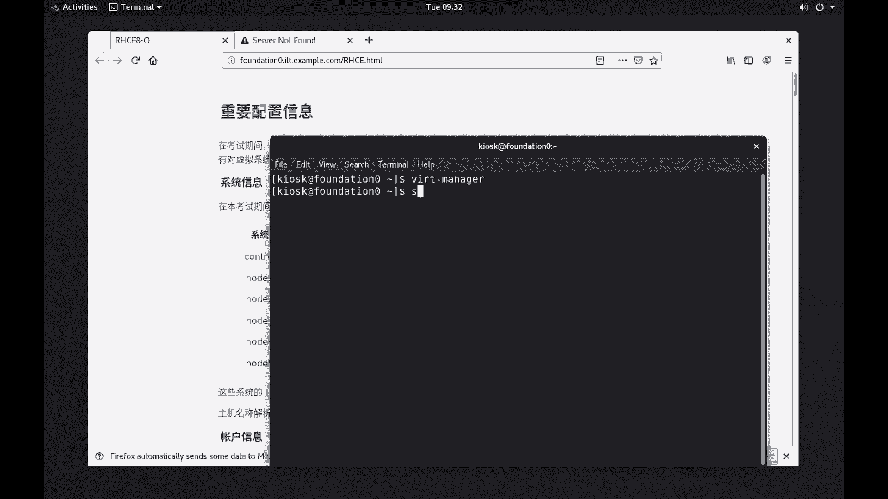
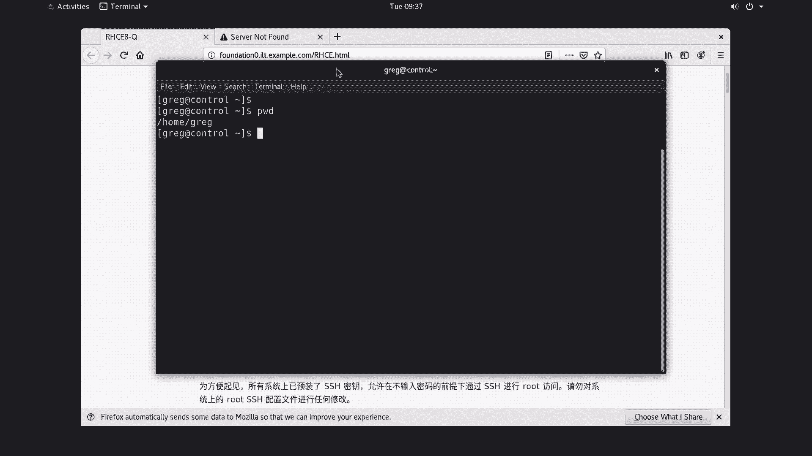

# RHCE认证学习：P1：环境准备与初始登录 🚀







在本节课中，我们将学习如何为RHCE认证考试准备练习环境，包括恢复虚拟机快照、启动所有必需的虚拟机，以及完成初始登录到控制节点的步骤。这是所有后续Ansible自动化任务的基础。



## 环境准备与启动



上一节我们介绍了课程概述，本节中我们来看看如何准备具体的练习环境。首先，无论您使用的是Windows还是macOS系统，都需要从指定的快照恢复虚拟机。

以下是恢复快照的关键步骤：
*   找到名称为 **`RHCE-OFF`** 的快照（关机状态）。
*   恢复此快照。在macOS上通常双击即可。
*   恢复时，如果提示保存当前状态，选择不保存。
*   恢复完成后，启动虚拟机。

启动后，虚拟机可能不会立即顺利进入系统。这是正常现象，尤其是在macOS上。您可以等待一段时间，或者尝试强制重启虚拟机。请确保所有六台虚拟机（1台控制节点和5台受管节点）最终都成功启动。

## 登录控制节点

所有虚拟机成功启动后，我们需要登录到Ansible控制节点。这是执行所有管理任务的起点。



以下是登录控制节点的具体信息：
*   **控制节点主机名**：`control`
*   **登录用户**：`greg` （注意：不是 `grep`）
*   **密码**：`flectrag`

使用以下命令通过SSH登录：
```bash
ssh greg@control
```
输入密码 `flectrag` 后即可登录。登录后，您将处于 `greg` 用户的家目录下。

## 重要考试信息须知

在开始练习前，理解考试环境的基本规则和配置至关重要。

以下是您必须了解的关键信息列表：
*   您对练习虚拟机拥有root权限，但对底层的物理主机没有。
*   所有系统的root密码均为 `flectrag`，除非题目要求，否则不要修改。
*   所有系统间已预配置SSH密钥，允许免密登录。
*   请勿修改系统上的root用户SSH配置。
*   所有Ansible相关工作（Playbook、清单文件等）都必须保存在控制节点上 `greg` 用户家目录下的 `ansible` 目录中。
*   所有Ansible命令都必须以 `greg` 用户身份，从上述目录运行。
*   考试系统的防火墙默认是禁用的，SELinux处于强制模式。
*   在最终评分前，受管节点（node1-node5）会被重置回初始状态，然后使用您编写的Playbook重新配置以进行评分。

---



本节课中我们一起学习了RHCE练习环境的搭建、如何登录到Ansible控制节点，以及必须牢记的考试环境规则。确保所有虚拟机正常运行并成功登录到控制节点，是进行后续所有自动化任务的前提。