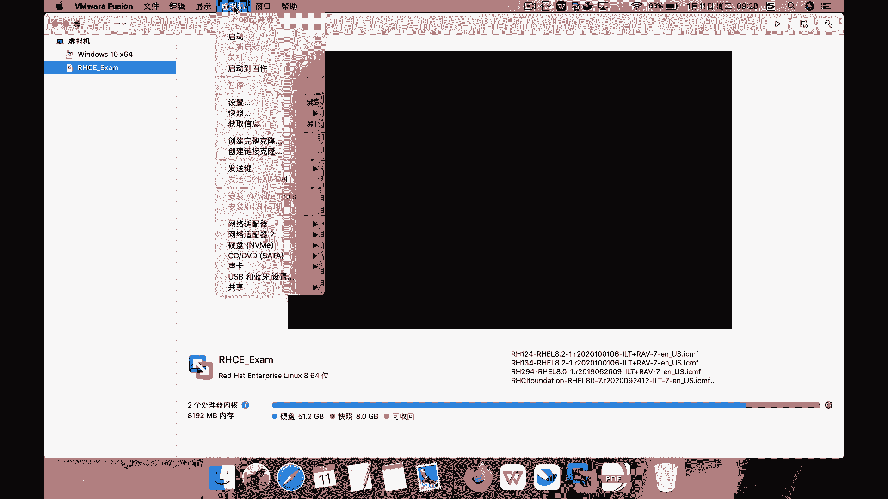
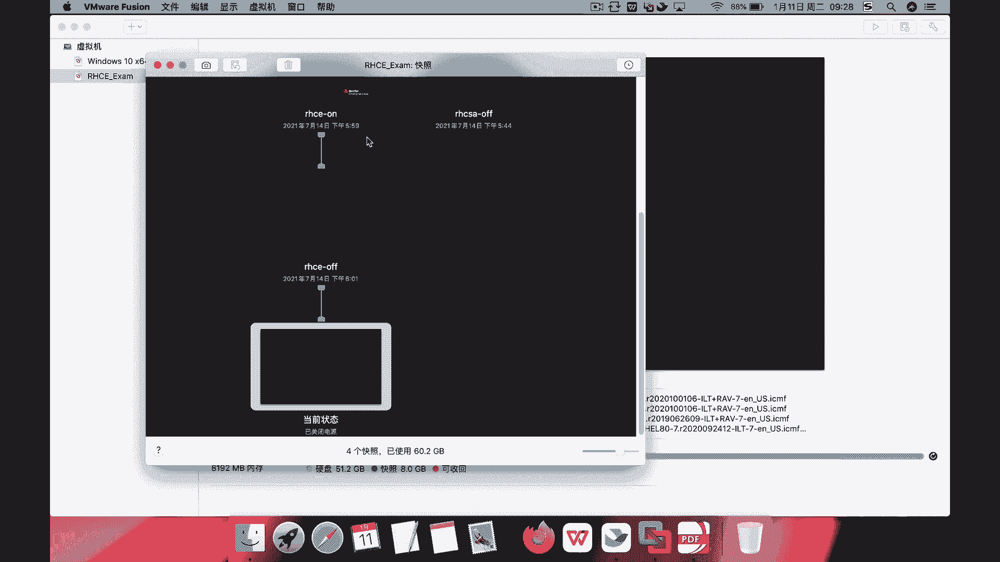
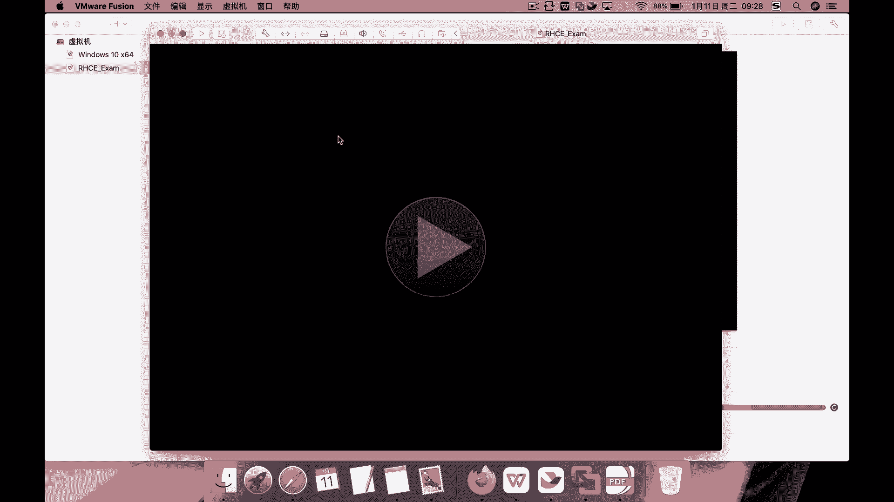
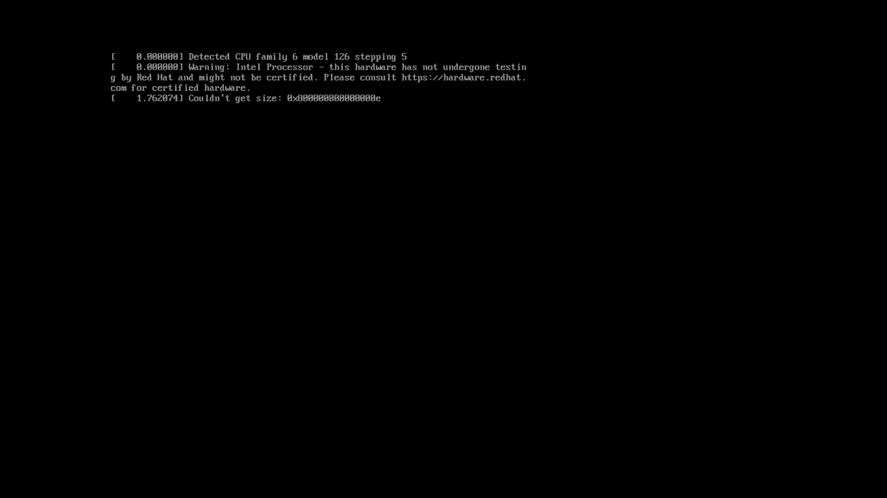
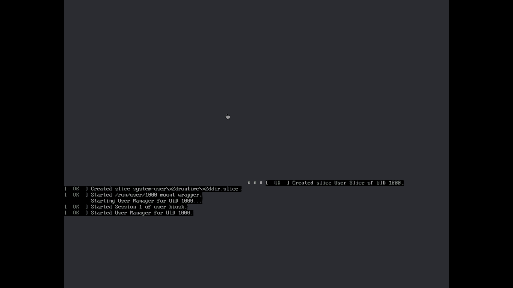
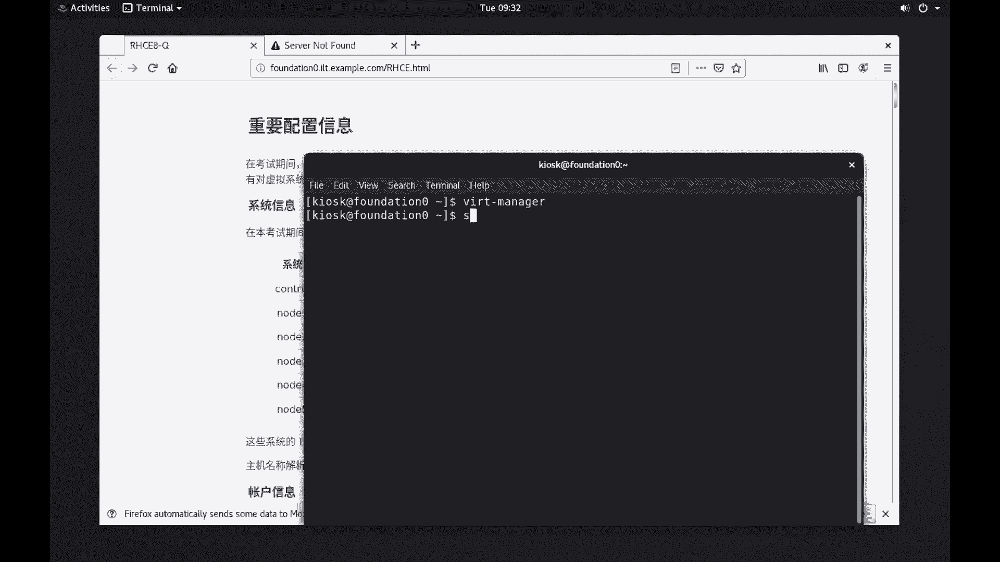
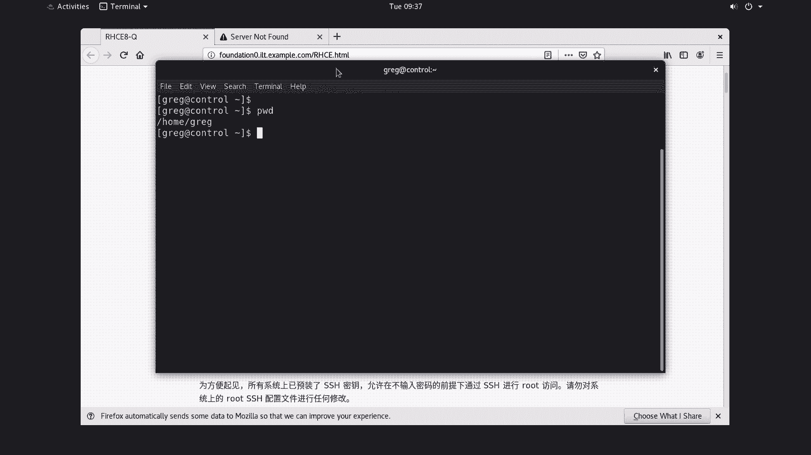

# （1）红帽认证RHCSA考前必做 - P1 - 红帽认证该这么学 - BV1HW4y1m7Vp

好各位小伙伴们，大家好，我是杨哥，那下面我们为大家来介绍关于r h c e这一部分的练习啊，这个首先呢这个我们要恢复快照，每做完每每次这个重做的话呢，我们也要恢复一个到最新的快照去做。

首先这边不管你是windows系统还是mac系统啊。

这个我们已经准备好了，快照恢复的方法可能有点不太一样啊，反正是找到快照，这边呢我们给大家准备了一个是有r hc csa的，这个之前说过还有r h c e的啊。

r h c e这边呢有一个叫r h c e off的快照，也就是嗯关机状态下的快照，我们建议使用这一个苹果上面呢就双击可以了，它让你保存以前的那个一些东西，我们不保存，直接用就可以好。

然后点启动，那这里呢大家也知道。

我这边就把这个窗口最大化了啊，那启动以后呢大家也知道有些问题啊，就是在在前面的csa部分呢，我们也提过，这可能有些虚拟机骑的不是那么痛快。

那要不就是等，要不就是强制重启，那这边呢那如果苹果让上述密码的话，那这就是我们系统的密码啊，有同学问我说这个系统起不来怎么办啊，起不来的话，那只能等，要不你换一下，换成那个windows的电脑试试。

也不知道为什么这个这个这个版本呢，在苹果上面总会有一些这样那样的一些问题，这个跟你的这个运气成分可能也有一些关系啊，那我们先稍事等待。

等待以后一定要检查所有的虚拟机是不是已经启动，启动完成啊，那讲到这边呢我们可以看一下，当然我们在前面也给大家讲过，实际上物理期我们是没有管理员权限的，我们有的只不过是一个普通用户带有这种速度功能的权限。

所以实际上呢你只能点这几个按钮哈，那那这个我们先把这个题啊题来启动器启动看一下，考试的一个一个题啊，那今天就是我们练习的题，ok那这边其实已经看到了，其实我们一共有这个123456台虚拟机。

其中一台一台呢是我们的安塞波的控制节点，然后还有五台呢是我们的啊，最后被控制的节点啊，也是管理最终的这个节点啊，那这里呢它告诉我们密码是什么，密码是f l e c t r a g这个根据情况。

而且呢为了方便起见，所有系统上已经预装了s s i h密钥，所以允许在不输入密码的情况下访问root s访问root啊，这个还有还有告诉我们说呃i c p控制节点就是使用的是账户是什么。

是j r e g r e g，还不是g r e p哈，然后此账户预装了s s h密钥，允许在s b控制节点和各个不受管节点之间进行登录，那也就是说我们可以其实不用设置这个密码就可以啊。

嗯但是为了保险起见，我们建议大家还是在安柏的，接下来呢设置一下密码啊，好所以这是关于关于关于这一块的这个信息，那我们刚刚才说这么多了，其实也是也是等待这个它的系统起来啊，好下面我们来等待一下看一下啊。

那这里呢大家也知道可以通过虚拟机控制这个vm，v vm没了这个control这样一个工具来控制这个考试的时候只能通过它，但是我们练习的时候呢，我们是可以通过我们的控制台啊，把这窗口放大一点。

v i r t杠manager，这个在考试的时候有没有，这个我们现在已经记不得了哈，但是可以通过刚才说的那个界面啊，啊这个不代表起来了，各位一定要注意，我们一定要点开去看一看，如果没起来的话呢。

你就先等待或者是重新强制把某台虚拟机重启好，我们看一看，双击打开这台蓝算是钱了啊，你到这个界面就起来了，control节点，这个就现在算是还没有起来啊，我们看看它到哪个哪个位置了，这还不太好脱，滚动条。

这ctrl节点倒不是说特别的，只要能登录，其实都没，应该是可以使用，因为它不像那个我们的最终的最终的节点啊，但是还是要等待一下node一节点这边稍微按一下，它应该是全了。

登录界面可能有一些这个因为虚拟机的一些原因啊，谈论一些提示消息，把我们登录窗口给盖住了，note 2可以好，每次出来弹出一个框，note 3不弹出不行吗，可以，note 4，note 4也可以好。

note 5 note 5也可以好，那基本上呢我们看这个控制节点啊，刚刚说控制节点呢，其实它不是我们最终最终这个在当然在真正考试的时候，这些都不会存在，不可能说起不来，那真起不来的话。

那你可以去找找考官给你给你处理的啊，或者是我们恢复的啊，这个可以恢复这个这个虚拟机，那现在呢这个现在这都能都没问题啊，啊我们再等一下ctrl节点好，那如果说某个节点不能够起来啊，特别是1234的节点。

那怎么办呢，强制重启，因为正常重启可能已经无法解决这个问题啊，好了，我们要做的事情就是首先在我们的这个物理机上面，所谓的物理机上面呢，然后去连接到我们的相应的这个节点啊。

相应的节点也就是我们的控制节点第一台，当然这个就一会儿来来，根据这个叫什么，根据我们的这个题的要求来连接就可以好，首先首先这个，虚拟机没问题的啊。

一定要注意，我们必须保证虚拟机能够起来，当然上来以后呢，我们还是先要把这个按照之前csa的这个这个这种套路啊，我们把我们的这个考试的一个类似于准备工作或者重要信息，还是先要看一遍，在考试期间。

他说你坐坐坐在这个位置呢是没有呃，是有多个虚拟机，你不具备root权限，但是你具有对系统虚拟机系统的root访问权限啊，前面的物理机没有，但是虚拟机有啊，然后，这些系统的ip呢不用你配啊。

账户信息呢root是root，密码是f l e c t r a g不要改密码，除非你有一样利用要求，另外呢刚才也说了，为了方便起见，所有系统上已经预装了s s h密钥，允许你在不输入密码的情况下。

通过s s h这种方式去进行root啊，另外请勿对系统的root s s i进行配置，另外还有一点呢，也就是说你可以s s h使用root的方式。

等到我们上面的control以及呢12345上面去都可以啊，然后另外呢我们aceable的这个叫什么控制节点上已经啊控制节点，你创建的用户g r e p。

所以我们一会登的时候就使用这个ja sorry g r e g这个用户登上去，此账户已经预装了s s h密钥啊，也就允许你在i sp的控制节点和各个i s p的受管节点之间，进行s s h登录啊。

也就是请请不要修改，换句话讲就是实际上呢我们从控制节点上去对啊，我们的这个受管节点进行管理的时候呢，它实际上已经是有密钥密钥的支持了，嗯其他的信息呢我们看一下他说重要信息，除非另有所指。

否则你所在的工作目录和你所所有的工作包含你的剧本配置文件，主机清单都应该保存在我们的控制节点的，也就是g r e g这个用户的加下面的一个叫安塞波的目录当中，这个当然后面也有题。

并且呢呃所这什么归这个用户所有，所有暗色部相关命令，应该由gr g用户从空接点上面去上的这个目录运行，下面这是什么东西，我们看看他说了，我们的考试系统上防火墙默认是不启用的，s n x除以强制模式。

然后这是相应的一些这个库，相应的一些软件库，这个在后面呢也会有有要求，这个重要信息我们读一下，注意在评分前，您的这个安塞伯受管节点，受管节点啊将会被重置。

换句话说也就是你的12345节点的将会被重重新啊，将而你的安全不是问节点将会被重置为考试，使得初始状态你编写的你编写的这个play book，而不是重启啊，sorry就说错了。

就是你因为我们在整个练习过程当中，或者在考试过程当中呢，我们所跑的一些剧本啊，或者说at hook呀，这期呢将会对将会去，实际上其实就是操作我们的12345这几台机器，那为了为了这个叫什么呃。

看看你这些剧本的是不是ok的，那么在考试的时候呃，在在那个叫什么，在检检检查你成绩的时候呢，会把你的12345机器上呢这个进行重置，换句话讲就是你一开始跑的那几个东西就没有了。

你编写的book将通过gre g这个用户的身份，从你的这个加目录s目录上运行，在playbook运行以后，以判断他是否按照要求进行的配置好，总之呢这些东西呢我们都看的很清楚。

所以呢我们下面第一步呢就是要先登录到我们的这个叫控制节点上去，啊啊我们刚才那个窗口去哪了，在这s s h，然后使用g e r e g用户登到我们的控制节点，也就是这台啊，这台机器cvt r o l。

这个机器好，密码呢是这个f l e c t r a g好了，那其他机器呢就先不要登了，为什么呢，因为因为其他机器是我们的受控节点嘛，所以我们先做到这边来，当前用户呢是是我们的这个g r e g用户好。

那说明环境呢这就ok了，一定要确保环境啊，这个还好啊，这个比那个c i s要好一点，c i c有有机器死活，它起的时候就有问题，c e的话呢还还挺痛快的啊。

好这是关于这个环境这一块儿和我们在真正考试之前要做的事情。

